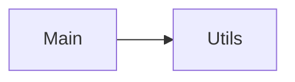

Repository Summary:
Files analyzed: 74
Directories scanned: 3919
Total size: 112.14 KB (114827 bytes)
Estimated tokens: 28706
Processing time: 5.46 seconds


## Table of Contents

- [Project Summary](#project-summary)
- [Directory Structure](#directory-structure)
- [Files Content](#files-content)
  - Files By Category:
    - Configuration (16 files):
      - [.gitignore](#_gitignore) - 587 bytes
      - [.postcssrc.json](#_postcssrc_json) - 54 bytes
      - [angular.json](#angular_json) - 3.6 KB
      - [config.json](#config_json) - 1.4 KB
      - [map.json](#map_json) - 15.3 KB
      - [ngsw-config.json](#ngsw-config_json) - 639 bytes
      - [openapi.json](#openapi_json) - 2.6 KB
      - [organization-v1.0.0.json](#organization-v1_0_0_json) - 11.2 KB
      - [output-v1.0.0.json](#output-v1_0_0_json) - 10.0 KB
      - [package.json](#package_json) - 1.3 KB
      - [and 6 more Configuration files...]
    - Documentation (1 files):
      - [README.md](#README_md) - 1011 bytes
    - JavaScript/TypeScript (24 files):
      - [app.component.ts](#app_component_ts) - 2.4 KB
      - [app.config.ts](#app_config_ts) - 739 bytes
      - [app.routes.ts](#app_routes_ts) - 1.4 KB
      - [config.service.ts](#config_service_ts) - 608 bytes
      - [cypher-query.model.ts](#cypher-query_model_ts) - 118 bytes
      - [error.component.ts](#error_component_ts) - 211 bytes
      - [home.component.ts](#home_component_ts) - 619 bytes
      - [http-validation-error.model.ts](#http-validation-error_model_ts) - 132 bytes
      - [iroko-api.service.ts](#iroko-api_service_ts) - 1.1 KB
      - [main.ts](#main_ts) - 250 bytes
      - [and 14 more JavaScript/TypeScript files...]
    - Web (33 files):
      - [app.component.html](#app_component_html) - 2.6 KB
      - [app.component.scss](#app_component_scss) - 0 bytes
      - [error.component.html](#error_component_html) - 20 bytes
      - [error.component.scss](#error_component_scss) - 0 bytes
      - [home.component.html](#home_component_html) - 19 bytes
      - [home.component.scss](#home_component_scss) - 0 bytes
      - [index.html](#index_html) - 1.9 KB
      - [mes.component.html](#mes_component_html) - 18 bytes
      - [mes.component.scss](#mes_component_scss) - 0 bytes
      - [organizations.component.html](#organizations_component_html) - 28 bytes
      - [and 23 more Web files...]
- [Architecture and Relationships](#architecture-and-relationships)
  - [File Dependencies](#file-dependencies)
  - [Class Relationships](#class-relationships)
  - [Component Interactions](#component-interactions)

## Project Summary <a id="project-summary"></a>

# Project Digest: iroko-ui-pwa
Generated on: Fri Sep 26 2025 22:01:40 GMT-0400 (hora de verano de Cuba)
Source: /home/malayo/dev/iroko-cris-ui/iroko-ui-pwa
Project Directory: /home/malayo/dev/iroko-cris-ui/iroko-ui-pwa

# Directory Structure
[DIR] .
  [DIR] .angular
    [DIR] cache
      [DIR] 20.3.3
        [DIR] iroko-ui-pwa
          [DIR] vite
            [DIR] deps
            [DIR] deps_ssr
  [DIR] .git
  [FILE] .gitignore
  [FILE] .postcssrc.json
  [DIR] .vscode
  [DIR] CodeFlattened_Output
  [FILE] README.md
  [FILE] angular.json
  [FILE] ngsw-config.json
  [FILE] package.json
  [FILE] proxy.conf.json
  [DIR] public
    [FILE] config.json
    [DIR] fonts
    [DIR] icons
    [DIR] img
  [DIR] src
    [DIR] app
      [DIR] api
        [DIR] models
          [FILE] cypher-query.model.ts
          [FILE] http-validation-error.model.ts
          [FILE] validation-error.model.ts
        [DIR] services
          [FILE] iroko-api.service.ts
      [FILE] app.component.html
      [FILE] app.component.scss
      [FILE] app.component.ts
      [FILE] app.config.ts
      [FILE] app.routes.ts
      [DIR] components
        [DIR] query-executor
          [FILE] query-executor.component.html
          [FILE] query-executor.component.scss
          [FILE] query-executor.component.ts
        [DIR] results-display
          [FILE] results-display.component.html
          [FILE] results-display.component.scss
          [FILE] results-display.component.ts
        [DIR] view-class
          [FILE] view-class.component.html
          [FILE] view-class.component.scss
          [FILE] view-class.component.ts
        [DIR] view-instance
          [FILE] view-instance.component.html
          [FILE] view-instance.component.scss
          [FILE] view-instance.component.ts
      [DIR] pages
        [DIR] error
          [FILE] error.component.html
          [FILE] error.component.scss
          [FILE] error.component.ts
        [DIR] home
          [FILE] home.component.html
          [FILE] home.component.scss
          [FILE] home.component.ts
        [DIR] mes
          [FILE] mes.component.html
          [FILE] mes.component.scss
          [FILE] mes.component.ts
        [DIR] organizations
          [FILE] organizations.component.html
          [FILE] organizations.component.scss
          [FILE] organizations.component.ts
        [DIR] outputs
          [FILE] outputs.component.html
          [FILE] outputs.component.scss
          [FILE] outputs.component.ts
        [DIR] persons
          [FILE] persons.component.html
          [FILE] persons.component.scss
          [FILE] persons.component.ts
        [DIR] projects
          [FILE] projects.component.html
          [FILE] projects.component.scss
          [FILE] projects.component.ts
        [DIR] query-page
          [FILE] query-page.component.html
          [FILE] query-page.component.scss
          [FILE] query-page.component.ts
        [DIR] sources
          [FILE] sources.component.html
          [FILE] sources.component.scss
          [FILE] sources.component.ts
        [DIR] vocabularies
          [FILE] vocabularies.component.html
          [FILE] vocabularies.component.scss
          [FILE] vocabularies.component.ts
      [DIR] schemas
        [FILE] organization-v1.0.0.json
        [FILE] output-v1.0.0.json
        [FILE] person-v1.0.0.json
        [FILE] project-v1.0.0.json
        [FILE] source-v1.0.0.json
      [DIR] services
        [FILE] config.service.ts
        [FILE] map.json
        [FILE] metadata.service.ts
        [FILE] openapi.json
    [FILE] index.html
    [FILE] main.ts
    [FILE] styles.scss
    [FILE] styles_theme-iroko.scss
  [FILE] tsconfig.app.json
  [FILE] tsconfig.json

# Files Content

## README.md <a id="README_md"></a> 🔄 **[RECENTLY MODIFIED]**

# IrokoUiPwa

This project was generated using [Angular CLI](https://github.com/angular/angular-cli) version 19.2.8.

## Principales secciones

- Home
- Revistas MES
- Catalogo de Fuentes (Sources)
- Organizaciones
- Personas
- Proyectos
- Resultados de investigacion (Outputs)

## Backend

Base de datos de Neo4j, accesible a traves de un api de solo lectura a la que se le puede hacer consultas en cypher

## Principales comoponentes:

- inicio: muestra resumen de las estadisticas generales, por cada seccion

- listas: se utiliza para mostrar las listas de las entidades principales. Cada lista es posible filtrarla por los metadatos del nodo.

- node-viewer: muestra un nodo, con sus metadatos correspondientes y ademas las estadisticas de ese nodo. Por cada tipo de relacion que tiene un nodo existe un tab donde se muesta la lista de nodos que estan relacionados con el nodo que se esta visitando. Si se tienen los permisos adecuados, es posible editar los metadatos de un nodo y tambien sus relaciones.

## .gitignore <a id="gitignore"></a>

# See https://docs.github.com/get-started/getting-started-with-git/ignoring-files for more about ignoring files.

# Compiled output
/dist
/tmp
/out-tsc
/bazel-out

# Node
/node_modules
npm-debug.log
yarn-error.log

# IDEs and editors
.idea/
.project
.classpath
.c9/
*.launch
.settings/
*.sublime-workspace

# Visual Studio Code
.vscode/*
!.vscode/settings.json
!.vscode/tasks.json
!.vscode/launch.json
!.vscode/extensions.json
.history/*

# Miscellaneous
/.angular/cache
.sass-cache/
/connect.lock
/coverage
/libpeerconnection.log
testem.log
/typings

# System files
.DS_Store
Thumbs.db

## src/app/schemas/organization-v1.0.0.json <a id="organization-v1_0_0_json"></a> 🔄 **[RECENTLY MODIFIED]**

{
  "$schema": "http://json-schema.org/draft-04/schema#",
  "id": "local://iroko/organization-v1.0.0.json",
  "title": "Organization Schema, use https://www.grid.ac/format as a base",
  "type": "object",
  "additionalProperties": true,
  "required": [
    "identifiers",
    "id",
    "name"
  ],
  "properties": {
    "id": {
      "type": "string",
      "description": "Iroko Organization UUID, pid_type = orgid"
    },
    "identifiers": {
      "type": "array",
      "description": "Organization Identifiers, different from GRID mapping",
      "items": {
        "type": "object",
        "additionalProperties": false,
        "properties": {
          "idtype": {
            "description": "identifier type",
            "type": "string",
            "enum": [
              "grid",
              "wkdata",
              "ror",
              "isni",
              "orgref",
              "fudref",
              "reup",
              "orgaid",
              "uniid",
              "orgid"
            ]
          },
          "value": {
            "type": "string"
          }
        }
      }
    },
    "name": {
      "type": "string",
      "description": "The name typically used to refer to the institute."
    },
    "status": {
      "type": "string",
      "description": "For an active institute, this is always set to active",
      "enum": [
        "active",
        "obsolete",
        "redirected",
        "unknown"
      ]
    },
    "aliases": {
      "type": "array",
      "description": "A list of other names the institute is known as",
      "items": {
        "type": "string"
      }
    },
    "acronyms": {
      "type": "array",
      "description": "A list of short acronyms the institute is known as (e.g. MRC for the Medical Research Council)",
      "items": {
        "type": "string"
      }
    },
    "types": {
      "type": "array",
      "description": "A list of types describing the institute.",
      "items": {
        "type": "string",
        "enum": [
          "Education",
          "Healthcare",
          "Company",
          "Archive",
          "Nonprofit",
          "Government",
          "Facility",
          "Other"
        ]
      }
    },
    "wikipedia_url": {
      "type": "string",
      "description": "URL of the wikipedia page for the institute"
    },
    "email_address": {
      "type":  "string",
      "description": "A contact email address for the institute"
    },
    "ip_addresses": {
      "type": "array",
      "description": "IP addresses known to belong to the institute",
      "items": {
        "type": "string"
      }
    },
    "established": {
      "type": "integer",
      "description": "The year the organization opened, CE"
    },
    "onei_registry": {
      "type": "integer",
      "description": "The year the organization was include in ONEI registry"
    },
    "exportable": {
      "type": "boolean",
      "description": "If true means it's ready for be exported for other systems"
    },
    "research_activity": {
      "type": "boolean",
      "description": "If true means the org perform some research activity"
    },
    "links": {
      "type": "array",
      "description": "An array of URLs linking to things like the homepage for the institute",
      "items": {
        "type": "string"
      }
    },
    "labels": {
      "description": "The name of the institute in different languages",
      "type": "array",
      "items": {
        "type": "object",
        "properties": {
          "label": {
            "type": "string",
            "description": "The institute name in a language variant"
          },
          "iso639": {
            "type": "string",
            "description": "The ISO-639-1 language code"
          }
        }
      }
    },
    "relationships": {
      "description": "Any relationships the institute has to others.",
      "minItems": 0,
      "type": "array",
      "items": {
        "type": "object",
        "additionalProperties": false,
        "properties": {
          "identifiers": {
            "type": "array",
            "description": "Related Organization Identifiers",
            "items": {
              "type": "object",
              "additionalProperties": false,
              "properties": {
                "idtype": {
                  "description": "identifier type",
                  "type": "string",
                  "enum": [
                    "grid",
                    "wkdata",
                    "ror",
                    "isni",
                    "orgref",
                    "fudref",
                    "reup",
                    "orgaid",
                    "uniid",
                    "orgid"
                  ]
                },
                "value": {
                  "type": "string"
                }
              }
            }
          },
          "type": {
            "description": "The relationship type.",
            "type": "string",
            "enum": [
              "parent",
              "related",
              "child",
              "other"
            ]
          },
          "label": {
            "type": "string",
            "description": "The name of the related institute"
          },
          "id": {
            "type": "string",
            "description": "Iroko Organization UUID"
          }
        }
      }
    },
    "addresses": {
      "type": "array",
      "description": "An array of addresses associated with the institute",
      "minItems": 1,
      "items": {
        "type": "object",
        "additionalProperties": true,
        "properties": {
          "city": {
            "type": "string",
            "description": "The name of the city"
          },
          "country": {
            "type": "string",
            "description": "The name of the country"
          },
          "country_code": {
            "type": "string",
            "description": "The ISO 3166-1 alpha-2 code of the country"
          },
          "lat": {
            "type": "number",
            "description": "Latitute of the institute"
          },
          "lng": {
            "type": "number",
            "description": "Longitude of the institute"
          },
          "line_1": {
            "type": "string",
            "description": "First line of the address"
          },
          "line_2": {
            "type": "string",
            "description": "Second line of the address"
          },
          "line_3": {
            "type": "string",
            "description": "Third line of the address"
          },
          "postcode": {
            "type": "string",
            "description": "The postcode/zipcode"
          },
          "primary": {
            "type": "boolean",
            "description": "If there is more than one address, identifies the main location"
          },
          "state": {
            "type": "string",
            "description": "The name of the state/region"
          },
          "state_code": {
            "type": "string",
            "description": "The ISO 3166-2 region code"
          },
          "municipality": {
            "type": "string",
            "description": "The name of the municipality"
          },
          "municipality_dpa": {
            "type": "string",
            "description": "The DPA minicipality code"
          },
          "geonames_city": {
            "type": "object",
            "description": "The linked GeoNames data. We put this like GRID, but we need to see if is really necessary or practicall for us.",
            "properties": {
              "id": {
                "type": "number",
                "description": "The GeoNames ID"
              },
              "city": {
                "type": "string",
                "description": "The name of the city"
              },
              "geonames_admin1": {
                "type": "object",
                "properties": {
                  "id": {
                    "type": "string",
                    "description": "The ID in the region format"
                  },
                  "name": {
                    "type": "string",
                    "description": "The name of the region"
                  },
                  "ascii_name": {
                    "type": "string",
                    "description": "A preferred ASCII encoded name for the region"
                  }
                }
              },
              "geonames_admin2": {
                "type": "object",
                "properties": {
                  "id": {
                    "type": "string",
                    "description": "The ID in the region format"
                  },
                  "name": {
                    "type": "string",
                    "description": "The name of the region"
                  },
                  "ascii_name": {
                    "type": "string",
                    "description": "A preferred ASCII encoded name for the region"
                  }
                }
              },
              "nuts_level1": {
                "type": "object",
                "properties": {
                  "id": {
                    "type": "string",
                    "description": "The ID in the region format"
                  },
                  "name": {
                    "type": "string",
                    "description": "The name of the region"
                  },
                  "ascii_name": {
                    "type": "string",
                    "description": "A preferred ASCII encoded name for the region"
                  }
                }
              },
              "nuts_level2": {
                "type": "object",
                "properties": {
                  "id": {
                    "type": "string",
                    "description": "The ID in the region format"
                  },
                  "name": {
                    "type": "string",
                    "description": "The name of the region"
                  },
                  "ascii_name": {
                    "type": "string",
                    "description": "A preferred ASCII encoded name for the region"
                  }
                }
              },
              "nuts_level3": {
                "type": "object",
                "properties": {
                  "id": {
                    "type": "string",
                    "description": "The ID in the region format"
                  },
                  "name": {
                    "type": "string",
                    "description": "The name of the region"
                  },
                  "ascii_name": {
                    "type": "string",
                    "description": "A preferred ASCII encoded name for the region"
                  }
                }
              }
            }
          }
        }
      }
    },
    "redirect": {
      "type": "object",
      "additionalProperties": false,
      "properties": {
        "idtype": {
          "description": "identifier type",
          "type": "string",
          "enum": [
            "grid",
            "wkdata",
            "ror",
            "isni",
            "orgref",
            "fudref",
            "reup",
            "orgaid",
            "uniid",
            "orgid"
          ]
        },
        "value": {
          "type": "string"
        }
      }
    }
  }
}


## src/app/schemas/project-v1.0.0.json <a id="project-v1_0_0_json"></a> 🔄 **[RECENTLY MODIFIED]**

{
  "$schema": "http://json-schema.org/draft-04/schema",
  "id": "local://iroko/project-v1.0.0.json",
  "title": "Project Schema",
  "type": "object",
  "additionalProperties": true,
  "required": ["creator", "id", "identifiers", "title"],
  "properties": {
    "id": {
      "type": "string",
      "description": "Iroko UUID, pid_type = perid"
    },
    "identifiers": {
      "type": "array",
      "description": "Project Identifiers",
      "items": {
        "type": "object",
        "additionalProperties": false,
        "properties": {
          "idtype": {
            "description": "identifier type",
            "type": "string"
          },
          "value": {
            "type": "string"
          }
        }
      }
    },
    "title": {
      "type": "array",
      "minItems": 1,
      "items": {
        "type": "object",
        "required": ["title"],
        "properties": {
          "title": {
            "type": "string"
          },
          "lang": {
            "type": "string",
            "description": "Use el atributo xml:lang para indicar el idioma del título. El valor del atributo debe elegirse de IETF BCP 47, Registro de Subetiquetas de Idiomas de IANA."
          },
          "titleType": {
            "type": "string",
            "enum": ["AlternativeTitle", "Subtitle", "TranslatedTitle", "Other"]
          }
        }
      },
      "description": "Utilice el nombre del título como valor. Repita esta propiedad para los diferentes tipos o idiomas de los títulos."
    },
    "creator": {
      "type": "array",
      "minItems": 1,
      "items": {
        "type": "object",
        "description": "Autor Schema",
        "required": ["creatorName", "givenName", "familyName"],
        "properties": {
          "creatorName": {
            "type": "string",
            "description": "Escribir en el formato: Apellido(s), Nombre(s) Los nombres en alfabetos latinos pueden transliterarse siguiendo las normas de la ALA-LC."
          },
          "nameType": {
            "type": "string",
            "description": "Valores de la lista controlada (Organizacional | Personal)",
            "enum": ["Organizational", "Personal"]
          },
          "givenName": {
            "type": "string",
            "description": "Nombre propio o de pila del autor."
          },
          "familyName": {
            "type": "string",
            "description": "Apellido del autor"
          },
          "id": {
            "type": "string"
          },
          "identifiers": {
            "type": "array",
            "description": "Projects Identifiers",
            "items": {
              "type": "object",
              "additionalProperties": false,
              "properties": {
                "idtype": {
                  "description": "identifier type",
                  "type": "string"
                },
                "value": {
                  "type": "string"
                }
              }
            }
          },
          "affiliations": {
            "description": "Affiliations of the person",
            "minItems": 0,
            "type": "array",
            "items": {
              "type": "object",
              "additionalProperties": false,
              "properties": {
                "id": {
                  "type": "string",
                  "description": "Iroko Organization UUID"
                },
                "identifiers": {
                  "type": "array",
                  "description": "Organization Identifiers",
                  "items": {
                    "type": "object",
                    "additionalProperties": false,
                    "properties": {
                      "idtype": {
                        "description": "identifier type",
                        "type": "string"
                      },
                      "value": {
                        "type": "string"
                      }
                    }
                  }
                },
                "start_date": {
                  "description": "Start date of the affiliation",
                  "type": "string",
                  "format": "date-time"
                },
                "end_date": {
                  "description": "End date of the affiliation. None means to this date.",
                  "type": "string",
                  "format": "date-time"
                },
                "label": {
                  "type": "string",
                  "description": "The name of the related institute"
                },
                "roles": {
                  "type": "array",
                  "description": "Roles within the organization",
                  "items": {
                    "type": "string",
                    "description": "Role (use controlled vocabulary)"
                  }
                }
              }
            }
          }
        }
      },
      "description": "Autores de la publicación en orden de prioridad. Puede ser un nombre corporativo/institucional o personal."
    },
    "contributor": {
      "type": "array",
      "items": {
        "type": "object",
        "properties": {
          "contributorType": {
            "type": "string",
            "enum": [
              "ContactPerson",
              "DataCollector",
              "DataCurator",
              "DataManager",
              "Distributor",
              "Editor",
              "HostingInstitution",
              "Producer",
              "ProjectLeader",
              "ProjectManager",
              "ProjectMember",
              "RegistrationAgency",
              "RegistrationAuthority",
              "RelatedPerson",
              "Researcher",
              "ResearchGroup",
              "RightsHolder",
              "Sponsor",
              "Supervisor",
              "WorkPackageLeader",
              "Other"
            ]
          },
          "contributorName": {
            "type": "string",
            "description": "Es obligatorio si se utiliza contributor."
          },
          "nameType": {
            "type": "string",
            "description": "Valores de la lista controlada (Organizacional | Personal)",
            "enum": ["Organizational", "Personal"]
          },
          "givenName": {
            "type": "string",
            "description": "Nombre propio o de pila del autor."
          },
          "familyName": {
            "type": "string",
            "description": "Apellido del autor"
          },
          "id": {
            "type": "string"
          },
          "identifiers": {
            "type": "array",
            "description": "Person Identifiers",
            "items": {
              "type": "object",
              "additionalProperties": false,
              "properties": {
                "idtype": {
                  "description": "identifier type",
                  "type": "string"
                },
                "value": {
                  "type": "string"
                }
              }
            }
          },
          "affiliations": {
            "description": "Affiliations of the person",
            "minItems": 0,
            "type": "array",
            "items": {
              "type": "object",
              "additionalProperties": false,
              "properties": {
                "id": {
                  "type": "string",
                  "description": "Iroko Organization UUID"
                },
                "identifiers": {
                  "type": "array",
                  "description": "Organization Identifiers",
                  "items": {
                    "type": "object",
                    "additionalProperties": false,
                    "properties": {
                      "idtype": {
                        "description": "identifier type",
                        "type": "string"
                      },
                      "value": {
                        "type": "string"
                      }
                    }
                  }
                },
                "start_date": {
                  "description": "Start date of the affiliation",
                  "type": "string",
                  "format": "date-time"
                },
                "end_date": {
                  "description": "End date of the affiliation. None means to this date.",
                  "type": "string",
                  "format": "date-time"
                },
                "label": {
                  "type": "string",
                  "description": "The name of the related institute"
                },
                "roles": {
                  "type": "array",
                  "description": "Roles within the organization",
                  "items": {
                    "type": "string",
                    "description": "Role (use controlled vocabulary)"
                  }
                }
              }
            }
          }
        }
      }
    },
    "fundingReference": {
      "type": "array",
      "items": {
        "type": "object",
        "description": "Financiador Schema",
        "properties": {
          "founderName": {
            "type": "string",
            "description": "Nombre del proveedor del financiamiento. Es obligatorio si se usa fundingReference."
          },
          "funderIdentifier": {
            "type": "object",
            "description": "Identificador único de la entidad financiadora.",
            "properties": {
              "fundType": {
                "type": "string",
                "description": "Tipo de identificador único de la entidad financiadora. Valores de la lista controlada",
                "enum": ["ISNI", "GRID", "Crossref Funder"]
              },
              "fundValue": {
                "type": "string"
              }
            }
          },

          "fundingStream": {
            "type": "string",
            "description": "Nombre de la vía de financiamiento (opcional)"
          },
          "awardNumber": {
            "type": "string",
            "description": "Indica el número de identificación de la subvención del proyecto o el número de adjudicación"
          },
          "awardURI": {
            "type": "string",
            "description": "URI de la página de presentación del proyecto proporcionada por el financiador para obtener más información sobre la adjudicación (subvención)"
          },
          "awardTitle": {
            "type": "string",
            "description": "Título del proyecto, adjudicación o subvención."
          }
        }
      },
      "description": "Repita esta propiedad para indicar los diferentes financiadores y proyectos"
    },
    "alternateIdentifier": {
      "type": "array",
      "items": {
        "type": "object",
        "properties": {
          "idValue": {
            "type": "string",
            "description": "Valor del identificador alternativo."
          },
          "idType": {
            "type": "string",
            "enum": [
              "ARK",
              "arXiv",
              "bibcode",
              "DOI",
              "EAN13",
              "EISSN",
              "Handle",
              "IGSN",
              "ISBN",
              "ISSN",
              "ISTC",
              "LISSN",
              "LSID",
              "PISSN",
              "PMID",
              "PURL",
              "UPC",
              "URL",
              "URN",
              "WOS"
            ]
          }
        }
      }
    },
    "relatedIdentifier": {
      "type": "array",
      "items": {
        "type": "object",
        "properties": {
          "idValue": {
            "type": "string",
            "description": "Valor del identificador alternativo."
          },
          "idType": {
            "type": "string",
            "enum": [
              "ARK",
              "arXiv",
              "bibcode",
              "DOI",
              "EAN13",
              "EISSN",
              "Handle",
              "IGSN",
              "ISBN",
              "ISSN",
              "ISTC",
              "LISSN",
              "LSID",
              "PISSN",
              "PMID",
              "PURL",
              "UPC",
              "URL",
              "URN",
              "WOS"
            ]
          },
          "relationType": {
            "type": "string",
            "enum": [
              "isCitedBy",
              "Cites",
              "IsSupplementTo",
              "IsSupplementedBy",
              "IsContinuedBy",
              "Continues",
              "IsDescribedBy",
              "Describes",
              "HasMetadata",
              "IsMetadataFor",
              "HasVersion",
              "IsVersionOf",
              "IsNewVersionOf",
              "IsPreviousVersionOf",
              "IsPartOf",
              "HasPart",
              "IsReferencedBy",
              "References",
              "IsDocumentedBy",
              "Documents",
              "IsCompiledBy",
              "Compiles",
              "IsVariantFormOf",
              "IsOriginalFormOf",
              "IsIdenticalTo",
              "IsReviewedBy",
              "Reviews",
              "IsDerivedFrom",
              "IsSourceOf ",
              "IsRequiredBy",
              "Requires"
            ]
          },
          "relatedMetadataScheme": {
            "type": "string",
            "description": "Úsese solo con este par de relaciones: (HasMetadata/IsMetadataFor)."
          },
          "schemeURI": {
            "type": "string",
            "description": "URI del esquema de metadatos relacionado señalado en relatedMetadataScheme. Valores permitidos, ejemplos y otras restricciones Úsese solo con este par de relaciones: (HasMetadata/IsMetadataFor)."
          },
          "schemeType": {
            "type": "string",
            "description": "Se refiere al tipo de esquema de metadatos relacionado señalado en relatedMetadataScheme, vinculado con schemeURI."
          },
          "resourceTypeGeneral": {
            "type": "string",
            "enum": [
              "Audiovisual",
              "Collection",
              "DataPaper",
              "Dataset",
              "Event",
              "Image",
              "InteractiveResource",
              "Model",
              "PhysicalObject",
              "Service",
              "Software",
              "Sound",
              "Text",
              "Workflow",
              "Other"
            ]
          }
        }
      }
    },
    "datesRights": {
      "type": "array",
      "minItems": 2,
      "maxItems": 2,
      "items": {
        "type": "object",
        "properties": {
          "dateValue": {
            "type": "string"
          },
          "dateType": {
            "type": "string",
            "enum": ["Accepted", "Available", "Issued"],
            "description": "Elija del vocabulario de tipo de fecha el término controlado Accepted para indicar el inicio y el término Available para indicar el final de un período de embargo. Valores de la lista controlada de tipo de fecha"
          }
        }
      },
      "description": "Use la fecha de inicio del embargo como valor en una instancia y la fecha de finalización en otra instancia."
    },
    "language": {
      "type": "array",
      "items": {
        "type": "string"
      },
      "description": "Utilice el código del idioma como valor."
    },
    "publisher": {
      "type": "array",
      "items": {
        "type": "string"
      },
      "description": "Utilice el nombre de la editorial como valor."
    },
    "publishDate": {
      "type": "object",
      "properties": {
        "dateValue": {
          "type": "string"
        },
        "dateType": {
          "type": "string",
          "enum": ["Accepted", "Available", "Issued"],
          "description": "Elija del vocabulario de tipo de fecha el término controlado Accepted para indicar el inicio y el término Available para indicar el final de un período de embargo. Valores de la lista controlada de tipo de fecha"
        }
      },
      "description": "Use la fecha de inicio del embargo como valor en una instancia y la fecha de finalización en otra instancia."
    }
  }
}

## src/app/schemas/source-v1.0.0.json <a id="source-v1_0_0_json"></a> 🔄 **[RECENTLY MODIFIED]**

{
  "$schema": "http://json-schema.org/draft-04/schema#",
  "id": "local://iroko/source-v1.0.0.json",
  "title": "Schema Source",
  "type": "object",
  "additionalProperties": true,
  "required": [
    "identifiers",
    "id",
    "title",
    "source_status",
    "source_type"
  ],
  "properties": {
    "id": {
      "description": "Source UUID , pid_type = srcid",
      "type": "string"
    },
    "identifiers": {
      "description": "identificadores de la fuente",
      "items": {
        "additionalProperties": false,
        "type": "object",
        "required": [
          "idtype",
          "value"
        ],
        "properties": {
          "idtype": {
            "description": "el tipo de identificador",
            "type": "string",
            "enum": [
              "ark",
              "arxiv",
              "doi",
              "bibcode",
              "ean8",
              "ean13",
              "handle",
              "isbn",
              "issn_l",
              "issn_p",
              "issn_e",
              "issn_c",
              "issn_o",
              "istc",
              "lsid",
              "pmid",
              "pmcid",
              "purl",
              "upc",
              "url",
              "urn",
              "orcid",
              "gnd",
              "ads",
              "oai",
              "prnps",
              "ernps",
              "oaiurl",
              "srcid"
            ]
          },
          "value": {
            "type": "string",
            "minLength": 1
          }
        }
      },
      "type": "array"
    },
    "name": {
      "type": "string"
    },
    "title": {
      "type": "string"
    },
    "aliases": {
      "type": "array",
      "description": "A list of other names the source is known as",
      "items": {
        "type": "string"
      }
    },
    "source_type": {
      "type": "string",
      "enum": [
        "JOURNAL",
        "SERIAL",
        "STUDENT",
        "POPULARIZATION",
        "REPOSITORY",
        "WEBSITE",
        "OTHER"
      ]
    },
    "source_status": {
      "type": "string",
      "enum": [
        "APPROVED",
        "TO_REVIEW",
        "UNOFFICIAL"
      ]
    },
    "repository_status": {
      "type": "string",
      "enum": [
        "DELETED",
        "ERROR",
        "FETCHING",
        "IDENTIFIED",
        "HARVESTED",
        "RECORDED",
        "ENRICHED"
      ]
    },
    "source_system": {
      "type": "string"
    },
    "description": {
      "type": "string"
    },
    "url": {
      "type": "array",
      "description": "A list of urls for the source , could be more than one",
      "items": {
        "type": "string"
      }
    },
    "email": {
      "type": "string"
    },
    "logo": {
      "type": "string"
    },
    "seriadas_cubanas": {
      "type": "string"
    },
    "start_year": {
      "type": "string"
    },
    "end_year": {
      "type": "string"
    },
    "subtitle": {
      "type": "string"
    },
    "shortname": {
      "type": "string"
    },
    "purpose": {
      "type": "string"
    },
    "frequency": {
      "type": "string"
    },
    "issn": {
      "type": "object",
      "additionalProperties": true,
      "properties": {
        "p": {
          "type": "string"
        },
        "e": {
          "type": "string"
        },
        "l": {
          "type": "string"
        }
      }
    },
    "rnps": {
      "type": "object",
      "additionalProperties": true,
      "properties": {
        "p": {
          "type": "string"
        },
        "e": {
          "type": "string"
        }
      }
    },
    "_save_info": {
      "description": "on save information",
      "type": "object",
      "additionalProperties": true,
      "properties": {
        "user_id": {
          "type": "string",
          "description": "the user saving the source"
        },
        "comment": {
          "type": "string",
          "description": "any relevant comment"
        },
        "updated": {
          "description": "date of the save",
          "type": "string",
          "format": "date-time"
        }
      }
    },
    "_save_info_updated": {
      "description": "date of the save",
      "type": "string",
      "format": "date-time"
    },
    "organizations": {
      "description": "list of organizations of related to this source",
      "type": "array",
      "items": {
        "type": "object",
        "additionalProperties": true,
        "properties": {
          "id": {
            "type": "string",
            "description": "identifier of the ORG"
          },
          "name": {
            "type": "string",
            "description": "the name of the ORG"
          },
          "role": {
            "type": "string",
            "description": "the role of the organization"
          }
        }
      }
    },
    "classifications": {
      "description": "list of terms of related to this source",
      "type": "array",
      "items": {
        "type": "object",
        "additionalProperties": true,
        "properties": {
          "id": {
            "type": "string",
            "description": "identifier the term related to this source"
          },
          "description": {
            "type": "string",
            "description": "the name of the term related to this source"
          },
          "vocabulary": {
            "type": "string",
            "description": "the vocabulary of the classification"
          }
        }
      }
    }
  }
}


## src/app/schemas/person-v1.0.0.json <a id="person-v1_0_0_json"></a> 🔄 **[RECENTLY MODIFIED]**

{
  "$schema": "http://json-schema.org/draft-04/schema#",
  "id": "local://iroko/person-v1.0.0.json",
  "title": "Person Schema, using orcid as a base(...?)",
  "type": "object",
  "additionalProperties": true,
  "required": [
    "identifiers",
    "id",
    "name"
  ],
  "properties": {
    "id": {
      "type": "string",
      "description": "Iroko UUID, pid_type = perid"
    },
    "identifiers": {
      "type": "array",
      "description": "Person Identifiers",
      "items": {
        "type": "object",
        "additionalProperties": false,
        "properties": {
          "idtype": {
            "description": "identifier type",
            "type": "string"
          },
          "value": {
            "type": "string"
          }
        }
      }
    },
    "name": {
      "type": "string",
      "description": "The name typically used to refer to the institute."
    },
    "last_name": {
      "type": "string",
      "description": "The name typically used to refer to the institute."
    },
    "public": {
      "type": "boolean",
      "description": "Si el perfil del usuario es publico"
    },
    "active": {
      "type": "boolean",
      "description": "Si este usuario está activo o no el sistema, si no está activo es como si no existiera pero a los efectos de los usuario administrativos sí existe."
    },
    "gender": {
      "type": "string",
      "description": "any string describing gender"
    },
    "country": {
      "type": "object",
      "description": "Country",
      "properties": {
        "code": {
          "type": "string",
          "description": "The ISO 3166-1 alpha-2 code of the country"
        },
        "name": {
          "type": "string",
          "description": "The name of the country"
        }
      }
    },
    "email_addresses": {
      "type": "array",
      "description": "A list of email addresses",
      "items": {
        "type": "string"
      }
    },
    "aliases": {
      "type": "array",
      "description": "A list of other names the person is known as",
      "items": {
        "type": "string"
      }
    },
    "research_interests": {
      "type": "array",
      "description": "Vocabulario UNESCO (Por defecto sería el de la UNESCO pero debe ofrecerse cambiar vocabulario a uno de los especializados de la lista que tenemos)",
      "items": {
        "type": "string"
      }
    },
    "key_words": {
      "type": "array",
      "description": "Palabras claves, es libre lo que ponga el usuario, es como la especialización dentro de los intereses de investigación. si fuese controlado deberí ser el de la UNESCO",
      "items": {
        "type": "string"
      }
    },
    "academic_titles": {
      "type": "array",
      "description": "Academic Titles",
      "items": {
        "type": "string"
      }
    },
    "affiliations": {
      "description": "Affiliations of the person",
      "minItems": 0,
      "type": "array",
      "items": {
        "type": "object",
        "additionalProperties": false,
        "properties": {
          "id": {
            "type": "string",
            "description": "Iroko Organization UUID"
          },
          "identifiers": {
            "type": "array",
            "description": "Organization Identifiers",
            "items": {
              "type": "object",
              "additionalProperties": false,
              "properties": {
                "idtype": {
                  "description": "identifier type",
                  "type": "string"
                },
                "value": {
                  "type": "string"
                }
              }
            }
          },
          "start_date": {
            "description": "Start date of the affiliation",
            "type": "string",
            "format": "date-time"
          },
          "end_date": {
            "description": "End date of the affiliation. None means to this date.",
            "type": "string",
            "format": "date-time"
          },
          "label": {
            "type": "string",
            "description": "The name of the related institute"
          },
          "roles": {
            "type": "array",
            "description": "Roles within the organization",
            "items": {
              "type": "string",
              "description": "Role (use controlled vocabulary)"
            }
          }
        }
      }
    },
    "roles_sceiba": {
      "type": "array",
      "description": "Roles within the organization",
      "items": {
        "type": "string",
        "description": "Role (use controlled vocabulary)"
      }
    },
    "publications": {
      "description": "Publications (papers, thesis, etc) of the person",
      "minItems": 0,
      "type": "array",
      "items": {
        "type": "object",
        "additionalProperties": false,
        "properties": {
          "identifiers": {
            "type": "array",
            "description": "Publication Identifiers",
            "items": {
              "type": "object",
              "additionalProperties": false,
              "properties": {
                "idtype": {
                  "description": "identifier type",
                  "type": "string"
                },
                "value": {
                  "type": "string"
                }
              }
            }
          },
          "id": {
            "type": "string",
            "description": "Iroko UUID"
          },
          "title": {
            "type": "string",
            "description": "Title of the publication"
          },
          "roles": {
            "type": "array",
            "description": "role in the article",
            "items": {
              "type": "string",
              "description": "Role (use controlled vocabulary)"
            }
          },
          "status": {
            "type": "string",
            "description": "the status of the relation of the person with the publication (is confirmed by the person or not )",
            "enum": [
              "inferred",
              "confirmed",
              "rejected"
            ]
          }
        }
      }
    },
    "sources": {
      "description": "Sources the person is related (journal, repository)",
      "minItems": 0,
      "type": "array",
      "items": {
        "type": "object",
        "additionalProperties": false,
        "properties": {
          "identifiers": {
            "type": "array",
            "description": "Publication Identifiers",
            "items": {
              "type": "object",
              "additionalProperties": false,
              "properties": {
                "idtype": {
                  "description": "identifier type",
                  "type": "string"
                },
                "value": {
                  "type": "string"
                }
              }
            }
          },
          "id": {
            "type": "string",
            "description": "Iroko UUID"
          },
          "name": {
            "type": "string",
            "description": "Name of the source"
          },
          "roles": {
            "type": "array",
            "description": "role in the source (editor, reviewer)",
            "items": {
              "type": "string",
              "description": "Role (use controlled vocabulary)"
            }
          }
        }
      }
    }
  }
}


## src/app/app.component.html <a id="app_component_html"></a> 🔄 **[RECENTLY MODIFIED]**

<div class="flex flex-col absolute inset-0" [class.main-is-mobile]="isMobile()">
  <mat-toolbar
    color="primary"
    class="flex justify-between items-center px-4 fixed z-[2] main-is-mobile:header-toolbar"
  >
    <div class="flex items-center flex-1">
      <button mat-icon-button (click)="snav.toggle()">
        <mat-icon>menu</mat-icon>
      </button>
      <h1 class="ml-2">
        {{ config.title }}
      </h1>
    </div>

    <div class="flex flex-col items-center flex-1">
      <h1 class="m-0 text-base leading-none">
        <!-- {{ metadata.title }} -->
      </h1>
    </div>

    <div class="flex items-center justify-end flex-1">
      <button mat-icon-button [matMenuTriggerFor]="userMenu">
        <mat-icon>account_circle</mat-icon>
      </button>
    </div>

    <mat-menu #userMenu="matMenu">
      <button mat-menu-item>
        <mat-icon>settings</mat-icon>
        <span>Settings</span>
      </button>
      <button mat-menu-item>
        <mat-icon>logout</mat-icon>
        <span>Logout</span>
      </button>
    </mat-menu>
  </mat-toolbar>

  <mat-sidenav-container class="flex-1 main-is-mobile:flex-[1_0_auto]">
    <mat-sidenav
      #snav
      mode="side"
      [mode]="isMobile() ? 'over' : 'side'"
      [fixedInViewport]="isMobile()"
      fixedTopGap="56"
    >
      @if (config.menu) {
      <mat-nav-list class="p-4">
        @for (item of config.menu; track item) { @if (item.children) {
        <div mat-subheader>
          {{ item.label }}
        </div>
        @for (child of item.children; track child) {
        <mat-list-item
          [routerLink]="child.route"
          routerLinkActive="active"
          (click)="snav.toggle()"
        >
          @if (child.icon) {
          <mat-icon matListIcon>{{ child.icon }}</mat-icon>
          }
          <div matListItemTitle>{{ child.label }}</div>
          <div matListItemLine>{{ child.description }}</div>
        </mat-list-item>
        }
        <mat-divider></mat-divider>
        }@else {
        <mat-list-item
          [routerLink]="item.route"
          routerLinkActive="active"
          (click)="snav.toggle()"
        >
          @if (item.icon) {
          <mat-icon matListIcon>{{ item.icon }}</mat-icon>
          }
          <div matListItemTitle>{{ item.label }}</div>
          <span matListItemLine>{{ item.description }}</span>
        </mat-list-item>
        } }
      </mat-nav-list>
      }
    </mat-sidenav>

    <mat-sidenav-content class="p-8 h-full">
      <router-outlet></router-outlet>
    </mat-sidenav-content>
  </mat-sidenav-container>

  <footer>
    <h2>FOOTER</h2>
    <mat-icon svgIcon="sceiba" class="center-logo"></mat-icon>
  </footer>
</div>

## src/app/schemas/output-v1.0.0.json <a id="output-v1_0_0_json"></a> 🔄 **[RECENTLY MODIFIED]**

{
  "$schema": "http://json-schema.org/draft-04/schema#",
  "id": "local://iroko/record-v1.0.0.json",
  "additionalProperties": true,
  "title": "iroko v1.0.0",
  "type": "object",
  "properties": {
    "id": {
      "description": "Iroko UUID, pid_type = irouid",
      "type": "string"
    },
    "identifiers": {
      "description": "identificadores del record",
      "items": {
        "additionalProperties": false,
        "type": "object",
        "properties": {
          "idtype": {
            "description": "el tipo de identificador",
            "type": "string",
            "enum": [
              "ark",
              "arxiv",
              "doi",
              "bibcode",
              "ean8",
              "ean13",
              "eissn",
              "handle",
              "isbn",
              "issn",
              "istc",
              "lissn",
              "lsid",
              "pmid",
              "pmcid",
              "purl",
              "upc",
              "url",
              "urn",
              "orcid",
              "gnd",
              "ads",
              "oai",
              "irouid"
            ]
          },
          "value": {
            "type": "string"
          }
        }
      },
      "type": "array"
    },
    "source_repo": {
      "type": "object",
      "additionalProperties": false,
      "properties": {
        "uuid": {
          "description": "Source UUID from which the document was harvest",
          "type": "string"
        },
        "name": {
          "description": "Source Name from which the document was harvest",
          "type": "string"
        }
      }
    },
    "spec": {
      "type": "object",
      "additionalProperties": false,
      "properties": {
        "code": {
          "description": "setSpec element from Dublin Core, the code",
          "type": "string"
        },
        "name": {
          "description": "setSpec Name from Dublin Core, the full name",
          "type": "string"
        }
      }
    },
    "title": {
      "description": "Document title.",
      "type": "string"
    },
    "creators": {
      "description": "Contributors in order of importance.",
      "minItems": 0,
      "type": "array",
      "items": {
        "type": "object",
        "additionalProperties": false,
        "properties": {
          "ids": {
            "description": "List of IDs related with the person.",
            "type": "array",
            "uniqueItems": true,
            "items": {
              "additionalProperties": false,
              "type": "object",
              "properties": {
                "source": {
                  "type": "string"
                },
                "value": {
                  "type": "string"
                }
              }
            }
          },
          "name": {
            "description": "Full name of person or organisation. Personal name format: family, given.",
            "type": "string"
          },
          "affiliations": {
            "description": "Affiliation(s) for the purpose of this specific document.",
            "type": "array",
            "uniqueItems": true,
            "items": {
              "type": "string"
            }
          },
          "email": {
            "type": "string",
            "description": "Contact email for the purpose of this specific document.",
            "format": "email"
          },
          "roles": {
            "description": "",
            "uniqueItems": true,
            "type": "array",
            "items": {
              "type": "string",
              "enum": [
                "Author",
                "ContactPerson",
                "DataCollector",
                "DataCurator",
                "DataManager",
                "Distributor",
                "Editor",
                "JournalManager",
                "Funder",
                "HostingInstitution",
                "Other",
                "Producer",
                "ProjectLeader",
                "ProjectManager",
                "ProjectMember",
                "RegistrationAgency",
                "RegistrationAuthority",
                "RelatedPerson",
                "ResearchGroup",
                "RightsHolder",
                "Researcher",
                "Sponsor",
                "Supervisor",
                "WorkPackageLeader"
              ]
            }
          }
        },
        "required": [
          "name"
        ]
      }
    },
    "keywords": {
      "description": "Free text keywords.",
      "items": {
        "type": "string"
      },
      "type": "array"
    },
    "description": {
      "description": "Description/abstract for document.",
      "type": "string"
    },
    "publisher": {
      "description": "Publisher name",
      "type": "string"
    },
    "sources": {
      "description": "Free text keywords.",
      "items": {
        "type": "string"
      },
      "type": "array"
    },
    "rights": {
      "description": "Rights.",
      "items": {
        "type": "string"
      },
      "type": "array"
    },
    "types": {
      "description": "Types. Eg: info:eu-repo/semantics/article, or Artículo revisado por pares",
      "items": {
        "type": "string"
      },
      "type": "array"
    },
    "formats": {
      "description": "formats. Eg: application/pdf",
      "items": {
        "type": "string"
      },
      "type": "array"
    },
    "language": {
      "description": "ISO 639-3 language code.",
      "type": "string"
    },
    "publication_date": {
      "description": "When the document is published",
      "type": "string",
      "format": "date-time"
    },
    "dates": {
      "description": "dates related to the record",
      "type": "array",
      "items": {
        "additionalProperties": false,
        "type": "object",
        "properties": {
          "date": {
            "type": "string",
            "format": "date-time"
          },
          "info": {
            "type": "string"
          }
        }
      }
    },
    "contributors": {
      "description": "Contributors in order of importance.",
      "minItems": 0,
      "type": "array",
      "items": {
        "type": "object",
        "additionalProperties": false,
        "properties": {
          "ids": {
            "description": "List of IDs related with the person.",
            "type": "array",
            "uniqueItems": true,
            "items": {
              "additionalProperties": false,
              "type": "object",
              "properties": {
                "source": {
                  "type": "string"
                },
                "value": {
                  "type": "string"
                }
              }
            }
          },
          "name": {
            "description": "Full name of person or organisation. Personal name format: family, given.",
            "type": "string"
          },
          "affiliations": {
            "description": "Affiliation(s) for the purpose of this specific document.",
            "type": "array",
            "uniqueItems": true,
            "items": {
              "type": "string"
            }
          },
          "email": {
            "type": "string",
            "description": "Contact email for the purpose of this specific document.",
            "format": "email"
          },
          "roles": {
            "description": "",
            "uniqueItems": true,
            "type": "array",
            "items": {
              "type": "string",
              "enum": [
                "Author",
                "ContactPerson",
                "DataCollector",
                "DataCurator",
                "DataManager",
                "Distributor",
                "Editor",
                "JournalManager",
                "Funder",
                "HostingInstitution",
                "Other",
                "Producer",
                "ProjectLeader",
                "ProjectManager",
                "ProjectMember",
                "RegistrationAgency",
                "RegistrationAuthority",
                "RelatedPerson",
                "ResearchGroup",
                "RightsHolder",
                "Researcher",
                "Sponsor",
                "Supervisor",
                "WorkPackageLeader"
              ]
            }
          }
        },
        "required": [
          "name"
        ]
      }
    },
    "references": {
      "description": "Raw textual references",
      "items": {
        "additionalProperties": true,
        "properties": {
          "raw_reference": {
            "type": "string"
          }
        },
        "title": "Reference",
        "type": "object"
      },
      "type": "array"
    },
    "organizations": {
      "description": "list of organizations of related to this source",
      "type": "array",
      "items": {
        "type": "object",
        "additionalProperties": true,
        "properties": {
          "id": {
            "type": "string",
            "description": "identifier of the ORG"
          },
          "name": {
            "type": "string",
            "description": "the name of the ORG"
          },
          "role": {
            "type": "string",
            "description": "the role of the organization"
          }
        }
      }
    },
    "classifications": {
      "description": "list of terms of related to this source",
      "type": "array",
      "items": {
        "type": "object",
        "additionalProperties": true,
        "properties": {
          "id": {
            "type": "string",
            "description": "identifier the term related to this source"
          },
          "description": {
            "type": "string",
            "description": "the name of the term related to this source"
          },
          "vocabulary": {
            "type": "string",
            "description": "the vocabulary of the classification"
          }
        }
      }
    },
    "terms": {
      "description": "UUID of related iroko terms",
      "items": {
        "type": "string"
      },
      "type": "array"
    },
    "status": {
      "type": "string"
    }
  },
  "required": [
    "id",
    "source_repo",
    "title"
  ]
}

## package.json <a id="package_json"></a>

{
  "name": "iroko-ui-pwa",
  "version": "0.0.0",
  "scripts": {
    "ng": "ng",
    "start": "ng serve",
    "build": "ng build",
    "watch": "ng build --watch --configuration development",
    "test": "ng test"
  },
  "private": true,
  "dependencies": {
    "@angular/cdk": "^20.2.5",
    "@angular/common": "^20.3.2",
    "@angular/compiler": "^20.3.2",
    "@angular/core": "^20.3.2",
    "@angular/forms": "^20.3.2",
    "@angular/material": "^20.2.5",
    "@angular/platform-browser": "^20.3.2",
    "@angular/platform-browser-dynamic": "^20.3.2",
    "@angular/router": "^20.3.2",
    "@angular/service-worker": "^20.3.2",
    "@tailwindcss/postcss": "^4.1.5",
    "marked": "^15.0.11",
    "material-icons": "^1.13.14",
    "ngx-json-viewer": "^3.2.1",
    "ngx-markdown": "^19.1.1",
    "postcss": "^8.5.3",
    "rxjs": "~7.8.0",
    "tailwindcss": "^4.1.5",
    "tslib": "^2.3.0",
    "zone.js": "~0.15.0"
  },
  "devDependencies": {
    "@angular/build": "^20.3.3",
    "@angular/cli": "^20.3.3",
    "@angular/compiler-cli": "^20.3.2",
    "@types/jasmine": "~5.1.0",
    "jasmine-core": "~5.6.0",
    "karma": "~6.4.0",
    "karma-chrome-launcher": "~3.2.0",
    "karma-coverage": "~2.2.0",
    "karma-jasmine": "~5.1.0",
    "karma-jasmine-html-reporter": "~2.1.0",
    "postcss": "^8.5.3",
    "typescript": "~5.9.2"
  }
}
## src/main.ts <a id="main_ts"></a>

### Dependencies

- `@angular/platform-browser`
- `./app/app.config`
- `./app/app.component`

import { bootstrapApplication } from '@angular/platform-browser';
import { appConfig } from './app/app.config';
import { AppComponent } from './app/app.component';

bootstrapApplication(AppComponent, appConfig)
  .catch((err) => console.error(err));

## tsconfig.json <a id="tsconfig_json"></a>

/* To learn more about Typescript configuration file: https://www.typescriptlang.org/docs/handbook/tsconfig-json.html. */
/* To learn more about Angular compiler options: https://angular.dev/reference/configs/angular-compiler-options. */
{
  "compileOnSave": false,
  "compilerOptions": {
    "outDir": "./dist/out-tsc",
    "strict": true,
    "noImplicitOverride": true,
    "noPropertyAccessFromIndexSignature": true,
    "noImplicitReturns": true,
    "noFallthroughCasesInSwitch": true,
    "skipLibCheck": true,
    "isolatedModules": true,
    "esModuleInterop": true,
    "experimentalDecorators": true,
    "moduleResolution": "bundler",
    "importHelpers": true,
    "target": "ES2022",
    "module": "ES2022"
  },
  "angularCompilerOptions": {
    "enableI18nLegacyMessageIdFormat": false,
    "strictInjectionParameters": true,
    "strictInputAccessModifiers": true,
    "strictTemplates": true
  }
}

## src/app/app.config.ts <a id="app_config_ts"></a>

### Dependencies

- `@angular/router`
- `./app.routes`
- `@angular/service-worker`
- `@angular/common/http`
- `./api/services/iroko-api.service`

import {
  ApplicationConfig,
  provideZoneChangeDetection,
  isDevMode,
} from '@angular/core';
import { provideRouter } from '@angular/router';

import { routes } from './app.routes';
import { provideServiceWorker } from '@angular/service-worker';
import { provideHttpClient, withFetch } from '@angular/common/http';

import { IrokoApiService } from './api/services/iroko-api.service';

export const appConfig: ApplicationConfig = {
  providers: [
    provideZoneChangeDetection({ eventCoalescing: true }),
    provideRouter(routes),
    provideServiceWorker('ngsw-worker.js', {
      enabled: !isDevMode(),
      registrationStrategy: 'registerWhenStable:30000',
    }),
    provideHttpClient(withFetch()),
    IrokoApiService,
  ],
};

## src/app/app.routes.ts <a id="app_routes_ts"></a>

### Dependencies

- `@angular/router`
- `./pages/query-page/query-page.component`
- `./pages/error/error.component`
- `./pages/home/home.component`
- `./pages/sources/sources.component`
- `./pages/mes/mes.component`
- `./pages/organizations/organizations.component`
- `./pages/persons/persons.component`
- `./pages/projects/projects.component`
- `./pages/outputs/outputs.component`
- `./pages/vocabularies/vocabularies.component`

import { Routes } from '@angular/router';
import { QueryPageComponent } from './pages/query-page/query-page.component';
import { ErrorComponent } from './pages/error/error.component';
import { HomeComponent } from './pages/home/home.component';
import { SourcesComponent } from './pages/sources/sources.component';
import { MesComponent } from './pages/mes/mes.component';
import { OrganizationsComponent } from './pages/organizations/organizations.component';
import { PersonsComponent } from './pages/persons/persons.component';
import { ProjectsComponent } from './pages/projects/projects.component';
import { OutputsComponent } from './pages/outputs/outputs.component';
import { VocabulariesComponent } from './pages/vocabularies/vocabularies.component';

export const routes: Routes = [
  {
    path: '',
    component: HomeComponent,
  },
  {
    path: 'sources',
    component: SourcesComponent,
  },
  {
    path: 'mes',
    component: MesComponent,
  },
  {
    path: 'organizations',
    component: OrganizationsComponent,
  },
  {
    path: 'persons',
    component: PersonsComponent,
  },
  {
    path: 'projects',
    component: ProjectsComponent,
  },
  {
    path: 'outputs',
    component: OutputsComponent,
  },
  {
    path: 'vocabs',
    component: VocabulariesComponent,
  },
  {
    path: 'query',
    component: QueryPageComponent,
  },
  {
    path: '**',
    component: ErrorComponent,
  },
];

## src/app/app.component.ts <a id="app_component_ts"></a>

### Dependencies

- `@angular/core`
- `@angular/router`
- `./services/config.service`
- `@angular/material/sidenav`
- `@angular/material/list`
- `@angular/material/icon`
- `@angular/material/toolbar`
- `@angular/material/menu`
- `@angular/material/button`
- `@angular/cdk/layout`
- `@angular/platform-browser`
- `./services/metadata.service`

import { Component, importProvidersFrom, inject, signal } from '@angular/core';
import { RouterModule, RouterOutlet } from '@angular/router';
import { ConfigService, Config } from './services/config.service';
import { MatSidenavModule } from '@angular/material/sidenav';
import { MatListModule } from '@angular/material/list';
import { MatIconModule, MatIconRegistry } from '@angular/material/icon';

import { MatToolbarModule } from '@angular/material/toolbar';
import { MatMenuModule } from '@angular/material/menu';
import { MatButtonModule } from '@angular/material/button';
import { MediaMatcher } from '@angular/cdk/layout';
import { DomSanitizer } from '@angular/platform-browser';
import { MetadataService, PageMetadata } from './services/metadata.service';

@Component({
  selector: 'app-root',
  imports: [
    RouterOutlet,
    MatToolbarModule,
    MatMenuModule,
    MatButtonModule,
    MatSidenavModule,
    MatListModule,
    RouterModule,
    MatIconModule
],
  templateUrl: './app.component.html',
  styleUrl: './app.component.scss',
})
export class AppComponent {
  protected readonly isMobile = signal(true);
  private readonly _mobileQuery: MediaQueryList;
  private readonly _mobileQueryListener: () => void;

  config: Config = { title: 'Iroko', menu: [] };

  metadata: PageMetadata = {
    title: '',
    abstract: '',
    description: '',
    keywords: [],
    subjects: [],
  };

  title = 'iroko-ui-pwa';
  constructor(
    private menuService: ConfigService,
    private matIconRegistry: MatIconRegistry,
    private domSanitizer: DomSanitizer,
    private metadataService: MetadataService
  ) {
    this.matIconRegistry.addSvgIcon(
      'sceiba',
      this.domSanitizer.bypassSecurityTrustResourceUrl('img/sceiba.svg')
    );
    const media = inject(MediaMatcher);

    this._mobileQuery = media.matchMedia('(max-width: 600px)');
    this.isMobile.set(this._mobileQuery.matches);
    this._mobileQueryListener = () =>
      this.isMobile.set(this._mobileQuery.matches);
    this._mobileQuery.addEventListener('change', this._mobileQueryListener);
  }

  ngOnInit() {
    this.menuService.getConfig().subscribe((config) => {
      this.config = config;
    });
    this.metadataService.currentMetadata.subscribe((metadata) => {
      this.metadata = metadata;
    });
  }

  ngOnDestroy(): void {
    this._mobileQuery.removeEventListener('change', this._mobileQueryListener);
  }
}

## src/app/services/config.service.ts <a id="config_service_ts"></a>

### Dependencies

- `@angular/common/http`
- `@angular/core`
- `@angular/material/menu`
- `rxjs`

import { HttpClient } from '@angular/common/http';
import { Injectable } from '@angular/core';
import { MatMenuItem } from '@angular/material/menu';
import { Observable } from 'rxjs';

export interface MenuItem {
  label: string;
  description: string;
  icon?: string;
  route?: string;
  children?: MenuItem[];
  expanded?: boolean;
}

export interface Config {
  title: string;
  menu: MenuItem[];
}

@Injectable({
  providedIn: 'root',
})
export class ConfigService {
  constructor(private http: HttpClient) {}

  getConfig(): Observable<Config> {
    return this.http.get<Config>('/config.json');
  }
}

## src/app/pages/error/error.component.ts <a id="error_component_ts"></a>

### Dependencies

- `@angular/core`

import { Component } from '@angular/core';

@Component({
  selector: 'app-error',
  imports: [],
  templateUrl: './error.component.html',
  styleUrl: './error.component.scss'
})
export class ErrorComponent {

}

## src/app/api/models/cypher-query.model.ts <a id="cypher-query_model_ts"></a>

export interface CypherQuery {
  query: string;
  parameters?: { [key: string]: any } | null;
  readonly?: boolean;
}

## src/app/pages/home/home.component.ts <a id="home_component_ts"></a>

### Dependencies

- `@angular/core`
- `../../services/metadata.service`

import { Component, OnDestroy, OnInit } from '@angular/core';
import { MetadataService } from '../../services/metadata.service';

@Component({
  selector: 'app-home',
  imports: [],
  templateUrl: './home.component.html',
  styleUrl: './home.component.scss',
})
export class HomeComponent implements OnInit, OnDestroy {
  constructor(private metadataService: MetadataService) {}

  ngOnInit() {
    this.metadataService.updateMetadata({
      title: 'Home',
      description: 'iroko-cris Home page',
      authors: [],
      subjects: [],
    });
  }

  ngOnDestroy() {
    this.metadataService.resetMetadata();
  }
}

## src/app/api/models/http-validation-error.model.ts <a id="http-validation-error_model_ts"></a>

### Dependencies

- `./validation-error.model`

import { ValidationError } from './validation-error.model';

export interface HTTPValidationError {
  detail?: ValidationError[];
}

## src/app/api/services/iroko-api.service.ts <a id="iroko-api_service_ts"></a>

### Dependencies

- `@angular/core`
- `@angular/common/http`
- `rxjs`
- `rxjs/operators`
- `../models/cypher-query.model`

import { Injectable } from '@angular/core';
import { HttpClient, HttpErrorResponse } from '@angular/common/http';
import { Observable, throwError } from 'rxjs';
import { catchError } from 'rxjs/operators';
import { CypherQuery } from '../models/cypher-query.model';

@Injectable({
  providedIn: 'root',
})
export class IrokoApiService {
  private apiUrl = '/api/v1';

  constructor(private http: HttpClient) {}

  executeQuery(queryData: CypherQuery): Observable<any> {
    return this.http
      .post(`${this.apiUrl}/query`, queryData)
      .pipe(catchError(this.handleError));
  }

  private handleError(error: HttpErrorResponse) {
    if (error.error instanceof ErrorEvent) {
      // Client-side or network error
      console.error('An error occurred:', error.error.message);
    } else {
      // The backend returned an unsuccessful response code
      console.error(
        `Backend returned code ${error.status}, ` +
          `body was: ${JSON.stringify(error.error)}`
      );
    }
    // Return an observable with a user-facing error message
    return throwError(
      () => new Error('Something bad happened; please try again later.')
    );
  }
}

## src/app/pages/mes/mes.component.ts <a id="mes_component_ts"></a>

### Dependencies

- `@angular/core`
- `../../services/metadata.service`

import { Component } from '@angular/core';
import { MetadataService } from '../../services/metadata.service';

@Component({
  selector: 'app-mes',
  imports: [],
  templateUrl: './mes.component.html',
  styleUrl: './mes.component.scss',
})
export class MesComponent {
  constructor(private metadataService: MetadataService) {}

  ngOnInit() {
    this.metadataService.updateMetadata({
      title: 'Revistas MES',
      description: 'iroko-cris - Revistas MES',
      authors: [],
      subjects: [],
    });
  }

  ngOnDestroy() {
    this.metadataService.resetMetadata();
  }
}

## src/app/pages/organizations/organizations.component.ts <a id="organizations_component_ts"></a>

### Dependencies

- `@angular/core`
- `../../services/metadata.service`

import { Component } from '@angular/core';
import { MetadataService } from '../../services/metadata.service';

@Component({
  selector: 'app-organizations',
  imports: [],
  templateUrl: './organizations.component.html',
  styleUrl: './organizations.component.scss',
})
export class OrganizationsComponent {
  constructor(private metadataService: MetadataService) {}

  ngOnInit() {
    this.metadataService.updateMetadata({
      title: 'Organizations',
      description: 'iroko-cris - Organizations page',
      authors: [],
      subjects: [],
    });
  }

  ngOnDestroy() {
    this.metadataService.resetMetadata();
  }
}

## src/app/services/metadata.service.ts <a id="metadata_service_ts"></a>

### Dependencies

- `@angular/core`
- `rxjs`
- `@angular/platform-browser`

import { Injectable } from '@angular/core';
import { BehaviorSubject } from 'rxjs';
import { Meta, Title } from '@angular/platform-browser';

export interface PageMetadata {
  title: string;
  abstract?: string;
  description?: string;
  keywords?: string[];
  subjects?: string[];
  authors?: string[];
  // Add any other metadata fields you need
}

@Injectable({
  providedIn: 'root',
})
export class MetadataService {
  private defaultMetadata: PageMetadata = {
    title: '',
    abstract: '',
    description: '',
    keywords: [],
    subjects: [],
  };

  private metadataSource = new BehaviorSubject<PageMetadata>(
    this.defaultMetadata
  );
  currentMetadata = this.metadataSource.asObservable();

  constructor(private meta: Meta, private title: Title) {}

  resetMetadata() {
    this.metadataSource.next(this.defaultMetadata);
  }

  private updateMetaTags(metadata: PageMetadata) {
    this.title.setTitle(metadata.title);

    this.meta.updateTag({
      name: 'description',
      content: metadata.description || '',
    });
    this.meta.updateTag({
      name: 'keywords',
      content: metadata.keywords?.join(', ') || '',
    });

    // OpenGraph/Facebook meta tags
    this.meta.updateTag({ property: 'og:title', content: metadata.title });
    this.meta.updateTag({
      property: 'og:description',
      content: metadata.description || '',
    });

    // Twitter meta tags
    this.meta.updateTag({ name: 'twitter:title', content: metadata.title });
    this.meta.updateTag({
      name: 'twitter:description',
      content: metadata.description || '',
    });
  }

  updateMetadata(metadata: Partial<PageMetadata>) {
    const current = this.metadataSource.getValue();
    const newMetadata = { ...current, ...metadata };
    this.metadataSource.next(newMetadata);
    this.updateMetaTags(newMetadata);
  }
}

## src/app/pages/persons/persons.component.ts <a id="persons_component_ts"></a>

### Dependencies

- `@angular/core`
- `../../services/metadata.service`

import { Component } from '@angular/core';
import { MetadataService } from '../../services/metadata.service';

@Component({
  selector: 'app-persons',
  imports: [],
  templateUrl: './persons.component.html',
  styleUrl: './persons.component.scss',
})
export class PersonsComponent {
  constructor(private metadataService: MetadataService) {}

  ngOnInit() {
    this.metadataService.updateMetadata({
      title: 'Outputs',
      description: 'iroko-cris - Outputs page',
      authors: [],
      subjects: [],
    });
  }

  ngOnDestroy() {
    this.metadataService.resetMetadata();
  }
}

## src/app/pages/outputs/outputs.component.ts <a id="outputs_component_ts"></a>

### Dependencies

- `@angular/core`
- `../../services/metadata.service`

import { Component } from '@angular/core';
import { MetadataService } from '../../services/metadata.service';

@Component({
  selector: 'app-outputs',
  imports: [],
  templateUrl: './outputs.component.html',
  styleUrl: './outputs.component.scss',
})
export class OutputsComponent {
  constructor(private metadataService: MetadataService) {}

  ngOnInit() {
    this.metadataService.updateMetadata({
      title: 'Outputs',
      description: 'iroko-cris - Outputs page',
      authors: [],
      subjects: [],
    });
  }

  ngOnDestroy() {
    this.metadataService.resetMetadata();
  }
}

## src/app/components/query-executor/query-executor.component.ts <a id="query-executor_component_ts"></a>

### Dependencies

- `@angular/core`
- `@angular/forms`
- `../../api/models/cypher-query.model`
- `@angular/material/form-field`
- `@angular/material/icon`
- `@angular/material/input`
- `@angular/material/checkbox`

import { Component, EventEmitter, Output } from '@angular/core';
import { FormBuilder, FormGroup, FormsModule, ReactiveFormsModule, Validators } from '@angular/forms';
import { CypherQuery } from '../../api/models/cypher-query.model';
import { MatFormFieldModule } from '@angular/material/form-field';
import { MatIconModule } from '@angular/material/icon';

import { MatInputModule } from '@angular/material/input';
import { MatCheckboxModule } from '@angular/material/checkbox';

@Component({
  selector: 'app-query-executor',
  templateUrl: './query-executor.component.html',
  styleUrls: ['./query-executor.component.scss'],
  imports: [
    ReactiveFormsModule,
    MatFormFieldModule,
    MatInputModule,
    FormsModule,
    MatIconModule,
    MatCheckboxModule
],
})
export class QueryExecutorComponent {
  @Output() queryExecuted = new EventEmitter<CypherQuery>();

  queryForm: FormGroup;
  parameters: { key: string; value: any }[] = [];
  showParameters = false;

  constructor(private fb: FormBuilder) {
    this.queryForm = this.fb.group({
      query: ['', Validators.required],
      readonly: [true],
    });
  }

  addParameter() {
    this.parameters.push({ key: "[REDACTED]", value: '' });
  }

  removeParameter(index: number) {
    this.parameters.splice(index, 1);
  }

  onSubmit() {
    if (this.queryForm.valid) {
      const formValue = this.queryForm.value;
      const parametersObj = this.parameters.reduce((acc, param) => {
        if (param.key) {
          acc[param.key] = param.value;
        }
        return acc;
      }, {} as { [key: string]: any });

      const queryData: CypherQuery = {
        query: formValue.query,
        parameters:
          Object.keys(parametersObj).length > 0 ? parametersObj : null,
        readonly: formValue.readonly,
      };

      this.queryExecuted.emit(queryData);
    }
  }
}

## src/app/pages/projects/projects.component.ts <a id="projects_component_ts"></a>

### Dependencies

- `@angular/core`
- `../../services/metadata.service`

import { Component } from '@angular/core';
import { MetadataService } from '../../services/metadata.service';

@Component({
  selector: 'app-projects',
  imports: [],
  templateUrl: './projects.component.html',
  styleUrl: './projects.component.scss',
})
export class ProjectsComponent {
  constructor(private metadataService: MetadataService) {}

  ngOnInit() {
    this.metadataService.updateMetadata({
      title: 'Projecs',
      description: 'iroko-cris - Projecs page',
      authors: [],
      subjects: [],
    });
  }

  ngOnDestroy() {
    this.metadataService.resetMetadata();
  }
}

## src/app/pages/query-page/query-page.component.ts <a id="query-page_component_ts"></a>

### Dependencies

- `@angular/core`
- `../../api/services/iroko-api.service`
- `../../api/models/cypher-query.model`
- `../../components/query-executor/query-executor.component`
- `../../components/results-display/results-display.component`
- `@angular/material/progress-bar`
- `../../services/metadata.service`

import { Component } from '@angular/core';
import { IrokoApiService } from '../../api/services/iroko-api.service';
import { CypherQuery } from '../../api/models/cypher-query.model';
import { QueryExecutorComponent } from '../../components/query-executor/query-executor.component';
import { ResultsDisplayComponent } from '../../components/results-display/results-display.component';
import { MatProgressBarModule } from '@angular/material/progress-bar';

import { MetadataService } from '../../services/metadata.service';

@Component({
  selector: 'app-query-page',
  templateUrl: './query-page.component.html',
  styleUrls: ['./query-page.component.scss'],
  imports: [
    QueryExecutorComponent,
    ResultsDisplayComponent,
    MatProgressBarModule
],
})
export class QueryPageComponent {
  queryResult: any;
  error: any;
  isLoading = false;

  constructor(
    private apiService: IrokoApiService,
    private metadataService: MetadataService
  ) {}

  ngOnInit() {
    this.metadataService.updateMetadata({
      title: 'Cypher Query',
      description: 'iroko-cris - Cypher Query',
      authors: [],
      subjects: [],
    });
  }

  ngOnDestroy() {
    this.metadataService.resetMetadata();
  }
  onQueryExecuted(queryData: CypherQuery) {
    this.isLoading = true;
    this.queryResult = null;
    this.error = null;

    this.apiService.executeQuery(queryData).subscribe({
      next: (result) => {
        this.queryResult = result;
        this.isLoading = false;
      },
      error: (err) => {
        this.error = err;
        this.isLoading = false;
      },
    });
  }
}

## src/app/components/results-display/results-display.component.ts <a id="results-display_component_ts"></a>

### Dependencies

- `@angular/common`
- `@angular/core`
- `ngx-json-viewer`

import { CommonModule } from '@angular/common';
import { Component, Input } from '@angular/core';
import { NgxJsonViewerModule } from 'ngx-json-viewer';

@Component({
  selector: 'app-results-display',
  templateUrl: './results-display.component.html',
  styleUrls: ['./results-display.component.scss'],
  imports: [NgxJsonViewerModule, CommonModule],
})
export class ResultsDisplayComponent {
  @Input() queryResult: any;
  @Input() error: any;
}

## src/app/pages/sources/sources.component.ts <a id="sources_component_ts"></a>

### Dependencies

- `@angular/core`
- `../../services/metadata.service`

import { Component } from '@angular/core';
import { MetadataService } from '../../services/metadata.service';

@Component({
  selector: 'app-sources',
  imports: [],
  templateUrl: './sources.component.html',
  styleUrl: './sources.component.scss',
})
export class SourcesComponent {
  constructor(private metadataService: MetadataService) {}

  ngOnInit() {
    this.metadataService.updateMetadata({
      title: 'Sources',
      description: 'iroko-cris - Sources page',
      authors: [],
      subjects: [],
    });
  }

  ngOnDestroy() {
    this.metadataService.resetMetadata();
  }
}

## src/app/api/models/validation-error.model.ts <a id="validation-error_model_ts"></a>

export interface ValidationError {
  loc: (string | number)[];
  msg: string;
  type: string;
}

## src/app/components/view-class/view-class.component.ts <a id="view-class_component_ts"></a>

### Dependencies

- `@angular/core`

import { Component, Input } from '@angular/core';

/**
 * Visualizar una clase significa:
 * - mostrar las propiedades y relaciones de la clase
 * - visualizar un "resumen" de los datos que existen en el grafo sobre esa clase (averiguar...)
 * - explorar la colleccion de instancias de esa clase.
 * - explorar el grafo a partir de la clase y sus instancias.
 * 
 * 
 * /
@Component({
  selector: 'app-view-class',
  imports: [],
  templateUrl: './view-class.component.html',
  styleUrl: './view-class.component.scss',
})
export class ViewClassComponent {
  @Input() className: string = '';
}

## src/app/components/view-instance/view-instance.component.ts <a id="view-instance_component_ts"></a>

### Dependencies

- `@angular/core`

import { Component, Input } from '@angular/core';

/**
 * Visualizar una instancia significa:
 * - mostrar las propiedades simples y complejas de la instancia
 * - mostrar las relaciones de esta instancia con otras, que pueden ser con:
 * - una instancia individual o
 * - una coleccion de instancias de una misma clase
 * - muestra instancias similares de la misma clase
 * 
 * 
 * tiene un tab principal, que muestra las propiedades simples y complejas y las relaciones conjuntos
 * pequennos de instancias de una misma clase
 * hay un tab por cada conjunto m
 * /

@Component({
  selector: 'app-view-instance',
  imports: [],
  templateUrl: './view-instance.component.html',
  styleUrl: './view-instance.component.scss',
})
export class ViewInstanceComponent {
  @Input() instancePID: string = '';

  // las collecciones de instancias relacionadas que sean mayor que este numero,
  // aparecen en un tab nuevo a partir de esta candidad.
  @Input() relationsCountInMain: number = 3;
}

## src/app/pages/vocabularies/vocabularies.component.ts <a id="vocabularies_component_ts"></a>

### Dependencies

- `@angular/core`
- `../../services/metadata.service`

import { Component } from '@angular/core';
import { MetadataService } from '../../services/metadata.service';

@Component({
  selector: 'app-vocabularies',
  imports: [],
  templateUrl: './vocabularies.component.html',
  styleUrl: './vocabularies.component.scss',
})
export class VocabulariesComponent {
  constructor(private metadataService: MetadataService) {}

  ngOnInit() {
    this.metadataService.updateMetadata({
      title: 'Vocabularies',
      description: 'iroko-cris - Vocabularies page',
      authors: [],
      subjects: [],
    });
  }

  ngOnDestroy() {
    this.metadataService.resetMetadata();
  }
}

## .postcssrc.json <a id="postcssrc_json"></a>

{
  "plugins": {
    "@tailwindcss/postcss": {}
  }
}

## angular.json <a id="angular_json"></a>

{
  "$schema": "./node_modules/@angular/cli/lib/config/schema.json",
  "version": 1,
  "newProjectRoot": "projects",
  "projects": {
    "iroko-ui-pwa": {
      "projectType": "application",
      "schematics": {
        "@schematics/angular:component": {
          "style": "scss"
        }
      },
      "root": "",
      "sourceRoot": "src",
      "prefix": "app",
      "architect": {
        "build": {
          "builder": "@angular/build:application",
          "options": {
            "outputPath": "dist/iroko-ui-pwa",
            "index": "src/index.html",
            "browser": "src/main.ts",
            "polyfills": [
              "zone.js"
            ],
            "tsConfig": "tsconfig.app.json",
            "inlineStyleLanguage": "scss",
            "assets": [
              {
                "glob": "**/*",
                "input": "public"
              }
            ],
            "styles": [
              "@angular/material/prebuilt-themes/rose-red.css",
              "src/styles.scss"
            ],
            "scripts": []
          },
          "configurations": {
            "production": {
              "budgets": [
                {
                  "type": "initial",
                  "maximumWarning": "500kB",
                  "maximumError": "1MB"
                },
                {
                  "type": "anyComponentStyle",
                  "maximumWarning": "4kB",
                  "maximumError": "8kB"
                }
              ],
              "outputHashing": "all",
              "serviceWorker": "ngsw-config.json"
            },
            "development": {
              "optimization": false,
              "extractLicenses": false,
              "sourceMap": true
            }
          },
          "defaultConfiguration": "production"
        },
        "serve": {
          "builder": "@angular/build:dev-server",
          "configurations": {
            "production": {
              "buildTarget": "iroko-ui-pwa:build:production"
            },
            "development": {
              "buildTarget": "iroko-ui-pwa:build:development"
            }
          },
          "options": {
            "proxyConfig": "proxy.conf.json"
          },
          "defaultConfiguration": "development"
        },
        "extract-i18n": {
          "builder": "@angular/build:extract-i18n"
        },
        "test": {
          "builder": "@angular/build:karma",
          "options": {
            "polyfills": [
              "zone.js",
              "zone.js/testing"
            ],
            "tsConfig": "tsconfig.spec.json",
            "inlineStyleLanguage": "scss",
            "assets": [
              {
                "glob": "**/*",
                "input": "public"
              }
            ],
            "styles": [
              "@angular/material/icon/_icon-theme.css",
              "src/styles.scss"
            ],
            "scripts": []
          }
        }
      }
    }
  },
  "cli": {
    "analytics": "ba16d7c5-9cc7-423f-8bd1-84d5c23b4739"
  },
  "schematics": {
    "@schematics/angular:component": {
      "type": "component"
    },
    "@schematics/angular:directive": {
      "type": "directive"
    },
    "@schematics/angular:service": {
      "type": "service"
    },
    "@schematics/angular:guard": {
      "typeSeparator": "."
    },
    "@schematics/angular:interceptor": {
      "typeSeparator": "."
    },
    "@schematics/angular:module": {
      "typeSeparator": "."
    },
    "@schematics/angular:pipe": {
      "typeSeparator": "."
    },
    "@schematics/angular:resolver": {
      "typeSeparator": "."
    }
  }
}

## src/app/app.component.scss <a id="app_component_scss"></a>


## public/config.json <a id="config_json"></a>

{
  "title": "Sceiba",
  "menu": [
    {
      "label": "Home",
      "description": "Preview off all",
      "icon": "home",
      "route": "/"
    },
    {
      "label": "Explore by ",
      "icon": "favorite",
      "children": [
        {
          "label": "All Sources",
          "description": "Todas las pubicaciones cubanas",
          "icon": "toggle_on",
          "route": "/sources"
        },
        {
          "label": "MES",
          "description": "Revistas del Ministerio de educacion superior",
          "icon": "view_timeline",
          "route": "/mes"
        },
        {
          "label": "Organizations",
          "description": "Organizaciones cubanas",
          "icon": "view_timeline",
          "route": "/organizations"
        },
        {
          "label": "Persons",
          "description": "Investigadores",
          "icon": "view_timeline",
          "route": "/persons"
        },
        {
          "label": "Outputs",
          "description": "Resultados de Investigacion.",
          "icon": "view_timeline",
          "route": "/outputs"
        },
        {
          "label": "Vocabularios",
          "description": "Explora los vocabularios",
          "icon": "view_timeline",
          "route": "/vocabs"
        }
      ]
    },

    {
      "label": "Query",
      "description": "Query the neo4j graph using Cypher",
      "icon": "code",
      "route": "/query"
    }
  ],
  "relations-in-tab-count": 3
}

## src/app/pages/error/error.component.html <a id="error_component_html"></a>

<p>error works!</p>

## src/app/pages/error/error.component.scss <a id="error_component_scss"></a>


## src/app/pages/home/home.component.html <a id="home_component_html"></a>

<p>home works!</p>

## src/app/pages/home/home.component.scss <a id="home_component_scss"></a>


## src/index.html <a id="index_html"></a>

<!doctype html>
<html lang="en">
<head>
  <meta charset="utf-8">
  <title>Iroko-Ui</title>
  <base href="/">
  <meta name="viewport" content="width=device-width, initial-scale=1">
  <link rel="icon" type="image/x-icon" href="favicon.ico">
  <link rel="manifest" href="manifest.webmanifest">
  <meta name="theme-color" content="#1976d2">

    <style type="text/css">
    body,
    html {
      height: 100%;
    }

    .app-loading {
      position: relative;
      display: flex;
      flex-direction: column;
      align-items: center;
      justify-content: center;
      height: 100%;
    }
  .spinner {
    margin: 5px auto 0;
    width: 70px;
    text-align: center;
  }

  .spinner > div {
    width: 14px;
    height: 14px;


    border-radius: 100%;
    display: inline-block;
    -webkit-animation: sk-bouncedelay 1.4s infinite ease-in-out both;
    animation: sk-bouncedelay 1.4s infinite ease-in-out both;
  }

  .spinner .bounce1 {
    background-color:#007e3e;
    -webkit-animation-delay: -0.60s;
    animation-delay: -0.60s;
  }

  .spinner .bounce2 {
    background-color: #018d79;
    -webkit-animation-delay: -0.30s;
    animation-delay: -0.30s;
  }

  .spinner .bounce3 {
    background-color: #0f6684;
  }

  @-webkit-keyframes sk-bouncedelay {
    0%, 80%, 100% { -webkit-transform: scale(0) }
    40% { -webkit-transform: scale(1.0) }
  }

  @keyframes sk-bouncedelay {
    0%, 80%, 100% {
      -webkit-transform: scale(0);
      transform: scale(0);
    } 40% {
      -webkit-transform: scale(1.0);
      transform: scale(1.0);
    }
  }
</style>
</head>
<body class="mat-typography">
  <app-root>
    <div class="app-loading">
      <div class="spinner">
        <div class="bounce1"></div>
        <div class="bounce2"></div>
        <div class="bounce3"></div>
      </div></div>
  </app-root>
  <noscript>Please enable JavaScript to continue using this application.</noscript>
</body>
</html>

## src/app/services/map.json <a id="map_json"></a>

{
  "name": "full_mapping",
  "description": "Full Mapping.",
  "entities": [
    {
      "name": "Source",
      "mapping": {
        "required": [
          "identifiers",
          "id",
          "title",
          "source_status",
          "source_type"
        ],
        "_class": "Source",
        "properties": {
          "id": "id",
          "identifiers": {
            "__predicate": "idtype",
            "__object": "value",
            "idtype": "valuesOf:identifiers.idtype"
          },
          "title": "title",
          "name": "name",
          "aliases": "aliases",
          "source_type": "sourceType",
          "source_status": "sourceStatus",
          "repository_status": "repositoryStatus",
          "source_system": "sourceSystem",
          "description": "description",
          "url": "url",
          "email": "email",
          "logo": "logo",
          "start_year": "startYear",
          "end_year": "endYear",
          "subtitle": "subtitle",
          "shortname": "shortname",
          "purpose": "purpose",
          "frequency": "frequency",
          "_save_info": {
            "user_id": "savedBy",
            "comment": "saveComment",
            "updated": "saveUpdated"
          },
          "organizations": {
            "__relation": "id",
            "__predicate": "RELATED_TO",
            "__target": "Organization",
            "id": "id",
            "name": "name",
            "relation_properties": {
              "role": "role"
            }
          },
          "classifications": {
            "__relation": "id",
            "__predicate": "CLASSIFIED_BY",
            "__target": "Term",
            "id": "id",
            "description": "description",
            "vocabulary": "vocabulary"
          }
        },
        "valuesOf": {
          "identifiers.idtype": {
            "ark": "identifier#ark",
            "arxiv": "identifier#arxiv",
            "doi": "identifier#doi",
            "bibcode": "identifier#bibcode",
            "ean8": "identifier#ean8",
            "ean13": "identifier#ean13",
            "handle": "identifier#handle",
            "isbn": "identifier#isbn",
            "issn_l": "identifier#issn_l",
            "issn_p": "identifier#issn_p",
            "issn_e": "identifier#issn_e",
            "issn_c": "identifier#issn_c",
            "issn_o": "identifier#issn_o",
            "istc": "identifier#istc",
            "lsid": "identifier#lsid",
            "pmid": "identifier#pmid",
            "pmcid": "identifier#pmcid",
            "purl": "identifier#purl",
            "upc": "identifier#upc",
            "url": "identifier#url",
            "urn": "identifier#urn",
            "orcid": "identifier#orcid",
            "dni": "identifier#dni",
            "scopid": "identifier#scopid",
            "hrid": "identifier#hrid",
            "passp": "identifier#passp",
            "gnd": "identifier#gnd",
            "ads": "identifier#ads",
            "oai": "identifier#oai",
            "prnps": "identifier#prnps",
            "ernps": "identifier#ernps",
            "oaiurl": "identifier#oaiurl",
            "grid": "identifier#grid",
            "wkdata": "identifier#wkdata",
            "ror": "identifier#ror",
            "isni": "identifier#isni",
            "fudref": "identifier#fudref",
            "orgref": "identifier#orgref",
            "reup": "identifier#reup",
            "orgaid": "identifier#orgaid",
            "uniid": "identifier#uniid",
            "sceibaid": "identifier#sceibaid",
            "irouid": "identifier#irouid",
            "srcid": "identifier#srcid",
            "orgid": "identifier#orgid",
            "perid": "identifier#perid"
          }
        }
      }
    },
    {
      "name": "Person",
      "mapping": {
        "required": ["identifiers", "id", "name"],
        "_class": "Source",
        "properties": {
          "id": "id",
          "identifiers": {
            "__predicate": "idtype",
            "__object": "value",
            "idtype": "valuesOf:identifiers.idtype"
          },
          "name": "name",
          "last_name": "lastName",
          "public": "public",
          "gender": "gender",
          "country": {
            "__relation": "code",
            "__predicate": "LIVES_IN",
            "__target": "Country",
            "code": "countryCode",
            "name": "name"
          },
          "email_addresses": "emailAddress",
          "aliases": "aliases",
          "research_interests": {
            "__relation": "id",
            "__predicate": "RESEARCH_INTEREST",
            "__target": "Term",
            "id": "id",
            "description": "description",
            "vocabulary": "vocabulary"
          },
          "key_words": "keywords",
          "academic_titles": "academicTitles",
          "affiliations": {
            "__relation": "id",
            "__predicate": "AFFILIATED_TO",
            "__target": "Organization",
            "id": "id",
            "name": "name",
            "relation_properties": {
              "start_date": "start_date",
              "end_date": "end_date",
              "roles": "roles"
            }
          }
        },
        "valuesOf": {
          "identifiers.idtype": {
            "ark": "identifier#ark",
            "arxiv": "identifier#arxiv",
            "doi": "identifier#doi",
            "bibcode": "identifier#bibcode",
            "ean8": "identifier#ean8",
            "ean13": "identifier#ean13",
            "handle": "identifier#handle",
            "isbn": "identifier#isbn",
            "issn_l": "identifier#issn_l",
            "issn_p": "identifier#issn_p",
            "issn_e": "identifier#issn_e",
            "issn_c": "identifier#issn_c",
            "issn_o": "identifier#issn_o",
            "istc": "identifier#istc",
            "lsid": "identifier#lsid",
            "pmid": "identifier#pmid",
            "pmcid": "identifier#pmcid",
            "purl": "identifier#purl",
            "upc": "identifier#upc",
            "url": "identifier#url",
            "urn": "identifier#urn",
            "orcid": "identifier#orcid",
            "dni": "identifier#dni",
            "scopid": "identifier#scopid",
            "hrid": "identifier#hrid",
            "passp": "identifier#passp",
            "gnd": "identifier#gnd",
            "ads": "identifier#ads",
            "oai": "identifier#oai",
            "prnps": "identifier#prnps",
            "ernps": "identifier#ernps",
            "oaiurl": "identifier#oaiurl",
            "grid": "identifier#grid",
            "wkdata": "identifier#wkdata",
            "ror": "identifier#ror",
            "isni": "identifier#isni",
            "fudref": "identifier#fudref",
            "orgref": "identifier#orgref",
            "reup": "identifier#reup",
            "orgaid": "identifier#orgaid",
            "uniid": "identifier#uniid",
            "sceibaid": "identifier#sceibaid",
            "irouid": "identifier#irouid",
            "srcid": "identifier#srcid",
            "orgid": "identifier#orgid",
            "perid": "identifier#perid"
          }
        }
      }
    },
    {
      "name": "Organization",
      "mapping": {
        "required": ["identifiers", "id", "name"],
        "_class": "Organization",
        "properties": {
          "id": "id",
          "identifiers": {
            "__predicate": "idtype",
            "__object": "value",
            "idtype": "valuesOf:identifiers.idtype"
          },
          "name": "name",
          "status": "status",
          "aliases": "aliases",
          "email_address": "emailAddress",
          "acronyms": "acronyms",
          "types": "organizationType",
          "wikipedia_url": "wikipediaUrl",
          "ip_addresses": "ipAddresses",
          "established": "established",
          "onei_registry": "oneiRegistry",
          "research_activity": "hasResearchActivity",
          "research_activity_in": {
            "__relation": "id",
            "__predicate": "RESEARCH_ACTIVITY_IN",
            "__target": "Term",
            "id": "id",
            "description": "description",
            "vocabulary": "vocabulary"
          },
          "links": "links",
          "labels": {
            "__relation": "iso639",
            "__predicate": "LABEL",
            "__target": "Language",
            "relation_properties": {
              "label": "label"
            },
            "iso639": "iso639"
          },
          "relationships": {
            "__relation": "id",
            "__predicate": "RELATED_TO",
            "__target": "Organization",
            "id": "id",
            "label": "name",
            "relation_properties": {
              "type": "relation_type"
            }
          },
          "redirect": {
            "__relation": "value",
            "__predicate": "IS_REDIRECTED",
            "__target": "Organization",
            "value": "id"
          }
        },
        "valuesOf": {
          "identifiers.idtype": {
            "ark": "identifier#ark",
            "arxiv": "identifier#arxiv",
            "doi": "identifier#doi",
            "bibcode": "identifier#bibcode",
            "ean8": "identifier#ean8",
            "ean13": "identifier#ean13",
            "handle": "identifier#handle",
            "isbn": "identifier#isbn",
            "issn_l": "identifier#issn_l",
            "issn_p": "identifier#issn_p",
            "issn_e": "identifier#issn_e",
            "issn_c": "identifier#issn_c",
            "issn_o": "identifier#issn_o",
            "istc": "identifier#istc",
            "lsid": "identifier#lsid",
            "pmid": "identifier#pmid",
            "pmcid": "identifier#pmcid",
            "purl": "identifier#purl",
            "upc": "identifier#upc",
            "url": "identifier#url",
            "urn": "identifier#urn",
            "orcid": "identifier#orcid",
            "dni": "identifier#dni",
            "scopid": "identifier#scopid",
            "hrid": "identifier#hrid",
            "passp": "identifier#passp",
            "gnd": "identifier#gnd",
            "ads": "identifier#ads",
            "oai": "identifier#oai",
            "prnps": "identifier#prnps",
            "ernps": "identifier#ernps",
            "oaiurl": "identifier#oaiurl",
            "grid": "identifier#grid",
            "wkdata": "identifier#wkdata",
            "ror": "identifier#ror",
            "isni": "identifier#isni",
            "fudref": "identifier#fudref",
            "orgref": "identifier#orgref",
            "reup": "identifier#reup",
            "orgaid": "identifier#orgaid",
            "uniid": "identifier#uniid",
            "sceibaid": "identifier#sceibaid",
            "irouid": "identifier#irouid",
            "srcid": "identifier#srcid",
            "orgid": "identifier#orgid",
            "perid": "identifier#perid"
          }
        }
      }
    },
    {
      "name": "Output",
      "mapping": {
        "required": [
          "identifiers",
          "id",
          "title",
          "source_repo",
          "creators",
          "description"
        ],
        "_class": "Output",
        "properties": {
          "id": "id",
          "identifiers": {
            "__predicate": "idtype",
            "__object": "value",
            "idtype": "valuesOf:identifiers.idtype"
          },
          "source_repo": {
            "__relation": "uuid",
            "__predicate": "COLLECTED_FROM",
            "__target": "Source",
            "uuid": "id",
            "name": "name"
          },
          "spec": {
            "__relation": "name",
            "__predicate": "IN",
            "__target": "SetSpec",
            "code": "code",
            "name": "name"
          },
          "title": "title",
          "creators": {
            "__relation": "name",
            "__predicate": "CREATED_BY",
            "__target": "Author",
            "email": "email",
            "name": "name",
            "affiliations": "affiliations",
            "ids": {
              "source": "idtype",
              "value": "value"
            },
            "relation_properties": {
              "roles": "roles"
            }
          },
          "keywords": "keywords",
          "description": "description",
          "publisher": "publisher",
          "sources": "sources",
          "rights": "rights",
          "types": "types",
          "formats": "formats",
          "language": "language",
          "publication_date": "publication_date",
          "dates": {
            "date": "date",
            "info": "info"
          },
          "contributors": {
            "__relation": "name",
            "__predicate": "CREATED_BY",
            "__target": "Author",
            "email": "email",
            "name": "name",
            "affiliations": "affiliations",
            "ids": {
              "source": "idtype",
              "value": "value"
            },
            "relation_properties": {
              "roles": "roles"
            }
          },
          "references": "references",
          "organizations": {
            "__relation": "id",
            "__predicate": "RELATED_TO",
            "__target": "Organization",
            "id": "id",
            "name": "name",
            "relation_properties": {
              "role": "role"
            }
          },
          "classifications": {
            "__relation": "id",
            "__predicate": "CLASSIFIED_BY",
            "__target": "Term",
            "id": "id",
            "description": "description",
            "vocabulary": "vocabulary"
          },
          "status": "status"
        },
        "valuesOf": {
          "identifiers.idtype": {
            "ark": "identifier#ark",
            "arxiv": "identifier#arxiv",
            "doi": "identifier#doi",
            "bibcode": "identifier#bibcode",
            "ean8": "identifier#ean8",
            "ean13": "identifier#ean13",
            "handle": "identifier#handle",
            "isbn": "identifier#isbn",
            "issn_l": "identifier#issn_l",
            "issn_p": "identifier#issn_p",
            "issn_e": "identifier#issn_e",
            "issn_c": "identifier#issn_c",
            "issn_o": "identifier#issn_o",
            "istc": "identifier#istc",
            "lsid": "identifier#lsid",
            "pmid": "identifier#pmid",
            "pmcid": "identifier#pmcid",
            "purl": "identifier#purl",
            "upc": "identifier#upc",
            "url": "identifier#url",
            "urn": "identifier#urn",
            "orcid": "identifier#orcid",
            "dni": "identifier#dni",
            "scopid": "identifier#scopid",
            "hrid": "identifier#hrid",
            "passp": "identifier#passp",
            "gnd": "identifier#gnd",
            "ads": "identifier#ads",
            "oai": "identifier#oai",
            "prnps": "identifier#prnps",
            "ernps": "identifier#ernps",
            "oaiurl": "identifier#oaiurl",
            "grid": "identifier#grid",
            "wkdata": "identifier#wkdata",
            "ror": "identifier#ror",
            "isni": "identifier#isni",
            "fudref": "identifier#fudref",
            "orgref": "identifier#orgref",
            "reup": "identifier#reup",
            "orgaid": "identifier#orgaid",
            "uniid": "identifier#uniid",
            "sceibaid": "identifier#sceibaid",
            "irouid": "identifier#irouid",
            "srcid": "identifier#srcid",
            "orgid": "identifier#orgid",
            "perid": "identifier#perid"
          }
        }
      }
    }
  ]
}

## src/app/pages/mes/mes.component.html <a id="mes_component_html"></a>

<p>mes works!</p>

## src/app/pages/mes/mes.component.scss <a id="mes_component_scss"></a>


## ngsw-config.json <a id="ngsw-config_json"></a>

{
  "$schema": "./node_modules/@angular/service-worker/config/schema.json",
  "index": "/index.html",
  "assetGroups": [
    {
      "name": "app",
      "installMode": "prefetch",
      "resources": {
        "files": [
          "/favicon.ico",
          "/index.csr.html",
          "/index.html",
          "/manifest.webmanifest",
          "/*.css",
          "/*.js"
        ]
      }
    },
    {
      "name": "assets",
      "installMode": "lazy",
      "updateMode": "prefetch",
      "resources": {
        "files": [
          "/**/*.(svg|cur|jpg|jpeg|png|apng|webp|avif|gif|otf|ttf|woff|woff2)"
        ]
      }
    }
  ]
}

## src/app/services/openapi.json <a id="openapi_json"></a>

{
  "openapi": "3.1.0",
  "info": { "title": "Iroko API", "version": "0.1.0" },
  "paths": {
    "/api/v1/query": {
      "post": {
        "summary": "Execute a read-only Cypher query",
        "description": "Execute a safe Cypher query with parameters.\n\n- **query**: Valid Cypher read-only query\n- **parameters**: Optional query parameters\n- **readonly**: Enforce read-only mode (default: True)",
        "operationId": "execute_cypher_api_v1_query_post",
        "requestBody": {
          "content": {
            "application/json": {
              "schema": { "$ref": "#/components/schemas/CypherQuery" }
            }
          },
          "required": true
        },
        "responses": {
          "200": {
            "description": "Successful Response",
            "content": { "application/json": { "schema": {} } }
          },
          "422": {
            "description": "Validation Error",
            "content": {
              "application/json": {
                "schema": { "$ref": "#/components/schemas/HTTPValidationError" }
              }
            }
          }
        }
      }
    }
  },
  "components": {
    "schemas": {
      "CypherQuery": {
        "properties": {
          "query": { "type": "string", "title": "Query" },
          "parameters": {
            "anyOf": [
              { "additionalProperties": true, "type": "object" },
              { "type": "null" }
            ],
            "title": "Parameters"
          },
          "readonly": {
            "type": "boolean",
            "title": "Readonly",
            "default": true
          }
        },
        "type": "object",
        "required": ["query"],
        "title": "CypherQuery",
        "example": {
          "parameters": { "name": "Alice" },
          "query": "MATCH (n:Person) WHERE n.name = $name RETURN n LIMIT 10",
          "readonly": true
        }
      },
      "HTTPValidationError": {
        "properties": {
          "detail": {
            "items": { "$ref": "#/components/schemas/ValidationError" },
            "type": "array",
            "title": "Detail"
          }
        },
        "type": "object",
        "title": "HTTPValidationError"
      },
      "ValidationError": {
        "properties": {
          "loc": {
            "items": { "anyOf": [{ "type": "string" }, { "type": "integer" }] },
            "type": "array",
            "title": "Location"
          },
          "msg": { "type": "string", "title": "Message" },
          "type": { "type": "string", "title": "Error Type" }
        },
        "type": "object",
        "required": ["loc", "msg", "type"],
        "title": "ValidationError"
      }
    }
  }
}

## src/app/pages/organizations/organizations.component.scss <a id="organizations_component_scss"></a>


## src/app/pages/organizations/organizations.component.html <a id="organizations_component_html"></a>

<p>organizations works!</p>

## src/app/pages/outputs/outputs.component.html <a id="outputs_component_html"></a>

<p>outputs works!</p>

## src/app/pages/outputs/outputs.component.scss <a id="outputs_component_scss"></a>


## src/app/pages/persons/persons.component.html <a id="persons_component_html"></a>

<p>persons works!</p>

## src/app/pages/persons/persons.component.scss <a id="persons_component_scss"></a>


## src/app/pages/projects/projects.component.html <a id="projects_component_html"></a>

<p>projects works!</p>

## proxy.conf.json <a id="proxy_conf_json"></a>

{
  "/api": {
    "target": "http://localhost:8000",
    "secure": false,
    "changeOrigin": true
  }
}

## src/app/pages/projects/projects.component.scss <a id="projects_component_scss"></a>


## src/app/components/query-executor/query-executor.component.html <a id="query-executor_component_html"></a>

<form [formGroup]="queryForm" (ngSubmit)="onSubmit()">
  <mat-form-field appearance="fill" class="full-width">
    <mat-label>Cypher Query</mat-label>
    <textarea
      matInput
      formControlName="query"
      rows="5"
      placeholder="Example: MATCH (n) RETURN n LIMIT 10"
    ></textarea>
    @if (queryForm.get('query')?.hasError('required')) {
      <mat-error>
        Query is required
      </mat-error>
    }
  </mat-form-field>

  <div class="parameters-section">
    <button mat-button type="button" (click)="showParameters = !showParameters">
      {{ showParameters ? "Hide Parameters" : "Add Parameters" }}
    </button>

    @if (showParameters) {
      <div class="parameters-list">
        @for (param of parameters; track param; let i = $index) {
          <div
            class="parameter-row"
            >
            <mat-form-field appearance="fill">
              <mat-label>Key</mat-label>
              <input
                matInput
                [(ngModel)]="param.key"
                [ngModelOptions]="{ standalone: true }"
                placeholder="key"
                />
            </mat-form-field>
            <mat-form-field appearance="fill">
              <mat-label>Value</mat-label>
              <input
                matInput
                [(ngModel)]="param.value"
                [ngModelOptions]="{ standalone: true }"
                placeholder="value"
                />
            </mat-form-field>
            <button
              mat-icon-button
              color="warn"
              (click)="removeParameter(i)"
              type="button"
              aria-label="Remove parameter"
              >
              <mat-icon>delete</mat-icon>
            </button>
          </div>
        }
        <button
          mat-button
          type="button"
          aria-label="Add Parameter"
          (click)="addParameter()"
          >
          <mat-icon>add</mat-icon> Add Parameter
        </button>
      </div>
    }
  </div>

  <mat-checkbox formControlName="readonly">Read-only</mat-checkbox>

  <div class="submit-button">
    <button
      mat-raised-button
      color="primary"
      type="submit"
      [disabled]="!queryForm.valid"
      >
      Execute Query
    </button>
  </div>
</form>

## src/app/components/query-executor/query-executor.component.scss <a id="query-executor_component_scss"></a>


## src/app/pages/query-page/query-page.component.html <a id="query-page_component_html"></a>

<div class="query-page-container">
  <h1>Iroko API Query Interface</h1>

  <div class="query-section">
    <app-query-executor (queryExecuted)="onQueryExecuted($event)"></app-query-executor>
  </div>

  @if (isLoading) {
    <mat-progress-bar mode="indeterminate"></mat-progress-bar>
  }

  <div class="results-section">
    <app-results-display [queryResult]="queryResult" [error]="error"></app-results-display>
  </div>
</div>

## src/app/pages/query-page/query-page.component.scss <a id="query-page_component_scss"></a>


## src/app/components/results-display/results-display.component.scss <a id="results-display_component_scss"></a>


## src/app/components/results-display/results-display.component.html <a id="results-display_component_html"></a>

@if (queryResult || error) {
  <div class="results-container">
    @if (error) {
      <div class="error-message">
        <h3>Error</h3>
        <pre>{{ error | json }}</pre>
      </div>
    }
    @if (queryResult) {
      <div class="query-result">
        <h3>Query Results</h3>
        <ngx-json-viewer [json]="queryResult" [expanded]="false"></ngx-json-viewer>
      </div>
    }
  </div>
}

## src/app/pages/sources/sources.component.html <a id="sources_component_html"></a>

<p>sources works!</p>

## src/app/pages/sources/sources.component.scss <a id="sources_component_scss"></a>


## src/styles_theme-iroko.scss <a id="styles_theme-iroko_scss"></a>

### Dependencies

- `sass:map`
- `@angular/material`

// This file was generated by running 'ng generate @angular/material:theme-color'.
// Proceed with caution if making changes to this file.

@use 'sass:map';
@use '@angular/material' as mat;

// Note: Color palettes are generated from primary: #008b43, secondary: #006587, tertiary: #00967f, neutral: #e6e5e6, error: #db2608db
$_palettes: (
  primary: (
    0: #000000,
    10: #00210b,
    20: #003918,
    25: #00461e,
    30: #005225,
    35: #00602c,
    40: #006d33,
    50: #008942,
    60: #31a559,
    70: #50c071,
    80: #6ddd8a,
    90: #89faa4,
    95: #c4ffcb,
    98: #eaffe9,
    99: #f5fff2,
    100: #ffffff,
  ),
  secondary: (
    0: #000000,
    10: #001e2b,
    20: #003548,
    25: #004058,
    30: #004d67,
    35: #005978,
    40: #026688,
    50: #317fa2,
    60: #4f99bd,
    70: #6cb4d9,
    80: #88cff6,
    90: #c2e8ff,
    95: #e2f3ff,
    98: #f5faff,
    99: #fbfcff,
    100: #ffffff,
  ),
  tertiary: (
    0: #000000,
    10: #00201a,
    20: #00382e,
    25: #004438,
    30: #005143,
    35: #005e4f,
    40: #006b5a,
    50: #008772,
    60: #22a28b,
    70: #48bea5,
    80: #67dac0,
    90: #85f6db,
    95: #b7ffeb,
    98: #e6fff6,
    99: #f3fffa,
    100: #ffffff,
  ),
  neutral: (
    0: #000000,
    10: #1a1c1d,
    20: #2f3031,
    25: #3a3b3c,
    30: #464748,
    35: #525253,
    40: #5e5e5f,
    50: #777778,
    60: #909092,
    70: #ababac,
    80: #c7c6c7,
    90: #e3e2e3,
    95: #f1f0f1,
    98: #faf9fa,
    99: #fdfcfd,
    100: #ffffff,
    4: #0d0e0f,
    6: #121414,
    12: #1e2021,
    17: #292a2b,
    22: #343536,
    24: #38393a,
    87: #dadadb,
    92: #e9e8e9,
    94: #efedee,
    96: #f4f3f4,
  ),
  neutral-variant: (
    0: #000000,
    10: #131e15,
    20: #283329,
    25: #333e34,
    30: #3e4a3f,
    35: #4a554a,
    40: #566156,
    50: #6e7a6e,
    60: #889487,
    70: #a2afa1,
    80: #bdcabb,
    90: #d9e6d7,
    95: #e7f4e5,
    98: #f0fded,
    99: #f5fff2,
    100: #ffffff,
  ),
  error: (
    0: #000000,
    10: #0c006a,
    20: #1900a7,
    25: #1f00c7,
    30: #2a14de,
    35: #392ce8,
    40: #463ef4,
    50: #6461ff,
    60: #8382ff,
    70: #a2a2ff,
    80: #c2c1ff,
    90: #e2dfff,
    95: #f2efff,
    98: #fcf8ff,
    99: #fffbff,
    100: #ffffff,
  ),
);

$_rest: (
  secondary: map.get($_palettes, secondary),
  neutral: map.get($_palettes, neutral),
  neutral-variant: map.get($_palettes,  neutral-variant),
  error: map.get($_palettes, error),
);

$primary-palette: map.merge(map.get($_palettes, primary), $_rest);
$tertiary-palette: map.merge(map.get($_palettes, tertiary), $_rest);

@function _high-contrast-value($light, $dark, $theme-type) {
  @if ($theme-type == light) {
    @return $light;
  }
  @if ($theme-type == dark) {
    @return $dark;
  }
  @if ($theme-type == color-scheme) {
    @return light-dark(#{$light}, #{$dark});
  }

  @error 'Unknown theme-type #{$theme-type}. Expected light, dark, or color-scheme';
}

@mixin high-contrast-overrides($theme-type) {
  @include mat.theme-overrides((
    primary: _high-contrast-value(#003415, #c1ffc9, $theme-type),
    on-primary: _high-contrast-value(#ffffff, #000000, $theme-type),
    primary-container: _high-contrast-value(#005526, #69d987, $theme-type),
    on-primary-container: _high-contrast-value(#ffffff, #000c03, $theme-type),
    inverse-primary: _high-contrast-value(#6ddd8a, #005426, $theme-type),
    primary-fixed: _high-contrast-value(#005526, #89faa4, $theme-type),
    primary-fixed-dim: _high-contrast-value(#003c19, #6ddd8a, $theme-type),
    on-primary-fixed: _high-contrast-value(#ffffff, #000000, $theme-type),
    on-primary-fixed-variant: _high-contrast-value(#ffffff, #001505, $theme-type),
    secondary: _high-contrast-value(#003042, #e0f3ff, $theme-type),
    on-secondary: _high-contrast-value(#ffffff, #000000, $theme-type),
    secondary-container: _high-contrast-value(#004f6b, #84cbf2, $theme-type),
    on-secondary-container: _high-contrast-value(#ffffff, #000d15, $theme-type),
    secondary-fixed: _high-contrast-value(#004f6b, #c2e8ff, $theme-type),
    secondary-fixed-dim: _high-contrast-value(#00374b, #88cff6, $theme-type),
    on-secondary-fixed: _high-contrast-value(#ffffff, #000000, $theme-type),
    on-secondary-fixed-variant: _high-contrast-value(#ffffff, #00131d, $theme-type),
    tertiary: _high-contrast-value(#00332a, #b2ffea, $theme-type),
    on-tertiary: _high-contrast-value(#ffffff, #000000, $theme-type),
    tertiary-container: _high-contrast-value(#005346, #63d6bc, $theme-type),
    on-tertiary-container: _high-contrast-value(#ffffff, #000b08, $theme-type),
    tertiary-fixed: _high-contrast-value(#005346, #85f6db, $theme-type),
    tertiary-fixed-dim: _high-contrast-value(#003a30, #67dac0, $theme-type),
    on-tertiary-fixed: _high-contrast-value(#ffffff, #000000, $theme-type),
    on-tertiary-fixed-variant: _high-contrast-value(#ffffff, #001510, $theme-type),
    background: _high-contrast-value(#faf9fa, #121414, $theme-type),
    on-background: _high-contrast-value(#1a1c1d, #e3e2e3, $theme-type),
    surface: _high-contrast-value(#faf9fa, #121414, $theme-type),
    surface-dim: _high-contrast-value(#b9b8b9, #121414, $theme-type),
    surface-bright: _high-contrast-value(#faf9fa, #4f5051, $theme-type),
    surface-container-lowest: _high-contrast-value(#ffffff, #000000, $theme-type),
    surface-container: _high-contrast-value(#e3e2e3, #2f3031, $theme-type),
    surface-container-high: _high-contrast-value(#d5d4d5, #3a3b3c, $theme-type),
    surface-container-highest: _high-contrast-value(#c7c6c7, #464748, $theme-type),
    on-surface: _high-contrast-value(#000000, #ffffff, $theme-type),
    shadow: _high-contrast-value(#000000, #000000, $theme-type),
    scrim: _high-contrast-value(#000000, #000000, $theme-type),
    surface-tint: _high-contrast-value(#006d33, #6ddd8a, $theme-type),
    inverse-surface: _high-contrast-value(#2f3031, #e3e2e3, $theme-type),
    inverse-on-surface: _high-contrast-value(#ffffff, #000000, $theme-type),
    outline: _high-contrast-value(#242f25, #e7f4e4, $theme-type),
    outline-variant: _high-contrast-value(#404c41, #b9c6b8, $theme-type),
    error: _high-contrast-value(#16009b, #f1eeff, $theme-type),
    on-error: _high-contrast-value(#ffffff, #000000, $theme-type),
    error-container: _high-contrast-value(#2d1ae0, #bdbcff, $theme-type),
    on-error-container: _high-contrast-value(#ffffff, #04003b, $theme-type),
    surface-variant: _high-contrast-value(#d9e6d7, #3e4a3f, $theme-type),
    on-surface-variant: _high-contrast-value(#000000, #ffffff, $theme-type),
  ))
 }

## src/styles.scss <a id="styles_scss"></a>

### Dependencies

- `material-icons/iconfont/material-icons.css`
- `@angular/material`
- `./styles_theme-iroko`
- `../public/fonts/Roboto-Light.ttf`
- `../public/fonts/Roboto-Regular.ttf`
- `../public/fonts/Roboto-Medium.ttf`
- `../public/fonts/Roboto-Bold.ttf`

/* You can add global styles to this file, and also import other style files */

@use '@angular/material' as mat;
@use './styles_theme-iroko' as iroko-theme;

@import 'material-icons/iconfont/material-icons.css';


// Include core styles
@include mat.elevation-classes();
@include mat.app-background();

@font-face {
  font-family: 'Roboto';
  font-style: normal;
  font-weight: 300;
  src: url('../public/fonts/Roboto-Light.ttf') format('truetype');
}

@font-face {
  font-family: 'Roboto';
  font-style: normal;
  font-weight: 400;
  src: url('../public/fonts/Roboto-Regular.ttf') format('truetype');
}

@font-face {
  font-family: 'Roboto';
  font-style: normal;
  font-weight: 500;
  src: url('../public/fonts/Roboto-Medium.ttf') format('truetype');
}

@font-face {
  font-family: 'Roboto';
  font-style: normal;
  font-weight: 700;
  src: url('../public/fonts/Roboto-Bold.ttf') format('truetype');
}

body {
  font-family: Roboto, "Helvetica Neue", sans-serif;
  margin: 0;
  padding: 30px;
  height: 100%;
  color-scheme: light;
  @include mat.theme((
      color: (
          primary: iroko-theme.$primary-palette,
          tertiary: iroko-theme.$tertiary-palette,
          theme-type: light,
        ),
      typography: (
        plain-family: Roboto,
        brand-family: Open Sans,
        bold-weight: 900,
        medium-weight: 500,
        regular-weight: 300,
      ),
      density: 0,
    ));
}


html { height: 100%; }


## tsconfig.app.json <a id="tsconfig_app_json"></a>

/* To learn more about Typescript configuration file: https://www.typescriptlang.org/docs/handbook/tsconfig-json.html. */
/* To learn more about Angular compiler options: https://angular.dev/reference/configs/angular-compiler-options. */
{
  "extends": "./tsconfig.json",
  "compilerOptions": {
    "outDir": "./out-tsc/app",
    "types": []
  },
  "files": [
    "src/main.ts"
  ],
  "include": [
    "src/**/*.d.ts"
  ]
}

## src/app/components/view-class/view-class.component.html <a id="view-class_component_html"></a>

<p>view-class works!</p>

## src/app/components/view-class/view-class.component.scss <a id="view-class_component_scss"></a>


## src/app/components/view-instance/view-instance.component.scss <a id="view-instance_component_scss"></a>


## src/app/pages/vocabularies/vocabularies.component.html <a id="vocabularies_component_html"></a>

<p>vocabularies works!</p>

## src/app/pages/vocabularies/vocabularies.component.scss <a id="vocabularies_component_scss"></a>


## src/app/components/view-instance/view-instance.component.html <a id="view-instance_component_html"></a>

<p>view-instance works!</p>
## Code Visualization


### Architecture and Relationships

These diagrams visualize code relationships at different levels of abstraction.

### File Dependencies

This diagram shows dependencies between individual source files.

#

Below is a visualization of file dependencies in the codebase:

```mermaid
graph LR
  F1_iroko-ui-pwa_README.md["README.md"]
  F2_iroko-ui-pwa_.gitignore[".gitignore"]
  F3_schemas_organization-v1.0.0.json["organization-v1.0.0.json"]
  F4_schemas_project-v1.0.0.json["project-v1.0.0.json"]
  F5_schemas_source-v1.0.0.json["source-v1.0.0.json"]
  F6_schemas_person-v1.0.0.json["person-v1.0.0.json"]
  F7_app_app.component.html["app.component.html"]
  F8_schemas_output-v1.0.0.json["output-v1.0.0.json"]
  F9_iroko-ui-pwa_package.json["package.json"]
  F10_src_main.ts["main.ts"]
  F11_iroko-ui-pwa_tsconfig.json["tsconfig.json"]
  F12_app_app.config.ts["app.config.ts"]
  F13_app_app.routes.ts["app.routes.ts"]
  F14_app_app.component.ts["app.component.ts"]
  F15_services_config.service.ts["config.service.ts"]
  F16_error_error.component.ts["error.component.ts"]
  F17_models_cypher-query.model.ts["cypher-query.model.ts"]
  F18_home_home.component.ts["home.component.ts"]
  F19_models_http-validation-error.model.ts["http-validation-error.model.ts"]
  F20_services_iroko-api.service.ts["iroko-api.service.ts"]
  F21_mes_mes.component.ts["mes.component.ts"]
  F22_organizations_organizations.component.ts["organizations.component.ts"]
  F23_services_metadata.service.ts["metadata.service.ts"]
  F24_persons_persons.component.ts["persons.component.ts"]
  F25_outputs_outputs.component.ts["outputs.component.ts"]
  F26_query-executor_query-executor.component.ts["query-executor.component.ts"]
  F27_projects_projects.component.ts["projects.component.ts"]
  F28_query-page_query-page.component.ts["query-page.component.ts"]
  F29_results-display_results-display.component.ts["results-display.component.ts"]
  F30_sources_sources.component.ts["sources.component.ts"]
  F31_models_validation-error.model.ts["validation-error.model.ts"]
  F32_view-class_view-class.component.ts["view-class.component.ts"]
  F33_view-instance_view-instance.component.ts["view-instance.component.ts"]
  F34_vocabularies_vocabularies.component.ts["vocabularies.component.ts"]
  F35_iroko-ui-pwa_.postcssrc.json[".postcssrc.json"]
  F36_iroko-ui-pwa_angular.json["angular.json"]
  F37_app_app.component.scss["app.component.scss"]
  F38_public_config.json["config.json"]
  F39_error_error.component.html["error.component.html"]
  F40_error_error.component.scss["error.component.scss"]
  F41_home_home.component.html["home.component.html"]
  F42_home_home.component.scss["home.component.scss"]
  F43_src_index.html["index.html"]
  F44_services_map.json["map.json"]
  F45_mes_mes.component.html["mes.component.html"]
  F46_mes_mes.component.scss["mes.component.scss"]
  F47_iroko-ui-pwa_ngsw-config.json["ngsw-config.json"]
  F48_services_openapi.json["openapi.json"]
  F49_organizations_organizations.component.scss["organizations.component.scss"]
  F50_organizations_organizations.component.html["organizations.component.html"]
  F51_outputs_outputs.component.html["outputs.component.html"]
  F52_outputs_outputs.component.scss["outputs.component.scss"]
  F53_persons_persons.component.html["persons.component.html"]
  F54_persons_persons.component.scss["persons.component.scss"]
  F55_projects_projects.component.html["projects.component.html"]
  F56_iroko-ui-pwa_proxy.conf.json["proxy.conf.json"]
  F57_projects_projects.component.scss["projects.component.scss"]
  F58_query-executor_query-executor.component.html["query-executor.component.html"]
  F59_query-executor_query-executor.component.scss["query-executor.component.scss"]
  F60_query-page_query-page.component.html["query-page.component.html"]
  F61_query-page_query-page.component.scss["query-page.component.scss"]
  F62_results-display_results-display.component.scss["results-display.component.scss"]
  F63_results-display_results-display.component.html["results-display.component.html"]
  F64_sources_sources.component.html["sources.component.html"]
  F65_sources_sources.component.scss["sources.component.scss"]
  F66_src_styles_theme-iroko.scss["styles_theme-iroko.scss"]
  F67_src_styles.scss["styles.scss"]
  F68_iroko-ui-pwa_tsconfig.app.json["tsconfig.app.json"]
  F69_view-class_view-class.component.html["view-class.component.html"]
  F70_view-class_view-class.component.scss["view-class.component.scss"]
  F71_view-instance_view-instance.component.scss["view-instance.component.scss"]
  F72_vocabularies_vocabularies.component.html["vocabularies.component.html"]
  F73_vocabularies_vocabularies.component.scss["vocabularies.component.scss"]
  F74_view-instance_view-instance.component.html["view-instance.component.html"]
```



### Class Relationships

This diagram shows inheritance and associations between classes.

```mermaid
classDiagram
```




<!-- TEST VISUALIZATION MARKER -->


