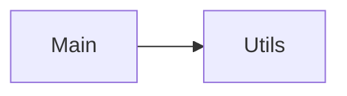

Repository Summary:
Files analyzed: 110
Directories scanned: 4035
Total size: 277.31 KB (283963 bytes)
Estimated tokens: 70990
Processing time: 2.03 seconds


## Table of Contents

- [Project Summary](#project-summary)
- [Directory Structure](#directory-structure)
- [Files Content](#files-content)
  - Files By Category:
    - Configuration (16 files):
      - [.gitignore](#_gitignore) - 587 bytes
      - [.postcssrc.json](#_postcssrc_json) - 54 bytes
      - [angular.json](#angular_json) - 3.6 KB
      - [config.json](#config_json) - 1.8 KB
      - [map.json](#map_json) - 15.3 KB
      - [ngsw-config.json](#ngsw-config_json) - 639 bytes
      - [openapi.json](#openapi_json) - 2.6 KB
      - [organization-v1.0.0.json](#organization-v1_0_0_json) - 11.2 KB
      - [output-v1.0.0.json](#output-v1_0_0_json) - 10.0 KB
      - [package.json](#package_json) - 1.3 KB
      - [and 6 more Configuration files...]
    - Documentation (2 files):
      - [about.md](#about_md) - 4.0 KB
      - [README.md](#README_md) - 1011 bytes
    - JavaScript/TypeScript (40 files):
      - [about.component.ts](#about_component_ts) - 1.4 KB
      - [app.component.ts](#app_component_ts) - 4.6 KB
      - [app.config.ts](#app_config_ts) - 1.2 KB
      - [app.routes.ts](#app_routes_ts) - 2.4 KB
      - [cache.service.ts](#cache_service_ts) - 1.7 KB
      - [caching.interceptor.ts](#caching_interceptor_ts) - 846 bytes
      - [config.service.ts](#config_service_ts) - 608 bytes
      - [cypher-builder.service.ts](#cypher-builder_service_ts) - 6.2 KB
      - [cypher-query.model.ts](#cypher-query_model_ts) - 118 bytes
      - [enhanced-node-viewer.component.ts](#enhanced-node-viewer_component_ts) - 7.6 KB
      - [and 30 more JavaScript/TypeScript files...]
    - Web (52 files):
      - [_page-styles.scss](#_page-styles_scss) - 803 bytes
      - [about.component.html](#about_component_html) - 1.1 KB
      - [about.component.scss](#about_component_scss) - 698 bytes
      - [app.component.html](#app_component_html) - 3.7 KB
      - [app.component.scss](#app_component_scss) - 6.5 KB
      - [enhanced-node-viewer.component.html](#enhanced-node-viewer_component_html) - 3.6 KB
      - [enhanced-node-viewer.component.scss](#enhanced-node-viewer_component_scss) - 3.4 KB
      - [error.component.html](#error_component_html) - 24 bytes
      - [error.component.scss](#error_component_scss) - 0 bytes
      - [generic-list.component.html](#generic-list_component_html) - 5.5 KB
      - [and 42 more Web files...]
- [Architecture and Relationships](#architecture-and-relationships)
  - [File Dependencies](#file-dependencies)
  - [Class Relationships](#class-relationships)
  - [Component Interactions](#component-interactions)

## Project Summary <a id="project-summary"></a>

# Project Digest: iroko-ui-pwa
Generated on: Tue Sep 30 2025 00:43:06 GMT-0400 (hora de verano de Cuba)
Source: /home/malayo/dev/iroko-cris-ui/iroko-ui-pwa
Project Directory: /home/malayo/dev/iroko-cris-ui/iroko-ui-pwa

# Directory Structure
[DIR] .
  [DIR] .angular
    [DIR] cache
      [DIR] 20.3.3
        [DIR] iroko-ui-pwa
          [DIR] vite
            [DIR] deps
            [DIR] deps_ssr
  [DIR] .git
  [FILE] .gitignore
  [FILE] .postcssrc.json
  [DIR] .vscode
  [DIR] CodeFlattened_Output
  [FILE] README.md
  [FILE] angular.json
  [FILE] ngsw-config.json
  [FILE] package.json
  [FILE] proxy.conf.json
  [DIR] public
    [FILE] config.json
    [DIR] fonts
    [DIR] icons
    [DIR] img
    [DIR] md
      [FILE] about.md
  [DIR] src
    [DIR] app
      [DIR] api
        [DIR] models
          [FILE] cypher-query.model.ts
          [FILE] http-validation-error.model.ts
          [FILE] validation-error.model.ts
        [DIR] services
          [FILE] iroko-api.service.ts
      [FILE] app.component.html
      [FILE] app.component.scss
      [FILE] app.component.ts
      [FILE] app.config.ts
      [FILE] app.routes.ts
      [DIR] components
        [DIR] enhanced-node-viewer
          [FILE] enhanced-node-viewer.component.html
          [FILE] enhanced-node-viewer.component.scss
          [FILE] enhanced-node-viewer.component.ts
        [DIR] generic-list
          [FILE] generic-list.component.html
          [FILE] generic-list.component.scss
          [FILE] generic-list.component.ts
        [DIR] global-search
          [FILE] global-search.component.html
          [FILE] global-search.component.scss
          [FILE] global-search.component.ts
        [DIR] markdown-viewer
          [FILE] markdown-viewer.component.html
          [FILE] markdown-viewer.component.scss
          [FILE] markdown-viewer.component.ts
        [DIR] query-executor
          [FILE] query-executor.component.html
          [FILE] query-executor.component.scss
          [FILE] query-executor.component.ts
        [DIR] relationship-card
          [FILE] relationship-card.component.html
          [FILE] relationship-card.component.scss
          [FILE] relationship-card.component.ts
        [DIR] relationship-pagination
          [FILE] relationship-pagination.component.html
          [FILE] relationship-pagination.component.scss
          [FILE] relationship-pagination.component.ts
        [DIR] results-display
          [FILE] results-display.component.html
          [FILE] results-display.component.scss
          [FILE] results-display.component.ts
        [DIR] view-class
          [FILE] view-class.component.html
          [FILE] view-class.component.scss
          [FILE] view-class.component.ts
        [DIR] view-instance
          [FILE] view-instance.component.html
          [FILE] view-instance.component.scss
          [FILE] view-instance.component.ts
      [DIR] interceptors
        [FILE] caching.interceptor.ts
      [DIR] pages
        [FILE] _page-styles.scss
        [DIR] about
          [FILE] about.component.html
          [FILE] about.component.scss
          [FILE] about.component.ts
        [DIR] error
          [FILE] error.component.html
          [FILE] error.component.scss
          [FILE] error.component.ts
        [DIR] home
          [FILE] home.component.html
          [FILE] home.component.scss
          [FILE] home.component.ts
        [DIR] mes
          [FILE] mes.component.html
          [FILE] mes.component.scss
          [FILE] mes.component.ts
        [DIR] node-view
          [FILE] node-view.component.html
          [FILE] node-view.component.scss
          [FILE] node-view.component.ts
        [DIR] organizations
          [FILE] organizations.component.html
          [FILE] organizations.component.scss
          [FILE] organizations.component.ts
        [DIR] outputs
          [FILE] outputs.component.html
          [FILE] outputs.component.scss
          [FILE] outputs.component.ts
        [DIR] persons
          [FILE] persons.component.html
          [FILE] persons.component.scss
          [FILE] persons.component.ts
        [DIR] projects
          [FILE] projects.component.html
          [FILE] projects.component.scss
          [FILE] projects.component.ts
        [DIR] query-page
          [FILE] query-page.component.html
          [FILE] query-page.component.scss
          [FILE] query-page.component.ts
        [DIR] search-results
          [FILE] search-results.component.html
          [FILE] search-results.component.scss
          [FILE] search-results.component.ts
        [DIR] sources
          [FILE] sources.component.html
          [FILE] sources.component.scss
          [FILE] sources.component.ts
        [DIR] vocabularies
          [FILE] vocabularies.component.html
          [FILE] vocabularies.component.scss
          [FILE] vocabularies.component.ts
      [DIR] schemas
        [FILE] organization-v1.0.0.json
        [FILE] output-v1.0.0.json
        [FILE] person-v1.0.0.json
        [FILE] project-v1.0.0.json
        [FILE] source-v1.0.0.json
      [DIR] services
        [FILE] cache.service.ts
        [FILE] config.service.ts
        [FILE] cypher-builder.service.ts
        [FILE] error-handler.service.ts
        [FILE] export.service.ts
        [FILE] map.json
        [FILE] metadata.service.ts
        [FILE] openapi.json
        [FILE] search.service.ts
    [FILE] index.html
    [FILE] main.ts
    [FILE] styles.scss
    [FILE] styles_theme-iroko.scss
  [FILE] translate-to-spanish.js
  [FILE] tsconfig.app.json
  [FILE] tsconfig.json

# Files Content

## .gitignore <a id="gitignore"></a>

# See https://docs.github.com/get-started/getting-started-with-git/ignoring-files for more about ignoring files.

# Compiled output
/dist
/tmp
/out-tsc
/bazel-out

# Node
/node_modules
npm-debug.log
yarn-error.log

# IDEs and editors
.idea/
.project
.classpath
.c9/
*.launch
.settings/
*.sublime-workspace

# Visual Studio Code
.vscode/*
!.vscode/settings.json
!.vscode/tasks.json
!.vscode/launch.json
!.vscode/extensions.json
.history/*

# Miscellaneous
/.angular/cache
.sass-cache/
/connect.lock
/coverage
/libpeerconnection.log
testem.log
/typings

# System files
.DS_Store
Thumbs.db

## package.json <a id="package_json"></a>

{
  "name": "iroko-ui-pwa",
  "version": "0.0.0",
  "scripts": {
    "ng": "ng",
    "start": "ng serve",
    "build": "ng build",
    "watch": "ng build --watch --configuration development",
    "test": "ng test"
  },
  "private": true,
  "dependencies": {
    "@angular/animations": "^20.3.2",
    "@angular/cdk": "^20.2.5",
    "@angular/common": "^20.3.2",
    "@angular/compiler": "^20.3.2",
    "@angular/core": "^20.3.2",
    "@angular/forms": "^20.3.2",
    "@angular/material": "^20.2.5",
    "@angular/platform-browser": "^20.3.2",
    "@angular/platform-browser-dynamic": "^20.3.2",
    "@angular/router": "^20.3.2",
    "@angular/service-worker": "^20.3.2",
    "@tailwindcss/postcss": "^4.1.5",
    "marked": "^15.0.11",
    "material-icons": "^1.13.14",
    "ngx-json-viewer": "^3.2.1",
    "ngx-markdown": "^20.1.0",
    "postcss": "^8.5.3",
    "rxjs": "~7.8.0",
    "tailwindcss": "^4.1.5",
    "tslib": "^2.3.0",
    "zone.js": "~0.15.0"
  },
  "devDependencies": {
    "@angular/build": "^20.3.3",
    "@angular/cli": "^20.3.3",
    "@angular/compiler-cli": "^20.3.2",
    "@types/jasmine": "~5.1.0",
    "jasmine-core": "~5.6.0",
    "karma": "~6.4.0",
    "karma-chrome-launcher": "~3.2.0",
    "karma-coverage": "~2.2.0",
    "karma-jasmine": "~5.1.0",
    "karma-jasmine-html-reporter": "~2.1.0",
    "postcss": "^8.5.3",
    "typescript": "~5.9.2"
  }
}

## tsconfig.json <a id="tsconfig_json"></a>

/* To learn more about Typescript configuration file: https://www.typescriptlang.org/docs/handbook/tsconfig-json.html. */
/* To learn more about Angular compiler options: https://angular.dev/reference/configs/angular-compiler-options. */
{
  "compileOnSave": false,
  "compilerOptions": {
    "outDir": "./dist/out-tsc",
    "strict": true,
    "noImplicitOverride": true,
    "noPropertyAccessFromIndexSignature": true,
    "noImplicitReturns": true,
    "noFallthroughCasesInSwitch": true,
    "skipLibCheck": true,
    "isolatedModules": true,
    "esModuleInterop": true,
    "experimentalDecorators": true,
    "moduleResolution": "bundler",
    "importHelpers": true,
    "target": "ES2022",
    "module": "ES2022"
  },
  "angularCompilerOptions": {
    "enableI18nLegacyMessageIdFormat": false,
    "strictInjectionParameters": true,
    "strictInputAccessModifiers": true,
    "strictTemplates": true
  }
}

## README.md <a id="README_md"></a>

# IrokoUiPwa

This project was generated using [Angular CLI](https://github.com/angular/angular-cli) version 19.2.8.

## Principales secciones

- Home
- Revistas MES
- Catalogo de Fuentes (Sources)
- Organizaciones
- Personas
- Proyectos
- Resultados de investigacion (Outputs)

## Backend

Base de datos de Neo4j, accesible a traves de un api de solo lectura a la que se le puede hacer consultas en cypher

## Principales comoponentes:

- inicio: muestra resumen de las estadisticas generales, por cada seccion

- listas: se utiliza para mostrar las listas de las entidades principales. Cada lista es posible filtrarla por los metadatos del nodo.

- node-viewer: muestra un nodo, con sus metadatos correspondientes y ademas las estadisticas de ese nodo. Por cada tipo de relacion que tiene un nodo existe un tab donde se muesta la lista de nodos que estan relacionados con el nodo que se esta visitando. Si se tienen los permisos adecuados, es posible editar los metadatos de un nodo y tambien sus relaciones.

## src/main.ts <a id="main_ts"></a>

### Dependencies

- `@angular/platform-browser`
- `./app/app.config`
- `./app/app.component`

import { bootstrapApplication } from '@angular/platform-browser';
import { appConfig } from './app/app.config';
import { AppComponent } from './app/app.component';

bootstrapApplication(AppComponent, appConfig)
  .catch((err) => console.error(err));

## src/app/pages/about/about.component.ts <a id="about_component_ts"></a>

### Dependencies

- `@angular/core`
- `@angular/common`
- `@angular/router`
- `../../services/metadata.service`
- `@angular/material/card`
- `@angular/material/progress-spinner`
- `@angular/material/icon`

import { Component, OnInit } from '@angular/core';
import { CommonModule } from '@angular/common';
import { RouterModule } from '@angular/router';
import { MetadataService } from '../../services/metadata.service';
import {
  MarkdownViewerComponent,
  MarkdownError,
} from '../../components/markdown-viewer/markdown-viewer.component';
import { MatCardModule } from '@angular/material/card';
import { MatProgressSpinnerModule } from '@angular/material/progress-spinner';
import { MatIcon } from '@angular/material/icon';

@Component({
  selector: 'app-about',
  templateUrl: './about.component.html',
  styleUrls: ['./about.component.scss'],
  imports: [
    CommonModule,
    RouterModule,
    MarkdownViewerComponent,
    MatCardModule,
    MatProgressSpinnerModule,
    MatIcon,
  ],
})
export class AboutComponent implements OnInit {
  isLoading = true;
  loadError = false;
  errorMessage = '';

  constructor(private metadataService: MetadataService) {}

  ngOnInit() {
    this.metadataService.updateMetadata({
      title: 'Acerca de Iroko',
      description: 'Learn about the Explorador del Grafo de Conocimiento Iroko platform',
      authors: [],
      subjects: [],
    });
  }

  onMarkdownLoad() {
    this.isLoading = false;
    this.loadError = false;
  }

  onMarkdownError(error: MarkdownError) {
    this.isLoading = false;
    this.loadError = true;
    this.errorMessage = error.message;
  }
}

## src/app/app.component.ts <a id="app_component_ts"></a>

### Dependencies

- `./services/config.service`
- `@angular/material/sidenav`
- `@angular/material/list`
- `@angular/material/icon`
- `@angular/material/toolbar`
- `@angular/material/menu`
- `@angular/material/button`
- `@angular/cdk/layout`
- `@angular/platform-browser`
- `./services/metadata.service`
- `./components/global-search/global-search.component`
- `rxjs/operators`
- `@angular/common`

// src/app/app.component.ts (updated)
import {
  Component,
  importProvidersFrom,
  inject,
  signal,
  OnInit,
} from '@angular/core';
import {
  RouterModule,
  RouterOutlet,
  Router,
  NavigationEnd,
  NavigationStart,
  NavigationError,
} from '@angular/router';
import { ConfigService, Config } from './services/config.service';
import { MatSidenavModule } from '@angular/material/sidenav';
import { MatListModule } from '@angular/material/list';
import { MatIconModule, MatIconRegistry } from '@angular/material/icon';
import { MatToolbarModule } from '@angular/material/toolbar';
import { MatMenuModule } from '@angular/material/menu';
import { MatButtonModule } from '@angular/material/button';
import { MediaMatcher } from '@angular/cdk/layout';
import { DomSanitizer } from '@angular/platform-browser';
import { MetadataService, PageMetadata } from './services/metadata.service';
import { GlobalSearchComponent } from './components/global-search/global-search.component';
import { filter, map } from 'rxjs/operators';
import { CommonModule } from '@angular/common';

@Component({
  selector: 'app-root',
  imports: [
    CommonModule,
    RouterOutlet,
    MatToolbarModule,
    MatMenuModule,
    MatButtonModule,
    MatSidenavModule,
    MatListModule,
    RouterModule,
    MatIconModule,
    GlobalSearchComponent,
  ],
  templateUrl: './app.component.html',
  styleUrl: './app.component.scss',
})
export class AppComponent implements OnInit {
  protected readonly isMobile = signal(true);
  private readonly _mobileQuery: MediaQueryList;
  private readonly _mobileQueryListener: () => void;

  config: Config = { title: 'Iroko', menu: [] };
  currentPageTitle = 'Iroko';
  metadata: PageMetadata = {
    title: '',
    abstract: '',
    description: '',
    keywords: [],
    subjects: [],
  };

  title = 'iroko-ui-pwa';

  constructor(
    private menuService: ConfigService,
    private matIconRegistry: MatIconRegistry,
    private domSanitizer: DomSanitizer,
    private metadataService: MetadataService,
    private router: Router
  ) {
    this.matIconRegistry.addSvgIcon(
      'sceiba',
      this.domSanitizer.bypassSecurityTrustResourceUrl('img/sceiba.svg')
    );
    const media = inject(MediaMatcher);

    this._mobileQuery = media.matchMedia('(max-width: 600px)');
    this.isMobile.set(this._mobileQuery.matches);
    this._mobileQueryListener = () =>
      this.isMobile.set(this._mobileQuery.matches);
    this._mobileQuery.addEventListener('change', this._mobileQueryListener);

    this.router.events.subscribe((event) => {
      if (event instanceof NavigationStart) {
        console.log('NavigationStart:', event.url);
      }
      if (event instanceof NavigationEnd) {
        console.log('NavigationEnd:', event.url);
      }
      if (event instanceof NavigationError) {
        console.error('NavigationError:', event.error);
      }
    });
  }

  ngOnInit() {
    this.menuService.getConfig().subscribe((config) => {
      this.config = config;
    });

    this.metadataService.currentMetadata.subscribe((metadata) => {
      this.metadata = metadata;
      this.currentPageTitle = metadata.title || 'Iroko';
    });

    // Set page title based on route
    this.router.events
      .pipe(
        filter((event) => event instanceof NavigationEnd),
        map(() => {
          let route = this.router.routerState.root;
          while (route.firstChild) route = route.firstChild;
          return route;
        }),
        filter((route) => route.outlet === 'primary')
      )
      .subscribe((route) => {
        const title =
          route.snapshot.data['title'] || this.getTitleFromRoute(route);
        this.metadataService.updateMetadata({ title });
      });
  }

  private getTitleFromRoute(route: any): string {
    const path = route.snapshot.routeConfig?.path;
    if (!path) return 'Iroko';

    const titleMap: { [key: string]: string } = {
      '': 'Inicio',
      sources: 'Sources',
      organizations: 'Organizaciones',
      persons: 'People',
      projects: 'Projects',
      outputs: 'Resultados de Investigación',
      vocabs: 'Vocabularios',
      query: 'Consulta Cypher',
      search: 'Resultados de Búsqueda',
    };

    return titleMap[path] || 'Iroko';
  }

  ngOnDestroy(): void {
    this._mobileQuery.removeEventListener('change', this._mobileQueryListener);
  }

  getMainContainerClass(): string {
    return this.isMobile()
      ? 'main-is-mobile flex flex-col min-h-screen'
      : 'flex flex-col min-h-screen';
  }
  // Add this method to the AppComponent class in app.component.ts
  getSidenavOpenedState(): boolean {
    // Expanded by default on desktop, collapsed on mobile
    return !this.isMobile();
  }
}

## src/app/app.routes.ts <a id="app_routes_ts"></a>

### Dependencies

- `@angular/router`
- `./pages/query-page/query-page.component`
- `./pages/error/error.component`
- `./pages/home/home.component`
- `./pages/sources/sources.component`
- `./pages/mes/mes.component`
- `./pages/organizations/organizations.component`
- `./pages/persons/persons.component`
- `./pages/projects/projects.component`
- `./pages/outputs/outputs.component`
- `./pages/vocabularies/vocabularies.component`
- `./pages/search-results/search-results.component`
- `./pages/node-view/node-view.component`
- `./pages/about/about.component`

import { Routes } from '@angular/router';
import { QueryPageComponent } from './pages/query-page/query-page.component';
import { ErrorComponent } from './pages/error/error.component';
import { HomeComponent } from './pages/home/home.component';
import { SourcesComponent } from './pages/sources/sources.component';
import { MesComponent } from './pages/mes/mes.component';
import { OrganizationsComponent } from './pages/organizations/organizations.component';
import { PersonsComponent } from './pages/persons/persons.component';
import { ProjectsComponent } from './pages/projects/projects.component';
import { OutputsComponent } from './pages/outputs/outputs.component';
import { VocabulariesComponent } from './pages/vocabularies/vocabularies.component';
import { SearchResultsComponent } from './pages/search-results/search-results.component';
import { NodeViewComponent } from './pages/node-view/node-view.component';
import { AboutComponent } from './pages/about/about.component'; // Add this import

export const routes: Routes = [
  {
    path: '',
    component: HomeComponent,
    data: { title: 'Inicio' },
  },
  {
    path: 'sources',
    component: SourcesComponent,
    data: { title: 'Fuentes de Datos' },
  },
  {
    path: 'mes',
    component: MesComponent,
    data: { title: 'MES Journals' },
  },
  {
    path: 'organizations',
    component: OrganizationsComponent,
    data: { title: 'Organizaciones' },
  },
  {
    path: 'persons',
    component: PersonsComponent,
    data: { title: 'Investigadores' },
  },
  {
    path: 'projects',
    component: ProjectsComponent,
    data: { title: 'Proyectos de Investigación' },
  },
  {
    path: 'outputs',
    component: OutputsComponent,
    data: { title: 'Resultados de Investigación' },
  },
  {
    path: 'vocabularies',
    component: VocabulariesComponent,
    data: { title: 'Vocabularios' },
  },
  {
    path: 'query',
    component: QueryPageComponent,
    data: { title: 'Consulta Cypher' },
  },
  {
    path: 'search',
    component: SearchResultsComponent,
    data: { title: 'Resultados de Búsqueda' },
  },
  {
    path: 'view/:type/:id',
    component: NodeViewComponent,
    data: { title: 'Detalles del Nodo' },
  },
  {
    path: 'about', // Add this route
    component: AboutComponent,
    data: { title: 'Acerca de' },
  },
  {
    path: '**',
    component: ErrorComponent,
    data: { title: 'Página No Encontrada' },
  },
];

## src/app/app.config.ts <a id="app_config_ts"></a>

### Dependencies

- `@angular/router`
- `./app.routes`
- `@angular/service-worker`
- `@angular/platform-browser/animations`
- `ngx-markdown`
- `./api/services/iroko-api.service`
- `./services/error-handler.service`
- `./interceptors/caching.interceptor`

// src/app/app.config.ts
import {
  ApplicationConfig,
  provideZoneChangeDetection,
  isDevMode,
  ErrorHandler,
} from '@angular/core';
import { provideRouter } from '@angular/router';

import { routes } from './app.routes';
import { provideServiceWorker } from '@angular/service-worker';
import {
  provideHttpClient,
  withFetch,
  withInterceptors,
} from '@angular/common/http';
import { provideAnimations } from '@angular/platform-browser/animations';

import { provideMarkdown } from 'ngx-markdown';

import { IrokoApiService } from './api/services/iroko-api.service';
import { ErrorHandlerService } from './services/error-handler.service';
import { cachingInterceptor } from './interceptors/caching.interceptor';

export const appConfig: ApplicationConfig = {
  providers: [
    provideZoneChangeDetection({ eventCoalescing: true }),
    provideRouter(routes),
    provideAnimations(),
    provideServiceWorker('ngsw-worker.js', {
      enabled: !isDevMode(),
      registrationStrategy: 'registerWhenStable:30000',
    }),
    provideHttpClient(withFetch(), withInterceptors([cachingInterceptor])),
    provideMarkdown(), // Add this line
    IrokoApiService,
    {
      provide: ErrorHandler,
      useClass: ErrorHandlerService,
    },
  ],
};

## src/app/services/cache.service.ts <a id="cache_service_ts"></a>

### Dependencies

- `@angular/core`
- `rxjs`

// src/app/services/cache.service.ts
import { Injectable } from '@angular/core';
import { Observable, of } from 'rxjs';

interface CacheItem {
  data: any;
  timestamp: number;
  ttl: number; // Time to live in milliseconds
}

@Injectable({
  providedIn: 'root',
})
export class CacheService {
  private cache = new Map<string, CacheItem>();
  private defaultTTL = 5 * 60 * 1000; // 5 minutes

  constructor() {
    // Clean up expired cache items every minute
    setInterval(() => this.cleanup(), 60 * 1000);
  }

  set(key: string, data: any, ttl: number = this.defaultTTL): void {
    this.cache.set(key, {
      data,
      timestamp: Date.now(),
      ttl,
    });
  }

  get(key: string): any | null {
    const item = this.cache.get(key);
    if (!item) return null;

    if (Date.now() - item.timestamp > item.ttl) {
      this.cache.delete(key);
      return null;
    }

    return item.data;
  }

  getOrFetch<T>(
    key: string,
    fetchFn: () => Observable<T>,
    ttl: number = this.defaultTTL
  ): Observable<T> {
    const cached = this.get(key);
    if (cached !== null) {
      return of(cached);
    }

    return new Observable<T>((observer) => {
      fetchFn().subscribe({
        next: (data) => {
          this.set(key, data, ttl);
          observer.next(data);
          observer.complete();
        },
        error: (err) => observer.error(err),
      });
    });
  }

  delete(key: string): boolean {
    return this.cache.delete(key);
  }

  clear(): void {
    this.cache.clear();
  }

  private cleanup(): void {
    const now = Date.now();
    this.cache.forEach((item, key) => {
      if (now - item.timestamp > item.ttl) {
        this.cache.delete(key);
      }
    });
  }
}

## src/app/interceptors/caching.interceptor.ts <a id="caching_interceptor_ts"></a>

### Dependencies

- `rxjs`
- `rxjs/operators`

// src/app/interceptors/caching.interceptor.ts
import {
  HttpInterceptorFn,
  HttpRequest,
  HttpHandlerFn,
  HttpEvent,
  HttpResponse,
} from '@angular/common/http';
import { Observable, of } from 'rxjs';
import { tap } from 'rxjs/operators';

const cache = new Map<string, any>();

export const cachingInterceptor: HttpInterceptorFn = (
  req: HttpRequest<unknown>,
  next: HttpHandlerFn
): Observable<HttpEvent<unknown>> => {
  // Only cache GET requests to the API
  if (req.method !== 'GET' || !req.url.includes('/api/')) {
    return next(req);
  }

  const cachedResponse = cache.get(req.urlWithParams);
  if (cachedResponse) {
    return of(cachedResponse.clone());
  }

  return next(req).pipe(
    tap((event) => {
      if (event instanceof HttpResponse) {
        cache.set(req.urlWithParams, event.clone());
      }
    })
  );
};

## src/app/services/config.service.ts <a id="config_service_ts"></a>

### Dependencies

- `@angular/common/http`
- `@angular/core`
- `@angular/material/menu`
- `rxjs`

import { HttpClient } from '@angular/common/http';
import { Injectable } from '@angular/core';
import { MatMenuItem } from '@angular/material/menu';
import { Observable } from 'rxjs';

export interface MenuItem {
  label: string;
  description: string;
  icon?: string;
  route?: string;
  children?: MenuItem[];
  expanded?: boolean;
}

export interface Config {
  title: string;
  menu: MenuItem[];
}

@Injectable({
  providedIn: 'root',
})
export class ConfigService {
  constructor(private http: HttpClient) {}

  getConfig(): Observable<Config> {
    return this.http.get<Config>('/config.json');
  }
}

## src/app/services/cypher-builder.service.ts <a id="cypher-builder_service_ts"></a>

### Dependencies

- `@angular/core`

// src/app/api/services/cypher-builder.service.ts
import { Injectable } from '@angular/core';

export interface QueryFilter {
  property: string;
  operator: '=' | 'CONTAINS' | 'STARTS WITH' | 'ENDS WITH' | '>' | '<' | '>=';
  value: any;
}

export interface QueryOptions {
  labels?: string[];
  properties?: string[];
  filters?: QueryFilter[];
  limit?: number;
  skip?: number;
  orderBy?: { property: string; direction: 'ASC' | 'DESC' };
  relationships?: { type: string; direction: 'IN' | 'OUT' }[];
}

@Injectable({
  providedIn: 'root',
})
export class CypherBuilderService {
  buildListQuery(options: QueryOptions): { query: string; parameters: any } {
    const params: any = {};
    const labels = options.labels?.join(':') || '';
    const alias = 'n';

    let query = `MATCH (${alias}${labels ? ':' + labels : ''})`;

    // Add WHERE clauses for filters
    const whereClauses: string[] = [];
    options.filters?.forEach((filter, index) => {
      const paramName = `param${index}`;
      params[paramName] = filter.value;

      switch (filter.operator) {
        case 'CONTAINS':
          whereClauses.push(
            `toLower(${alias}.${filter.property}) CONTAINS toLower($${paramName})`
          );
          break;
        case 'STARTS WITH':
          whereClauses.push(
            `toLower(${alias}.${filter.property}) STARTS WITH toLower($${paramName})`
          );
          break;
        case 'ENDS WITH':
          whereClauses.push(
            `toLower(${alias}.${filter.property}) ENDS WITH toLower($${paramName})`
          );
          break;
        default:
          whereClauses.push(
            `${alias}.${filter.property} ${filter.operator} $${paramName}`
          );
      }
    });

    if (whereClauses.length > 0) {
      query += `\nWHERE ${whereClauses.join(' AND ')}`;
    }

    // RETURN clause
    const returnProps = options.properties?.length
      ? options.properties.map((prop) => `${alias}.${prop}`).join(', ')
      : `${alias}`;

    query += `\nRETURN ${returnProps}`;

    // ORDER BY
    if (options.orderBy) {
      query += `\nORDER BY ${alias}.${options.orderBy.property} ${options.orderBy.direction}`;
    }

    // SKIP and LIMIT
    if (options.skip) {
      query += `\nSKIP ${options.skip}`;
    }

    if (options.limit) {
      query += `\nLIMIT ${options.limit}`;
    }

    return { query, parameters: params };
  }

  buildNodeQuery(
    nodeId: string,
    labels?: string[]
  ): { query: string; parameters: any } {
    const labelString = labels?.join(':') || '';
    const alias = 'n';

    const query = `
      MATCH (${alias}${labelString ? ':' + labelString : ''} {id: $id})
      OPTIONAL MATCH (${alias})-[r]-(related)
      RETURN ${alias}, type(r) as relationshipType, collect(related) as relatedNodes
    `;

    return {
      query,
      parameters: { id: nodeId },
    };
  }

  buildRelationshipQuery(
    nodeId: string,
    relationshipType?: string
  ): { query: string; parameters: any } {
    let query = `
      MATCH (n {id: $id})-[r${
        relationshipType ? ':' + relationshipType : ''
      }]-(related)
      RETURN type(r) as relationshipType, r, related
      ORDER BY relationshipType
    `;

    return {
      query,
      parameters: { id: nodeId },
    };
  }
  buildSearchQuery(
    entityType: string,
    searchTerm: string,
    searchableColumns: string[]
  ): { query: string; parameters: any } {
    if (!searchTerm || searchableColumns.length === 0) {
      return {
        query: `MATCH (n:${entityType}) RETURN n`,
        parameters: {},
      };
    }

    const searchConditions = searchableColumns
      .map(
        (col) =>
          `toLower(COALESCE(toString(n.${col}), '')) CONTAINS toLower($searchTerm)`
      )
      .join(' OR ');

    const query = `
      MATCH (n:${entityType})
      WHERE ${searchConditions}
      RETURN n
    `;

    return {
      query,
      parameters: { searchTerm },
    };
  }

  buildNodeWithRelationshipsQuery(
    nodeId: string,
    labels?: string[]
  ): { query: string; parameters: any } {
    const labelString = labels?.join(':') || '';
    const alias = 'n';

    const query = `
      MATCH (${alias}${labelString ? ':' + labelString : ''} {id: $id})
      OPTIONAL MATCH (${alias})-[r]-(related)
      RETURN ${alias},
             type(r) as relationshipType,
             r,
             related,
             labels(related) as relatedLabels,
             startNode(r) = ${alias} as isOutgoing
      ORDER BY type(r), related.name
    `;

    return {
      query,
      parameters: { id: nodeId },
    };
  }

  buildRelationshipCountQuery(
    nodeId: string,
    relationshipType: string,
    direction: 'INCOMING' | 'OUTGOING',
    labels?: string[]
  ): { query: string; parameters: any } {
    const labelString = labels?.join(':') || '';
    const alias = 'n';

    let matchClause = '';
    if (direction === 'OUTGOING') {
      matchClause = `MATCH (${alias}${
        labelString ? ':' + labelString : ''
      } {id: $id})-[r:${relationshipType}]->(related)`;
    } else {
      matchClause = `MATCH (${alias}${
        labelString ? ':' + labelString : ''
      } {id: $id})<-[r:${relationshipType}]-(related)`;
    }

    const query = `
      ${matchClause}
      RETURN count(related) as count
    `;

    return {
      query,
      parameters: { id: nodeId },
    };
  }

  buildPaginatedRelationshipsQuery(
    nodeId: string,
    relationshipType: string,
    direction: 'INCOMING' | 'OUTGOING',
    labels?: string[],
    page: number = 0,
    pageSize: number = 10
  ): { query: string; parameters: any } {
    const labelString = labels?.join(':') || '';
    const alias = 'n';

    let matchClause = '';
    if (direction === 'OUTGOING') {
      matchClause = `MATCH (${alias}${
        labelString ? ':' + labelString : ''
      } {id: $id})-[r:${relationshipType}]->(related)`;
    } else {
      matchClause = `MATCH (${alias}${
        labelString ? ':' + labelString : ''
      } {id: $id})<-[r:${relationshipType}]-(related)`;
    }

    const query = `
      ${matchClause}
      RETURN related, r, labels(related) as relatedLabels
      ORDER BY related.name, related.id
      SKIP $skip
      LIMIT $limit
    `;

    return {
      query,
      parameters: {
        id: nodeId,
        skip: page * pageSize,
        limit: pageSize,
      },
    };
  }
}

## src/app/api/models/cypher-query.model.ts <a id="cypher-query_model_ts"></a>

export interface CypherQuery {
  query: string;
  parameters?: { [key: string]: any } | null;
  readonly?: boolean;
}

## src/app/components/enhanced-node-viewer/enhanced-node-viewer.component.ts <a id="enhanced-node-viewer_component_ts"></a>

### Dependencies

- `@angular/common`
- `@angular/material/tabs`
- `@angular/material/card`
- `@angular/material/chips`
- `@angular/material/button`
- `@angular/material/icon`
- `@angular/material/list`
- `ngx-json-viewer`
- `@angular/material/progress-spinner`
- `../../api/services/iroko-api.service`
- `../../services/cypher-builder.service`
- `../relationship-card/relationship-card.component`
- `../relationship-pagination/relationship-pagination.component`

import {
  Component,
  Input,
  OnInit,
  Output,
  EventEmitter,
  SimpleChanges,
} from '@angular/core';
import { CommonModule } from '@angular/common';
import { MatTabsModule } from '@angular/material/tabs';
import { MatCardModule } from '@angular/material/card';
import { MatChipsModule } from '@angular/material/chips';
import { MatButtonModule } from '@angular/material/button';
import { MatIconModule } from '@angular/material/icon';
import { MatListModule } from '@angular/material/list';
import { NgxJsonViewerModule } from 'ngx-json-viewer';
import { MatProgressSpinnerModule } from '@angular/material/progress-spinner';

import { IrokoApiService } from '../../api/services/iroko-api.service';
import { CypherBuilderService } from '../../services/cypher-builder.service';
import { RelationshipCardComponent } from '../relationship-card/relationship-card.component';
import { RelationshipPaginationComponent } from '../relationship-pagination/relationship-pagination.component';

interface RelationshipGroup {
  type: string;
  relationships: RelationshipData[];
  direction: 'INCOMING' | 'OUTGOING';
  totalCount: number;
  currentPage: number;
  pageSize: number;
  isLoading: boolean;
}

interface RelationshipData {
  node: any;
  relationship: any;
  nodeLabels: string[];
}

@Component({
  selector: 'app-enhanced-node-viewer',
  templateUrl: './enhanced-node-viewer.component.html',
  styleUrls: ['./enhanced-node-viewer.component.scss'],
  imports: [
    CommonModule,
    MatTabsModule,
    MatCardModule,
    MatChipsModule,
    MatButtonModule,
    MatIconModule,
    MatListModule,
    NgxJsonViewerModule,
    MatProgressSpinnerModule,
    RelationshipCardComponent,
    RelationshipPaginationComponent,
  ],
})
export class EnhancedNodeViewerComponent implements OnInit {
  @Input() nodeId!: string;
  @Input() nodeType!: string;
  @Output() nodeSelected = new EventEmitter<any>();

  node: any;
  relationshipGroups: RelationshipGroup[] = [];
  loading = false;
  activeTab = 0;

  constructor(
    private irokoApiService: IrokoApiService,
    private cypherBuilder: CypherBuilderService
  ) {}

  ngOnInit() {
    this.loadNode();
  }

  ngOnChanges(changes: SimpleChanges): void {
    console.log('EnhancedNodeViewerComponent - Input changes:', changes);

    // Reload node when nodeId or nodeType changes
    if (
      (changes['nodeId'] && changes['nodeId'].currentValue) ||
      (changes['nodeType'] && changes['nodeType'].currentValue)
    ) {
      this.loadNode();
    }
  }

  loadNode() {
    this.activeTab = 0;
    if (!this.nodeId || !this.nodeType) {
      console.warn('EnhancedNodeViewerComponent - Missing nodeId or nodeType');
      return;
    }

    console.log('EnhancedNodeViewerComponent - Loading node:', {
      nodeId: this.nodeId,
      nodeType: this.nodeType,
    });

    this.loading = true;

    // Load node with all relationships
    const queryData = this.cypherBuilder.buildNodeWithRelationshipsQuery(
      this.nodeId,
      [this.nodeType]
    );
    console.log(queryData);

    this.irokoApiService.executeQuery(queryData).subscribe({
      next: (result) => {
        if (result && result.length > 0) {
          this.node = result[0].n;

          this.processAllRelationships(result);
        } else {
          console.warn('EnhancedNodeViewerComponent - No node found');
        }
        this.loading = false;
      },
      error: (error) => {
        console.error(
          'EnhancedNodeViewerComponent - Error loading node:',
          error
        );
        this.loading = false;
      },
    });
  }

  private processAllRelationships(result: any[]) {
    const relationshipMap = new Map<string, RelationshipGroup>();

    // Process all relationships from the result
    result.forEach((row: any) => {
      if (row.relationshipType && row.related) {
        const direction: 'INCOMING' | 'OUTGOING' = row.isOutgoing
          ? 'OUTGOING'
          : 'INCOMING';
        const key =  "[REDACTED]";

        if (!relationshipMap.has(key)) {
          relationshipMap.set(key, {
            type: row.relationshipType,
            relationships: [],
            direction: direction,
            totalCount: 0, // We'll count as we process
            currentPage: 0,
            pageSize: 10,
            isLoading: false,
          });
        }

        const group = relationshipMap.get(key)!;

        // Only store the first page (10 items) initially
        if (group.relationships.length < group.pageSize) {
          group.relationships.push({
            node: row.related,
            relationship: row.r,
            nodeLabels: row.relatedLabels || [],
          });
        }

        // Count all relationships for this type
        group.totalCount++;
      }
    });

    this.relationshipGroups = Array.from(relationshipMap.values());

    // For groups with more than 10 items, we need to load counts properly
    this.relationshipGroups.forEach((group) => {
      if (group.totalCount > group.pageSize) {
        this.loadRelationshipCount(group);
      }
    });
  }

  private loadRelationshipCount(group: RelationshipGroup): void {
    const countQuery = this.cypherBuilder.buildRelationshipCountQuery(
      this.nodeId,
      group.type,
      group.direction,
      [this.nodeType]
    );

    this.irokoApiService.executeQuery(countQuery).subscribe({
      next: (countResult) => {
        if (countResult && countResult.length > 0) {
          group.totalCount = countResult[0].count || group.totalCount;
        }
      },
      error: (error) => {
        console.error('Error loading relationship count:', error);
        // Keep the estimated count we have
      },
    });
  }

  loadRelationshipPage(group: RelationshipGroup, page: number): void {
    if (group.isLoading) return;

    group.isLoading = true;

    const relationshipsQuery =
      this.cypherBuilder.buildPaginatedRelationshipsQuery(
        this.nodeId,
        group.type,
        group.direction,
        [this.nodeType],
        page,
        group.pageSize
      );

    this.irokoApiService.executeQuery(relationshipsQuery).subscribe({
      next: (result) => {
        group.relationships = result.map((row: any) => ({
          node: row.related,
          relationship: row.r,
          nodeLabels: row.relatedLabels || [],
        }));
        group.currentPage = page;
        group.isLoading = false;
      },
      error: (error) => {
        console.error('Error loading relationships:', error);
        group.isLoading = false;
      },
    });
  }

  getNodeProperties(): { key: string; value: any }[] {
    if (!this.node) return [];

    return Object.entries(this.node)
      .filter(([key]) => !key.startsWith('_'))
      .map(([key, value]) => ({ key, value }));
  }

  isArray(value: any): boolean {
    return Array.isArray(value);
  }

  isObject(value: any): boolean {
    return typeof value === 'object' && value !== null && !Array.isArray(value);
  }

  onRelatedNodeSelect(nodeData: any): void {
    if (nodeData && nodeData.id) {
      // Extract the primary node type from labels
      const nodeLabels = nodeData.labels || nodeData.nodeLabels || [];
      const primaryType = nodeLabels.length > 0 ? nodeLabels[0] : 'node';

      // Emit the node data with type information
      this.nodeSelected.emit({
        node: nodeData,
        type: primaryType,
      });
    }
  }
  getDisplayedRelationships(group: RelationshipGroup): RelationshipData[] {
    return group.relationships;
  }

  shouldShowPagination(group: RelationshipGroup): boolean {
    return group.totalCount > group.pageSize;
  }

  getTabLabel(group: RelationshipGroup): string {
    return `${group.type} (${group.totalCount})`;
  }
}

## src/app/services/error-handler.service.ts <a id="error-handler_service_ts"></a>

### Dependencies

- `@angular/core`
- `@angular/common/http`
- `@angular/material/snack-bar`

// src/app/services/error-handler.service.ts
import { Injectable, ErrorHandler, Injector } from '@angular/core';
import { HttpErrorResponse } from '@angular/common/http';
import { MatSnackBar } from '@angular/material/snack-bar';

@Injectable({
  providedIn: 'root',
})
export class ErrorHandlerService implements ErrorHandler {
  private snackBar: MatSnackBar | null = null;

  constructor(private injector: Injector) {}

  handleError(error: any): void {
    console.error('Error occurred:', error);

    // Lazy load snackbar to avoid circular dependency
    if (!this.snackBar) {
      this.snackBar = this.injector.get(MatSnackBar);
    }

    const message = this.getErrorMessage(error);

    this.snackBar.open(message, 'Dismiss', {
      duration: 5000,
      panelClass: ['error-snackbar'],
    });
  }

  private getErrorMessage(error: any): string {
    if (error instanceof HttpErrorResponse) {
      return this.getHttpErrorMessage(error);
    } else if (error instanceof Error) {
      return error.message;
    } else if (typeof error === 'string') {
      return error;
    } else {
      return 'An unexpected error occurred';
    }
  }

  private getHttpErrorMessage(error: HttpErrorResponse): string {
    switch (error.status) {
      case 0:
        return 'Unable to connect to the server. Please check your connection.';
      case 400:
        return 'Invalid request. Please check your input.';
      case 401:
        return 'Authentication required. Please log in.';
      case 403:
        return 'You do not have permission to perform this action.';
      case 404:
        return 'The requested resource was not found.';
      case 500:
        return 'Server error. Please try again later.';
      case 503:
        return 'Service temporarily unavailable. Please try again later.';
      default:
        return `Error ${error.status}: ${error.message}`;
    }
  }
}

## src/app/pages/error/error.component.ts <a id="error_component_ts"></a>

### Dependencies

- `@angular/core`

import { Component } from '@angular/core';

@Component({
  selector: 'app-error',
  imports: [],
  templateUrl: './error.component.html',
  styleUrl: './error.component.scss'
})
export class ErrorComponent {

}

## src/app/services/export.service.ts <a id="export_service_ts"></a>

### Dependencies

- `@angular/core`

// src/app/services/export.service.ts
import { Injectable } from '@angular/core';

@Injectable({
  providedIn: 'root',
})
export class ExportService {
  exportToCSV(data: any[], filename: string = 'data.csv'): void {
    if (!data || data.length === 0) {
      console.warn('No data to export');
      return;
    }

    const headers = Object.keys(data[0]);
    const csvContent = [
      headers.join(','),
      ...data.map((row) =>
        headers
          .map((header) => {
            const value = row[header];
            // Handle values that might contain commas or quotes
            if (typeof value === 'object') {
              return `"${JSON.stringify(value).replace(/"/g, '""')}"`;
            }
            return `"${String(value || '').replace(/"/g, '""')}"`;
          })
          .join(',')
      ),
    ].join('\n');

    this.downloadFile(csvContent, filename, 'text/csv');
  }

  exportToJSON(data: any, filename: string = 'data.json'): void {
    const jsonContent = JSON.stringify(data, null, 2);
    this.downloadFile(jsonContent, filename, 'application/json');
  }

  exportTableToCSV(
    tableElement: HTMLTableElement,
    filename: string = 'table.csv'
  ): void {
    const rows = Array.from(tableElement.querySelectorAll('tr'));
    const csvContent = rows
      .map((row) =>
        Array.from(row.querySelectorAll('th, td'))
          .map((cell) => `"${cell.textContent?.replace(/"/g, '""') || ''}"`)
          .join(',')
      )
      .join('\n');

    this.downloadFile(csvContent, filename, 'text/csv');
  }

  private downloadFile(
    content: string,
    filename: string,
    mimeType: string
  ): void {
    const blob = new Blob([content], { type: mimeType });
    const url = URL.createObjectURL(blob);

    const link = document.createElement('a');
    link.href = url;
    link.download = filename;
    document.body.appendChild(link);
    link.click();
    document.body.removeChild(link);

    URL.revokeObjectURL(url);
  }
}

## src/app/pages/home/home.component.ts <a id="home_component_ts"></a>

### Dependencies

- `@angular/core`
- `@angular/common`
- `@angular/router`
- `../../services/metadata.service`
- `../../api/services/iroko-api.service`
- `@angular/material/card`
- `@angular/material/button`
- `@angular/material/icon`
- `@angular/material/grid-list`
- `@angular/material/progress-spinner`

import { Component, OnDestroy, OnInit } from '@angular/core';
import { CommonModule } from '@angular/common';
import { RouterModule } from '@angular/router';
import { MetadataService } from '../../services/metadata.service';
import { IrokoApiService } from '../../api/services/iroko-api.service';
import { MatCardModule } from '@angular/material/card';
import { MatButtonModule } from '@angular/material/button';
import { MatIconModule } from '@angular/material/icon';
import { MatGridListModule } from '@angular/material/grid-list';
import { MatProgressSpinnerModule } from '@angular/material/progress-spinner';

@Component({
  selector: 'app-home',
  templateUrl: './home.component.html',
  styleUrls: ['./home.component.scss'],
  imports: [
    CommonModule,
    RouterModule,
    MatCardModule,
    MatButtonModule,
    MatIconModule,
    MatGridListModule,
    MatProgressSpinnerModule,
  ],
})
export class HomeComponent implements OnInit, OnDestroy {
  stats = [
    {
      label: 'Organizaciones',
      count: 0,
      icon: 'corporate_fare',
      route: '/organizations',
      color: 'primary',
      type: 'Organization',
    },
    {
      label: 'Investigadores',
      count: 0,
      icon: 'people',
      route: '/persons',
      color: 'accent',
      type: 'Person',
    },
    {
      label: 'Resultados de Investigación',
      count: 0,
      icon: 'article',
      route: '/outputs',
      color: 'warn',
      type: 'Output',
    },
    {
      label: 'Projects',
      count: 0,
      icon: 'folder',
      route: '/projects',
      color: 'primary',
      type: 'Project',
    },
    {
      label: 'Fuentes de Datos',
      count: 0,
      icon: 'source',
      route: '/sources',
      color: 'accent',
      type: 'Source',
    },
    {
      label: 'Vocabularios',
      count: 0,
      icon: 'tag',
      route: '/vocabularies',
      color: 'warn',
      type: 'Término',
    },
  ];

  quickActions = [
    {
      label: 'Búsqueda Avanzada',
      description: 'Buscar across all entities',
      icon: 'search',
      route: '/search',
    },
    {
      label: 'Consulta Cypher',
      description: 'Run custom graph queries',
      icon: 'code',
      route: '/query',
    },
    {
      label: 'Browse Catalog',
      description: 'Explore by categories',
      icon: 'explore',
      route: '/sources',
    },
  ];

  isLoading = true;

  constructor(
    private metadataService: MetadataService,
    private irokoApiService: IrokoApiService
  ) {}

  ngOnInit() {
    this.metadataService.updateMetadata({
      title: 'Explorador del Grafo de Conocimiento Iroko',
      description:
        'Explore research data, organizations, and publications in the Cuban research ecosystem',
      authors: [],
      subjects: [],
    });

    this.loadStatistics();
  }

  ngOnDestroy() {
    this.metadataService.resetMetadata();
  }

  private loadStatistics() {
    const queries = this.stats.map((stat) =>
      this.irokoApiService.executeQuery({
        query: `MATCH (n:${stat.type}) RETURN count(n) AS count`,
        parameters: {},
        readonly: true,
      })
    );

    // Execute all queries in parallel
    Promise.all(queries.map((q) => q.toPromise()))
      .then((results) => {
        results.forEach((result, index) => {
          if (result && result.length > 0) {
            this.stats[index].count = result[0].count || 0;
          }
        });
        this.isLoading = false;
      })
      .catch((error) => {
        console.error('Error loading statistics:', error);
        this.isLoading = false;
      });
  }

  formatCount(count: number): string {
    if (count >= 1000000) {
      return (count / 1000000).toFixed(1) + 'M';
    } else if (count >= 1000) {
      return (count / 1000).toFixed(1) + 'K';
    }
    return count.toString();
  }
}

## src/app/components/generic-list/generic-list.component.ts <a id="generic-list_component_ts"></a>

### Dependencies

- `@angular/common`
- `@angular/material/card`
- `@angular/material/form-field`
- `@angular/material/input`
- `@angular/material/select`
- `@angular/material/button`
- `@angular/material/icon`
- `@angular/material/progress-spinner`
- `@angular/material/chips`
- `@angular/material/divider`
- `@angular/material/tooltip`
- `../../api/services/iroko-api.service`
- `../enhanced-node-viewer/enhanced-node-viewer.component`
- `@angular/router`

// src/app/components/generic-list/generic-list.component.ts
import {
  Component,
  Input,
  Output,
  EventEmitter,
  OnInit,
  OnDestroy,
} from '@angular/core';
import { CommonModule } from '@angular/common';
import {
  FormsModule,
  ReactiveFormsModule,
  FormBuilder,
  FormControl,
} from '@angular/forms';
import {
  Subject,
  Subscription,
  debounceTime,
  distinctUntilChanged,
} from 'rxjs';
import { MatCardModule } from '@angular/material/card';
import { MatFormFieldModule } from '@angular/material/form-field';
import { MatInputModule } from '@angular/material/input';
import { MatSelectModule } from '@angular/material/select';
import { MatButtonModule } from '@angular/material/button';
import { MatIconModule } from '@angular/material/icon';
import { MatProgressSpinnerModule } from '@angular/material/progress-spinner';
import { MatChipsModule } from '@angular/material/chips';
import { MatDividerModule } from '@angular/material/divider';
import { MatTooltipModule } from '@angular/material/tooltip';

import { IrokoApiService } from '../../api/services/iroko-api.service';
import {
  CypherBuilderService,
  QueryFilter,
} from '../../services/cypher-builder.service';
import { EnhancedNodeViewerComponent } from '../enhanced-node-viewer/enhanced-node-viewer.component';
import { Router } from '@angular/router';

export interface ListColumn {
  name: string;
  label: string;
  sortable?: boolean;
  filterable?: boolean;
  type?: 'string' | 'number' | 'date' | 'array';
}

export interface SortOption {
  attribute: string;
  direction: 'ASC' | 'DESC';
}

@Component({
  selector: 'app-generic-list',
  templateUrl: './generic-list.component.html',
  styleUrls: ['./generic-list.component.scss'],
  imports: [
    CommonModule,
    FormsModule,
    ReactiveFormsModule,
    MatCardModule,
    MatFormFieldModule,
    MatInputModule,
    MatSelectModule,
    MatButtonModule,
    MatIconModule,
    MatProgressSpinnerModule,
    MatChipsModule,
    MatDividerModule,
    MatTooltipModule,
  ],
})
export class GenericListComponent implements OnInit, OnDestroy {
  @Input() entityType!: string;
  @Input() columns: ListColumn[] = [];
  @Input() label: string = '';
  @Input() pageSize: number = 10;
  @Input() defaultSort?: string;
  @Input() defaultSortOrder: 'ASC' | 'DESC' = 'ASC';
  @Output() nodeSelected = new EventEmitter<any>();

  // Data state
  nodes: any[] = [];
  totalCount = 0;
  currentPage = 0;
  isLoading = false;
  hasError = false;
  errorMessage = '';

  // Buscar and sort state
  searchTerm = '';
  sortBy: SortOption = { attribute: '', direction: 'ASC' };

  // Node viewer state
  selectedNode: any = null;
  showNodeViewer = false;

  // UI state - use FormControl with proper typing
  searchControl: FormControl<string | null>;
  sortControl: FormControl<string | null>;
  showSortOrder = false;

  // Pagination
  totalPages = 0;
  paginationRange: number[] = [];

  // Debounce for search
  private searchSubject = new Subject<string>();
  private searchSubscription?: Subscription;

  constructor(
    private irokoApiService: IrokoApiService,
    private cypherBuilder: CypherBuilderService,
    private router: Router,
    private fb: FormBuilder
  ) {
    this.searchControl = this.fb.control('');
    this.sortControl = this.fb.control('');
  }

  ngOnInit() {
    this.initializeSorting();
    this.setupSearchDebounce();
    this.loadPage(0);
  }

  ngOnDestroy() {
    this.searchSubscription?.unsubscribe();
  }

  private initializeSorting() {
    // Set default sort
    const sortableColumns = this.columns
      .filter((col) => col.sortable)
      .map((col) => col.name);
    const initialSortAttr =
      this.defaultSort && sortableColumns.includes(this.defaultSort)
        ? this.defaultSort
        : sortableColumns[0] || 'id';

    this.sortBy = {
      attribute: initialSortAttr,
      direction: this.defaultSortOrder,
    };

    this.sortControl.setValue(initialSortAttr);
    this.showSortOrder = !!initialSortAttr;
  }

  private setupSearchDebounce() {
    this.searchSubscription = this.searchSubject
      .pipe(debounceTime(500), distinctUntilChanged())
      .subscribe((searchTerm) => {
        this.searchTerm = searchTerm;
        this.loadPage(0);
      });

    this.searchControl.valueChanges.subscribe((value) => {
      this.searchSubject.next(value || '');
    });
  }

  async loadPage(page: number) {
    this.currentPage = page;
    this.isLoading = true;
    this.hasError = false;

    try {
      if (page === 0) {
        this.totalCount = await this.fetchTotalCount();
      }

      this.nodes = await this.fetchNodes(page * this.pageSize, this.pageSize);
      this.updatePagination();
    } catch (error) {
      console.error('Error loading page:', error);
      this.hasError = true;
      this.errorMessage = 'Failed to load data. Please try again.';
    } finally {
      this.isLoading = false;
    }
  }

  private async fetchTotalCount(): Promise<number> {
    const whereClause = this.buildWhereClause();
    const query = `MATCH (n:${this.entityType}) ${whereClause} RETURN count(n) AS count`;
    const parameters = this.buildParameters();

    const result = await this.irokoApiService
      .executeQuery({
        query,
        parameters,
        readonly: true,
      })
      .toPromise();

    // Handle the nested structure: result is array of objects with count property
    return result?.[0]?.count || 0;
  }

  private async fetchNodes(offset: number, limit: number): Promise<any[]> {
    const whereClause = this.buildWhereClause();
    const orderClause = this.buildOrderClause();

    const query = `
      MATCH (n:${this.entityType})
      ${whereClause}
      RETURN n
      ${orderClause}
      SKIP $offset
      LIMIT $limit
    `;

    const parameters = {
      ...this.buildParameters(),
      offset,
      limit,
    };

    const result = await this.irokoApiService
      .executeQuery({
        query,
        parameters,
        readonly: true,
      })
      .toPromise();

    // Extract the actual node data from the nested structure
    // Result is array of objects like: [{n: {id: '...', name: '...'}}, ...]
    return (result || []).map((item: { n: any }) =>
      this.extractNodeData(item.n || item)
    );
  }

  private extractNodeData(nodeWrapper: any): any {
    // If the node data is nested under properties, extract it
    if (nodeWrapper && nodeWrapper.properties) {
      return {
        id: nodeWrapper.elementId || nodeWrapper.properties.id,
        ...nodeWrapper.properties,
      };
    }

    // If it's already a flat object with an id, return as is
    if (nodeWrapper && nodeWrapper.id) {
      return nodeWrapper;
    }

    // Otherwise, try to extract meaningful data from the wrapper
    const nodeData: any = { id: nodeWrapper.elementId };

    // Copy all properties from the wrapper that aren't metadata
    Object.keys(nodeWrapper).forEach((key) => {
      if (!['elementId', 'labels', 'identity'].includes(key)) {
        nodeData[key] = nodeWrapper[key];
      }
    });

    return nodeData;
  }

  private buildWhereClause(): string {
    if (!this.searchTerm) return '';

    const searchableColumns = this.columns
      .filter((col) => col.filterable !== false)
      .map((col) => col.name);

    if (searchableColumns.length === 0) return '';

    // Build a search across multiple properties
    const searchConditions = searchableColumns
      .map(
        (col) =>
          `toLower(COALESCE(toString(n.${col}), '')) CONTAINS toLower($searchTerm)`
      )
      .join(' OR ');

    return `WHERE ${searchConditions}`;
  }

  private buildOrderClause(): string {
    if (!this.sortBy.attribute) return '';
    return `ORDER BY n.${this.sortBy.attribute} ${this.sortBy.direction}`;
  }

  private buildParameters(): any {
    const params: any = {};
    if (this.searchTerm) {
      params.searchTerm = this.searchTerm;
    }
    return params;
  }

  private updatePagination() {
    this.totalPages = Math.ceil(this.totalCount / this.pageSize) || 1;

    // Calculate pagination range (show max 5 pages)
    const startPage = Math.max(0, this.currentPage - 2);
    const endPage = Math.min(this.totalPages, startPage + 5);

    this.paginationRange = [];
    for (let i = startPage; i < endPage; i++) {
      this.paginationRange.push(i);
    }
  }

  // UI Event Handlers
  onSearchChange(event: Event) {
    const value = (event.target as HTMLInputElement).value;
    this.searchControl.setValue(value);
  }

  clearSearch() {
    this.searchControl.setValue('');
    this.searchTerm = '';
    this.loadPage(0);
  }

  onSortChange() {
    const newAttribute = this.sortControl.value;
    if (!newAttribute || newAttribute === 'none') {
      this.sortBy = { attribute: '', direction: 'ASC' };
      this.showSortOrder = false;
    } else {
      // If sorting by the same attribute, toggle direction
      if (this.sortBy.attribute === newAttribute) {
        this.toggleSortOrder();
      } else {
        this.sortBy = { attribute: newAttribute, direction: 'ASC' };
        this.showSortOrder = true;
      }
    }
    this.loadPage(0);
  }

  toggleSortOrder() {
    this.sortBy.direction = this.sortBy.direction === 'ASC' ? 'DESC' : 'ASC';
    this.loadPage(0);
  }

  getSortIcon(): string {
    return this.sortBy.direction === 'ASC' ? 'arrow_upward' : 'arrow_downward';
  }

  getSortTooltip(): string {
    return this.sortBy.direction === 'ASC' ? 'Ascendente' : 'Descendente';
  }

  getPaginationInfo(): string {
    if (this.totalCount === 0) {
      return 'No se encontraron resultados.';
    }

    const startIdx = this.currentPage * this.pageSize + 1;
    const endIdx = Math.min(startIdx + this.nodes.length - 1, this.totalCount);
    const totalPages = this.totalPages;

    return `Mostrando ${startIdx}–${endIdx} de ${
      this.totalCount
    } elementos — Página ${this.currentPage + 1} de ${totalPages}`;
  }

  onPageChange(page: number) {
    this.loadPage(page);
  }

  onNodeSelect(node: any) {
    // Navigate to the node view route
    this.router.navigate(['/view', this.entityType.toLowerCase(), node.id]);
    this.nodeSelected.emit(node);
  }

  onBackToList() {
    this.selectedNode = null;
    this.showNodeViewer = false;
  }

  formatPropertyValue(value: any, type?: string): string {
    if (value === null || value === undefined) return '-';

    if (Array.isArray(value)) {
      return value.join(', ');
    }

    if (typeof value === 'object') {
      return JSON.stringify(value);
    }

    if (type === 'date' && typeof value === 'string') {
      return new Date(value).toLocaleDateString();
    }

    return String(value);
  }

  getNodeProperties(
    node: any
  ): { key: string; value: any; label: string; type?: string }[] {
    return this.columns.map((col) => ({
      key: col.name,
      value: node[col.name],
      label: col.label,
      type: col.type,
    }));
  }

  hasSearchTerm(): boolean {
    return !!this.searchTerm;
  }

  getNodeDisplayName(node: any): string {
    return node.name || node.title || node.label || node.id || 'Unnamed';
  }
}

## src/app/components/global-search/global-search.component.ts <a id="global-search_component_ts"></a>

### Dependencies

- `@angular/core`
- `@angular/common`
- `@angular/forms`
- `@angular/router`
- `@angular/material/form-field`
- `@angular/material/input`
- `@angular/material/autocomplete`
- `@angular/material/icon`
- `@angular/material/button`
- `@angular/material/progress-spinner`
- `@angular/material/menu`
- `@angular/material/chips`
- `rxjs/operators`
- `rxjs`
- `../../services/search.service`

// src/app/components/global-search/global-search.component.ts
import { Component, ElementRef, ViewChild, OnInit } from '@angular/core';
import { CommonModule } from '@angular/common';
import { FormsModule } from '@angular/forms';
import { Router } from '@angular/router';
import { MatFormFieldModule } from '@angular/material/form-field';
import { MatInputModule } from '@angular/material/input';
import { MatAutocompleteModule } from '@angular/material/autocomplete';
import { MatIconModule } from '@angular/material/icon';
import { MatButtonModule } from '@angular/material/button';
import { MatProgressSpinnerModule } from '@angular/material/progress-spinner';
import { MatMenuModule } from '@angular/material/menu';
import { MatChipsModule } from '@angular/material/chips';
import { debounceTime, distinctUntilChanged, switchMap } from 'rxjs/operators';
import { Subject } from 'rxjs';
import { SearchResult, SearchService } from '../../services/search.service';

@Component({
  selector: 'app-global-search',
  templateUrl: './global-search.component.html',
  styleUrls: ['./global-search.component.scss'],
  imports: [
    CommonModule,
    FormsModule,
    MatFormFieldModule,
    MatInputModule,
    MatAutocompleteModule,
    MatIconModule,
    MatButtonModule,
    MatProgressSpinnerModule,
    MatMenuModule,
    MatChipsModule,
  ],
})
export class GlobalSearchComponent implements OnInit {
  @ViewChild('searchInput') searchInput!: ElementRef<HTMLInputElement>;

  searchTerm = '';
  searchResults: SearchResult[] = [];
  isLoading = false;
  showResults = false;

  private searchTerms = new Subject<string>();

  constructor(private searchService: SearchService, private router: Router) {}

  ngOnInit() {
    this.searchTerms
      .pipe(
        debounceTime(300),
        distinctUntilChanged(),
        switchMap((term) => {
          if (!term.trim()) {
            this.searchResults = [];
            return [];
          }
          this.isLoading = true;
          return this.searchService.globalSearch(term);
        })
      )
      .subscribe({
        next: (results) => {
          this.searchResults = results.map((item: any) => ({
            id: item.node.properties.id || item.node.identity,
            type: item.type,
            label:
              item.node.properties.name ||
              item.node.properties.title ||
              'Unnamed',
            description: item.node.properties.description,
            properties: item.node.properties,
            score: item.score,
          }));
          this.isLoading = false;
        },
        error: (error) => {
          console.error('Buscar error:', error);
          this.isLoading = false;
        },
      });
  }

  onSearchInput(event: Event): void {
    const term = (event.target as HTMLInputElement).value;
    this.searchTerms.next(term);
  }

  onSearchSubmit(): void {
    if (this.searchTerm.trim()) {
      this.router.navigate(['/search'], {
        queryParams: { q: this.searchTerm },
      });
      this.showResults = false;
      this.searchInput.nativeElement.blur();
    }
  }

  onResultSelect(result: SearchResult): void {
    this.router.navigate([`/${result.type.toLowerCase()}s`, result.id]);
    this.showResults = false;
    this.searchTerm = '';
  }

  onFocus(): void {
    if (this.searchResults.length > 0) {
      this.showResults = true;
    }
  }

  onBlur(): void {
    setTimeout(() => {
      this.showResults = false;
    }, 200);
  }

  clearSearch(): void {
    this.searchTerm = '';
    this.searchResults = [];
    this.showResults = false;
  }
}

## src/app/api/models/http-validation-error.model.ts <a id="http-validation-error_model_ts"></a>

### Dependencies

- `./validation-error.model`

import { ValidationError } from './validation-error.model';

export interface HTTPValidationError {
  detail?: ValidationError[];
}

## src/app/api/services/iroko-api.service.ts <a id="iroko-api_service_ts"></a>

### Dependencies

- `@angular/core`
- `@angular/common/http`
- `rxjs`
- `rxjs/operators`
- `../models/cypher-query.model`

import { Injectable } from '@angular/core';
import { HttpClient, HttpErrorResponse } from '@angular/common/http';
import { Observable, throwError } from 'rxjs';
import { catchError } from 'rxjs/operators';
import { CypherQuery } from '../models/cypher-query.model';

@Injectable({
  providedIn: 'root',
})
export class IrokoApiService {
  private apiUrl = '/api/v1';

  constructor(private http: HttpClient) {}

  executeQuery(queryData: CypherQuery): Observable<any> {
    return this.http
      .post(`${this.apiUrl}/query`, queryData)
      .pipe(catchError(this.handleError));
  }

  private handleError(error: HttpErrorResponse) {
    if (error.error instanceof ErrorEvent) {
      // Client-side or network error
      console.error('An error occurred:', error.error.message);
    } else {
      // The backend returned an unsuccessful response code
      console.error(
        `Backend returned code ${error.status}, ` +
          `body was: ${JSON.stringify(error.error)}`
      );
    }
    // Return an observable with a user-facing error message
    return throwError(
      () => new Error('Something bad happened; please try again later.')
    );
  }
}

## src/app/components/markdown-viewer/markdown-viewer.component.ts <a id="markdown-viewer_component_ts"></a>

### Dependencies

- `@angular/core`
- `@angular/common`
- `ngx-markdown`

import { Component, Input, Output, EventEmitter } from '@angular/core';
import { CommonModule } from '@angular/common';
import { MarkdownModule } from 'ngx-markdown';

export interface MarkdownError {
  message: string;
  originalError?: any;
}

@Component({
  selector: 'app-markdown-viewer',
  templateUrl: './markdown-viewer.component.html',
  styleUrls: ['./markdown-viewer.component.scss'],
  imports: [CommonModule, MarkdownModule],
})
export class MarkdownViewerComponent {
  @Input() content: string = '';
  @Input() src?: string;
  @Output() load = new EventEmitter<void>();
  @Output() error = new EventEmitter<MarkdownError>();

  onMarkdownLoad() {
    this.load.emit();
  }

  onMarkdownError(error: any) {
    const markdownError: MarkdownError = {
      message:
        typeof error === 'string'
          ? error
          : error?.message || 'Unknown error loading markdown',
      originalError: error,
    };
    this.error.emit(markdownError);
  }
}

## src/app/pages/mes/mes.component.ts <a id="mes_component_ts"></a>

### Dependencies

- `@angular/core`
- `@angular/common`
- `@angular/router`
- `../../services/metadata.service`

// src/app/pages/mes/mes.component.ts
import { Component } from '@angular/core';
import { CommonModule } from '@angular/common';
import { RouterModule } from '@angular/router';
import { MetadataService } from '../../services/metadata.service';
import {
  GenericListComponent,
  ListColumn,
} from '../../components/generic-list/generic-list.component';

@Component({
  selector: 'app-mes',
  templateUrl: './mes.component.html',
  styleUrls: ['./mes.component.scss'],
  imports: [CommonModule, GenericListComponent, RouterModule],
})
export class MesComponent {
  mesColumns: ListColumn[] = [
    {
      name: 'id',
      label: 'ID',
      sortable: true,
      filterable: true,
      type: 'string',
    },
    {
      name: 'title',
      label: 'Título de la Revista',
      sortable: true,
      filterable: true,
      type: 'string',
    },
    {
      name: 'name',
      label: 'Nombre Corto',
      sortable: true,
      filterable: true,
      type: 'string',
    },
    {
      name: 'issn',
      label: 'ISSN',
      sortable: false,
      filterable: true,
      type: 'string',
    },
    {
      name: 'rnps',
      label: 'RNPS',
      sortable: false,
      filterable: true,
      type: 'string',
    },
    {
      name: 'seriadas_cubanas',
      label: 'Seriadas Cubanas',
      sortable: true,
      filterable: true,
      type: 'string',
    },
    {
      name: 'source_status',
      label: 'Estado',
      sortable: true,
      filterable: true,
      type: 'string',
    },
    {
      name: 'start_year',
      label: 'Año de Inicio',
      sortable: true,
      filterable: true,
      type: 'string',
    },
    {
      name: 'frequency',
      label: 'Frecuencia',
      sortable: true,
      filterable: true,
      type: 'string',
    },
    {
      name: 'organizations',
      label: 'Organizaciones Editoras',
      sortable: false,
      filterable: true,
      type: 'array',
    },
  ];

  constructor(private metadataService: MetadataService) {}

  ngOnInit() {
    this.metadataService.updateMetadata({
      title: 'MES Journals',
      description:
        'Explore scientific journals from the Cuban Ministry of Higher Education',
      authors: [],
      subjects: [],
    });
  }

  onNodeSelected(node: any) {
    console.log('MES journal selected:', node);
    // Navigate to journal detail or show dialog
  }
}

## src/app/pages/node-view/node-view.component.ts <a id="node-view_component_ts"></a>

### Dependencies

- `@angular/core`
- `@angular/common`
- `@angular/router`
- `@angular/material/card`
- `@angular/material/button`
- `@angular/material/icon`
- `@angular/material/progress-spinner`
- `../../services/metadata.service`
- `../../components/enhanced-node-viewer/enhanced-node-viewer.component`
- `rxjs`

// src/app/pages/node-view/node-view.component.ts
import { Component, OnInit } from '@angular/core';
import { CommonModule } from '@angular/common';
import { ActivatedRoute, Router, RouterModule } from '@angular/router';
import { MatCardModule } from '@angular/material/card';
import { MatButtonModule } from '@angular/material/button';
import { MatIconModule } from '@angular/material/icon';
import { MatProgressSpinnerModule } from '@angular/material/progress-spinner';

import { MetadataService } from '../../services/metadata.service';
import { EnhancedNodeViewerComponent } from '../../components/enhanced-node-viewer/enhanced-node-viewer.component';
import { Subscription } from 'rxjs';

@Component({
  selector: 'app-node-view',
  templateUrl: './node-view.component.html',
  styleUrls: ['./node-view.component.scss'],
  imports: [
    CommonModule,
    RouterModule,
    MatCardModule,
    MatButtonModule,
    MatIconModule,
    MatProgressSpinnerModule,
    EnhancedNodeViewerComponent,
  ],
})
export class NodeViewComponent implements OnInit {
  nodeType: string = '';
  nodeId: string = '';
  private routeSub!: Subscription;

  // Map entity types to display names
  private nodeTypes: { [key: string]: string } = {
    organization: 'Organization',
    person: 'Person',
    source: 'Source',
    project: 'Project',
    output: 'Output',
    term: 'Término',
  };

  // Map entity types to display names
  private typeDisplayNames: { [key: string]: string } = {
    Organization: 'Organization',
    Person: 'Researcher',
    Source: 'Data Source',
    Project: 'Research Project',
    Output: 'Research Output',
    Término: 'Vocabulario Término',
  };

  constructor(
    private route: ActivatedRoute,
    private router: Router,
    private metadataService: MetadataService
  ) {}

  ngOnInit() {
    this.routeSub = this.route.params.subscribe((params) => {
      this.nodeType = this.nodeTypes[params['type']];
      this.nodeId = params['id'];
      console.log(this.nodeId, 'AAAAAAAAAAAAAAAAAAAAAAAAAAA');

      const displayName = this.typeDisplayNames[this.nodeType] || this.nodeType;
      this.metadataService.updateMetadata({
        title: `${displayName} Details`,
        description: `View details for ${displayName.toLowerCase()}`,
      });
    });
  }
  ngOnDestroy() {
    // Clean up subscription to prevent memory leaks
    if (this.routeSub) {
      this.routeSub.unsubscribe();
    }
  }

  goBack() {
    // Navigate back to the previous page or the list page
    const listRoute = this.getListRoute();
    this.router.navigate([listRoute]);
  }

  private getListRoute(): string {
    const routeMap: { [key: string]: string } = {
      Organization: '/organizations',
      Person: '/persons',
      Source: '/sources',
      Project: '/projects',
      Output: '/outputs',
      Término: '/vocabularies',
    };

    return routeMap[this.nodeType] || '/';
  }

  getBreadcrumbLabel(): string {
    return this.typeDisplayNames[this.nodeType] || this.nodeType;
  }

  onRelatedNodeSelect(nodeData: any): void {
    console.log('NodeViewComponent - Related node selected:', nodeData);
    // If you want to handle navigation to related nodes from within the node view
    // You can implement this based on your requirements
  }
}

## src/app/pages/outputs/outputs.component.ts <a id="outputs_component_ts"></a>

### Dependencies

- `@angular/core`
- `@angular/common`
- `@angular/router`
- `../../services/metadata.service`

// src/app/pages/outputs/outputs.component.ts
import { Component } from '@angular/core';
import { CommonModule } from '@angular/common';
import { RouterModule } from '@angular/router';
import { MetadataService } from '../../services/metadata.service';
import {
  GenericListComponent,
  ListColumn,
} from '../../components/generic-list/generic-list.component';

@Component({
  selector: 'app-outputs',
  templateUrl: './outputs.component.html',
  styleUrls: ['./outputs.component.scss'],
  imports: [CommonModule, GenericListComponent, RouterModule],
})
export class OutputsComponent {
  outputColumns: ListColumn[] = [
    {
      name: 'id',
      label: 'ID',
      sortable: true,
      filterable: true,
      type: 'string',
    },
    {
      name: 'title',
      label: 'Título',
      sortable: true,
      filterable: true,
      type: 'string',
    },
    {
      name: 'creators',
      label: 'Autores',
      sortable: false,
      filterable: true,
      type: 'array',
    },
    {
      name: 'description',
      label: 'Resumen',
      sortable: false,
      filterable: true,
      type: 'string',
    },
    {
      name: 'publication_date',
      label: 'Fecha de Publicación',
      sortable: true,
      filterable: true,
      type: 'date',
    },
    {
      name: 'publisher',
      label: 'Editor',
      sortable: true,
      filterable: true,
      type: 'string',
    },
    {
      name: 'types',
      label: 'Tipos de Documento',
      sortable: false,
      filterable: true,
      type: 'array',
    },
    {
      name: 'language',
      label: 'Idioma',
      sortable: true,
      filterable: true,
      type: 'string',
    },
    {
      name: 'keywords',
      label: 'Palabras Clave',
      sortable: false,
      filterable: true,
      type: 'array',
    },
    {
      name: 'source_repo',
      label: 'Repositorio Fuente',
      sortable: true,
      filterable: true,
      type: 'string',
    },
  ];

  constructor(private metadataService: MetadataService) {}

  ngOnInit() {
    this.metadataService.updateMetadata({
      title: 'Resultados de Investigación',
      description:
        'Explore research publications, articles, and scientific outputs in the knowledge graph',
      authors: [],
      subjects: [],
    });
  }

  onNodeSelected(node: any) {
    console.log('Output selected:', node);
    // Navigate to output detail or show dialog
  }
}

## src/app/pages/organizations/organizations.component.ts <a id="organizations_component_ts"></a>

### Dependencies

- `@angular/core`
- `@angular/common`
- `@angular/router`
- `../../services/metadata.service`

// src/app/pages/organizations/organizations.component.ts
import { Component } from '@angular/core';
import { CommonModule } from '@angular/common';
import { RouterModule } from '@angular/router';
import { MetadataService } from '../../services/metadata.service';
import {
  GenericListComponent,
  ListColumn,
} from '../../components/generic-list/generic-list.component';

@Component({
  selector: 'app-organizations',
  templateUrl: './organizations.component.html',
  styleUrls: ['./organizations.component.scss'],
  imports: [CommonModule, GenericListComponent, RouterModule],
})
export class OrganizationsComponent {
  organizationColumns: ListColumn[] = [
    {
      name: 'id',
      label: 'ID',
      sortable: true,
      filterable: true,
      type: 'string',
    },
    {
      name: 'name',
      label: 'Name',
      sortable: true,
      filterable: true,
      type: 'string',
    },
    {
      name: 'types',
      label: 'Tipos',
      sortable: true,
      filterable: true,
      type: 'array',
    },
    {
      name: 'status',
      label: 'Estado',
      sortable: true,
      filterable: true,
      type: 'string',
    },
    {
      name: 'acronyms',
      label: 'Siglas',
      sortable: false,
      filterable: true,
      type: 'array',
    },
    {
      name: 'established',
      label: 'Fundado',
      sortable: true,
      filterable: false,
      type: 'date',
    },
  ];

  constructor(private metadataService: MetadataService) {}

  ngOnInit() {
    this.metadataService.updateMetadata({
      title: 'Organizaciones',
      description: 'Explore organizations in the knowledge graph',
      authors: [],
      subjects: [],
    });
  }

  onNodeSelected(node: any) {
    console.log('Organization selected:', node);
    // You can navigate to a detail view or show a dialog here
  }
}

## src/app/services/metadata.service.ts <a id="metadata_service_ts"></a>

### Dependencies

- `@angular/core`
- `rxjs`
- `@angular/platform-browser`

import { Injectable } from '@angular/core';
import { BehaviorSubject } from 'rxjs';
import { Meta, Title } from '@angular/platform-browser';

export interface PageMetadata {
  title: string;
  abstract?: string;
  description?: string;
  keywords?: string[];
  subjects?: string[];
  authors?: string[];
  // Add any other metadata fields you need
}

@Injectable({
  providedIn: 'root',
})
export class MetadataService {
  private defaultMetadata: PageMetadata = {
    title: '',
    abstract: '',
    description: '',
    keywords: [],
    subjects: [],
  };

  private metadataSource = new BehaviorSubject<PageMetadata>(
    this.defaultMetadata
  );
  currentMetadata = this.metadataSource.asObservable();

  constructor(private meta: Meta, private title: Title) {}

  resetMetadata() {
    this.metadataSource.next(this.defaultMetadata);
  }

  private updateMetaTags(metadata: PageMetadata) {
    this.title.setTitle(metadata.title);

    this.meta.updateTag({
      name: 'description',
      content: metadata.description || '',
    });
    this.meta.updateTag({
      name: 'keywords',
      content: metadata.keywords?.join(', ') || '',
    });

    // OpenGraph/Facebook meta tags
    this.meta.updateTag({ property: 'og:title', content: metadata.title });
    this.meta.updateTag({
      property: 'og:description',
      content: metadata.description || '',
    });

    // Twitter meta tags
    this.meta.updateTag({ name: 'twitter:title', content: metadata.title });
    this.meta.updateTag({
      name: 'twitter:description',
      content: metadata.description || '',
    });
  }

  updateMetadata(metadata: Partial<PageMetadata>) {
    const current = this.metadataSource.getValue();
    const newMetadata = { ...current, ...metadata };
    this.metadataSource.next(newMetadata);
    this.updateMetaTags(newMetadata);
  }
}

## src/app/pages/persons/persons.component.ts <a id="persons_component_ts"></a>

### Dependencies

- `@angular/core`
- `@angular/common`
- `@angular/router`
- `../../services/metadata.service`

// src/app/pages/persons/persons.component.ts
import { Component } from '@angular/core';
import { CommonModule } from '@angular/common';
import { RouterModule } from '@angular/router';
import { MetadataService } from '../../services/metadata.service';
import {
  GenericListComponent,
  ListColumn,
} from '../../components/generic-list/generic-list.component';

@Component({
  selector: 'app-persons',
  templateUrl: './persons.component.html',
  styleUrls: ['./persons.component.scss'],
  imports: [CommonModule, GenericListComponent, RouterModule],
})
export class PersonsComponent {
  personColumns: ListColumn[] = [
    {
      name: 'id',
      label: 'ID',
      sortable: true,
      filterable: true,
      type: 'string',
    },
    {
      name: 'name',
      label: 'Nombre Completo',
      sortable: true,
      filterable: true,
      type: 'string',
    },
    {
      name: 'last_name',
      label: 'Apellido',
      sortable: true,
      filterable: true,
      type: 'string',
    },
    {
      name: 'email_addresses',
      label: 'Direcciones de Correo',
      sortable: false,
      filterable: true,
      type: 'array',
    },
    {
      name: 'research_interests',
      label: 'Intereses de Investigación',
      sortable: false,
      filterable: true,
      type: 'array',
    },
    {
      name: 'academic_titles',
      label: 'Títulos Académicos',
      sortable: false,
      filterable: true,
      type: 'array',
    },
    {
      name: 'affiliations',
      label: 'Afiliaciones',
      sortable: false,
      filterable: true,
      type: 'array',
    },
    {
      name: 'gender',
      label: 'Género',
      sortable: true,
      filterable: true,
      type: 'string',
    },
  ];

  constructor(private metadataService: MetadataService) {}

  ngOnInit() {
    this.metadataService.updateMetadata({
      title: 'Investigadores',
      description:
        'Explore researchers, scientists, and contributors in the knowledge graph',
      authors: [],
      subjects: [],
    });
  }

  onNodeSelected(node: any) {
    console.log('Person selected:', node);
    // Navigate to person detail or show dialog
  }
}

## src/app/pages/projects/projects.component.ts <a id="projects_component_ts"></a>

### Dependencies

- `@angular/core`
- `@angular/common`
- `@angular/router`
- `../../services/metadata.service`

// src/app/pages/projects/projects.component.ts
import { Component } from '@angular/core';
import { CommonModule } from '@angular/common';
import { RouterModule } from '@angular/router';
import { MetadataService } from '../../services/metadata.service';
import {
  GenericListComponent,
  ListColumn,
} from '../../components/generic-list/generic-list.component';

@Component({
  selector: 'app-projects',
  templateUrl: './projects.component.html',
  styleUrls: ['./projects.component.scss'],
  imports: [CommonModule, GenericListComponent, RouterModule],
})
export class ProjectsComponent {
  projectColumns: ListColumn[] = [
    {
      name: 'id',
      label: 'ID',
      sortable: true,
      filterable: true,
      type: 'string',
    },
    {
      name: 'title',
      label: 'Título',
      sortable: true,
      filterable: true,
      type: 'string',
    },
    {
      name: 'creator',
      label: 'Investigador Principal',
      sortable: true,
      filterable: true,
      type: 'string',
    },
    {
      name: 'fundingReference',
      label: 'Financiamiento',
      sortable: false,
      filterable: true,
      type: 'array',
    },
    {
      name: 'language',
      label: 'Idiomas',
      sortable: false,
      filterable: true,
      type: 'array',
    },
    {
      name: 'publisher',
      label: 'Editor',
      sortable: true,
      filterable: true,
      type: 'string',
    },
  ];

  constructor(private metadataService: MetadataService) {}

  ngOnInit() {
    this.metadataService.updateMetadata({
      title: 'Proyectos de Investigación',
      description:
        'Explore research projects and initiatives in the knowledge graph',
      authors: [],
      subjects: [],
    });
  }

  onNodeSelected(node: any) {
    console.log('Project selected:', node);
    // Navigate to project detail or show dialog
  }
}

## src/app/pages/query-page/query-page.component.ts <a id="query-page_component_ts"></a>

### Dependencies

- `@angular/core`
- `../../api/services/iroko-api.service`
- `../../api/models/cypher-query.model`
- `../../components/query-executor/query-executor.component`
- `../../components/results-display/results-display.component`
- `@angular/material/progress-bar`
- `../../services/metadata.service`
- `@angular/common`
- `@angular/material/card`
- `@angular/material/expansion`
- `@angular/material/icon`

import { Component, ViewChild } from '@angular/core';
import { IrokoApiService } from '../../api/services/iroko-api.service';
import { CypherQuery } from '../../api/models/cypher-query.model';
import { QueryExecutorComponent } from '../../components/query-executor/query-executor.component';
import { ResultsDisplayComponent } from '../../components/results-display/results-display.component';
import { MatProgressBarModule } from '@angular/material/progress-bar';
import { MetadataService } from '../../services/metadata.service';
import { CommonModule } from '@angular/common';
import { MatCardModule } from '@angular/material/card';
import { MatExpansionModule } from '@angular/material/expansion';
import { MatIconModule } from '@angular/material/icon';

@Component({
  selector: 'app-query-page',
  templateUrl: './query-page.component.html',
  styleUrls: ['./query-page.component.scss'],
  imports: [
    CommonModule,
    QueryExecutorComponent,
    ResultsDisplayComponent,
    MatProgressBarModule,
    MatCardModule,
    MatExpansionModule,
    MatIconModule,
  ],
})
export class QueryPageComponent {
  @ViewChild(QueryExecutorComponent) queryExecutor!: QueryExecutorComponent;

  queryResult: any;
  error: any;
  isLoading = false;
  hasResults = false;
  queryTime?: number;
  resultCount?: number;

  // Quick examples data
  quickExamples = [
    {
      id: 'organizations',
      title: 'Lista Organizaciones',
      description: 'MATCH (n:Organization) RETURN n LIMIT 10',
      icon: 'corporate_fare',
    },
    {
      id: 'researchers',
      title: 'Find Investigadores',
      description: 'MATCH (n:Person) RETURN n LIMIT 10',
      icon: 'people',
    },
    {
      id: 'publications',
      title: 'Recent Publications',
      description:
        'MATCH (n:Output) RETURN n ORDER BY n.publication_date DESC LIMIT 10',
      icon: 'article',
    },
    {
      id: 'relationships',
      title: 'Organization Relationships',
      description:
        'MATCH (o:Organization)-[r]-(related) RETURN o, r, related LIMIT 15',
      icon: 'account_tree',
    },
  ];

  constructor(
    private apiService: IrokoApiService,
    private metadataService: MetadataService
  ) {}

  ngOnInit() {
    this.metadataService.updateMetadata({
      title: 'Consulta Cypher',
      description: 'iroko-cris - Consulta Cypher',
      authors: [],
      subjects: [],
    });
  }

  ngOnDestroy() {
    this.metadataService.resetMetadata();
  }

  onQueryExecuted(queryData: CypherQuery) {
    this.isLoading = true;
    this.queryResult = null;
    this.error = null;
    this.hasResults = false;
    this.queryTime = undefined;
    this.resultCount = undefined;

    const startTime = performance.now();

    this.apiService.executeQuery(queryData).subscribe({
      next: (result) => {
        const endTime = performance.now();
        this.queryTime = endTime - startTime;
        this.queryResult = result;
        this.resultCount = this.calculateResultCount(result);
        this.hasResults = true;
        this.isLoading = false;
      },
      error: (err) => {
        this.error = err;
        this.isLoading = false;
        this.hasResults = false;
      },
    });
  }

  private calculateResultCount(result: any): number {
    if (!result) return 0;
    if (Array.isArray(result)) return result.length;
    if (typeof result === 'object') return Object.keys(result).length;
    return 1;
  }

  clearResults() {
    this.queryResult = null;
    this.error = null;
    this.hasResults = false;
    this.queryTime = undefined;
    this.resultCount = undefined;
  }

  // Method to load examples
  loadExample(exampleId: string) {
    if (this.queryExecutor) {
      this.queryExecutor.loadExample(exampleId);
    }
  }
}

## src/app/components/query-executor/query-executor.component.ts <a id="query-executor_component_ts"></a>

### Dependencies

- `../../api/models/cypher-query.model`
- `@angular/material/form-field`
- `@angular/material/icon`
- `@angular/material/input`
- `@angular/material/checkbox`
- `@angular/material/button`

import {
  Component,
  EventEmitter,
  Output,
  ViewChild,
  ElementRef,
} from '@angular/core';
import {
  FormBuilder,
  FormGroup,
  FormsModule,
  ReactiveFormsModule,
  Validators,
} from '@angular/forms';
import { CypherQuery } from '../../api/models/cypher-query.model';
import { MatFormFieldModule } from '@angular/material/form-field';
import { MatIconModule } from '@angular/material/icon';
import { MatInputModule } from '@angular/material/input';
import { MatCheckboxModule } from '@angular/material/checkbox';
import { MatButtonModule } from '@angular/material/button';

@Component({
  selector: 'app-query-executor',
  templateUrl: './query-executor.component.html',
  styleUrls: ['./query-executor.component.scss'],
  imports: [
    ReactiveFormsModule,
    FormsModule,
    MatFormFieldModule,
    MatInputModule,
    MatIconModule,
    MatCheckboxModule,
    MatButtonModule,
  ],
})
export class QueryExecutorComponent {
  @Output() queryExecuted = new EventEmitter<CypherQuery>();
  @ViewChild('queryTextarea') queryTextarea!: ElementRef;

  queryForm: FormGroup;
  parameters: { key: string; value: any }[] = [];
  showParameters = false;

  constructor(private fb: FormBuilder) {
    this.queryForm = this.fb.group({
      query: ['', Validators.required],
      readonly: [true],
    });
  }

  addParameter() {
    this.parameters.push({ key: "[REDACTED]", value: '' });
  }

  removeParameter(index: number) {
    this.parameters.splice(index, 1);
  }

  onSubmit() {
    if (this.queryForm.valid) {
      const formValue = this.queryForm.value;
      const parametersObj = this.parameters.reduce((acc, param) => {
        if (param.key) {
          acc[param.key] = param.value;
        }
        return acc;
      }, {} as { [key: string]: any });

      const queryData: CypherQuery = {
        query: formValue.query,
        parameters:
          Object.keys(parametersObj).length > 0 ? parametersObj : null,
        readonly: formValue.readonly,
      };

      this.queryExecuted.emit(queryData);
    }
  }

  // Method to load examples
  loadExample(type: string) {
    const examples: { [key: string]: string } = {
      organizations: 'MATCH (n:Organization) RETURN n LIMIT 10',
      researchers: 'MATCH (n:Person) RETURN n LIMIT 10',
      publications:
        'MATCH (n:Output) RETURN n ORDER BY n.publication_date DESC LIMIT 10',
      relationships:
        'MATCH (o:Organization)-[r]-(related) RETURN o, r, related LIMIT 15',
    };

    if (examples[type]) {
      this.queryForm.patchValue({
        query: examples[type],
      });

      // Focus the textarea
      if (this.queryTextarea) {
        this.queryTextarea.nativeElement.focus();
      }
    }
  }
}

## src/app/components/relationship-card/relationship-card.component.ts <a id="relationship-card_component_ts"></a>

### Dependencies

- `@angular/core`
- `@angular/common`
- `@angular/router`
- `@angular/material/card`
- `@angular/material/chips`
- `@angular/material/button`
- `@angular/material/icon`
- `ngx-json-viewer`

import { Component, Input, Output, EventEmitter, inject } from '@angular/core';
import { CommonModule } from '@angular/common';
import { Router, RouterModule } from '@angular/router';
import { MatCardModule } from '@angular/material/card';
import { MatChipsModule } from '@angular/material/chips';
import { MatButtonModule } from '@angular/material/button';
import { MatIconModule } from '@angular/material/icon';
import { NgxJsonViewerModule } from 'ngx-json-viewer';

@Component({
  selector: 'app-relationship-card',
  templateUrl: './relationship-card.component.html',
  styleUrls: ['./relationship-card.component.scss'],
  imports: [
    CommonModule,
    RouterModule,
    MatCardModule,
    MatChipsModule,
    MatButtonModule,
    MatIconModule,
    NgxJsonViewerModule,
  ],
})
export class RelationshipCardComponent {
  @Input() node: any;
  @Input() relationship: any;
  @Input() nodeLabels: string[] = [];
  @Input() relationshipType: string = '';
  @Input() direction: 'INCOMING' | 'OUTGOING' = 'OUTGOING';
  @Output() nodeSelected = new EventEmitter<any>();

  private router = inject(Router); // Inject Router

  // Allowed node types for view details
  private readonly allowedNodeTypes = [
    'Source',
    'Organization',
    'Person',
    'Project',
    'Output',
    'Término',
  ];

  getNodeProperties(): { key: string; value: any }[] {
    if (!this.node) return [];

    return Object.entries(this.node)
      .filter(
        ([key]) =>
          !key.startsWith('_') &&
          key !== 'labels' &&
          key !== 'identity' &&
          key !== 'elementId'
      )
      .map(([key, value]) => ({ key, value }));
  }

  isArray(value: any): boolean {
    return Array.isArray(value);
  }

  isObject(value: any): boolean {
    return typeof value === 'object' && value !== null && !Array.isArray(value);
  }

  getNodeDisplayName(): string {
    if (!this.node) return 'Unknown';

    return (
      this.node.name ||
      this.node.title ||
      this.node.label ||
      this.node.id ||
      'Unnamed'
    );
  }

  getNodeType(): string {
    // Try multiple ways to get the node type
    if (this.nodeLabels && this.nodeLabels.length > 0) {
      return this.nodeLabels.join(', ');
    }

    if (this.node?.labels && Array.isArray(this.node.labels)) {
      return this.node.labels.join(', ');
    }

    if (this.node?.type) {
      return this.node.type;
    }

    return 'Node';
  }

  getPrimaryNodeType(): string {
    const nodeType = this.getNodeType();
    return nodeType.split(',')[0].trim(); // Get the first label as primary type
  }

  shouldShowViewDetails(): boolean {
    const primaryType = this.getPrimaryNodeType();
    return this.allowedNodeTypes.includes(primaryType);
  }

  getViewDetailsRoute(): any[] {
    console.log('aaaa');

    const primaryType = this.getPrimaryNodeType().toLowerCase();
    const nodeId = this.node.id;

    if (nodeId) {
      return ['/view', primaryType, nodeId];
    }

    return ['/']; // Fallback route if no ID
  }

  onNodeClick(): void {
    if (this.node && this.node.id) {
      this.nodeSelected.emit(this.node);
    }
  }

  onViewDetails(event: Event): void {
    console.log(this.node);
    event.stopPropagation(); // Prevent card click event

    const primaryType = this.getPrimaryNodeType().toLowerCase();
    const nodeId = this.node.id;

    if (nodeId && primaryType) {
      console.log('Navigating to:', ['/view', primaryType, nodeId]);
      this.router.navigate(['/view', primaryType, nodeId]);
      this.nodeSelected.emit(this.node);
    }
  }

  getDirectionIcon(): string {
    return this.direction === 'INCOMING' ? 'arrow_back' : 'arrow_forward';
  }

  getDirectionLabel(): string {
    return this.direction === 'INCOMING' ? 'Incoming' : 'Outgoing';
  }

  // Helper to format property values for display
  formatPropertyValue(value: any): any {
    if (this.isArray(value)) {
      return value; // Arrays are handled by the array container
    } else if (this.isObject(value)) {
      return value; // Objects are handled by JSON viewer
    } else if (typeof value === 'string' && value.length > 150) {
      // Only truncate very long strings for display, but keep full text in title
      return value.substring(0, 150) + '...';
    }
    return value;
  }
}

## src/app/components/results-display/results-display.component.ts <a id="results-display_component_ts"></a>

### Dependencies

- `@angular/common`
- `@angular/core`
- `ngx-json-viewer`

import { CommonModule } from '@angular/common';
import { Component, Input } from '@angular/core';
import { NgxJsonViewerModule } from 'ngx-json-viewer';

@Component({
  selector: 'app-results-display',
  templateUrl: './results-display.component.html',
  styleUrls: ['./results-display.component.scss'],
  imports: [NgxJsonViewerModule, CommonModule],
})
export class ResultsDisplayComponent {
  @Input() queryResult: any;
  @Input() error: any;
}

## src/app/components/relationship-pagination/relationship-pagination.component.ts <a id="relationship-pagination_component_ts"></a>

### Dependencies

- `@angular/common`
- `@angular/material/button`
- `@angular/material/icon`
- `@angular/material/progress-spinner`

import {
  Component,
  Input,
  Output,
  EventEmitter,
  OnChanges,
  SimpleChanges,
} from '@angular/core';
import { CommonModule } from '@angular/common';
import { MatButtonModule } from '@angular/material/button';
import { MatIconModule } from '@angular/material/icon';
import { MatProgressSpinnerModule } from '@angular/material/progress-spinner';

@Component({
  selector: 'app-relationship-pagination',
  templateUrl: './relationship-pagination.component.html',
  styleUrls: ['./relationship-pagination.component.scss'],
  imports: [
    CommonModule,
    MatButtonModule,
    MatIconModule,
    MatProgressSpinnerModule,
  ],
})
export class RelationshipPaginationComponent implements OnChanges {
  @Input() currentPage: number = 0;
  @Input() pageSize: number = 10;
  @Input() totalItems: number = 0;
  @Input() isLoading: boolean = false;
  @Output() pageChange = new EventEmitter<number>();

  totalPages: number = 0;
  pages: number[] = [];

  ngOnChanges(changes: SimpleChanges): void {
    if (changes['totalItems'] || changes['pageSize']) {
      this.updatePagination();
    }
  }

  private updatePagination(): void {
    this.totalPages = Math.ceil(this.totalItems / this.pageSize);
    this.pages = this.generatePageNumbers();
  }

  private generatePageNumbers(): number[] {
    const maxVisiblePages = 5;
    const pages: number[] = [];

    let startPage = Math.max(
      0,
      this.currentPage - Math.floor(maxVisiblePages / 2)
    );
    let endPage = Math.min(this.totalPages, startPage + maxVisiblePages);

    if (endPage - startPage < maxVisiblePages) {
      startPage = Math.max(0, endPage - maxVisiblePages);
    }

    for (let i = startPage; i < endPage; i++) {
      pages.push(i);
    }

    return pages;
  }

  goToPage(page: number): void {
    if (page >= 0 && page < this.totalPages && page !== this.currentPage) {
      this.pageChange.emit(page);
    }
  }

  nextPage(): void {
    if (this.currentPage < this.totalPages - 1) {
      this.goToPage(this.currentPage + 1);
    }
  }

  previousPage(): void {
    if (this.currentPage > 0) {
      this.goToPage(this.currentPage - 1);
    }
  }

  getDisplayedRange(): string {
    const start = this.currentPage * this.pageSize + 1;
    const end = Math.min(
      (this.currentPage + 1) * this.pageSize,
      this.totalItems
    );
    return `Mostrando ${start}-${end} de ${this.totalItems}`;
  }
}

## src/app/pages/search-results/search-results.component.ts <a id="search-results_component_ts"></a>

### Dependencies

- `@angular/core`
- `@angular/common`
- `@angular/router`
- `@angular/material/card`
- `@angular/material/chips`
- `@angular/material/progress-spinner`
- `@angular/material/button`
- `@angular/material/icon`
- `../../services/search.service`
- `../../services/metadata.service`

// src/app/pages/search-results/search-results.component.ts
import { Component, OnInit } from '@angular/core';
import { CommonModule } from '@angular/common';
import { Router, ActivatedRoute } from '@angular/router';
import { MatCardModule } from '@angular/material/card';
import { MatChipsModule } from '@angular/material/chips';
import { MatProgressSpinnerModule } from '@angular/material/progress-spinner';
import { MatButtonModule } from '@angular/material/button';
import { MatIconModule } from '@angular/material/icon';

import { SearchService, SearchResult } from '../../services/search.service';
import { MetadataService } from '../../services/metadata.service';

@Component({
  selector: 'app-search-results',
  templateUrl: './search-results.component.html',
  styleUrls: ['./search-results.component.scss'],
  imports: [
    CommonModule,
    MatCardModule,
    MatChipsModule,
    MatProgressSpinnerModule,
    MatButtonModule,
    MatIconModule,
  ],
})
export class SearchResultsComponent implements OnInit {
  searchTerm = '';
  results: SearchResult[] = [];
  isLoading = false;
  hasSearched = false;

  constructor(
    private route: ActivatedRoute,
    private router: Router,
    private searchService: SearchService,
    private metadataService: MetadataService
  ) {}

  ngOnInit() {
    this.route.queryParams.subscribe((params) => {
      this.searchTerm = params['q'] || '';
      if (this.searchTerm) {
        this.performSearch();
      }
    });
  }

  performSearch() {
    if (!this.searchTerm.trim()) return;

    this.isLoading = true;
    this.hasSearched = true;

    this.metadataService.updateMetadata({
      title: `Buscar: ${this.searchTerm}`,
      description: `Buscar results for "${this.searchTerm}" in the knowledge graph`,
    });

    this.searchService.globalSearch(this.searchTerm).subscribe({
      next: (data) => {
        this.results = data.map((item: any) => ({
          id: item.node.properties.id || item.node.identity,
          type: item.type,
          label:
            item.node.properties.name ||
            item.node.properties.title ||
            'Unnamed',
          description: item.node.properties.description,
          properties: item.node.properties,
          score: item.score,
        }));
        this.isLoading = false;
      },
      error: (error) => {
        console.error('Buscar error:', error);
        this.isLoading = false;
      },
    });
  }

  getResultCountByType(type: string): number {
    return this.results.filter((result) => result.type === type).length;
  }

  getUniqueTypes(): string[] {
    return [...new Set(this.results.map((result) => result.type))];
  }

  navigateToResult(result: SearchResult) {
    this.router.navigate([`/${result.type.toLowerCase()}s`, result.id]);
  }
}

## src/app/services/search.service.ts <a id="search_service_ts"></a>

### Dependencies

- `@angular/core`
- `@angular/common/http`
- `../api/services/iroko-api.service`

// src/app/services/search.service.ts
import { Injectable } from '@angular/core';
import { HttpClient } from '@angular/common/http';
import {
  Observable,
  BehaviorSubject,
  debounceTime,
  distinctUntilChanged,
  switchMap,
} from 'rxjs';
import { IrokoApiService } from '../api/services/iroko-api.service';

export interface SearchResult {
  id: string;
  type: string;
  label: string;
  description?: string;
  properties: any;
  score?: number;
}

export interface SearchResponse {
  results: SearchResult[];
  total: number;
  facets?: any;
}

@Injectable({
  providedIn: 'root',
})
export class SearchService {
  private searchTerm = new BehaviorSubject<string>('');
  private searchResults = new BehaviorSubject<SearchResponse>({
    results: [],
    total: 0,
  });
  private isLoading = new BehaviorSubject<boolean>(false);

  searchTerm$ = this.searchTerm.asObservable();
  searchResults$ = this.searchResults.asObservable();
  isLoading$ = this.isLoading.asObservable();

  constructor(
    private irokoApiService: IrokoApiService,
    private http: HttpClient
  ) {}

  // Global search across all entity types
  globalSearch(term: string, limit: number = 50): Observable<any> {
    this.isLoading.next(true);

    const query = `
      CALL db.index.fulltext.queryNodes("fullTextSearch", $term)
      YIELD node, score
      WITH node, score, labels(node) as nodeLabels
      RETURN node, score, nodeLabels[0] as type
      ORDER BY score DESC
      LIMIT $limit
    `;

    return this.irokoApiService.executeQuery({
      query,
      parameters: { term: `${term}*`, limit },
      readonly: true,
    });
  }

  // Entity-specific search
  searchByType(
    entityType: string,
    term: string,
    properties: string[] = ['name', 'title', 'description']
  ): Observable<any> {
    const conditions = properties
      .map((prop) => `toLower(n.${prop}) CONTAINS toLower($term)`)
      .join(' OR ');

    const query = `
      MATCH (n:${entityType})
      WHERE ${conditions}
      RETURN n, labels(n) as type
      ORDER BY n.name
      LIMIT 50
    `;

    return this.irokoApiService.executeQuery({
      query,
      parameters: { term },
      readonly: true,
    });
  }

  // Advanced search with filters
  advancedSearch(filters: {
    types?: string[];
    properties?: { [key: string]: any };
    relationships?: { type: string; targetType?: string }[];
  }): Observable<any> {
    let query = 'MATCH (n)';
    const params: any = {};
    const conditions: string[] = [];

    // Type filters
    if (filters.types && filters.types.length > 0) {
      const typeConditions = filters.types.map((type, index) => {
        params[`type${index}`] = type;
        return `n:$${`type${index}`}`;
      });
      conditions.push(`(${typeConditions.join(' OR ')})`);
    }

    // Property filters
    if (filters.properties) {
      Object.entries(filters.properties).forEach(([key, value], index) => {
        if (value) {
          params[`prop${index}`] = value;
          conditions.push(
            `toLower(n.${key}) CONTAINS toLower($${`prop${index}`})`
          );
        }
      });
    }

    // Relationship filters
    if (filters.relationships) {
      filters.relationships.forEach((rel, index) => {
        query += `\nMATCH (n)-[:${rel.type}]->(related${index})`;
        if (rel.targetType) {
          conditions.push(`related${index}:${rel.targetType}`);
        }
      });
    }

    if (conditions.length > 0) {
      query += `\nWHERE ${conditions.join(' AND ')}`;
    }

    query += '\nRETURN DISTINCT n, labels(n) as type';

    return this.irokoApiService.executeQuery({
      query,
      parameters: params,
      readonly: true,
    });
  }

  setSearchTerm(term: string) {
    this.searchTerm.next(term);
  }

  updateSearchResults(results: SearchResponse) {
    this.searchResults.next(results);
  }
}

## src/app/pages/sources/sources.component.ts <a id="sources_component_ts"></a>

### Dependencies

- `@angular/core`
- `@angular/common`
- `@angular/router`
- `../../services/metadata.service`

// src/app/pages/sources/sources.component.ts
import { Component } from '@angular/core';
import { CommonModule } from '@angular/common';
import { RouterModule } from '@angular/router';
import { MetadataService } from '../../services/metadata.service';
import {
  GenericListComponent,
  ListColumn,
} from '../../components/generic-list/generic-list.component';

@Component({
  selector: 'app-sources',
  templateUrl: './sources.component.html',
  styleUrls: ['./sources.component.scss'],
  imports: [CommonModule, GenericListComponent, RouterModule],
})
export class SourcesComponent {
  sourceColumns: ListColumn[] = [
    {
      name: 'id',
      label: 'ID',
      sortable: true,
      filterable: true,
      type: 'string',
    },
    {
      name: 'title',
      label: 'Título',
      sortable: true,
      filterable: true,
      type: 'string',
    },
    {
      name: 'name',
      label: 'Name',
      sortable: true,
      filterable: true,
      type: 'string',
    },
    {
      name: 'source_type',
      label: 'Tipo de Fuente',
      sortable: true,
      filterable: true,
      type: 'string',
    },
    {
      name: 'source_status',
      label: 'Estado',
      sortable: true,
      filterable: true,
      type: 'string',
    },
    {
      name: 'repository_status',
      label: 'Estado del Repositorio',
      sortable: true,
      filterable: true,
      type: 'string',
    },
    {
      name: 'url',
      label: 'URLs',
      sortable: false,
      filterable: true,
      type: 'array',
    },
    {
      name: 'start_year',
      label: 'Año de Inicio',
      sortable: true,
      filterable: true,
      type: 'string',
    },
    {
      name: 'end_year',
      label: 'Año de Finalización',
      sortable: true,
      filterable: true,
      type: 'string',
    },
    {
      name: 'frequency',
      label: 'Frecuencia',
      sortable: true,
      filterable: true,
      type: 'string',
    },
  ];

  constructor(private metadataService: MetadataService) {}

  ngOnInit() {
    this.metadataService.updateMetadata({
      title: 'Fuentes de Datos',
      description:
        'Explore journals, repositories, and data sources in the knowledge graph',
      authors: [],
      subjects: [],
    });
  }

  onNodeSelected(node: any) {
    console.log('Source selected:', node);
    // Navigate to source detail or show dialog
  }
}

## translate-to-spanish.js <a id="translate-to-spanish_js"></a>

### Dependencies

- `fs`
- `path`

// translate-to-spanish.js
const fs = require("fs");
const path = require("path");

// Define a map of English → Spanish translations
// Extend this as needed
const translations = {
  // Generic UI
  Home: "Inicio",
  "Data Sources": "Fuentes de Datos",
  Organizations: "Organizaciones",
  Researchers: "Investigadores",
  "Research Projects": "Proyectos de Investigación",
  "Research Outputs": "Resultados de Investigación",
  Vocabularies: "Vocabularios",
  "Cypher Query": "Consulta Cypher",
  "Search Results": "Resultados de Búsqueda",
  About: "Acerca de",
  "Page Not Found": "Página No Encontrada",
  "Node Details": "Detalles del Nodo",
  "System overview and statistics": "Resumen del sistema y estadísticas",
  "Journals, repositories, and data sources":
    "Revistas, repositorios y fuentes de datos",
  "Research organizations and institutions":
    "Organizaciones e instituciones de investigación",
  "Researchers and contributors": "Investigadores y colaboradores",
  "Research projects and initiatives":
    "Proyectos e iniciativas de investigación",
  "Research outputs and publications":
    "Resultados y publicaciones de investigación",
  "Controlled vocabularies and terms": "Vocabularios controlados y términos",
  "Advanced Cypher query interface": "Interfaz avanzada de consultas Cypher",
  "About this application": "Acerca de esta aplicación",

  // Buttons & Actions
  Settings: "Configuración",
  Logout: "Cerrar sesión",
  "View Details": "Ver Detalles",
  "Execute Query": "Ejecutar Consulta",
  "Clear Results": "Limpiar Resultados",
  Retry: "Reintentar",
  Refresh: "Actualizar",
  "Start Exploring": "Comenzar a Explorar",
  "Advanced Query": "Consulta Avanzada",
  "Explore Research Data": "Explorar Datos de Investigación",
  "Graph Navigation": "Navegación en Grafo",
  "Advanced Search": "Búsqueda Avanzada",
  "Data Export": "Exportar Datos",
  "Back to": "Volver a",
  List: "Lista",

  // Placeholders & Labels
  "Search knowledge graph...": "Buscar en el grafo de conocimiento...",
  "Search...": "Buscar...",
  "Sort by": "Ordenar por",
  "Sort by...": "Ordenar por...",
  "Loading...": "Cargando...",
  "No data available": "No hay datos disponibles",
  "No items found matching your criteria.":
    "No se encontraron elementos que coincidan con sus criterios.",
  'No {{ label.toLowerCase() || "items" }} found matching your criteria.':
    'No se encontraron {{ label.toLowerCase() || "elementos" }} que coincidan con sus criterios.',
  "Loading statistics...": "Cargando estadísticas...",
  "Loading about content...": 'Cargando contenido de "Acerca de"...',
  "Unable to load content": "No se pudo cargar el contenido",
  "There was an error loading the about page content.":
    'Hubo un error al cargar el contenido de la página "Acerca de".',
  "Please wait while we process your query...":
    "Espere mientras procesamos su consulta...",
  'Write a Cypher query in the editor and click "Execute Query" to see results here.':
    'Escriba una consulta Cypher en el editor y haga clic en "Ejecutar Consulta" para ver los resultados aquí.',
  "Try one of the quick examples to get started!":
    "¡Pruebe uno de los ejemplos rápidos para comenzar!",
  "Sample queries to get started": "Consultas de ejemplo para comenzar",
  "Query Editor": "Editor de Consultas",
  "Write and execute Cypher queries": "Escriba y ejecute consultas Cypher",
  "Quick Examples": "Ejemplos Rápidos",
  "Query Results": "Resultados de la Consulta",
  "Query Error": "Error en la Consulta",
  "No Query Executed": "No se ejecutó ninguna consulta",
  Parameters: "Parámetros",
  "Read-only mode": "Modo de solo lectura",
  "Add Parameter": "Agregar Parámetro",
  Key: "[REDACTED]",
  Value: "Valor",
  Delete: "Eliminar",

  // Stats & Cards
  "Knowledge Graph Overview": "Resumen del Grafo de Conocimiento",
  "Quick Actions": "Acciones Rápidas",
  "Navigate through relationships between researchers, organizations, and publications":
    "Navegue por las relaciones entre investigadores, organizaciones y publicaciones",
  "Search across all entities with filters and full-text search capabilities":
    "Busque en todas las entidades con filtores y capacidades de búsqueda de texto completo",
  "Run custom graph queries to explore complex relationships and patterns":
    "Ejecute consultas personalizadas en el grafo para explorar relaciones y patrones complejos",
  "Export search results and entity data in multiple formats for analysis":
    "Exporte resultados de búsqueda y datos de entidades en múltiples formatos para análisis",

  // Column Headers (from generic-list components)
  ID: "ID",
  "Journal Title": "Título de la Revista",
  "Short Name": "Nombre Corto",
  ISSN: "ISSN",
  RNPS: "RNPS",
  "Seriadas Cubanas": "Seriadas Cubanas",
  Status: "Estado",
  "Start Year": "Año de Inicio",
  Frequency: "Frecuencia",
  "Publisher Organizations": "Organizaciones Editoras",
  Title: "Título",
  Authors: "Autores",
  Abstract: "Resumen",
  "Publication Date": "Fecha de Publicación",
  Publisher: "Editor",
  "Document Types": "Tipos de Documento",
  Language: "Idioma",
  Keywords: "Palabras Clave",
  "Source Repository": "Repositorio Fuente",
  "Full Name": "Nombre Completo",
  "Last Name": "Apellido",
  "Email Addresses": "Direcciones de Correo",
  "Research Interests": "Intereses de Investigación",
  "Academic Titles": "Títulos Académicos",
  Affiliations: "Afiliaciones",
  Gender: "Género",
  "Principal Investigator": "Investigador Principal",
  Funding: "Financiamiento",
  Languages: "Idiomas",
  Types: "Tipos",
  Acronyms: "Siglas",
  Established: "Fundado",
  Term: "Término",
  Description: "Descripción",
  Vocabulary: "Vocabulario",
  "Broader Terms": "Términos Más Generales",
  "Narrower Terms": "Términos Más Específicos",
  "Related Terms": "Términos Relacionados",
  URLs: "URLs",
  "End Year": "Año de Finalización",
  "Source Type": "Tipo de Fuente",
  "Repository Status": "Estado del Repositorio",

  // Footer
  "Iroko Knowledge Graph Explorer":
    "Explorador del Grafo de Conocimiento Iroko",
  "© 2025 Sceiba. Powered by Neo4j.": "© 2025 Sceiba. Impulsado por Neo4j.",

  // Error & Empty States
  "error works!": "¡error funciona!",
  Search: "Buscar",
  "No results found": "No se encontraron resultados",
  "Try adjusting your search terms or try a different search.":
    "Intente ajustar sus términos de búsqueda o realice una búsqueda diferente.",
  Relevance: "Relevancia",
};

// Escape regex special chars
function escapeRegExp(string) {
  return string.replace(/[.*+?^${}()|[\]\\]/g, "\\$&");
}

// Replace only full words or phrases (not inside bindings like {{...}})
function translateText(content) {
  let result = content;

  // Sort by length (longest first) to avoid partial replacements
  const sortedKeys = Object.keys(translations).sort(
    (a, b) => b.length - a.length
  );

  for (const en of sortedKeys) {
    const es = translations[en];
    // Only replace if not inside {{ }}, [], or as part of a larger identifier
    // This regex avoids replacing inside Angular expressions or property bindings
    const regex = new RegExp(`(?<!\\w)${escapeRegExp(en)}(?!\\w)`, "g");
    result = result.replace(regex, es);
  }

  return result;
}

// Recursively process files
function processDirectory(dir) {
  const items = fs.readdirSync(dir);
  items.forEach((item) => {
    const fullPath = path.join(dir, item);
    const stat = fs.statSync(fullPath);

    if (stat.isDirectory()) {
      processDirectory(fullPath);
    } else if ([".html", ".ts"].includes(path.extname(fullPath))) {
      let content = fs.readFileSync(fullPath, "utf8");
      const newContent = translateText(content);
      if (newContent !== content) {
        fs.writeFileSync(fullPath, newContent, "utf8");
        console.log(`Translated: ${fullPath}`);
      }
    }
  });
}

// Start from src/
processDirectory(path.join(__dirname, "src"));

console.log("✅ Translation to Spanish completed!");

## src/app/api/models/validation-error.model.ts <a id="validation-error_model_ts"></a>

export interface ValidationError {
  loc: (string | number)[];
  msg: string;
  type: string;
}

## src/app/components/view-class/view-class.component.ts <a id="view-class_component_ts"></a>

### Dependencies

- `@angular/core`

import { Component, Input } from '@angular/core';

/**
 * Visualizar una clase significa:
 * - mostrar las propiedades y relaciones de la clase
 * - visualizar un "resumen" de los datos que existen en el grafo sobre esa clase (averiguar...)
 * - explorar la colleccion de instancias de esa clase.
 * - explorar el grafo a partir de la clase y sus instancias.
 * 
 * 
 * /
@Component({
  selector: 'app-view-class',
  imports: [],
  templateUrl: './view-class.component.html',
  styleUrl: './view-class.component.scss',
})
export class ViewClassComponent {
  @Input() className: string = '';
}

## src/app/components/view-instance/view-instance.component.ts <a id="view-instance_component_ts"></a>

### Dependencies

- `@angular/core`

import { Component, Input } from '@angular/core';

/**
 * Visualizar una instancia significa:
 * - mostrar las propiedades simples y complejas de la instancia
 * - mostrar las relaciones de esta instancia con otras, que pueden ser con:
 * - una instancia individual o
 * - una coleccion de instancias de una misma clase
 * - muestra instancias similares de la misma clase
 * 
 * 
 * tiene un tab principal, que muestra las propiedades simples y complejas y las relaciones conjuntos
 * pequennos de instancias de una misma clase
 * hay un tab por cada conjunto m
 * /

@Component({
  selector: 'app-view-instance',
  imports: [],
  templateUrl: './view-instance.component.html',
  styleUrl: './view-instance.component.scss',
})
export class ViewInstanceComponent {
  @Input() instancePID: string = '';

  // las collecciones de instancias relacionadas que sean mayor que este numero,
  // aparecen en un tab nuevo a partir de esta candidad.
  @Input() relationsCountInMain: number = 3;
}

## src/app/pages/vocabularies/vocabularies.component.ts <a id="vocabularies_component_ts"></a>

### Dependencies

- `@angular/core`
- `@angular/common`
- `@angular/router`
- `../../services/metadata.service`

// src/app/pages/vocabularies/vocabularies.component.ts
import { Component } from '@angular/core';
import { CommonModule } from '@angular/common';
import { RouterModule } from '@angular/router';
import { MetadataService } from '../../services/metadata.service';
import {
  GenericListComponent,
  ListColumn,
} from '../../components/generic-list/generic-list.component';

@Component({
  selector: 'app-vocabularies',
  templateUrl: './vocabularies.component.html',
  styleUrls: ['./vocabularies.component.scss'],
  imports: [CommonModule, GenericListComponent, RouterModule],
})
export class VocabulariesComponent {
  vocabularyColumns: ListColumn[] = [
    {
      name: 'id',
      label: 'ID',
      sortable: true,
      filterable: true,
      type: 'string',
    },
    {
      name: 'name',
      label: 'Término',
      sortable: true,
      filterable: true,
      type: 'string',
    },
    {
      name: 'description',
      label: 'Descripción',
      sortable: true,
      filterable: true,
      type: 'string',
    },
    {
      name: 'vocabulary',
      label: 'Vocabulario',
      sortable: true,
      filterable: true,
      type: 'string',
    },
    {
      name: 'broader_terms',
      label: 'Términos Más Generales',
      sortable: false,
      filterable: true,
      type: 'array',
    },
    {
      name: 'narrower_terms',
      label: 'Términos Más Específicos',
      sortable: false,
      filterable: true,
      type: 'array',
    },
    {
      name: 'related_terms',
      label: 'Términos Relacionados',
      sortable: false,
      filterable: true,
      type: 'array',
    },
  ];

  constructor(private metadataService: MetadataService) {}

  ngOnInit() {
    this.metadataService.updateMetadata({
      title: 'Vocabularios & Terms',
      description:
        'Explore controlled vocabularies, taxonomies, and classification terms',
      authors: [],
      subjects: [],
    });
  }

  onNodeSelected(node: any) {
    console.log('Vocabulario term selected:', node);
    // Navigate to term detail or show dialog
  }
}

## public/md/about.md <a id="about_md"></a>

# Acerca del Explorador del Grafo de Conocimiento Iroko

Iroko es una plataforma integral de grafo de conocimiento diseñada para explorar y analizar datos de investigación del ecosistema científico cubano.

## Características

- **Backend de Base de Datos en Grafo**: Impulsado por Neo4j para consultas eficientes de relaciones
- **Búsqueda Avanzada**: Búsqueda de texto completo en todas las entidades y propiedades
- **Visualización de Relaciones**: Explora conexiones entre investigadores, organizaciones y publicaciones
- **Interfaz de Consultas Cypher**: Ejecuta consultas personalizadas en grafo para análisis avanzado
- **Aplicación Web Progresiva (PWA)**: Funciona sin conexión y ofrece una experiencia similar a una aplicación nativa
- **Diseño Responsivo**: Optimizado tanto para dispositivos móviles como de escritorio

## Fuentes de Datos

Iroko integra datos de múltiples fuentes:

- Revistas científicas y publicaciones
- Bases de datos de organizaciones de investigación
- Perfiles de investigadores y sus colaboraciones
- Información sobre financiamiento de proyectos
- Sistemas de vocabularios y clasificación
- Revistas del MES (Ministerio de Educación Superior)

## Tipos de Entidades

El grafo de conocimiento incluye los siguientes tipos principales de entidades:

### Organizaciones

Instituciones de investigación, universidades y organizaciones científicas con metadatos detallados que incluyen ubicaciones, tipos y relaciones.

### Investigadores

Científicos, académicos y colaboradores en investigación con información sobre sus afiliaciones, intereses de investigación y publicaciones.

### Proyectos de Investigación

Proyectos científicos y becas con detalles sobre financiamiento, participantes y resultados.

### Resultados de Investigación

Publicaciones, artículos, conjuntos de datos y otros resultados de investigación con metadatos completos.

### Fuentes de Datos

Revistas, repositorios y fuentes de información que contribuyen al grafo de conocimiento.

### Vocabularios

Vocabularios controlados, taxonomías y términos de clasificación para una categorización estandarizada.

## Pila Tecnológica

### Frontend

- **Angular 17+**: Framework web moderno con TypeScript
- **Angular Material**: Componentes de Material Design
- **Tailwind CSS**: Framework CSS basado en utilidades
- **PWA**: Service workers para funcionalidad sin conexión

### Backend

- **Neo4j**: Base de datos en grafo para gestión de relaciones
- **API RESTful**: Punto de acceso para ejecución de consultas Cypher
- **Python/FastAPI**: Servidor de API (servicio backend)

### Funcionalidades Adicionales

- **Búsqueda de Texto Completo**: Búsqueda integrada en todas las entidades
- **Navegación en Grafo**: Exploración visual de relaciones
- **Exportación de Datos**: Capacidad de exportar en formatos CSV y JSON
- **Diseño Responsivo**: Enfoque orientado a dispositivos móviles

## Compromiso con la Ciencia Abierta

Iroko se construye sobre principios de ciencia abierta y tiene como objetivos:

- Promover la transparencia en la investigación
- Facilitar la colaboración entre investigadores
- Proporcionar acceso abierto a la información de investigación
- Apoyar a la comunidad científica cubana

## Privacidad de Datos

Estamos comprometidos con la protección de la privacidad de los usuarios y el cumplimiento de las regulaciones de protección de datos. Todos los datos personales se manejan conforme a nuestra política de privacidad.

## Contribuciones

Iroko es un proyecto de código abierto. Agradecemos las contribuciones de la comunidad:

- Contribuciones de código
- Mejoras en la documentación
- Reportes de errores y solicitudes de nuevas funcionalidades
- Mejoras en la calidad de los datos

## Soporte

Para soporte técnico o preguntas sobre la plataforma:

- Consulte nuestra documentación
- Abra un reporte en nuestro repositorio de GitHub
- Contacte al equipo de desarrollo

---

_Impulsado por Sceiba y la comunidad científica cubana_

**Versión**: 1.0.0
**Última actualización**: ${new Date().toLocaleDateString()}

## src/app/pages/_page-styles.scss <a id="page-styles_scss"></a>

/* src/app/pages/_page-styles.scss */
.page-container {
  max-width: 1200px;
  margin: 0 auto;
  // padding: 24px 16px;

  @media (max-width: 768px) {
    // padding: 16px 8px;
  }
}

.page-header {
  margin-bottom: 32px;
  text-align: center;
  padding-top: 32px;
  padding-bottom: 32px;
  background: linear-gradient(135deg, #006d33 0%, #00461e 100%);
  color: white;

  h1 {
    font-size: 2.5rem;
    font-weight: 700;
    margin: 0px;
    color: white;
    line-height: 1.2;

    @media (max-width: 768px) {
      font-size: 2rem;
    }
  }

  p {
    font-size: 1.1rem;
    color: white;
    max-width: 800px;
    margin: 0 auto;
    line-height: 1.6;

    @media (max-width: 768px) {
      font-size: 1rem;
      padding: 0 16px;
    }
  }
}

/* Import this in each page component's SCSS file */

## .postcssrc.json <a id="postcssrc_json"></a>

{
  "plugins": {
    "@tailwindcss/postcss": {}
  }
}

## src/app/pages/about/about.component.html <a id="about_component_html"></a>

<div class="page-container">
  <div class="page-header">
    <h1>Acerca de Iroko</h1>
    <p>Learn about our knowledge graph platform and features</p>
  </div>

  <mat-card>
    <mat-card-content>
      @if (isLoading) {
      <div class="loading-container">
        <mat-progress-spinner
          diameter="40"
          mode="indeterminate"
        ></mat-progress-spinner>
        <p>Cargando contenido de "Acerca de"...</p>
      </div>
      } @if (loadError) {
      <div class="error-container">
        <mat-icon color="warn">error_outline</mat-icon>
        <h3>No se pudo cargar el contenido</h3>
        <p>
          {{
            errorMessage ||
              "Hubo un error al cargar el contenido de la página 'Acerca de'."
          }}
        </p>
        <button mat-button color="primary" (click)="ngOnInit()">
          <mat-icon>refresh</mat-icon>
          Reintentar
        </button>
      </div>
      }

      <app-markdown-viewer
        src="md/about.md"
        (load)="onMarkdownLoad()"
        (error)="onMarkdownError($event)"
      >
      </app-markdown-viewer>
    </mat-card-content>
  </mat-card>
</div>

## src/app/pages/about/about.component.scss <a id="about_component_scss"></a>

### Dependencies

- `../page-styles`

@use "../page-styles";

:host {
  display: block;
  flex: 1;
}

.loading-container {
  display: flex;
  flex-direction: column;
  align-items: center;
  justify-content: center;
  padding: 60px 20px;
  text-align: center;

  p {
    margin-top: 16px;
    color: rgba(0, 0, 0, 0.6);
  }
}

.error-container {
  display: flex;
  flex-direction: column;
  align-items: center;
  justify-content: center;
  padding: 60px 20px;
  text-align: center;
  color: rgba(0, 0, 0, 0.6);

  mat-icon {
    font-size: 48px;
    width: 48px;
    height: 48px;
    margin-bottom: 16px;
  }

  h3 {
    margin: 0 0 8px 0;
    color: rgba(0, 0, 0, 0.8);
  }

  p {
    margin: 0 0 16px 0;
    max-width: 400px;
  }
}

## angular.json <a id="angular_json"></a>

{
  "$schema": "./node_modules/@angular/cli/lib/config/schema.json",
  "version": 1,
  "newProjectRoot": "projects",
  "projects": {
    "iroko-ui-pwa": {
      "projectType": "application",
      "schematics": {
        "@schematics/angular:component": {
          "style": "scss"
        }
      },
      "root": "",
      "sourceRoot": "src",
      "prefix": "app",
      "architect": {
        "build": {
          "builder": "@angular/build:application",
          "options": {
            "outputPath": "dist/iroko-ui-pwa",
            "index": "src/index.html",
            "browser": "src/main.ts",
            "polyfills": [
              "zone.js"
            ],
            "tsConfig": "tsconfig.app.json",
            "inlineStyleLanguage": "scss",
            "assets": [
              {
                "glob": "**/*",
                "input": "public"
              }
            ],
            "styles": [
              "@angular/material/prebuilt-themes/rose-red.css",
              "src/styles.scss"
            ],
            "scripts": []
          },
          "configurations": {
            "production": {
              "budgets": [
                {
                  "type": "initial",
                  "maximumWarning": "500kB",
                  "maximumError": "1MB"
                },
                {
                  "type": "anyComponentStyle",
                  "maximumWarning": "4kB",
                  "maximumError": "8kB"
                }
              ],
              "outputHashing": "all",
              "serviceWorker": "ngsw-config.json"
            },
            "development": {
              "optimization": false,
              "extractLicenses": false,
              "sourceMap": true
            }
          },
          "defaultConfiguration": "production"
        },
        "serve": {
          "builder": "@angular/build:dev-server",
          "configurations": {
            "production": {
              "buildTarget": "iroko-ui-pwa:build:production"
            },
            "development": {
              "buildTarget": "iroko-ui-pwa:build:development"
            }
          },
          "options": {
            "proxyConfig": "proxy.conf.json"
          },
          "defaultConfiguration": "development"
        },
        "extract-i18n": {
          "builder": "@angular/build:extract-i18n"
        },
        "test": {
          "builder": "@angular/build:karma",
          "options": {
            "polyfills": [
              "zone.js",
              "zone.js/testing"
            ],
            "tsConfig": "tsconfig.spec.json",
            "inlineStyleLanguage": "scss",
            "assets": [
              {
                "glob": "**/*",
                "input": "public"
              }
            ],
            "styles": [
              "@angular/material/icon/_icon-theme.css",
              "src/styles.scss"
            ],
            "scripts": []
          }
        }
      }
    }
  },
  "cli": {
    "analytics": "ba16d7c5-9cc7-423f-8bd1-84d5c23b4739"
  },
  "schematics": {
    "@schematics/angular:component": {
      "type": "component"
    },
    "@schematics/angular:directive": {
      "type": "directive"
    },
    "@schematics/angular:service": {
      "type": "service"
    },
    "@schematics/angular:guard": {
      "typeSeparator": "."
    },
    "@schematics/angular:interceptor": {
      "typeSeparator": "."
    },
    "@schematics/angular:module": {
      "typeSeparator": "."
    },
    "@schematics/angular:pipe": {
      "typeSeparator": "."
    },
    "@schematics/angular:resolver": {
      "typeSeparator": "."
    }
  }
}

## src/app/app.component.html <a id="app_component_html"></a>

<!-- src/app/app.component.html -->
<div [class]="getMainContainerClass()">
  <mat-toolbar
    color="primary"
    class="flex justify-between items-center px-4 fixed z-[2] main-is-mobile:header-toolbar"
  >
    <!-- Left Section: Drawer Toggle -->
    <div class="flex items-center flex-none">
      <button mat-icon-button (click)="snav.toggle()" class="drawer-toggle">
        <mat-icon>menu</mat-icon>
      </button>
    </div>

    <!-- Center Section: App Logo & Título -->
    <div class="app-branding flex items-center justify-center flex-1">
      <div class="flex items-center gap-3 app-branding">
        <mat-icon svgIcon="sceiba" class="app-logo"></mat-icon>
        <h1 class="app-title m-0 text-xl font-semibold">
          {{ config.title }}
        </h1>
      </div>
    </div>

    <mat-menu #userMenu="matMenu">
      <button mat-menu-item>
        <mat-icon>settings</mat-icon>
        <span>Configuración</span>
      </button>
      <button mat-menu-item>
        <mat-icon>logout</mat-icon>
        <span>Cerrar sesión</span>
      </button>
    </mat-menu>

    <mat-menu #mobileMenu="matMenu" class="mobile-search-menu">
      <div class="p-4">
        <app-global-search></app-global-search>
      </div>
    </mat-menu>
  </mat-toolbar>

  <mat-sidenav-container class="flex-1 main-is-mobile:flex-[1_0_auto]">
    <mat-sidenav
      #snav
      mode="side"
      [mode]="isMobile() ? 'over' : 'side'"
      [opened]="!isMobile()"
      [fixedInViewport]="isMobile()"
      fixedTopGap="56"
    >
      @if (config.menu) {
      <mat-nav-list class="p-4">
        @for (item of config.menu; track item) { @if (item.children) {
        <div mat-subheader class="menu-subheader">
          {{ item.label }}
        </div>
        @for (child of item.children; track child) {
        <mat-list-item
          [routerLink]="child.route"
          routerLinkActive="active"
          [routerLinkActiveOptions]="{ exact: child.route === '/' }"
          (click)="isMobile() && snav.toggle()"
          class="menu-item"
        >
          @if (child.icon) {
          <mat-icon matListIcon class="menu-icon">{{ child.icon }}</mat-icon>
          }
          <div matListItemTitle class="menu-label">{{ child.label }}</div>
          <div matListItemLine class="menu-description">
            {{ child.description }}
          </div>
        </mat-list-item>
        }
        <mat-divider class="menu-divider"></mat-divider>
        } @else {
        <mat-list-item
          [routerLink]="item.route"
          routerLinkActive="active"
          [routerLinkActiveOptions]="{ exact: item.route === '/' }"
          (click)="isMobile() && snav.toggle()"
          class="menu-item"
        >
          @if (item.icon) {
          <mat-icon matListIcon class="menu-icon">{{ item.icon }}</mat-icon>
          }
          <div matListItemTitle class="menu-label">{{ item.label }}</div>
          <span matListItemLine class="menu-description">{{
            item.description
          }}</span>
        </mat-list-item>
        } }
      </mat-nav-list>
      }
    </mat-sidenav>

    <mat-sidenav-content class="p-4 md:p-8 h-full">
      <router-outlet></router-outlet>
    </mat-sidenav-content>
  </mat-sidenav-container>

  <footer class="app-footer">
    <div class="footer-content">
      <div class="footer-section">
        <mat-icon svgIcon="sceiba" class="footer-logo"></mat-icon>
        <span class="footer-text">Explorador del Grafo de Conocimiento Iroko</span>
      </div>
      <div class="footer-section">
        <span class="footer-copyright">
          &copy; 2025 Sceiba. Powered by Neo4j.
        </span>
      </div>
      <div class="footer-section">
        <a routerLink="/about" class="footer-link">Acerca de</a>
      </div>
    </div>
  </footer>
</div>

## src/app/app.component.scss <a id="app_component_scss"></a>

/* src/app/app.component.scss */
.app-footer {
  background: linear-gradient(135deg, #2c3e50 0%, #34495e 100%);
  color: white;
  padding: 20px 0;
  margin-top: auto;
  width: 100%;

  .footer-content {
    max-width: 1200px;
    margin: 0 auto;
    padding: 0 16px;
    display: flex;
    justify-content: space-between;
    align-items: center;
    flex-wrap: wrap;
    gap: 16px;

    @media (max-width: 768px) {
      flex-direction: column;
      text-align: center;
    }
  }

  .footer-section {
    display: flex;
    align-items: center;
    gap: 8px;

    @media (max-width: 768px) {
      justify-content: center;
    }
  }

  .footer-logo {
    width: 20px;
    height: 20px;
    color: white;
  }

  .footer-text {
    font-size: 0.9rem;
    opacity: 0.9;
  }

  .footer-copyright {
    font-size: 0.8rem;
    opacity: 0.7;
  }

  .footer-link {
    color: white;
    text-decoration: none;
    font-size: 0.9rem;
    opacity: 0.9;
    transition: opacity 0.2s ease;

    &:hover {
      opacity: 1;
      text-decoration: underline;
    }
  }
}
// Ensure the toolbar itself is styled consistently
mat-toolbar {
  // Use Angular Material's theme colors
  // background: mat.get-color-from-palette(#{your-theme}, primary, 700); // Or primary default
  // color: white; // Or use a text color from the palette
  height: 64px; // Standard height
  z-index: 1000; // Ensure it stays on top
  box-shadow: 0 2px 4px rgba(0, 0, 0, 0.1); // Add subtle shadow

  // Ensure content aligns correctly within the toolbar
  display: flex;
  align-items: center;
  padding: 0 16px; // Add horizontal padding

  // Remove any fixed positioning if it's causing layout issues elsewhere
  // position: fixed; // Consider if this is needed globally or just for overlay effect
  // top: 0;
  // left: 0;
  // right: 0;
}

// Right Section (Search & User Menu)
.toolbar-right-section {
  // Add this class to the right div in HTML if needed for specificity
  display: flex;
  align-items: center;
  justify-content: flex-end; // Handled by Tailwind 'justify-end'
  gap: 12px; // Consistent spacing between right items
  flex: none; // Handled by Tailwind 'flex-none'
}
// Search Container Styling (ensure it fits in toolbar)
.search-container {
  // The class applied to the app-global-search component
  // Tailwind: hidden md:block
  // Max width might need adjustment based on design
  max-width: 400px; // Or adjust as needed
  flex-shrink: 1; // Allow it to shrink if necessary
  // Ensure internal input fits
  // Styles for the internal input field might be needed in global-search.component.scss
  // or via view encapsulation piercing here (less ideal)
  // Example: .mat-form-field { width: 100%; }
}

// User Menu Button
.user-menu-button {
  // Add this class to the user menu button in HTML if needed
  color: inherit; // Inherits white from mat-toolbar
  // Add specific styles if needed
  // Angular Material button styles usually handle focus/hover well
}

// Center Section (Logo & Title)
.app-branding {
  // Tailwind classes from HTML: flex items-center justify-center flex-1
  // These are good. Maybe add specific alignment if needed
  display: flex;
  align-items: center;
  justify-content: center;
  flex: 1; // Ensure it takes available space
  gap: 8px; // Space between logo and title
  // Prevent shrinking if side content is large
  flex-shrink: 0;
}

/* App Bar Enhancements */
.app-logo {
  width: 32px;
  height: 32px;
  color: white;
  margin-right: 1em;
}

.app-title {
  color: #006d33; // This seems specific, consider using a theme color
  // color: mat.get-color-from-palette(#{your-theme}, primary, contrast); // Alternative
  font-weight: 600; // Already present
  font-size: 1.25rem; // Or use a theme-defined typography level
  white-space: nowrap; // Prevents title breaking
  overflow: hidden; // In case title is very long
  text-overflow: ellipsis; // Show ellipsis if truncated
}

/* Menu Enhancements */
.menu-subheader {
  color: #666;
  font-weight: 600;
  font-size: 0.875rem;
  margin-top: 16px;
  margin-bottom: 8px;
  padding-left: 16px;
}

.menu-item {
  border-radius: 0px !important;
  margin: 2px 0;
  transition: all 0.2s ease;
  height: 80px !important;
  min-height: 80px !important;

  &:hover {
    background-color: rgba(0, 109, 51, 0.08);
  }

  &.active {
    background-color: rgba(0, 109, 51, 0.12) !important;
    color: #006d33;

    .menu-icon {
      color: #006d33 !important;
    }

    .menu-label {
      color: #006d33 !important;
      font-weight: 600;
    }

    .menu-description {
      color: rgba(0, 109, 51, 0.8) !important;
    }

    &::before {
      content: "";
      position: absolute;
      left: 0;
      // top: 50%;
      transform: translateY(-50%);
      width: 4px;
      height: 80px;
      background-color: #006d33;
      border-radius: 0px !important;
    }
  }
}

.menu-icon {
  color: #666;
  transition: color 0.2s ease;
  margin-right: 12px !important;
}

.menu-label {
  font-weight: 500;
  color: #333;
  transition: color 0.2s ease;
  font-size: 0.875rem;
  line-height: 1.2;
}

.menu-description {
  color: #666;
  font-size: 0.7rem;
  transition: color 0.2s ease;
  line-height: 1.2;
  opacity: 0.8;
}

.menu-divider {
  margin: 8px 0;
}

/* Ensure the main layout uses flexbox properly */
.flex {
  display: flex;
}

.flex-col {
  flex-direction: column;
}

.min-h-screen {
  min-height: 100vh;
}

/* Mobile optimizations */
@media (max-width: 768px) {
  .main-is-mobile {
    .header-toolbar {
      padding: 0 8px;
    }
  }

  .menu-item {
    height: 80px !important;
    min-height: 80px !important;

    .menu-label {
      font-size: 0.85rem;
    }

    .menu-description {
      font-size: 0.65rem;
    }
  }
}

/* Sidenav improvements */
mat-sidenav {
  box-shadow: 2px 0 8px rgba(0, 0, 0, 0.1);
  border-right: none;

  @media (max-width: 768px) {
    width: 280px;
  }

  @media (min-width: 769px) {
    width: 300px;
  }
}

mat-sidenav-content {
  background-color: #f8f9fa;
  transition: margin 0.3s ease;
}

/* Global search in mobile menu */
.mobile-search-menu {
  .mat-menu-content {
    padding: 0 !important;

    .search-container {
      padding: 16px;
      width: 300px;
    }
  }
}

/* Fix mat-list-item default padding */
::ng-deep {
  .mat-mdc-list-item {
    --mdc-list-list-item-container-shape: 6px;

    .mdc-list-item__content {
      padding: 0 8px !important;
    }
  }

  /* Remove default active background from Angular Material */
  .mat-mdc-list-item.mat-mdc-list-item-interactive.mat-mdc-list-item-single-line.mdc-list-item--with-one-line {
    &.active {
      --mdc-list-list-item-container-color: transparent !important;
    }
  }
}

## public/config.json <a id="config_json"></a>

{
  "title": "Grafo de Conocimiento Sceiba",
  "menu": [
    {
      "label": "Inicio",
      "description": "Resumen del sistema y estadísticas",
      "icon": "home",
      "route": "/"
    },
    {
      "label": "Explorar",
      "icon": "explore",
      "children": [
        {
          "label": "Revistas MES",
          "description": "Revistas científicas del MES",
          "icon": "source",
          "route": "/mes"
        },
        {
          "label": "Organizaciones",
          "description": "Organizaciones e instituciones de investigación",
          "icon": "corporate_fare",
          "route": "/organizations"
        },
        {
          "label": "Personas",
          "description": "Investigadores y colaboradores",
          "icon": "people",
          "route": "/persons"
        },
        {
          "label": "Proyectos",
          "description": "Proyectos e iniciativas de investigación",
          "icon": "folder",
          "route": "/projects"
        },
        {
          "label": "Resultados",
          "description": "Resultados de investigación y publicaciones",
          "icon": "article",
          "route": "/outputs"
        },
        {
          "label": "Fuentes",
          "description": "Revistas, repositorios y fuentes de datos",
          "icon": "source",
          "route": "/sources"
        },
        {
          "label": "Vocabularios",
          "description": "Vocabularios controlados y términos",
          "icon": "tag",
          "route": "/vocabularies"
        }
      ]
    },
    {
      "label": "Consulta",
      "description": "Interfaz avanzada de consultas Cypher",
      "icon": "code",
      "route": "/query"
    },
    {
      "label": "Acerca de",
      "description": "Acerca de esta aplicación",
      "icon": "info",
      "route": "/about"
    }
  ]
}

## src/app/components/enhanced-node-viewer/enhanced-node-viewer.component.html <a id="enhanced-node-viewer_component_html"></a>

@if (loading) {
<div class="loading-spinner">
  <mat-progress-spinner mode="indeterminate"></mat-progress-spinner>
</div>
} @else if (node) {
<div class="node-viewer">
  <mat-card>
    <mat-card-header>
      <mat-card-title>
        {{ node.name || node.title || node.id }}
      </mat-card-title>
      <mat-card-subtitle>{{ nodeType }}</mat-card-subtitle>
    </mat-card-header>

    <mat-card-content>
      <mat-tab-group [(selectedIndex)]="activeTab">
        <!-- Properties Tab -->
        <mat-tab label="Properties">
          <div class="properties-grid">
            @for (prop of getNodeProperties(); track prop.key) {
            <div class="property-item">
              <strong class="property-label">{{ prop.key }}:</strong>
              <div class="property-value-container">
                @if (isArray(prop.value)) {
                <div class="array-container">
                  <ul class="array-list">
                    @for (item of prop.value; track item) {
                    <li class="array-list-item">
                      <span class="array-item-content">{{ item }}</span>
                    </li>
                    }
                  </ul>
                </div>
                } @else if (isObject(prop.value)) {
                <div class="json-container">
                  <ngx-json-viewer
                    [json]="prop.value"
                    [expanded]="false"
                  ></ngx-json-viewer>
                </div>
                } @else {
                <span class="property-value" [title]="prop.value">
                  {{ prop.value }}
                </span>
                }
              </div>
            </div>
            }
          </div>
        </mat-tab>

        <!-- Relationships Tabs -->
        @for (group of relationshipGroups; track group.type; let i = $index) {
        <mat-tab [label]="getTabLabel(group)">
          <div class="relationships-tab-content">
            @if (group.isLoading) {
            <div class="relationships-loading">
              <mat-progress-spinner
                diameter="40"
                mode="indeterminate"
              ></mat-progress-spinner>
              <p>Loading relationships...</p>
            </div>
            } @else if (group.relationships.length === 0) {
            <div class="no-relationships">
              <mat-icon>link_off</mat-icon>
              <p>No {{ group.type.toLowerCase() }} relationships found</p>
            </div>
            } @else {
            <div class="relationships-grid">
              @for (rel of getDisplayedRelationships(group); track rel.node.id)
              {
              <app-relationship-card
                [node]="rel.node"
                [relationship]="rel.relationship"
                [nodeLabels]="rel.nodeLabels"
                [relationshipType]="group.type"
                [direction]="group.direction"
                (nodeSelected)="onRelatedNodeSelect($event)"
              ></app-relationship-card>
              }
            </div>

            @if (shouldShowPagination(group)) {
            <app-relationship-pagination
              [currentPage]="group.currentPage"
              [pageSize]="group.pageSize"
              [totalItems]="group.totalCount"
              [isLoading]="group.isLoading"
              (pageChange)="loadRelationshipPage(group, $event)"
            ></app-relationship-pagination>
            } }
          </div>
        </mat-tab>
        }
      </mat-tab-group>
    </mat-card-content>
  </mat-card>
</div>
} @else {
<div class="no-data">
  <mat-icon>error_outline</mat-icon>
  <p>Node not found</p>
</div>
}

## src/app/components/enhanced-node-viewer/enhanced-node-viewer.component.scss <a id="enhanced-node-viewer_component_scss"></a>

.loading-spinner {
  display: flex;
  justify-content: center;
  align-items: center;
  padding: 40px;
}

.node-viewer {
  padding: 16px;

  .properties-grid {
    display: grid;
    grid-template-columns: repeat(auto-fit, minmax(300px, 1fr));
    gap: 16px;
    padding: 16px 0;
  }

  .property-item {
    display: flex;
    flex-direction: column;
    gap: 8px;
    padding: 12px;
    border: 1px solid #e0e0e0;
    border-radius: 4px;
    word-break: break-word;
    overflow-wrap: break-word;

    .property-label {
      color: rgba(0, 0, 0, 0.7);
      font-size: 0.9rem;
      font-weight: 600;
      word-break: break-word;
      overflow-wrap: break-word;
    }

    .property-value-container {
      word-break: break-word;
      overflow-wrap: break-word;
    }

    .property-value {
      font-size: 0.9rem;
      color: rgba(0, 0, 0, 0.9);
      word-break: break-word;
      overflow-wrap: break-word;
      line-height: 1.4;
      display: block;
    }
  }

  // Array container styles
  .array-container {
    word-break: break-word;
    overflow-wrap: break-word;
  }

  .array-list {
    margin: 0;
    padding-left: 20px;
    list-style-type: disc;
    word-break: break-word;
    overflow-wrap: break-word;
  }

  .array-list-item {
    margin-bottom: 4px;
    word-break: break-word;
    overflow-wrap: break-word;
    line-height: 1.4;
  }

  .array-item-content {
    font-size: 0.9rem;
    color: rgba(0, 0, 0, 0.9);
    word-break: break-word;
    overflow-wrap: break-word;
  }

  .json-container {
    max-height: 150px;
    overflow: auto;
    border: 1px solid #e0e0e0;
    border-radius: 4px;
    padding: 4px;
    word-break: break-word;
    overflow-wrap: break-word;

    .json-viewer {
      font-size: 0.8rem;
      word-break: break-word;
      overflow-wrap: break-word;

      ::ng-deep {
        .ngx-json-viewer {
          word-break: break-word;
          overflow-wrap: break-word;

          .segment {
            word-break: break-word;
            overflow-wrap: break-word;
            white-space: pre-wrap;
          }
        }
      }
    }
  }
}

.relationships-tab-content {
  padding: 16px 0;
}

.relationships-loading {
  display: flex;
  flex-direction: column;
  justify-content: center;
  align-items: center;
  padding: 40px;
  color: rgba(0, 0, 0, 0.6);

  p {
    margin-top: 16px;
  }
}

.no-relationships {
  display: flex;
  flex-direction: column;
  justify-content: center;
  align-items: center;
  padding: 40px;
  color: rgba(0, 0, 0, 0.5);

  mat-icon {
    font-size: 48px;
    width: 48px;
    height: 48px;
    margin-bottom: 16px;
  }

  p {
    margin: 0;
    font-size: 1.1rem;
  }
}

.relationships-grid {
  display: grid;
  grid-template-columns: repeat(auto-fill, minmax(350px, 1fr));
  gap: 16px;
  margin-bottom: 16px;
}

.no-data {
  display: flex;
  flex-direction: column;
  align-items: center;
  justify-content: center;
  padding: 40px;
  color: rgba(0, 0, 0, 0.5);

  mat-icon {
    font-size: 48px;
    width: 48px;
    height: 48px;
    margin-bottom: 16px;
  }

  p {
    margin: 0;
    font-size: 1.1rem;
  }
}

// Responsive design
@media (max-width: 768px) {
  .node-viewer {
    padding: 8px;

    .properties-grid {
      grid-template-columns: 1fr;
    }
  }

  .relationships-grid {
    grid-template-columns: 1fr;
  }
}

// Ensure all text elements have proper wrapping
:host {
  * {
    word-break: break-word;
    overflow-wrap: break-word;
  }
}

## src/app/pages/error/error.component.html <a id="error_component_html"></a>

<p>¡error funciona!</p>

## src/app/pages/error/error.component.scss <a id="error_component_scss"></a>


## src/app/components/generic-list/generic-list.component.html <a id="generic-list_component_html"></a>

<!-- src/app/components/generic-list/generic-list.component.html -->
<div class="generic-list-container">
  <!-- Buscar and Sort Controls -->
  <mat-card class="controls-card">
    <mat-card-content>
      <div class="controls-row">
        <!-- Buscar Field -->
        <mat-form-field appearance="outline" class="search-field">
          <mat-label>Buscar...</mat-label>
          <input
            matInput
            [formControl]="searchControl"
            (input)="onSearchChange($event)"
            placeholder="Buscar across all properties"
          />
          <mat-icon matPrefix>search</mat-icon>

          @if (hasSearchTerm()) {
          <button
            mat-icon-button
            matSuffix
            (click)="clearSearch()"
            matTooltip="Clear search"
          >
            <mat-icon>clear</mat-icon>
          </button>
          }
        </mat-form-field>

        <!-- Sort Controls -->
        <div class="sort-controls">
          <mat-form-field appearance="outline" class="sort-field">
            <mat-label>Ordenar por</mat-label>
            <mat-select
              [formControl]="sortControl"
              (selectionChange)="onSortChange()"
            >
              <mat-option value="none">Ordenar por...</mat-option>
              @for (column of columns; track column.name) { @if (column.sortable
              !== false) {
              <mat-option [value]="column.name">
                Ordenar por {{ column.label }}
              </mat-option>
              } }
            </mat-select>
          </mat-form-field>

          @if (showSortOrder) {
          <button
            mat-icon-button
            class="sort-order-btn"
            (click)="toggleSortOrder()"
            [matTooltip]="getSortTooltip()"
          >
            <mat-icon>{{ getSortIcon() }}</mat-icon>
          </button>
          }
        </div>
      </div>
    </mat-card-content>
  </mat-card>

  <!-- Pagination Info -->
  <div class="pagination-info">
    <span class="info-text">{{ getPaginationInfo() }}</span>
  </div>

  <mat-divider></mat-divider>

  <!-- Loading State -->
  @if (isLoading) {
  <div class="loading-container">
    <mat-progress-spinner
      diameter="40"
      mode="indeterminate"
    ></mat-progress-spinner>
    <p>Cargando...</p>
  </div>
  }

  <!-- Error State -->
  @if (hasError && !isLoading) {
  <mat-card class="error-card">
    <mat-card-content class="error-content">
      <mat-icon color="warn">error_outline</mat-icon>
      <span>{{ errorMessage }}</span>
      <button mat-button color="primary" (click)="loadPage(currentPage)">
        <mat-icon>refresh</mat-icon>
        Reintentar
      </button>
    </mat-card-content>
  </mat-card>
  }

  <!-- Results -->
  @if (!isLoading && !hasError) {
  <div class="results-container">
    <!-- No Results -->
    @if (nodes.length === 0) {
    <mat-card class="no-results-card">
      <mat-card-content class="no-results-content">
        <mat-icon>search_off</mat-icon>
        <h3>No hay datos disponibles</h3>
        <p>
          No se encontraron {{ label.toLowerCase() || "elementos" }} que coincidan con sus criterios.
        </p>
      </mat-card-content>
    </mat-card>
    }

    <!-- Node Cards -->
    @if (nodes.length > 0) {
    <div class="cards-grid">
      @for (node of nodes; track node.id) {
      <mat-card class="node-card" (click)="onNodeSelect(node)">
        <mat-card-content>
          <!-- Node Header -->
          <div class="node-header">
            <h3 class="node-title">
              {{ getNodeDisplayName(node) }}
            </h3>
            <mat-chip
              class="entity-type-chip"
              [class]="entityType.toLowerCase()"
            >
              {{ entityType }}
            </mat-chip>
          </div>

          <!-- Node Properties -->
          <div class="node-properties">
            @for (prop of getNodeProperties(node); track prop.key) { @if
            (prop.value !== null && prop.value !== undefined && prop.value !==
            '') {
            <div class="property-row">
              <span class="property-label">{{ prop.label }}:</span>
              <span class="property-value">
                {{ formatPropertyValue(prop.value, prop.type) }}
              </span>
            </div>
            } }
          </div>

          <!-- Ver Detalles Action -->
          <div class="card-actions">
            <button mat-button color="primary" class="view-details-btn">
              Ver Detalles
              <mat-icon>arrow_forward</mat-icon>
            </button>
          </div>
        </mat-card-content>
      </mat-card>
      }
    </div>
    }
  </div>
  }

  <!-- Pagination Controls -->
  @if (totalPages > 1 && !isLoading && !hasError) {
  <mat-divider></mat-divider>

  <div class="pagination-controls">
    <div class="pagination-buttons">
      <!-- Previous Button -->
      <button
        mat-icon-button
        [disabled]="currentPage === 0"
        (click)="onPageChange(currentPage - 1)"
      >
        <mat-icon>chevron_left</mat-icon>
      </button>

      <!-- Page Numbers -->
      @for (page of paginationRange; track page) {
      <button
        mat-button
        [class.active]="page === currentPage"
        (click)="onPageChange(page)"
      >
        {{ page + 1 }}
      </button>
      }

      <!-- Next Button -->
      <button
        mat-icon-button
        [disabled]="currentPage === totalPages - 1"
        (click)="onPageChange(currentPage + 1)"
      >
        <mat-icon>chevron_right</mat-icon>
      </button>
    </div>
  </div>
  }
</div>

## src/app/components/generic-list/generic-list.component.scss <a id="generic-list_component_scss"></a>

/* src/app/components/generic-list/generic-list.component.scss */
.generic-list-container {
  padding: 16px;
  max-width: 1200px;
  margin: 0 auto;
}

/* Controls */
.controls-card {
  margin-bottom: 16px;
}

.controls-row {
  display: flex;
  gap: 16px;
  align-items: flex-start;
  flex-wrap: wrap;
}

.search-field {
  flex: 1;
  min-width: 300px;
}

.sort-controls {
  display: flex;
  gap: 8px;
  align-items: center;
}

.sort-field {
  width: 200px;
}

.sort-order-btn {
  border: 1px solid rgba(0, 0, 0, 0.12);
  border-radius: 4px;
}

/* Pagination Info */
.pagination-info {
  padding: 12px 0;

  .info-text {
    font-size: 0.875rem;
    color: rgba(0, 0, 0, 0.6);
    font-style: italic;
  }
}

/* Loading State */
.loading-container {
  display: flex;
  flex-direction: column;
  align-items: center;
  justify-content: center;
  padding: 60px 20px;
  text-align: center;

  p {
    margin-top: 16px;
    color: rgba(0, 0, 0, 0.6);
  }
}

/* Error State */
.error-card {
  margin: 16px 0;

  .error-content {
    display: flex;
    align-items: center;
    gap: 12px;
    padding: 16px;

    mat-icon {
      flex-shrink: 0;
    }

    span {
      flex: 1;
      color: #d32f2f;
    }
  }
}

/* No Results */
.no-results-card {
  margin: 40px auto;
  max-width: 400px;
  text-align: center;

  .no-results-content {
    padding: 40px 20px;

    mat-icon {
      font-size: 48px;
      width: 48px;
      height: 48px;
      margin-bottom: 16px;
      color: rgba(0, 0, 0, 0.38);
    }

    h3 {
      margin: 0 0 8px 0;
      color: rgba(0, 0, 0, 0.6);
    }

    p {
      margin: 0;
      color: rgba(0, 0, 0, 0.5);
    }
  }
}

/* Results Grid */
.cards-grid {
  display: grid;
  grid-template-columns: repeat(auto-fill, minmax(350px, 1fr));
  gap: 16px;
  margin: 16px 0;
}

/* Node Card */
.node-card {
  cursor: pointer;
  transition: transform 0.2s ease, box-shadow 0.2s ease;
  height: fit-content;

  &:hover {
    transform: translateY(-2px);
    box-shadow: 0 4px 12px rgba(0, 0, 0, 0.15);

    .view-details-btn {
      opacity: 1;
      transform: translateX(0);
    }
  }
}

.node-header {
  display: flex;
  justify-content: space-between;
  align-items: flex-start;
  margin-bottom: 12px;
  gap: 8px;
}

.node-title {
  margin: 0;
  font-size: 1.1rem;
  font-weight: 500;
  line-height: 1.3;
  flex: 1;
  word-break: break-word;
}

.entity-type-chip {
  font-size: 0.7em;
  height: 20px;

  &.organization {
    background-color: #e3f2fd;
    color: #1976d2;
  }
  &.person {
    background-color: #f3e5f5;
    color: #7b1fa2;
  }
  &.source {
    background-color: #e8f5e8;
    color: #388e3c;
  }
  &.output {
    background-color: #fff3e0;
    color: #f57c00;
  }
  &.project {
    background-color: #fce4ec;
    color: #c2185b;
  }
  &.term {
    background-color: #e8eaf6;
    color: #303f9f;
  }
}

.node-properties {
  margin-bottom: 16px;
}

.property-row {
  display: flex;
  margin-bottom: 8px;
  line-height: 1.4;
}

.property-label {
  font-weight: 500;
  color: rgba(0, 0, 0, 0.7);
  min-width: 120px;
  flex-shrink: 0;
}

.property-value {
  color: rgba(0, 0, 0, 0.8);
  word-break: break-word;
  flex: 1;
}

.card-actions {
  display: flex;
  justify-content: flex-end;
  border-top: 1px solid rgba(0, 0, 0, 0.08);
  padding-top: 12px;
}

.view-details-btn {
  opacity: 0;
  transform: translateX(-8px);
  transition: all 0.2s ease;

  mat-icon {
    font-size: 18px;
    width: 18px;
    height: 18px;
    margin-left: 4px;
  }
}

/* Pagination Controls */
.pagination-controls {
  display: flex;
  justify-content: center;
  padding: 16px 0;
}

.pagination-buttons {
  display: flex;
  gap: 4px;
  align-items: center;

  button {
    min-width: 40px;

    &.active {
      background-color: #006d33;
      color: white;
    }
  }
}

/* Responsive Design */
@media (max-width: 768px) {
  .generic-list-container {
    padding: 8px;
  }

  .node-viewer-header {
    flex-direction: column;
    align-items: flex-start;
    gap: 12px;
  }

  .controls-row {
    flex-direction: column;
  }

  .search-field {
    min-width: 100%;
  }

  .sort-controls {
    width: 100%;

    .sort-field {
      flex: 1;
    }
  }

  .cards-grid {
    grid-template-columns: 1fr;
  }

  .property-row {
    flex-direction: column;
    gap: 2px;
  }

  .property-label {
    min-width: auto;
    font-size: 0.9em;
  }

  .node-header {
    flex-direction: column;
    align-items: flex-start;
    gap: 8px;
  }

  .entity-type-chip {
    align-self: flex-start;
  }
}

## src/app/components/global-search/global-search.component.html <a id="global-search_component_html"></a>

<!-- src/app/components/global-search/global-search.component.html -->
<div class="search-container">
  <mat-form-field appearance="outline" class="search-field">
    <mat-label>Buscar en el grafo de conocimiento...</mat-label>
    <input
      #searchInput
      matInput
      type="text"
      [(ngModel)]="searchTerm"
      (input)="onSearchInput($event)"
      (focus)="onFocus()"
      (blur)="onBlur()"
      (keyup.enter)="onSearchSubmit()"
      placeholder="Buscar organizations, people, publications..."
    />

    <button
      mat-icon-button
      matSuffix
      *ngIf="searchTerm"
      (click)="clearSearch()"
    >
      <mat-icon>clear</mat-icon>
    </button>

    <button
      mat-icon-button
      matSuffix
      *ngIf="!searchTerm"
      (click)="searchInput.focus()"
    >
      <mat-icon>search</mat-icon>
    </button>

    <mat-progress-spinner
      *ngIf="isLoading"
      matSuffix
      diameter="20"
      mode="indeterminate"
    >
    </mat-progress-spinner>
  </mat-form-field>

  <div class="search-results" *ngIf="showResults && searchResults.length > 0">
    <div class="results-header">
      <span>Resultados de Búsqueda</span>
      <small>{{ searchResults.length }} found</small>
    </div>

    <div class="result-list">
      <div
        *ngFor="let result of searchResults"
        class="result-item"
        (click)="onResultSelect(result)"
      >
        <mat-chip class="type-chip" [class]="result.type.toLowerCase()">
          {{ result.type }}
        </mat-chip>

        <div class="result-content">
          <div class="result-title">{{ result.label }}</div>
          <div *ngIf="result.description" class="result-description">
            {{ result.description | slice : 0 : 100
            }}{{ result.description.length > 100 ? "..." : "" }}
          </div>
        </div>

        <mat-icon class="result-arrow">arrow_forward</mat-icon>
      </div>
    </div>
  </div>
</div>

## src/app/components/global-search/global-search.component.scss <a id="global-search_component_scss"></a>

/* src/app/components/global-search/global-search.component.scss */
.search-container {
  position: relative;
  width: 100%;
  max-width: 400px;
}

.search-field {
  width: 100%;

  .mat-form-field-wrapper {
    padding-bottom: 0;
  }

  .mat-form-field-outline {
    background-color: rgba(255, 255, 255, 0.9);
    border-radius: 24px;
  }

  .mat-form-field-outline-thick {
    opacity: 0.8;
  }
}

.search-results {
  position: absolute;
  top: 100%;
  left: 0;
  right: 0;
  background: white;
  border: 1px solid #e0e0e0;
  border-radius: 8px;
  box-shadow: 0 4px 20px rgba(0, 0, 0, 0.15);
  z-index: 1000;
  max-height: 400px;
  overflow-y: auto;
  margin-top: 8px;
}

.results-header {
  padding: 12px 16px;
  border-bottom: 1px solid #e0e0e0;
  display: flex;
  justify-content: space-between;
  align-items: center;
  background: #fafafa;
  font-weight: 500;
  font-size: 0.875rem;

  small {
    color: #666;
    font-weight: normal;
  }
}

.result-list {
  padding: 8px 0;
}

.result-item {
  display: flex;
  align-items: center;
  padding: 12px 16px;
  cursor: pointer;
  border-bottom: 1px solid #f5f5f5;
  transition: background-color 0.2s;
  gap: 12px;

  &:hover {
    background-color: #f5f5f5;
  }

  &:last-child {
    border-bottom: none;
  }
}

.type-chip {
  font-size: 0.7em;
  height: 20px;
  min-width: 60px;
  display: flex;
  align-items: center;
  justify-content: center;

  &.organization {
    background-color: #e3f2fd;
    color: #1976d2;
  }
  &.person {
    background-color: #f3e5f5;
    color: #7b1fa2;
  }
  &.source {
    background-color: #e8f5e8;
    color: #388e3c;
  }
  &.output {
    background-color: #fff3e0;
    color: #f57c00;
  }
  &.project {
    background-color: #fce4ec;
    color: #c2185b;
  }
  &.term {
    background-color: #e8eaf6;
    color: #303f9f;
  }
}

.result-content {
  flex: 1;
  min-width: 0;
}

.result-title {
  font-weight: 500;
  margin-bottom: 4px;
  white-space: nowrap;
  overflow: hidden;
  text-overflow: ellipsis;
  font-size: 0.9rem;
}

.result-description {
  font-size: 0.8rem;
  color: #666;
  line-height: 1.3;
  display: -webkit-box;
  -webkit-line-clamp: 2;
  -webkit-box-orient: vertical;
  overflow: hidden;
}

.result-arrow {
  color: #999;
  font-size: 18px;
  width: 18px;
  height: 18px;
}

/* Mobile search menu */
.mobile-search-menu {
  .mat-menu-content {
    padding: 16px !important;

    .search-container {
      max-width: none;
    }
  }
}

/* Responsive adjustments */
@media (max-width: 768px) {
  .search-container {
    max-width: none;
  }

  .search-field .mat-form-field {
    width: 100%;
  }
}

## src/app/pages/home/home.component.html <a id="home_component_html"></a>

<div class="home-container">
  <!-- Hero Section -->
  <section class="hero-section">
    <div class="hero-content">
      <h1 class="hero-title">Explorador del Grafo de Conocimiento Iroko</h1>
      <p class="hero-subtitle">
        Descubra datos de investigación, organizaciones y publicaciones en el
        ecosistema de investigación cubano
      </p>
      <div class="hero-actions">
        <button mat-raised-button color="primary" routerLink="/search">
          <mat-icon>search</mat-icon>
          Comenzar a Explorar
        </button>
        <button mat-stroked-button color="primary" routerLink="/query">
          <mat-icon>code</mat-icon>
          Consulta Avanzada
        </button>
      </div>
    </div>
  </section>

  <!-- Statistics Section -->
  <section class="stats-section">
    <h2 class="section-title">Resumen del Grafo de Conocimiento</h2>

    @if (isLoading) {
    <div class="loading-container">
      <mat-progress-spinner
        diameter="40"
        mode="indeterminate"
      ></mat-progress-spinner>
      <p>Cargando estadísticas...</p>
    </div>
    } @else {
    <mat-grid-list cols="2" rowHeight="100px" gutterSize="16px">
      <mat-grid-tile *ngFor="let stat of stats" [colspan]="1" [rowspan]="1">
        <mat-card
          class="stat-card"
          [class]="stat.color"
          [routerLink]="stat.route"
        >
          <mat-card-content>
            <div class="stat-content">
              <div class="stat-icon">
                <mat-icon>{{ stat.icon }}</mat-icon>
              </div>
              <div class="stat-info">
                <div class="stat-count">{{ formatCount(stat.count) }}</div>
                <div class="stat-label">{{ stat.label }}</div>
              </div>
            </div>
          </mat-card-content>
        </mat-card>
      </mat-grid-tile>
    </mat-grid-list>
    }
  </section>

  <!-- Acciones Rápidas -->
  <section class="actions-section">
    <h2 class="section-title">Acciones Rápidas</h2>
    <div class="actions-grid">
      <mat-card
        *ngFor="let action of quickActions"
        class="action-card"
        [routerLink]="action.route"
      >
        <mat-card-content>
          <div class="action-content">
            <mat-icon class="action-icon">{{ action.icon }}</mat-icon>
            <div class="action-text">
              <h3>{{ action.label }}</h3>
              <p>{{ action.description }}</p>
            </div>
            <mat-icon class="action-arrow">arrow_forward</mat-icon>
          </div>
        </mat-card-content>
      </mat-card>
    </div>
  </section>

  <!-- Features Section -->
  <section class="features-section">
    <h2 class="section-title">Explorar Datos de Investigación</h2>
    <div class="features-grid">
      <div class="feature-item">
        <mat-icon>account_tree</mat-icon>
        <h3>Navegación en Grafo</h3>
        <p>
          Navigate through relationships between researchers, organizations, and
          publications
        </p>
      </div>
      <div class="feature-item">
        <mat-icon>search</mat-icon>
        <h3>Búsqueda Avanzada</h3>
        <p>
          Buscar across all entities with filters and full-text search
          capabilities
        </p>
      </div>
      <div class="feature-item">
        <mat-icon>schema</mat-icon>
        <h3>Cypher Queries</h3>
        <p>
          Ejecute consultas personalizadas en el grafo para explorar relaciones
          y patrones complejos
        </p>
      </div>
      <div class="feature-item">
        <mat-icon>download</mat-icon>
        <h3>Exportar Datos</h3>
        <p>
          Exporte resultados de búsqueda y datos de entidades en múltiples
          formatos para análisis
        </p>
      </div>
    </div>
  </section>
</div>

## src/app/pages/home/home.component.scss <a id="home_component_scss"></a>

/* src/app/pages/home/home.component.scss */
.home-container {
  max-width: 1200px;
  margin: 0 auto;
  padding: 0 16px;
}

/* Hero Section */
.hero-section {
  background: linear-gradient(135deg, #006d33 0%, #00461e 100%);
  color: white;
  padding: 80px 0;
  margin: -32px -32px 48px -32px;
  border-radius: 0 0 16px 16px;
}

.hero-content {
  max-width: 800px;
  margin: 0 auto;
  text-align: center;
  padding: 0 20px;
}

.hero-title {
  font-size: 3rem;
  font-weight: 700;
  margin-bottom: 16px;
  line-height: 1.1;
}

.hero-subtitle {
  font-size: 1.25rem;
  margin-bottom: 32px;
  opacity: 0.9;
  line-height: 1.6;
}

.hero-actions {
  display: flex;
  gap: 16px;
  justify-content: center;
  flex-wrap: wrap;
}

/* Sections */
.section-title {
  font-size: 2rem;
  font-weight: 600;
  margin-bottom: 32px;
  text-align: center;
  color: #333;
}

/* Statistics */
.stats-section {
  margin-bottom: 64px;
}

.stat-card {
  width: 100%;
  height: 100%;
  cursor: pointer;
  transition: transform 0.2s ease, box-shadow 0.2s ease;

  &:hover {
    transform: translateY(-4px);
    box-shadow: 0 8px 24px rgba(0, 0, 0, 0.12);
  }

  &.primary {
    border-left: 4px solid #006d33;
  }

  &.accent {
    border-left: 4px solid #006587;
  }

  &.warn {
    border-left: 4px solid #db2608;
  }
}

.stat-content {
  display: flex;
  align-items: center;
  padding: 16px;
}

.stat-icon {
  margin-right: 16px;

  mat-icon {
    font-size: 2.5rem;
    width: 2.5rem;
    height: 2.5rem;
    opacity: 0.8;
  }
}

.stat-info {
  flex: 1;
}

.stat-count {
  font-size: 1.5rem;
  font-weight: 700;
  line-height: 1;
  margin-bottom: 4px;
}

.stat-label {
  font-size: 0.9rem;
  opacity: 0.8;
}

/* Quick Actions */
.actions-section {
  margin-bottom: 64px;
}

.actions-grid {
  display: grid;
  grid-template-columns: repeat(auto-fit, minmax(300px, 1fr));
  gap: 24px;
}

.action-card {
  cursor: pointer;
  transition: transform 0.2s ease, box-shadow 0.2s ease;

  &:hover {
    transform: translateY(-2px);
    box-shadow: 0 6px 20px rgba(0, 0, 0, 0.1);

    .action-arrow {
      transform: translateX(4px);
    }
  }
}

.action-content {
  display: flex;
  align-items: center;
  padding: 8px 0;
}

.action-icon {
  font-size: 2rem;
  width: 2rem;
  height: 2rem;
  margin-right: 16px;
  color: #006d33;
}

.action-text {
  flex: 1;

  h3 {
    margin: 0 0 4px 0;
    font-size: 1.1rem;
    font-weight: 600;
  }

  p {
    margin: 0;
    font-size: 0.9rem;
    opacity: 0.7;
  }
}

.action-arrow {
  color: #666;
  transition: transform 0.2s ease;
}

/* Features */
.features-section {
  margin-bottom: 64px;
}

.features-grid {
  display: grid;
  grid-template-columns: repeat(auto-fit, minmax(250px, 1fr));
  gap: 32px;
}

.feature-item {
  text-align: center;
  padding: 24px;

  mat-icon {
    font-size: 3rem;
    width: 3rem;
    height: 3rem;
    margin-bottom: 16px;
    color: #006d33;
  }

  h3 {
    margin: 0 0 12px 0;
    font-size: 1.25rem;
    font-weight: 600;
  }

  p {
    margin: 0;
    line-height: 1.6;
    opacity: 0.8;
  }
}

/* Responsive Design */
@media (max-width: 768px) {
  .hero-title {
    font-size: 2rem;
  }

  .hero-subtitle {
    font-size: 1.1rem;
  }

  .hero-actions {
    flex-direction: column;
    align-items: center;
  }

  .stats-section mat-grid-list {
    cols: 1;
  }

  .actions-grid {
    grid-template-columns: 1fr;
  }

  .features-grid {
    grid-template-columns: 1fr;
  }
}

## src/index.html <a id="index_html"></a>

<!doctype html>
<html lang="en">
<head>
  <meta charset="utf-8">
  <title>Iroko-Ui</title>
  <base href="/">
  <meta name="viewport" content="width=device-width, initial-scale=1">
  <link rel="icon" type="image/x-icon" href="favicon.ico">
  <link rel="manifest" href="manifest.webmanifest">
  <meta name="theme-color" content="#1976d2">

    <style type="text/css">
    body,
    html {
      height: 100%;
    }

    .app-loading {
      position: relative;
      display: flex;
      flex-direction: column;
      align-items: center;
      justify-content: center;
      height: 100%;
    }
  .spinner {
    margin: 5px auto 0;
    width: 70px;
    text-align: center;
  }

  .spinner > div {
    width: 14px;
    height: 14px;


    border-radius: 100%;
    display: inline-block;
    -webkit-animation: sk-bouncedelay 1.4s infinite ease-in-out both;
    animation: sk-bouncedelay 1.4s infinite ease-in-out both;
  }

  .spinner .bounce1 {
    background-color:#007e3e;
    -webkit-animation-delay: -0.60s;
    animation-delay: -0.60s;
  }

  .spinner .bounce2 {
    background-color: #018d79;
    -webkit-animation-delay: -0.30s;
    animation-delay: -0.30s;
  }

  .spinner .bounce3 {
    background-color: #0f6684;
  }

  @-webkit-keyframes sk-bouncedelay {
    0%, 80%, 100% { -webkit-transform: scale(0) }
    40% { -webkit-transform: scale(1.0) }
  }

  @keyframes sk-bouncedelay {
    0%, 80%, 100% {
      -webkit-transform: scale(0);
      transform: scale(0);
    } 40% {
      -webkit-transform: scale(1.0);
      transform: scale(1.0);
    }
  }
</style>
</head>
<body class="mat-typography">
  <app-root>
    <div class="app-loading">
      <div class="spinner">
        <div class="bounce1"></div>
        <div class="bounce2"></div>
        <div class="bounce3"></div>
      </div></div>
  </app-root>
  <noscript>Please enable JavaScript to continue using this application.</noscript>
</body>
</html>

## src/app/components/markdown-viewer/markdown-viewer.component.html <a id="markdown-viewer_component_html"></a>

<div class="markdown-container">
  @if (src) {
  <markdown
    [src]="src"
    (load)="onMarkdownLoad()"
    (error)="onMarkdownError($event)"
  >
  </markdown>
  } @else {
  <markdown
    [data]="content"
    (load)="onMarkdownLoad()"
    (error)="onMarkdownError($event)"
  >
  </markdown>
  }
</div>

## src/app/components/markdown-viewer/markdown-viewer.component.scss <a id="markdown-viewer_component_scss"></a>

.markdown-container {
  padding: 16px;

  // Style markdown content
  ::ng-deep {
    h1,
    h2,
    h3,
    h4,
    h5,
    h6 {
      margin-top: 24px;
      margin-bottom: 16px;
      color: #333;
    }

    h1 {
      font-size: 2rem;
      border-bottom: 1px solid #eaecef;
      padding-bottom: 8px;
    }

    h2 {
      font-size: 1.5rem;
      border-bottom: 1px solid #eaecef;
      padding-bottom: 6px;
    }

    h3 {
      font-size: 1.25rem;
    }

    p {
      margin-bottom: 16px;
      line-height: 1.6;
    }

    ul,
    ol {
      margin-bottom: 16px;
      padding-left: 24px;
    }

    li {
      margin-bottom: 4px;
      line-height: 1.6;
    }

    code {
      background-color: #f6f8fa;
      padding: 2px 4px;
      border-radius: 3px;
      font-size: 0.9em;
    }

    pre {
      background-color: #f6f8fa;
      padding: 16px;
      border-radius: 6px;
      overflow-x: auto;
      margin-bottom: 16px;

      code {
        background: none;
        padding: 0;
      }
    }

    blockquote {
      border-left: 4px solid #dfe2e5;
      padding-left: 16px;
      margin-left: 0;
      color: #6a737d;
    }

    table {
      border-collapse: collapse;
      width: 100%;
      margin-bottom: 16px;

      th,
      td {
        border: 1px solid #dfe2e5;
        padding: 8px 12px;
        text-align: left;
      }

      th {
        background-color: #f6f8fa;
        font-weight: 600;
      }
    }

    a {
      color: #0366d6;
      text-decoration: none;

      &:hover {
        text-decoration: underline;
      }
    }
  }
}

## src/app/services/map.json <a id="map_json"></a>

{
  "name": "full_mapping",
  "description": "Full Mapping.",
  "entities": [
    {
      "name": "Source",
      "mapping": {
        "required": [
          "identifiers",
          "id",
          "title",
          "source_status",
          "source_type"
        ],
        "_class": "Source",
        "properties": {
          "id": "id",
          "identifiers": {
            "__predicate": "idtype",
            "__object": "value",
            "idtype": "valuesOf:identifiers.idtype"
          },
          "title": "title",
          "name": "name",
          "aliases": "aliases",
          "source_type": "sourceType",
          "source_status": "sourceStatus",
          "repository_status": "repositoryStatus",
          "source_system": "sourceSystem",
          "description": "description",
          "url": "url",
          "email": "email",
          "logo": "logo",
          "start_year": "startYear",
          "end_year": "endYear",
          "subtitle": "subtitle",
          "shortname": "shortname",
          "purpose": "purpose",
          "frequency": "frequency",
          "_save_info": {
            "user_id": "savedBy",
            "comment": "saveComment",
            "updated": "saveUpdated"
          },
          "organizations": {
            "__relation": "id",
            "__predicate": "RELATED_TO",
            "__target": "Organization",
            "id": "id",
            "name": "name",
            "relation_properties": {
              "role": "role"
            }
          },
          "classifications": {
            "__relation": "id",
            "__predicate": "CLASSIFIED_BY",
            "__target": "Term",
            "id": "id",
            "description": "description",
            "vocabulary": "vocabulary"
          }
        },
        "valuesOf": {
          "identifiers.idtype": {
            "ark": "identifier#ark",
            "arxiv": "identifier#arxiv",
            "doi": "identifier#doi",
            "bibcode": "identifier#bibcode",
            "ean8": "identifier#ean8",
            "ean13": "identifier#ean13",
            "handle": "identifier#handle",
            "isbn": "identifier#isbn",
            "issn_l": "identifier#issn_l",
            "issn_p": "identifier#issn_p",
            "issn_e": "identifier#issn_e",
            "issn_c": "identifier#issn_c",
            "issn_o": "identifier#issn_o",
            "istc": "identifier#istc",
            "lsid": "identifier#lsid",
            "pmid": "identifier#pmid",
            "pmcid": "identifier#pmcid",
            "purl": "identifier#purl",
            "upc": "identifier#upc",
            "url": "identifier#url",
            "urn": "identifier#urn",
            "orcid": "identifier#orcid",
            "dni": "identifier#dni",
            "scopid": "identifier#scopid",
            "hrid": "identifier#hrid",
            "passp": "identifier#passp",
            "gnd": "identifier#gnd",
            "ads": "identifier#ads",
            "oai": "identifier#oai",
            "prnps": "identifier#prnps",
            "ernps": "identifier#ernps",
            "oaiurl": "identifier#oaiurl",
            "grid": "identifier#grid",
            "wkdata": "identifier#wkdata",
            "ror": "identifier#ror",
            "isni": "identifier#isni",
            "fudref": "identifier#fudref",
            "orgref": "identifier#orgref",
            "reup": "identifier#reup",
            "orgaid": "identifier#orgaid",
            "uniid": "identifier#uniid",
            "sceibaid": "identifier#sceibaid",
            "irouid": "identifier#irouid",
            "srcid": "identifier#srcid",
            "orgid": "identifier#orgid",
            "perid": "identifier#perid"
          }
        }
      }
    },
    {
      "name": "Person",
      "mapping": {
        "required": ["identifiers", "id", "name"],
        "_class": "Source",
        "properties": {
          "id": "id",
          "identifiers": {
            "__predicate": "idtype",
            "__object": "value",
            "idtype": "valuesOf:identifiers.idtype"
          },
          "name": "name",
          "last_name": "lastName",
          "public": "public",
          "gender": "gender",
          "country": {
            "__relation": "code",
            "__predicate": "LIVES_IN",
            "__target": "Country",
            "code": "countryCode",
            "name": "name"
          },
          "email_addresses": "emailAddress",
          "aliases": "aliases",
          "research_interests": {
            "__relation": "id",
            "__predicate": "RESEARCH_INTEREST",
            "__target": "Term",
            "id": "id",
            "description": "description",
            "vocabulary": "vocabulary"
          },
          "key_words": "keywords",
          "academic_titles": "academicTitles",
          "affiliations": {
            "__relation": "id",
            "__predicate": "AFFILIATED_TO",
            "__target": "Organization",
            "id": "id",
            "name": "name",
            "relation_properties": {
              "start_date": "start_date",
              "end_date": "end_date",
              "roles": "roles"
            }
          }
        },
        "valuesOf": {
          "identifiers.idtype": {
            "ark": "identifier#ark",
            "arxiv": "identifier#arxiv",
            "doi": "identifier#doi",
            "bibcode": "identifier#bibcode",
            "ean8": "identifier#ean8",
            "ean13": "identifier#ean13",
            "handle": "identifier#handle",
            "isbn": "identifier#isbn",
            "issn_l": "identifier#issn_l",
            "issn_p": "identifier#issn_p",
            "issn_e": "identifier#issn_e",
            "issn_c": "identifier#issn_c",
            "issn_o": "identifier#issn_o",
            "istc": "identifier#istc",
            "lsid": "identifier#lsid",
            "pmid": "identifier#pmid",
            "pmcid": "identifier#pmcid",
            "purl": "identifier#purl",
            "upc": "identifier#upc",
            "url": "identifier#url",
            "urn": "identifier#urn",
            "orcid": "identifier#orcid",
            "dni": "identifier#dni",
            "scopid": "identifier#scopid",
            "hrid": "identifier#hrid",
            "passp": "identifier#passp",
            "gnd": "identifier#gnd",
            "ads": "identifier#ads",
            "oai": "identifier#oai",
            "prnps": "identifier#prnps",
            "ernps": "identifier#ernps",
            "oaiurl": "identifier#oaiurl",
            "grid": "identifier#grid",
            "wkdata": "identifier#wkdata",
            "ror": "identifier#ror",
            "isni": "identifier#isni",
            "fudref": "identifier#fudref",
            "orgref": "identifier#orgref",
            "reup": "identifier#reup",
            "orgaid": "identifier#orgaid",
            "uniid": "identifier#uniid",
            "sceibaid": "identifier#sceibaid",
            "irouid": "identifier#irouid",
            "srcid": "identifier#srcid",
            "orgid": "identifier#orgid",
            "perid": "identifier#perid"
          }
        }
      }
    },
    {
      "name": "Organization",
      "mapping": {
        "required": ["identifiers", "id", "name"],
        "_class": "Organization",
        "properties": {
          "id": "id",
          "identifiers": {
            "__predicate": "idtype",
            "__object": "value",
            "idtype": "valuesOf:identifiers.idtype"
          },
          "name": "name",
          "status": "status",
          "aliases": "aliases",
          "email_address": "emailAddress",
          "acronyms": "acronyms",
          "types": "organizationType",
          "wikipedia_url": "wikipediaUrl",
          "ip_addresses": "ipAddresses",
          "established": "established",
          "onei_registry": "oneiRegistry",
          "research_activity": "hasResearchActivity",
          "research_activity_in": {
            "__relation": "id",
            "__predicate": "RESEARCH_ACTIVITY_IN",
            "__target": "Term",
            "id": "id",
            "description": "description",
            "vocabulary": "vocabulary"
          },
          "links": "links",
          "labels": {
            "__relation": "iso639",
            "__predicate": "LABEL",
            "__target": "Language",
            "relation_properties": {
              "label": "label"
            },
            "iso639": "iso639"
          },
          "relationships": {
            "__relation": "id",
            "__predicate": "RELATED_TO",
            "__target": "Organization",
            "id": "id",
            "label": "name",
            "relation_properties": {
              "type": "relation_type"
            }
          },
          "redirect": {
            "__relation": "value",
            "__predicate": "IS_REDIRECTED",
            "__target": "Organization",
            "value": "id"
          }
        },
        "valuesOf": {
          "identifiers.idtype": {
            "ark": "identifier#ark",
            "arxiv": "identifier#arxiv",
            "doi": "identifier#doi",
            "bibcode": "identifier#bibcode",
            "ean8": "identifier#ean8",
            "ean13": "identifier#ean13",
            "handle": "identifier#handle",
            "isbn": "identifier#isbn",
            "issn_l": "identifier#issn_l",
            "issn_p": "identifier#issn_p",
            "issn_e": "identifier#issn_e",
            "issn_c": "identifier#issn_c",
            "issn_o": "identifier#issn_o",
            "istc": "identifier#istc",
            "lsid": "identifier#lsid",
            "pmid": "identifier#pmid",
            "pmcid": "identifier#pmcid",
            "purl": "identifier#purl",
            "upc": "identifier#upc",
            "url": "identifier#url",
            "urn": "identifier#urn",
            "orcid": "identifier#orcid",
            "dni": "identifier#dni",
            "scopid": "identifier#scopid",
            "hrid": "identifier#hrid",
            "passp": "identifier#passp",
            "gnd": "identifier#gnd",
            "ads": "identifier#ads",
            "oai": "identifier#oai",
            "prnps": "identifier#prnps",
            "ernps": "identifier#ernps",
            "oaiurl": "identifier#oaiurl",
            "grid": "identifier#grid",
            "wkdata": "identifier#wkdata",
            "ror": "identifier#ror",
            "isni": "identifier#isni",
            "fudref": "identifier#fudref",
            "orgref": "identifier#orgref",
            "reup": "identifier#reup",
            "orgaid": "identifier#orgaid",
            "uniid": "identifier#uniid",
            "sceibaid": "identifier#sceibaid",
            "irouid": "identifier#irouid",
            "srcid": "identifier#srcid",
            "orgid": "identifier#orgid",
            "perid": "identifier#perid"
          }
        }
      }
    },
    {
      "name": "Output",
      "mapping": {
        "required": [
          "identifiers",
          "id",
          "title",
          "source_repo",
          "creators",
          "description"
        ],
        "_class": "Output",
        "properties": {
          "id": "id",
          "identifiers": {
            "__predicate": "idtype",
            "__object": "value",
            "idtype": "valuesOf:identifiers.idtype"
          },
          "source_repo": {
            "__relation": "uuid",
            "__predicate": "COLLECTED_FROM",
            "__target": "Source",
            "uuid": "id",
            "name": "name"
          },
          "spec": {
            "__relation": "name",
            "__predicate": "IN",
            "__target": "SetSpec",
            "code": "code",
            "name": "name"
          },
          "title": "title",
          "creators": {
            "__relation": "name",
            "__predicate": "CREATED_BY",
            "__target": "Author",
            "email": "email",
            "name": "name",
            "affiliations": "affiliations",
            "ids": {
              "source": "idtype",
              "value": "value"
            },
            "relation_properties": {
              "roles": "roles"
            }
          },
          "keywords": "keywords",
          "description": "description",
          "publisher": "publisher",
          "sources": "sources",
          "rights": "rights",
          "types": "types",
          "formats": "formats",
          "language": "language",
          "publication_date": "publication_date",
          "dates": {
            "date": "date",
            "info": "info"
          },
          "contributors": {
            "__relation": "name",
            "__predicate": "CREATED_BY",
            "__target": "Author",
            "email": "email",
            "name": "name",
            "affiliations": "affiliations",
            "ids": {
              "source": "idtype",
              "value": "value"
            },
            "relation_properties": {
              "roles": "roles"
            }
          },
          "references": "references",
          "organizations": {
            "__relation": "id",
            "__predicate": "RELATED_TO",
            "__target": "Organization",
            "id": "id",
            "name": "name",
            "relation_properties": {
              "role": "role"
            }
          },
          "classifications": {
            "__relation": "id",
            "__predicate": "CLASSIFIED_BY",
            "__target": "Term",
            "id": "id",
            "description": "description",
            "vocabulary": "vocabulary"
          },
          "status": "status"
        },
        "valuesOf": {
          "identifiers.idtype": {
            "ark": "identifier#ark",
            "arxiv": "identifier#arxiv",
            "doi": "identifier#doi",
            "bibcode": "identifier#bibcode",
            "ean8": "identifier#ean8",
            "ean13": "identifier#ean13",
            "handle": "identifier#handle",
            "isbn": "identifier#isbn",
            "issn_l": "identifier#issn_l",
            "issn_p": "identifier#issn_p",
            "issn_e": "identifier#issn_e",
            "issn_c": "identifier#issn_c",
            "issn_o": "identifier#issn_o",
            "istc": "identifier#istc",
            "lsid": "identifier#lsid",
            "pmid": "identifier#pmid",
            "pmcid": "identifier#pmcid",
            "purl": "identifier#purl",
            "upc": "identifier#upc",
            "url": "identifier#url",
            "urn": "identifier#urn",
            "orcid": "identifier#orcid",
            "dni": "identifier#dni",
            "scopid": "identifier#scopid",
            "hrid": "identifier#hrid",
            "passp": "identifier#passp",
            "gnd": "identifier#gnd",
            "ads": "identifier#ads",
            "oai": "identifier#oai",
            "prnps": "identifier#prnps",
            "ernps": "identifier#ernps",
            "oaiurl": "identifier#oaiurl",
            "grid": "identifier#grid",
            "wkdata": "identifier#wkdata",
            "ror": "identifier#ror",
            "isni": "identifier#isni",
            "fudref": "identifier#fudref",
            "orgref": "identifier#orgref",
            "reup": "identifier#reup",
            "orgaid": "identifier#orgaid",
            "uniid": "identifier#uniid",
            "sceibaid": "identifier#sceibaid",
            "irouid": "identifier#irouid",
            "srcid": "identifier#srcid",
            "orgid": "identifier#orgid",
            "perid": "identifier#perid"
          }
        }
      }
    }
  ]
}

## src/app/pages/mes/mes.component.html <a id="mes_component_html"></a>

<!-- src/app/pages/mes/mes.component.html -->
<div class="page-container">
  <div class="page-header">
    <h1>Revistas Científicas del MES</h1>
    <p>
      Explora las revistas y publicaciones científicas del Ministerio de
      Educación Superior de Cuba.
    </p>
  </div>

  <app-generic-list
    entityType="Source"
    [columns]="mesColumns"
    label="MES Journals"
    [defaultSort]="'title'"
    [defaultSortOrder]="'ASC'"
    [pageSize]="10"
    (nodeSelected)="onNodeSelected($event)"
  >
  </app-generic-list>
</div>

## src/app/pages/mes/mes.component.scss <a id="mes_component_scss"></a>

### Dependencies

- `../page-styles`

@use "../page-styles";

## ngsw-config.json <a id="ngsw-config_json"></a>

{
  "$schema": "./node_modules/@angular/service-worker/config/schema.json",
  "index": "/index.html",
  "assetGroups": [
    {
      "name": "app",
      "installMode": "prefetch",
      "resources": {
        "files": [
          "/favicon.ico",
          "/index.csr.html",
          "/index.html",
          "/manifest.webmanifest",
          "/*.css",
          "/*.js"
        ]
      }
    },
    {
      "name": "assets",
      "installMode": "lazy",
      "updateMode": "prefetch",
      "resources": {
        "files": [
          "/**/*.(svg|cur|jpg|jpeg|png|apng|webp|avif|gif|otf|ttf|woff|woff2)"
        ]
      }
    }
  ]
}

## src/app/pages/node-view/node-view.component.scss <a id="node-view_component_scss"></a>

/* src/app/pages/node-view/node-view.component.scss */
.node-view-page {
  max-width: 1200px;
  margin: 0 auto;
  padding: 24px 16px;

  @media (max-width: 768px) {
    padding: 16px 8px;
  }
}

.page-header {
  margin-bottom: 24px;

  .back-button {
    display: flex;
    align-items: center;
    gap: 8px;
    margin-bottom: 16px;
    color: #666;

    &:hover {
      background-color: rgba(0, 0, 0, 0.04);
    }
  }

  h1 {
    font-size: 2rem;
    font-weight: 700;
    margin-bottom: 8px;
    color: #333;

    @media (max-width: 768px) {
      font-size: 1.75rem;
    }
  }

  p {
    font-size: 1.1rem;
    color: #666;
    margin: 0;
  }
}

.node-viewer-container {
  margin-top: 16px;
}

## src/app/pages/node-view/node-view.component.html <a id="node-view_component_html"></a>

<!-- src/app/pages/node-view/node-view.component.html -->
<div class="node-view-page">
  <div class="page-header">
    <button mat-button (click)="goBack()" class="back-button">
      <mat-icon>arrow_back</mat-icon>
      Volver a {{ getBreadcrumbLabel() }} Lista
    </button>

    <h1>{{ getBreadcrumbLabel() }} Details</h1>
    <p>
      Exploring detailed information about this
      {{ getBreadcrumbLabel().toLowerCase() }}
    </p>
  </div>

  <div class="node-viewer-container">
    <app-enhanced-node-viewer
      [nodeId]="nodeId"
      [nodeType]="nodeType"
      (nodeSelected)="onRelatedNodeSelect($event)"
    >
    </app-enhanced-node-viewer>
  </div>
</div>

## src/app/services/openapi.json <a id="openapi_json"></a>

{
  "openapi": "3.1.0",
  "info": { "title": "Iroko API", "version": "0.1.0" },
  "paths": {
    "/api/v1/query": {
      "post": {
        "summary": "Execute a read-only Cypher query",
        "description": "Execute a safe Cypher query with parameters.\n\n- **query**: Valid Cypher read-only query\n- **parameters**: Optional query parameters\n- **readonly**: Enforce read-only mode (default: True)",
        "operationId": "execute_cypher_api_v1_query_post",
        "requestBody": {
          "content": {
            "application/json": {
              "schema": { "$ref": "#/components/schemas/CypherQuery" }
            }
          },
          "required": true
        },
        "responses": {
          "200": {
            "description": "Successful Response",
            "content": { "application/json": { "schema": {} } }
          },
          "422": {
            "description": "Validation Error",
            "content": {
              "application/json": {
                "schema": { "$ref": "#/components/schemas/HTTPValidationError" }
              }
            }
          }
        }
      }
    }
  },
  "components": {
    "schemas": {
      "CypherQuery": {
        "properties": {
          "query": { "type": "string", "title": "Query" },
          "parameters": {
            "anyOf": [
              { "additionalProperties": true, "type": "object" },
              { "type": "null" }
            ],
            "title": "Parameters"
          },
          "readonly": {
            "type": "boolean",
            "title": "Readonly",
            "default": true
          }
        },
        "type": "object",
        "required": ["query"],
        "title": "CypherQuery",
        "example": {
          "parameters": { "name": "Alice" },
          "query": "MATCH (n:Person) WHERE n.name = $name RETURN n LIMIT 10",
          "readonly": true
        }
      },
      "HTTPValidationError": {
        "properties": {
          "detail": {
            "items": { "$ref": "#/components/schemas/ValidationError" },
            "type": "array",
            "title": "Detail"
          }
        },
        "type": "object",
        "title": "HTTPValidationError"
      },
      "ValidationError": {
        "properties": {
          "loc": {
            "items": { "anyOf": [{ "type": "string" }, { "type": "integer" }] },
            "type": "array",
            "title": "Location"
          },
          "msg": { "type": "string", "title": "Message" },
          "type": { "type": "string", "title": "Error Type" }
        },
        "type": "object",
        "required": ["loc", "msg", "type"],
        "title": "ValidationError"
      }
    }
  }
}

## src/app/schemas/organization-v1.0.0.json <a id="organization-v1_0_0_json"></a>

{
  "$schema": "http://json-schema.org/draft-04/schema#",
  "id": "local://iroko/organization-v1.0.0.json",
  "title": "Organization Schema, use https://www.grid.ac/format as a base",
  "type": "object",
  "additionalProperties": true,
  "required": [
    "identifiers",
    "id",
    "name"
  ],
  "properties": {
    "id": {
      "type": "string",
      "description": "Iroko Organization UUID, pid_type = orgid"
    },
    "identifiers": {
      "type": "array",
      "description": "Organization Identifiers, different from GRID mapping",
      "items": {
        "type": "object",
        "additionalProperties": false,
        "properties": {
          "idtype": {
            "description": "identifier type",
            "type": "string",
            "enum": [
              "grid",
              "wkdata",
              "ror",
              "isni",
              "orgref",
              "fudref",
              "reup",
              "orgaid",
              "uniid",
              "orgid"
            ]
          },
          "value": {
            "type": "string"
          }
        }
      }
    },
    "name": {
      "type": "string",
      "description": "The name typically used to refer to the institute."
    },
    "status": {
      "type": "string",
      "description": "For an active institute, this is always set to active",
      "enum": [
        "active",
        "obsolete",
        "redirected",
        "unknown"
      ]
    },
    "aliases": {
      "type": "array",
      "description": "A list of other names the institute is known as",
      "items": {
        "type": "string"
      }
    },
    "acronyms": {
      "type": "array",
      "description": "A list of short acronyms the institute is known as (e.g. MRC for the Medical Research Council)",
      "items": {
        "type": "string"
      }
    },
    "types": {
      "type": "array",
      "description": "A list of types describing the institute.",
      "items": {
        "type": "string",
        "enum": [
          "Education",
          "Healthcare",
          "Company",
          "Archive",
          "Nonprofit",
          "Government",
          "Facility",
          "Other"
        ]
      }
    },
    "wikipedia_url": {
      "type": "string",
      "description": "URL of the wikipedia page for the institute"
    },
    "email_address": {
      "type":  "string",
      "description": "A contact email address for the institute"
    },
    "ip_addresses": {
      "type": "array",
      "description": "IP addresses known to belong to the institute",
      "items": {
        "type": "string"
      }
    },
    "established": {
      "type": "integer",
      "description": "The year the organization opened, CE"
    },
    "onei_registry": {
      "type": "integer",
      "description": "The year the organization was include in ONEI registry"
    },
    "exportable": {
      "type": "boolean",
      "description": "If true means it's ready for be exported for other systems"
    },
    "research_activity": {
      "type": "boolean",
      "description": "If true means the org perform some research activity"
    },
    "links": {
      "type": "array",
      "description": "An array of URLs linking to things like the homepage for the institute",
      "items": {
        "type": "string"
      }
    },
    "labels": {
      "description": "The name of the institute in different languages",
      "type": "array",
      "items": {
        "type": "object",
        "properties": {
          "label": {
            "type": "string",
            "description": "The institute name in a language variant"
          },
          "iso639": {
            "type": "string",
            "description": "The ISO-639-1 language code"
          }
        }
      }
    },
    "relationships": {
      "description": "Any relationships the institute has to others.",
      "minItems": 0,
      "type": "array",
      "items": {
        "type": "object",
        "additionalProperties": false,
        "properties": {
          "identifiers": {
            "type": "array",
            "description": "Related Organization Identifiers",
            "items": {
              "type": "object",
              "additionalProperties": false,
              "properties": {
                "idtype": {
                  "description": "identifier type",
                  "type": "string",
                  "enum": [
                    "grid",
                    "wkdata",
                    "ror",
                    "isni",
                    "orgref",
                    "fudref",
                    "reup",
                    "orgaid",
                    "uniid",
                    "orgid"
                  ]
                },
                "value": {
                  "type": "string"
                }
              }
            }
          },
          "type": {
            "description": "The relationship type.",
            "type": "string",
            "enum": [
              "parent",
              "related",
              "child",
              "other"
            ]
          },
          "label": {
            "type": "string",
            "description": "The name of the related institute"
          },
          "id": {
            "type": "string",
            "description": "Iroko Organization UUID"
          }
        }
      }
    },
    "addresses": {
      "type": "array",
      "description": "An array of addresses associated with the institute",
      "minItems": 1,
      "items": {
        "type": "object",
        "additionalProperties": true,
        "properties": {
          "city": {
            "type": "string",
            "description": "The name of the city"
          },
          "country": {
            "type": "string",
            "description": "The name of the country"
          },
          "country_code": {
            "type": "string",
            "description": "The ISO 3166-1 alpha-2 code of the country"
          },
          "lat": {
            "type": "number",
            "description": "Latitute of the institute"
          },
          "lng": {
            "type": "number",
            "description": "Longitude of the institute"
          },
          "line_1": {
            "type": "string",
            "description": "First line of the address"
          },
          "line_2": {
            "type": "string",
            "description": "Second line of the address"
          },
          "line_3": {
            "type": "string",
            "description": "Third line of the address"
          },
          "postcode": {
            "type": "string",
            "description": "The postcode/zipcode"
          },
          "primary": {
            "type": "boolean",
            "description": "If there is more than one address, identifies the main location"
          },
          "state": {
            "type": "string",
            "description": "The name of the state/region"
          },
          "state_code": {
            "type": "string",
            "description": "The ISO 3166-2 region code"
          },
          "municipality": {
            "type": "string",
            "description": "The name of the municipality"
          },
          "municipality_dpa": {
            "type": "string",
            "description": "The DPA minicipality code"
          },
          "geonames_city": {
            "type": "object",
            "description": "The linked GeoNames data. We put this like GRID, but we need to see if is really necessary or practicall for us.",
            "properties": {
              "id": {
                "type": "number",
                "description": "The GeoNames ID"
              },
              "city": {
                "type": "string",
                "description": "The name of the city"
              },
              "geonames_admin1": {
                "type": "object",
                "properties": {
                  "id": {
                    "type": "string",
                    "description": "The ID in the region format"
                  },
                  "name": {
                    "type": "string",
                    "description": "The name of the region"
                  },
                  "ascii_name": {
                    "type": "string",
                    "description": "A preferred ASCII encoded name for the region"
                  }
                }
              },
              "geonames_admin2": {
                "type": "object",
                "properties": {
                  "id": {
                    "type": "string",
                    "description": "The ID in the region format"
                  },
                  "name": {
                    "type": "string",
                    "description": "The name of the region"
                  },
                  "ascii_name": {
                    "type": "string",
                    "description": "A preferred ASCII encoded name for the region"
                  }
                }
              },
              "nuts_level1": {
                "type": "object",
                "properties": {
                  "id": {
                    "type": "string",
                    "description": "The ID in the region format"
                  },
                  "name": {
                    "type": "string",
                    "description": "The name of the region"
                  },
                  "ascii_name": {
                    "type": "string",
                    "description": "A preferred ASCII encoded name for the region"
                  }
                }
              },
              "nuts_level2": {
                "type": "object",
                "properties": {
                  "id": {
                    "type": "string",
                    "description": "The ID in the region format"
                  },
                  "name": {
                    "type": "string",
                    "description": "The name of the region"
                  },
                  "ascii_name": {
                    "type": "string",
                    "description": "A preferred ASCII encoded name for the region"
                  }
                }
              },
              "nuts_level3": {
                "type": "object",
                "properties": {
                  "id": {
                    "type": "string",
                    "description": "The ID in the region format"
                  },
                  "name": {
                    "type": "string",
                    "description": "The name of the region"
                  },
                  "ascii_name": {
                    "type": "string",
                    "description": "A preferred ASCII encoded name for the region"
                  }
                }
              }
            }
          }
        }
      }
    },
    "redirect": {
      "type": "object",
      "additionalProperties": false,
      "properties": {
        "idtype": {
          "description": "identifier type",
          "type": "string",
          "enum": [
            "grid",
            "wkdata",
            "ror",
            "isni",
            "orgref",
            "fudref",
            "reup",
            "orgaid",
            "uniid",
            "orgid"
          ]
        },
        "value": {
          "type": "string"
        }
      }
    }
  }
}


## src/app/pages/organizations/organizations.component.html <a id="organizations_component_html"></a>

<!-- src/app/pages/organizations/organizations.component.html -->
<div class="page-container">
  <div class="page-header">
    <h1>Organizaciones</h1>
    <p>
      Explora organizaciones e instituciones de investigación en el gráfico de
      conocimiento
    </p>
  </div>

  <app-generic-list
    entityType="Organization"
    [columns]="organizationColumns"
    label="Organizaciones"
    [defaultSort]="'name'"
    [defaultSortOrder]="'ASC'"
    [pageSize]="10"
    (nodeSelected)="onNodeSelected($event)"
  >
  </app-generic-list>
</div>

## src/app/pages/organizations/organizations.component.scss <a id="organizations_component_scss"></a>

### Dependencies

- `../page-styles`

@use "../page-styles";

## src/app/schemas/output-v1.0.0.json <a id="output-v1_0_0_json"></a>

{
  "$schema": "http://json-schema.org/draft-04/schema#",
  "id": "local://iroko/record-v1.0.0.json",
  "additionalProperties": true,
  "title": "iroko v1.0.0",
  "type": "object",
  "properties": {
    "id": {
      "description": "Iroko UUID, pid_type = irouid",
      "type": "string"
    },
    "identifiers": {
      "description": "identificadores del record",
      "items": {
        "additionalProperties": false,
        "type": "object",
        "properties": {
          "idtype": {
            "description": "el tipo de identificador",
            "type": "string",
            "enum": [
              "ark",
              "arxiv",
              "doi",
              "bibcode",
              "ean8",
              "ean13",
              "eissn",
              "handle",
              "isbn",
              "issn",
              "istc",
              "lissn",
              "lsid",
              "pmid",
              "pmcid",
              "purl",
              "upc",
              "url",
              "urn",
              "orcid",
              "gnd",
              "ads",
              "oai",
              "irouid"
            ]
          },
          "value": {
            "type": "string"
          }
        }
      },
      "type": "array"
    },
    "source_repo": {
      "type": "object",
      "additionalProperties": false,
      "properties": {
        "uuid": {
          "description": "Source UUID from which the document was harvest",
          "type": "string"
        },
        "name": {
          "description": "Source Name from which the document was harvest",
          "type": "string"
        }
      }
    },
    "spec": {
      "type": "object",
      "additionalProperties": false,
      "properties": {
        "code": {
          "description": "setSpec element from Dublin Core, the code",
          "type": "string"
        },
        "name": {
          "description": "setSpec Name from Dublin Core, the full name",
          "type": "string"
        }
      }
    },
    "title": {
      "description": "Document title.",
      "type": "string"
    },
    "creators": {
      "description": "Contributors in order of importance.",
      "minItems": 0,
      "type": "array",
      "items": {
        "type": "object",
        "additionalProperties": false,
        "properties": {
          "ids": {
            "description": "List of IDs related with the person.",
            "type": "array",
            "uniqueItems": true,
            "items": {
              "additionalProperties": false,
              "type": "object",
              "properties": {
                "source": {
                  "type": "string"
                },
                "value": {
                  "type": "string"
                }
              }
            }
          },
          "name": {
            "description": "Full name of person or organisation. Personal name format: family, given.",
            "type": "string"
          },
          "affiliations": {
            "description": "Affiliation(s) for the purpose of this specific document.",
            "type": "array",
            "uniqueItems": true,
            "items": {
              "type": "string"
            }
          },
          "email": {
            "type": "string",
            "description": "Contact email for the purpose of this specific document.",
            "format": "email"
          },
          "roles": {
            "description": "",
            "uniqueItems": true,
            "type": "array",
            "items": {
              "type": "string",
              "enum": [
                "Author",
                "ContactPerson",
                "DataCollector",
                "DataCurator",
                "DataManager",
                "Distributor",
                "Editor",
                "JournalManager",
                "Funder",
                "HostingInstitution",
                "Other",
                "Producer",
                "ProjectLeader",
                "ProjectManager",
                "ProjectMember",
                "RegistrationAgency",
                "RegistrationAuthority",
                "RelatedPerson",
                "ResearchGroup",
                "RightsHolder",
                "Researcher",
                "Sponsor",
                "Supervisor",
                "WorkPackageLeader"
              ]
            }
          }
        },
        "required": [
          "name"
        ]
      }
    },
    "keywords": {
      "description": "Free text keywords.",
      "items": {
        "type": "string"
      },
      "type": "array"
    },
    "description": {
      "description": "Description/abstract for document.",
      "type": "string"
    },
    "publisher": {
      "description": "Publisher name",
      "type": "string"
    },
    "sources": {
      "description": "Free text keywords.",
      "items": {
        "type": "string"
      },
      "type": "array"
    },
    "rights": {
      "description": "Rights.",
      "items": {
        "type": "string"
      },
      "type": "array"
    },
    "types": {
      "description": "Types. Eg: info:eu-repo/semantics/article, or Artículo revisado por pares",
      "items": {
        "type": "string"
      },
      "type": "array"
    },
    "formats": {
      "description": "formats. Eg: application/pdf",
      "items": {
        "type": "string"
      },
      "type": "array"
    },
    "language": {
      "description": "ISO 639-3 language code.",
      "type": "string"
    },
    "publication_date": {
      "description": "When the document is published",
      "type": "string",
      "format": "date-time"
    },
    "dates": {
      "description": "dates related to the record",
      "type": "array",
      "items": {
        "additionalProperties": false,
        "type": "object",
        "properties": {
          "date": {
            "type": "string",
            "format": "date-time"
          },
          "info": {
            "type": "string"
          }
        }
      }
    },
    "contributors": {
      "description": "Contributors in order of importance.",
      "minItems": 0,
      "type": "array",
      "items": {
        "type": "object",
        "additionalProperties": false,
        "properties": {
          "ids": {
            "description": "List of IDs related with the person.",
            "type": "array",
            "uniqueItems": true,
            "items": {
              "additionalProperties": false,
              "type": "object",
              "properties": {
                "source": {
                  "type": "string"
                },
                "value": {
                  "type": "string"
                }
              }
            }
          },
          "name": {
            "description": "Full name of person or organisation. Personal name format: family, given.",
            "type": "string"
          },
          "affiliations": {
            "description": "Affiliation(s) for the purpose of this specific document.",
            "type": "array",
            "uniqueItems": true,
            "items": {
              "type": "string"
            }
          },
          "email": {
            "type": "string",
            "description": "Contact email for the purpose of this specific document.",
            "format": "email"
          },
          "roles": {
            "description": "",
            "uniqueItems": true,
            "type": "array",
            "items": {
              "type": "string",
              "enum": [
                "Author",
                "ContactPerson",
                "DataCollector",
                "DataCurator",
                "DataManager",
                "Distributor",
                "Editor",
                "JournalManager",
                "Funder",
                "HostingInstitution",
                "Other",
                "Producer",
                "ProjectLeader",
                "ProjectManager",
                "ProjectMember",
                "RegistrationAgency",
                "RegistrationAuthority",
                "RelatedPerson",
                "ResearchGroup",
                "RightsHolder",
                "Researcher",
                "Sponsor",
                "Supervisor",
                "WorkPackageLeader"
              ]
            }
          }
        },
        "required": [
          "name"
        ]
      }
    },
    "references": {
      "description": "Raw textual references",
      "items": {
        "additionalProperties": true,
        "properties": {
          "raw_reference": {
            "type": "string"
          }
        },
        "title": "Reference",
        "type": "object"
      },
      "type": "array"
    },
    "organizations": {
      "description": "list of organizations of related to this source",
      "type": "array",
      "items": {
        "type": "object",
        "additionalProperties": true,
        "properties": {
          "id": {
            "type": "string",
            "description": "identifier of the ORG"
          },
          "name": {
            "type": "string",
            "description": "the name of the ORG"
          },
          "role": {
            "type": "string",
            "description": "the role of the organization"
          }
        }
      }
    },
    "classifications": {
      "description": "list of terms of related to this source",
      "type": "array",
      "items": {
        "type": "object",
        "additionalProperties": true,
        "properties": {
          "id": {
            "type": "string",
            "description": "identifier the term related to this source"
          },
          "description": {
            "type": "string",
            "description": "the name of the term related to this source"
          },
          "vocabulary": {
            "type": "string",
            "description": "the vocabulary of the classification"
          }
        }
      }
    },
    "terms": {
      "description": "UUID of related iroko terms",
      "items": {
        "type": "string"
      },
      "type": "array"
    },
    "status": {
      "type": "string"
    }
  },
  "required": [
    "id",
    "source_repo",
    "title"
  ]
}

## src/app/pages/outputs/outputs.component.html <a id="outputs_component_html"></a>

<!-- src/app/pages/outputs/outputs.component.html -->
<div class="page-container">
  <div class="page-header">
    <h1>Resultados de Investigación</h1>
    <p>
      Explorar publicaciones científicas, artículos de investigación, conjuntos
      de datos y otros resultados de investigación.
    </p>
  </div>

  <app-generic-list
    entityType="Output"
    [columns]="outputColumns"
    label="Resultados de Investigación"
    [defaultSort]="'publication_date'"
    [defaultSortOrder]="'DESC'"
    [pageSize]="10"
    (nodeSelected)="onNodeSelected($event)"
  >
  </app-generic-list>
</div>

## src/app/pages/outputs/outputs.component.scss <a id="outputs_component_scss"></a>

### Dependencies

- `../page-styles`

@use "../page-styles";

## src/app/schemas/person-v1.0.0.json <a id="person-v1_0_0_json"></a>

{
  "$schema": "http://json-schema.org/draft-04/schema#",
  "id": "local://iroko/person-v1.0.0.json",
  "title": "Person Schema, using orcid as a base(...?)",
  "type": "object",
  "additionalProperties": true,
  "required": [
    "identifiers",
    "id",
    "name"
  ],
  "properties": {
    "id": {
      "type": "string",
      "description": "Iroko UUID, pid_type = perid"
    },
    "identifiers": {
      "type": "array",
      "description": "Person Identifiers",
      "items": {
        "type": "object",
        "additionalProperties": false,
        "properties": {
          "idtype": {
            "description": "identifier type",
            "type": "string"
          },
          "value": {
            "type": "string"
          }
        }
      }
    },
    "name": {
      "type": "string",
      "description": "The name typically used to refer to the institute."
    },
    "last_name": {
      "type": "string",
      "description": "The name typically used to refer to the institute."
    },
    "public": {
      "type": "boolean",
      "description": "Si el perfil del usuario es publico"
    },
    "active": {
      "type": "boolean",
      "description": "Si este usuario está activo o no el sistema, si no está activo es como si no existiera pero a los efectos de los usuario administrativos sí existe."
    },
    "gender": {
      "type": "string",
      "description": "any string describing gender"
    },
    "country": {
      "type": "object",
      "description": "Country",
      "properties": {
        "code": {
          "type": "string",
          "description": "The ISO 3166-1 alpha-2 code of the country"
        },
        "name": {
          "type": "string",
          "description": "The name of the country"
        }
      }
    },
    "email_addresses": {
      "type": "array",
      "description": "A list of email addresses",
      "items": {
        "type": "string"
      }
    },
    "aliases": {
      "type": "array",
      "description": "A list of other names the person is known as",
      "items": {
        "type": "string"
      }
    },
    "research_interests": {
      "type": "array",
      "description": "Vocabulario UNESCO (Por defecto sería el de la UNESCO pero debe ofrecerse cambiar vocabulario a uno de los especializados de la lista que tenemos)",
      "items": {
        "type": "string"
      }
    },
    "key_words": {
      "type": "array",
      "description": "Palabras claves, es libre lo que ponga el usuario, es como la especialización dentro de los intereses de investigación. si fuese controlado deberí ser el de la UNESCO",
      "items": {
        "type": "string"
      }
    },
    "academic_titles": {
      "type": "array",
      "description": "Academic Titles",
      "items": {
        "type": "string"
      }
    },
    "affiliations": {
      "description": "Affiliations of the person",
      "minItems": 0,
      "type": "array",
      "items": {
        "type": "object",
        "additionalProperties": false,
        "properties": {
          "id": {
            "type": "string",
            "description": "Iroko Organization UUID"
          },
          "identifiers": {
            "type": "array",
            "description": "Organization Identifiers",
            "items": {
              "type": "object",
              "additionalProperties": false,
              "properties": {
                "idtype": {
                  "description": "identifier type",
                  "type": "string"
                },
                "value": {
                  "type": "string"
                }
              }
            }
          },
          "start_date": {
            "description": "Start date of the affiliation",
            "type": "string",
            "format": "date-time"
          },
          "end_date": {
            "description": "End date of the affiliation. None means to this date.",
            "type": "string",
            "format": "date-time"
          },
          "label": {
            "type": "string",
            "description": "The name of the related institute"
          },
          "roles": {
            "type": "array",
            "description": "Roles within the organization",
            "items": {
              "type": "string",
              "description": "Role (use controlled vocabulary)"
            }
          }
        }
      }
    },
    "roles_sceiba": {
      "type": "array",
      "description": "Roles within the organization",
      "items": {
        "type": "string",
        "description": "Role (use controlled vocabulary)"
      }
    },
    "publications": {
      "description": "Publications (papers, thesis, etc) of the person",
      "minItems": 0,
      "type": "array",
      "items": {
        "type": "object",
        "additionalProperties": false,
        "properties": {
          "identifiers": {
            "type": "array",
            "description": "Publication Identifiers",
            "items": {
              "type": "object",
              "additionalProperties": false,
              "properties": {
                "idtype": {
                  "description": "identifier type",
                  "type": "string"
                },
                "value": {
                  "type": "string"
                }
              }
            }
          },
          "id": {
            "type": "string",
            "description": "Iroko UUID"
          },
          "title": {
            "type": "string",
            "description": "Title of the publication"
          },
          "roles": {
            "type": "array",
            "description": "role in the article",
            "items": {
              "type": "string",
              "description": "Role (use controlled vocabulary)"
            }
          },
          "status": {
            "type": "string",
            "description": "the status of the relation of the person with the publication (is confirmed by the person or not )",
            "enum": [
              "inferred",
              "confirmed",
              "rejected"
            ]
          }
        }
      }
    },
    "sources": {
      "description": "Sources the person is related (journal, repository)",
      "minItems": 0,
      "type": "array",
      "items": {
        "type": "object",
        "additionalProperties": false,
        "properties": {
          "identifiers": {
            "type": "array",
            "description": "Publication Identifiers",
            "items": {
              "type": "object",
              "additionalProperties": false,
              "properties": {
                "idtype": {
                  "description": "identifier type",
                  "type": "string"
                },
                "value": {
                  "type": "string"
                }
              }
            }
          },
          "id": {
            "type": "string",
            "description": "Iroko UUID"
          },
          "name": {
            "type": "string",
            "description": "Name of the source"
          },
          "roles": {
            "type": "array",
            "description": "role in the source (editor, reviewer)",
            "items": {
              "type": "string",
              "description": "Role (use controlled vocabulary)"
            }
          }
        }
      }
    }
  }
}


## src/app/pages/persons/persons.component.scss <a id="persons_component_scss"></a>

### Dependencies

- `../page-styles`

@use "../page-styles";

## src/app/schemas/project-v1.0.0.json <a id="project-v1_0_0_json"></a>

{
  "$schema": "http://json-schema.org/draft-04/schema",
  "id": "local://iroko/project-v1.0.0.json",
  "title": "Project Schema",
  "type": "object",
  "additionalProperties": true,
  "required": ["creator", "id", "identifiers", "title"],
  "properties": {
    "id": {
      "type": "string",
      "description": "Iroko UUID, pid_type = perid"
    },
    "identifiers": {
      "type": "array",
      "description": "Project Identifiers",
      "items": {
        "type": "object",
        "additionalProperties": false,
        "properties": {
          "idtype": {
            "description": "identifier type",
            "type": "string"
          },
          "value": {
            "type": "string"
          }
        }
      }
    },
    "title": {
      "type": "array",
      "minItems": 1,
      "items": {
        "type": "object",
        "required": ["title"],
        "properties": {
          "title": {
            "type": "string"
          },
          "lang": {
            "type": "string",
            "description": "Use el atributo xml:lang para indicar el idioma del título. El valor del atributo debe elegirse de IETF BCP 47, Registro de Subetiquetas de Idiomas de IANA."
          },
          "titleType": {
            "type": "string",
            "enum": ["AlternativeTitle", "Subtitle", "TranslatedTitle", "Other"]
          }
        }
      },
      "description": "Utilice el nombre del título como valor. Repita esta propiedad para los diferentes tipos o idiomas de los títulos."
    },
    "creator": {
      "type": "array",
      "minItems": 1,
      "items": {
        "type": "object",
        "description": "Autor Schema",
        "required": ["creatorName", "givenName", "familyName"],
        "properties": {
          "creatorName": {
            "type": "string",
            "description": "Escribir en el formato: Apellido(s), Nombre(s) Los nombres en alfabetos latinos pueden transliterarse siguiendo las normas de la ALA-LC."
          },
          "nameType": {
            "type": "string",
            "description": "Valores de la lista controlada (Organizacional | Personal)",
            "enum": ["Organizational", "Personal"]
          },
          "givenName": {
            "type": "string",
            "description": "Nombre propio o de pila del autor."
          },
          "familyName": {
            "type": "string",
            "description": "Apellido del autor"
          },
          "id": {
            "type": "string"
          },
          "identifiers": {
            "type": "array",
            "description": "Projects Identifiers",
            "items": {
              "type": "object",
              "additionalProperties": false,
              "properties": {
                "idtype": {
                  "description": "identifier type",
                  "type": "string"
                },
                "value": {
                  "type": "string"
                }
              }
            }
          },
          "affiliations": {
            "description": "Affiliations of the person",
            "minItems": 0,
            "type": "array",
            "items": {
              "type": "object",
              "additionalProperties": false,
              "properties": {
                "id": {
                  "type": "string",
                  "description": "Iroko Organization UUID"
                },
                "identifiers": {
                  "type": "array",
                  "description": "Organization Identifiers",
                  "items": {
                    "type": "object",
                    "additionalProperties": false,
                    "properties": {
                      "idtype": {
                        "description": "identifier type",
                        "type": "string"
                      },
                      "value": {
                        "type": "string"
                      }
                    }
                  }
                },
                "start_date": {
                  "description": "Start date of the affiliation",
                  "type": "string",
                  "format": "date-time"
                },
                "end_date": {
                  "description": "End date of the affiliation. None means to this date.",
                  "type": "string",
                  "format": "date-time"
                },
                "label": {
                  "type": "string",
                  "description": "The name of the related institute"
                },
                "roles": {
                  "type": "array",
                  "description": "Roles within the organization",
                  "items": {
                    "type": "string",
                    "description": "Role (use controlled vocabulary)"
                  }
                }
              }
            }
          }
        }
      },
      "description": "Autores de la publicación en orden de prioridad. Puede ser un nombre corporativo/institucional o personal."
    },
    "contributor": {
      "type": "array",
      "items": {
        "type": "object",
        "properties": {
          "contributorType": {
            "type": "string",
            "enum": [
              "ContactPerson",
              "DataCollector",
              "DataCurator",
              "DataManager",
              "Distributor",
              "Editor",
              "HostingInstitution",
              "Producer",
              "ProjectLeader",
              "ProjectManager",
              "ProjectMember",
              "RegistrationAgency",
              "RegistrationAuthority",
              "RelatedPerson",
              "Researcher",
              "ResearchGroup",
              "RightsHolder",
              "Sponsor",
              "Supervisor",
              "WorkPackageLeader",
              "Other"
            ]
          },
          "contributorName": {
            "type": "string",
            "description": "Es obligatorio si se utiliza contributor."
          },
          "nameType": {
            "type": "string",
            "description": "Valores de la lista controlada (Organizacional | Personal)",
            "enum": ["Organizational", "Personal"]
          },
          "givenName": {
            "type": "string",
            "description": "Nombre propio o de pila del autor."
          },
          "familyName": {
            "type": "string",
            "description": "Apellido del autor"
          },
          "id": {
            "type": "string"
          },
          "identifiers": {
            "type": "array",
            "description": "Person Identifiers",
            "items": {
              "type": "object",
              "additionalProperties": false,
              "properties": {
                "idtype": {
                  "description": "identifier type",
                  "type": "string"
                },
                "value": {
                  "type": "string"
                }
              }
            }
          },
          "affiliations": {
            "description": "Affiliations of the person",
            "minItems": 0,
            "type": "array",
            "items": {
              "type": "object",
              "additionalProperties": false,
              "properties": {
                "id": {
                  "type": "string",
                  "description": "Iroko Organization UUID"
                },
                "identifiers": {
                  "type": "array",
                  "description": "Organization Identifiers",
                  "items": {
                    "type": "object",
                    "additionalProperties": false,
                    "properties": {
                      "idtype": {
                        "description": "identifier type",
                        "type": "string"
                      },
                      "value": {
                        "type": "string"
                      }
                    }
                  }
                },
                "start_date": {
                  "description": "Start date of the affiliation",
                  "type": "string",
                  "format": "date-time"
                },
                "end_date": {
                  "description": "End date of the affiliation. None means to this date.",
                  "type": "string",
                  "format": "date-time"
                },
                "label": {
                  "type": "string",
                  "description": "The name of the related institute"
                },
                "roles": {
                  "type": "array",
                  "description": "Roles within the organization",
                  "items": {
                    "type": "string",
                    "description": "Role (use controlled vocabulary)"
                  }
                }
              }
            }
          }
        }
      }
    },
    "fundingReference": {
      "type": "array",
      "items": {
        "type": "object",
        "description": "Financiador Schema",
        "properties": {
          "founderName": {
            "type": "string",
            "description": "Nombre del proveedor del financiamiento. Es obligatorio si se usa fundingReference."
          },
          "funderIdentifier": {
            "type": "object",
            "description": "Identificador único de la entidad financiadora.",
            "properties": {
              "fundType": {
                "type": "string",
                "description": "Tipo de identificador único de la entidad financiadora. Valores de la lista controlada",
                "enum": ["ISNI", "GRID", "Crossref Funder"]
              },
              "fundValue": {
                "type": "string"
              }
            }
          },

          "fundingStream": {
            "type": "string",
            "description": "Nombre de la vía de financiamiento (opcional)"
          },
          "awardNumber": {
            "type": "string",
            "description": "Indica el número de identificación de la subvención del proyecto o el número de adjudicación"
          },
          "awardURI": {
            "type": "string",
            "description": "URI de la página de presentación del proyecto proporcionada por el financiador para obtener más información sobre la adjudicación (subvención)"
          },
          "awardTitle": {
            "type": "string",
            "description": "Título del proyecto, adjudicación o subvención."
          }
        }
      },
      "description": "Repita esta propiedad para indicar los diferentes financiadores y proyectos"
    },
    "alternateIdentifier": {
      "type": "array",
      "items": {
        "type": "object",
        "properties": {
          "idValue": {
            "type": "string",
            "description": "Valor del identificador alternativo."
          },
          "idType": {
            "type": "string",
            "enum": [
              "ARK",
              "arXiv",
              "bibcode",
              "DOI",
              "EAN13",
              "EISSN",
              "Handle",
              "IGSN",
              "ISBN",
              "ISSN",
              "ISTC",
              "LISSN",
              "LSID",
              "PISSN",
              "PMID",
              "PURL",
              "UPC",
              "URL",
              "URN",
              "WOS"
            ]
          }
        }
      }
    },
    "relatedIdentifier": {
      "type": "array",
      "items": {
        "type": "object",
        "properties": {
          "idValue": {
            "type": "string",
            "description": "Valor del identificador alternativo."
          },
          "idType": {
            "type": "string",
            "enum": [
              "ARK",
              "arXiv",
              "bibcode",
              "DOI",
              "EAN13",
              "EISSN",
              "Handle",
              "IGSN",
              "ISBN",
              "ISSN",
              "ISTC",
              "LISSN",
              "LSID",
              "PISSN",
              "PMID",
              "PURL",
              "UPC",
              "URL",
              "URN",
              "WOS"
            ]
          },
          "relationType": {
            "type": "string",
            "enum": [
              "isCitedBy",
              "Cites",
              "IsSupplementTo",
              "IsSupplementedBy",
              "IsContinuedBy",
              "Continues",
              "IsDescribedBy",
              "Describes",
              "HasMetadata",
              "IsMetadataFor",
              "HasVersion",
              "IsVersionOf",
              "IsNewVersionOf",
              "IsPreviousVersionOf",
              "IsPartOf",
              "HasPart",
              "IsReferencedBy",
              "References",
              "IsDocumentedBy",
              "Documents",
              "IsCompiledBy",
              "Compiles",
              "IsVariantFormOf",
              "IsOriginalFormOf",
              "IsIdenticalTo",
              "IsReviewedBy",
              "Reviews",
              "IsDerivedFrom",
              "IsSourceOf ",
              "IsRequiredBy",
              "Requires"
            ]
          },
          "relatedMetadataScheme": {
            "type": "string",
            "description": "Úsese solo con este par de relaciones: (HasMetadata/IsMetadataFor)."
          },
          "schemeURI": {
            "type": "string",
            "description": "URI del esquema de metadatos relacionado señalado en relatedMetadataScheme. Valores permitidos, ejemplos y otras restricciones Úsese solo con este par de relaciones: (HasMetadata/IsMetadataFor)."
          },
          "schemeType": {
            "type": "string",
            "description": "Se refiere al tipo de esquema de metadatos relacionado señalado en relatedMetadataScheme, vinculado con schemeURI."
          },
          "resourceTypeGeneral": {
            "type": "string",
            "enum": [
              "Audiovisual",
              "Collection",
              "DataPaper",
              "Dataset",
              "Event",
              "Image",
              "InteractiveResource",
              "Model",
              "PhysicalObject",
              "Service",
              "Software",
              "Sound",
              "Text",
              "Workflow",
              "Other"
            ]
          }
        }
      }
    },
    "datesRights": {
      "type": "array",
      "minItems": 2,
      "maxItems": 2,
      "items": {
        "type": "object",
        "properties": {
          "dateValue": {
            "type": "string"
          },
          "dateType": {
            "type": "string",
            "enum": ["Accepted", "Available", "Issued"],
            "description": "Elija del vocabulario de tipo de fecha el término controlado Accepted para indicar el inicio y el término Available para indicar el final de un período de embargo. Valores de la lista controlada de tipo de fecha"
          }
        }
      },
      "description": "Use la fecha de inicio del embargo como valor en una instancia y la fecha de finalización en otra instancia."
    },
    "language": {
      "type": "array",
      "items": {
        "type": "string"
      },
      "description": "Utilice el código del idioma como valor."
    },
    "publisher": {
      "type": "array",
      "items": {
        "type": "string"
      },
      "description": "Utilice el nombre de la editorial como valor."
    },
    "publishDate": {
      "type": "object",
      "properties": {
        "dateValue": {
          "type": "string"
        },
        "dateType": {
          "type": "string",
          "enum": ["Accepted", "Available", "Issued"],
          "description": "Elija del vocabulario de tipo de fecha el término controlado Accepted para indicar el inicio y el término Available para indicar el final de un período de embargo. Valores de la lista controlada de tipo de fecha"
        }
      },
      "description": "Use la fecha de inicio del embargo como valor en una instancia y la fecha de finalización en otra instancia."
    }
  }
}

## src/app/pages/persons/persons.component.html <a id="persons_component_html"></a>

<!-- src/app/pages/persons/persons.component.html -->
<div class="page-container">
  <div class="page-header">
    <h1>Investigadores</h1>
    <p>
      Explora investigadores, científicos y colaboradores de diversas
      instituciones y disciplinas.
    </p>
  </div>

  <app-generic-list
    entityType="Person"
    [columns]="personColumns"
    label="Investigadores"
    [defaultSort]="'name'"
    [defaultSortOrder]="'ASC'"
    [pageSize]="10"
    (nodeSelected)="onNodeSelected($event)"
  >
  </app-generic-list>
</div>

## src/app/pages/projects/projects.component.html <a id="projects_component_html"></a>

<!-- src/app/pages/projects/projects.component.html -->
<div class="page-container">
  <div class="page-header">
    <h1>Proyectos de Investigación</h1>
    <p>
      Explora proyectos de investigación, subvenciones e iniciativas científicas
      en diversos ámbitos.
    </p>
  </div>

  <app-generic-list
    entityType="Project"
    [columns]="projectColumns"
    label="Projects"
    [defaultSort]="'title'"
    [defaultSortOrder]="'ASC'"
    [pageSize]="10"
    (nodeSelected)="onNodeSelected($event)"
  >
  </app-generic-list>
</div>

## proxy.conf.json <a id="proxy_conf_json"></a>

{
  "/api": {
    "target": "http://localhost:8000",
    "secure": false,
    "changeOrigin": true
  }
}

## src/app/pages/projects/projects.component.scss <a id="projects_component_scss"></a>

### Dependencies

- `../page-styles`

@use "../page-styles";

## src/app/components/query-executor/query-executor.component.html <a id="query-executor_component_html"></a>

<form [formGroup]="queryForm" (ngSubmit)="onSubmit()" class="query-form">
  <mat-form-field appearance="outline" class="full-width">
    <mat-label>Consulta Cypher</mat-label>
    <textarea
      #queryTextarea
      matInput
      formControlName="query"
      rows="12"
      placeholder="Example: MATCH (n) RETURN n LIMIT 10"
      class="query-textarea"
    ></textarea>
    @if (queryForm.get('query')?.hasError('required')) {
    <mat-error> Query is required </mat-error>
    }
  </mat-form-field>

  <div class="form-actions">
    <div class="form-controls">
      <mat-checkbox formControlName="readonly" color="primary">
        Modo de solo lectura
      </mat-checkbox>

      <button
        mat-button
        type="button"
        (click)="showParameters = !showParameters"
        class="parameters-toggle"
      >
        <mat-icon>{{
          showParameters ? "keyboard_arrow_up" : "keyboard_arrow_down"
        }}</mat-icon>
        Parámetros
      </button>
    </div>

    <button
      mat-raised-button
      color="primary"
      type="submit"
      [disabled]="!queryForm.valid"
      class="execute-btn"
    >
      <mat-icon>play_arrow</mat-icon>
      Ejecutar Consulta
    </button>
  </div>

  @if (showParameters) {
  <div class="parameters-section">
    <h4>Query Parámetros</h4>
    <div class="parameters-list">
      @for (param of parameters; track param; let i = $index) {
      <div class="parameter-row">
        <mat-form-field appearance="outline" class="parameter-field">
          <mat-label>Clave</mat-label>
          <input
            matInput
            [(ngModel)]="param.key"
            [ngModelOptions]="{ standalone: true }"
            placeholder="parameter_name"
          />
        </mat-form-field>
        <mat-form-field appearance="outline" class="parameter-field">
          <mat-label>Valor</mat-label>
          <input
            matInput
            [(ngModel)]="param.value"
            [ngModelOptions]="{ standalone: true }"
            placeholder="value"
          />
        </mat-form-field>
        <button
          mat-icon-button
          color="warn"
          (click)="removeParameter(i)"
          type="button"
          aria-label="Remove parameter"
          class="remove-param-btn"
        >
          <mat-icon>delete</mat-icon>
        </button>
      </div>
      }
      <button
        mat-stroked-button
        type="button"
        aria-label="Agregar Parámetro"
        (click)="addParameter()"
        class="add-param-btn"
      >
        <mat-icon>add</mat-icon>
        Agregar Parámetro
      </button>
    </div>
  </div>
  }
</form>

## src/app/components/query-executor/query-executor.component.scss <a id="query-executor_component_scss"></a>

.query-form {
  height: 100%;
  display: flex;
  flex-direction: column;
  gap: 20px;

  .full-width {
    width: 100%;
    flex: 1;

    .query-textarea {
      font-family: "Courier New", monospace;
      font-size: 0.9rem;
      line-height: 1.4;
      resize: vertical;
      min-height: 200px;
    }

    ::ng-deep {
      .mat-mdc-form-field-subscript-wrapper {
        display: none;
      }
    }
  }

  .form-actions {
    display: flex;
    justify-content: space-between;
    align-items: center;
    gap: 16px;
    flex-wrap: wrap;

    .form-controls {
      display: flex;
      align-items: center;
      gap: 16px;

      .parameters-toggle {
        display: flex;
        align-items: center;
        gap: 4px;
        color: #666;
      }
    }

    .execute-btn {
      min-width: 140px;

      mat-icon {
        margin-right: 8px;
      }
    }
  }

  .parameters-section {
    border: 1px solid #e0e0e0;
    border-radius: 8px;
    padding: 20px;
    background: #fafafa;

    h4 {
      margin: 0 0 16px 0;
      color: #333;
      font-size: 1rem;
      font-weight: 600;
    }

    .parameters-list {
      display: flex;
      flex-direction: column;
      gap: 12px;

      .parameter-row {
        display: flex;
        gap: 12px;
        align-items: flex-start;

        .parameter-field {
          flex: 1;

          ::ng-deep {
            .mat-mdc-form-field-subscript-wrapper {
              display: none;
            }
          }
        }

        .remove-param-btn {
          margin-top: 4px;
          flex-shrink: 0;
        }
      }

      .add-param-btn {
        align-self: flex-start;

        mat-icon {
          margin-right: 8px;
        }
      }
    }
  }
}

// Enhanced Mobile Responsive Design
@media (max-width: 768px) {
  .query-form {
    gap: 16px;

    .full-width {
      .query-textarea {
        min-height: 150px;
        font-size: 0.85rem;
      }
    }

    .form-actions {
      flex-direction: column;
      align-items: stretch;
      gap: 12px;

      .form-controls {
        justify-content: space-between;
        width: 100%;
      }

      .execute-btn {
        width: 100%;
        min-width: auto;
      }
    }

    .parameters-section {
      padding: 16px;

      h4 {
        font-size: 0.9rem;
        margin-bottom: 12px;
      }

      .parameters-list {
        gap: 10px;

        .parameter-row {
          flex-direction: column;
          gap: 8px;

          .remove-param-btn {
            align-self: flex-end;
            margin-top: 0;
          }
        }

        .add-param-btn {
          width: 100%;
          justify-content: center;
        }
      }
    }
  }
}

@media (max-width: 480px) {
  .query-form {
    .form-actions {
      .form-controls {
        flex-direction: column;
        gap: 12px;
        align-items: stretch;
      }
    }
  }
}

## src/app/pages/query-page/query-page.component.html <a id="query-page_component_html"></a>

<div class="query-page-container">
  <!-- Header Section -->
  <div class="page-header">
    <div class="header-content">
      <h1>Consulta Cypher Interface</h1>
      <p>
        Ejecute consultas Cypher personalizadas para explorar el gráfico de
        conocimiento
      </p>
    </div>
  </div>

  <!-- Main Content -->
  <div class="query-layout">
    <!-- Query Input Section -->
    <div class="query-input-section">
      <mat-card class="query-card">
        <mat-card-header>
          <mat-card-title>
            <mat-icon>code</mat-icon>
            Editor de Consultas
          </mat-card-title>
          <mat-card-subtitle
            >Escriba y ejecute consultas Cypher</mat-card-subtitle
          >
        </mat-card-header>
        <mat-card-content>
          <app-query-executor
            (queryExecuted)="onQueryExecuted($event)"
            #queryExecutor
          >
          </app-query-executor>
        </mat-card-content>
      </mat-card>

      <!-- Ejemplos Rápidos -->
      <mat-expansion-panel class="examples-panel">
        <mat-expansion-panel-header>
          <mat-panel-title>
            <mat-icon>playlist_add_check</mat-icon>
            Ejemplos Rápidos
          </mat-panel-title>
          <mat-panel-description>
            Consultas de ejemplo para comenzar
          </mat-panel-description>
        </mat-expansion-panel-header>

        <div class="examples-grid">
          <div
            *ngFor="let example of quickExamples"
            class="example-item"
            (click)="loadExample(example.id)"
          >
            <mat-icon>{{ example.icon }}</mat-icon>
            <div class="example-content">
              <strong>{{ example.title }}</strong>
              <span>{{ example.description }}</span>
            </div>
          </div>
        </div>
      </mat-expansion-panel>
    </div>

    <!-- Results Section -->
    <div class="results-section" [class.has-results]="hasResults || error">
      <!-- Loading State -->
      @if (isLoading) {
      <div class="loading-state">
        <mat-progress-bar mode="indeterminate"></mat-progress-bar>
        <div class="loading-content">
          <mat-icon>query_stats</mat-icon>
          <h3>Executing Query</h3>
          <p>Espere mientras procesamos su consulta...</p>
        </div>
      </div>
      }

      <!-- Results -->
      @if (hasResults && !isLoading) {
      <div class="results-header">
        <div class="results-info">
          <h2>
            <mat-icon>check_circle</mat-icon>
            Resultados de la Consulta
          </h2>
          <div class="results-stats">
            <span class="stat-item">
              <mat-icon>schedule</mat-icon>
              {{ queryTime?.toFixed(0) }} ms
            </span>
            <span class="stat-item">
              <mat-icon>list_alt</mat-icon>
              {{ resultCount }} result{{ resultCount !== 1 ? "s" : "" }}
            </span>
          </div>
          <button
            mat-raised-button
            color="warn"
            (click)="clearResults()"
            [disabled]="!hasResults && !error"
            class="clear-btn"
          >
            <mat-icon>clear_all</mat-icon>
            Limpiar Resultados
          </button>
        </div>
      </div>

      <mat-card class="results-card">
        <mat-card-content>
          <app-results-display [queryResult]="queryResult" [error]="error">
          </app-results-display>
        </mat-card-content>
      </mat-card>
      }

      <!-- Error State -->
      @if (error && !isLoading) {
      <div class="error-state">
        <div class="error-header">
          <mat-icon color="warn">error_outline</mat-icon>
          <h2>Error en la Consulta</h2>
        </div>
        <mat-card class="error-card">
          <mat-card-content>
            <app-results-display [queryResult]="queryResult" [error]="error">
            </app-results-display>
          </mat-card-content>
        </mat-card>
      </div>
      }

      <!-- Empty State -->
      @if (!hasResults && !error && !isLoading) {
      <div class="empty-state">
        <div class="empty-content">
          <mat-icon>code_off</mat-icon>
          <h3>No se ejecutó ninguna consulta</h3>
          <p>
            Write a Cypher query in the editor and click "Ejecutar Consulta" to
            see results here.
          </p>
          <p class="hint">¡Pruebe uno de los ejemplos rápidos para comenzar!</p>
        </div>
      </div>
      }
    </div>
  </div>
</div>

## src/app/components/relationship-card/relationship-card.component.html <a id="relationship-card_component_html"></a>

<mat-card class="relationship-card">
  <mat-card-header>
    <div class="card-header-content">
      <div class="node-title-section">
        <mat-card-title class="node-title">
          {{ getNodeDisplayName() }}
        </mat-card-title>
        <mat-card-subtitle class="node-type">
          {{ getNodeType() }}
        </mat-card-subtitle>
      </div>
      <div class="relationship-info">
        <mat-chip class="direction-chip" [class]="direction.toLowerCase()">
          <mat-icon class="direction-icon">{{ getDirectionIcon() }}</mat-icon>
          {{ getDirectionLabel() }}
        </mat-chip>
        <mat-chip class="type-chip">
          {{ relationshipType }}
        </mat-chip>
      </div>
    </div>
  </mat-card-header>

  <mat-card-content>
    <!-- Node Properties -->
    <div class="properties-section" *ngIf="getNodeProperties().length > 0">
      <div class="properties-grid">
        <div *ngFor="let prop of getNodeProperties()" class="property-item">
          <strong class="property-label">{{ prop.key }}:</strong>
          <div class="property-value-container">
            @if (isArray(prop.value)) {
            <div class="array-container">
              @for (item of prop.value; track item; let last = $last) {
              <span class="array-item">
                {{ item }}@if (!last) {<span class="array-separator">, </span>}
              </span>
              }
            </div>
            } @else if (isObject(prop.value)) {
            <div class="json-container">
              <ngx-json-viewer
                [json]="prop.value"
                [expanded]="false"
                class="json-viewer"
              >
              </ngx-json-viewer>
            </div>
            } @else {
            <span class="property-value" [title]="prop.value">
              {{ formatPropertyValue(prop.value) }}
            </span>
            }
          </div>
        </div>
      </div>
    </div>

    <!-- No Properties Message -->
    <div *ngIf="getNodeProperties().length === 0" class="no-properties">
      <mat-icon>info</mat-icon>
      <span>No properties available</span>
    </div>
  </mat-card-content>

  <!-- Ver Detalles Action (only for allowed node types) -->
  @if (shouldShowViewDetails()) {
  <mat-card-actions align="end">
    <button
      mat-button
      color="primary"
      (click)="onViewDetails($event)"
      class="view-details-btn"
    >
      <mat-icon>arrow_forward</mat-icon>
      Ver Detalles
    </button>
  </mat-card-actions>
  }
</mat-card>

## src/app/components/relationship-pagination/relationship-pagination.component.html <a id="relationship-pagination_component_html"></a>

<div class="pagination-container">
  <div class="pagination-info" *ngIf="totalItems > 0">
    <span class="info-text">{{ getDisplayedRange() }}</span>
  </div>

  <div class="pagination-controls" *ngIf="totalPages > 1">
    <div class="pagination-buttons">
      <!-- Previous Button -->
      <button
        mat-icon-button
        [disabled]="currentPage === 0 || isLoading"
        (click)="previousPage()"
        class="nav-button"
      >
        <mat-icon>chevron_left</mat-icon>
      </button>

      <!-- Page Numbers -->
      <button
        *ngFor="let page of pages"
        mat-button
        [class.active]="page === currentPage"
        [disabled]="isLoading"
        (click)="goToPage(page)"
        class="page-button"
      >
        {{ page + 1 }}
      </button>

      <!-- Next Button -->
      <button
        mat-icon-button
        [disabled]="currentPage === totalPages - 1 || isLoading"
        (click)="nextPage()"
        class="nav-button"
      >
        <mat-icon>chevron_right</mat-icon>
      </button>
    </div>
  </div>

  <!-- Loading Spinner -->
  <div class="loading-spinner" *ngIf="isLoading">
    <mat-progress-spinner
      diameter="24"
      mode="indeterminate"
    ></mat-progress-spinner>
  </div>
</div>

## src/app/pages/query-page/query-page.component.scss <a id="query-page_component_scss"></a>

.query-page-container {
  height: 100%;
  display: flex;
  flex-direction: column;
  padding: 0;
  background: #f8f9fa;

  .page-header {
    background: linear-gradient(135deg, #006d33 0%, #00461e 100%);
    color: white;
    padding: 24px 32px;
    display: flex;
    justify-content: space-between;
    align-items: flex-start;
    gap: 20px;

    .header-content {
      flex: 1;

      h1 {
        margin: 0 0 8px 0;
        color: white;
        font-size: 2.25rem;
        font-weight: 700;
      }

      p {
        margin: 0;
        color: white;
        opacity: 0.9;
        font-size: 1.1rem;
        max-width: 600px;
      }
    }

    .header-actions {
      .clear-btn {
        background: rgba(255, 255, 255, 0.15);
        border: 1px solid rgba(255, 255, 255, 0.3);

        &:hover {
          background: rgba(255, 255, 255, 0.25);
        }

        mat-icon {
          margin-right: 8px;
        }
      }
    }
  }

  .query-layout {
    flex: 1;
    display: grid;
    grid-template-columns: 1fr 1fr;
    gap: 0;
    height: calc(100vh - 140px);
    overflow: hidden;

    @media (max-width: 1200px) {
      grid-template-columns: 1fr;
      grid-template-rows: auto 1fr;
      height: auto;
      min-height: calc(100vh - 140px);
    }
  }

  .query-input-section {
    background: white;
    border-right: 1px solid #e0e0e0;
    display: flex;
    flex-direction: column;
    height: 100%;
    overflow-y: auto;

    @media (max-width: 1200px) {
      height: auto;
      max-height: 70vh;
      border-right: none;
      border-bottom: 1px solid #e0e0e0;
    }

    .query-card {
      margin: 0;
      border: none;
      border-radius: 0;
      box-shadow: none;
      border-bottom: 1px solid #e0e0e0;
      flex: 1;

      @media (max-width: 1200px) {
        flex: none;
      }

      ::ng-deep {
        .mat-mdc-card-header {
          padding: 24px 24px 16px;
          background: #fafafa;
          border-bottom: 1px solid #e0e0e0;

          .mat-mdc-card-title {
            display: flex;
            align-items: center;
            gap: 12px;
            font-size: 1.25rem;
            font-weight: 600;

            mat-icon {
              color: #006d33;
            }
          }

          .mat-mdc-card-subtitle {
            color: #666;
          }
        }

        .mat-mdc-card-content {
          padding: 24px;
          height: calc(100% - 80px);

          @media (max-width: 1200px) {
            height: auto;
            min-height: 300px;
          }
        }
      }
    }

    .examples-panel {
      margin: 0;
      border-radius: 0;
      border: none;
      border-bottom: 1px solid #e0e0e0;

      // Make sure expansion panel is always visible on mobile
      @media (max-width: 768px) {
        .mat-expansion-panel {
          border: none !important;
        }
      }

      ::ng-deep {
        .mat-expansion-panel-header {
          padding: 16px 24px;
          background: #fafafa;
          height: auto !important;
          min-height: 64px;

          .mat-content {
            align-items: center;
            gap: 12px;
          }

          .mat-panel-title {
            display: flex;
            align-items: center;
            gap: 8px;
            font-weight: 600;
            margin: 0;
            font-size: 1rem;

            mat-icon {
              color: #006d33;
              font-size: 20px;
              width: 20px;
              height: 20px;
            }
          }

          .mat-panel-description {
            color: #666;
            margin: 0;
            font-size: 0.9rem;
          }
        }

        .mat-expansion-panel-body {
          padding: 0 !important;
          max-height: 300px;
          overflow-y: auto;
        }
      }

      .examples-grid {
        display: grid;
        grid-template-columns: 1fr;
        gap: 1px;
        background: #f0f0f0;

        .example-item {
          background: white;
          padding: 16px 20px;
          cursor: pointer;
          transition: all 0.2s ease;
          display: flex;
          align-items: flex-start;
          gap: 16px;
          border-bottom: 1px solid #f0f0f0;

          &:last-child {
            border-bottom: none;
          }

          &:hover {
            background: #f8f9fa;
            transform: translateX(4px);
          }

          &:active {
            background: #e8f5e8;
          }

          mat-icon {
            color: #006d33;
            flex-shrink: 0;
            margin-top: 2px;
          }

          .example-content {
            flex: 1;
            display: flex;
            flex-direction: column;
            gap: 6px;

            strong {
              font-weight: 600;
              color: #333;
              font-size: 0.95rem;
              line-height: 1.3;
            }

            span {
              font-size: 0.8rem;
              color: #666;
              font-family: "Courier New", monospace;
              background: #f8f9fa;
              padding: 6px 8px;
              border-radius: 4px;
              border-left: 3px solid #006d33;
              line-height: 1.4;
              word-break: break-word;
              overflow-wrap: break-word;
            }
          }
        }
      }
    }
  }

  .results-section {
    background: #f8f9fa;
    height: 100%;
    overflow-y: auto;
    position: relative;

    @media (max-width: 1200px) {
      height: auto;
      min-height: 40vh;
    }

    &.has-results {
      background: white;
    }

    .loading-state {
      height: 100%;
      display: flex;
      flex-direction: column;

      .mat-progress-bar {
        flex-shrink: 0;
      }

      .loading-content {
        flex: 1;
        display: flex;
        flex-direction: column;
        align-items: center;
        justify-content: center;
        text-align: center;
        padding: 60px 40px;

        mat-icon {
          font-size: 64px;
          width: 64px;
          height: 64px;
          margin-bottom: 20px;
          color: #006d33;
          opacity: 0.7;
        }

        h3 {
          margin: 0 0 12px 0;
          color: #333;
          font-size: 1.5rem;
        }

        p {
          margin: 0;
          color: #666;
          font-size: 1.1rem;
        }
      }
    }

    .results-header {
      background: white;
      padding: 24px 32px;
      border-bottom: 1px solid #e0e0e0;

      .results-info {
        display: flex;
        justify-content: space-between;
        align-items: center;

        h2 {
          margin: 0;
          display: flex;
          align-items: center;
          gap: 12px;
          font-size: 1.5rem;
          color: #2e7d32;

          mat-icon {
            color: #2e7d32;
          }
        }

        .results-stats {
          display: flex;
          gap: 20px;

          .stat-item {
            display: flex;
            align-items: center;
            gap: 8px;
            color: #666;
            font-size: 0.9rem;

            mat-icon {
              font-size: 18px;
              width: 18px;
              height: 18px;
            }
          }
        }
      }
    }

    .results-card {
      margin: 0;
      border: none;
      border-radius: 0;
      box-shadow: none;
      height: calc(100% - 120px);

      @media (max-width: 1200px) {
        height: auto;
        min-height: 300px;
      }

      ::ng-deep {
        .mat-mdc-card-content {
          padding: 0;
          height: 100%;
        }
      }
    }

    .error-state {
      height: 100%;
      display: flex;
      flex-direction: column;

      .error-header {
        background: #ffebee;
        padding: 24px 32px;
        border-bottom: 1px solid #ffcdd2;
        display: flex;
        align-items: center;
        gap: 12px;

        h2 {
          margin: 0;
          color: #c62828;
          font-size: 1.5rem;
        }

        mat-icon {
          color: #c62828;
        }
      }

      .error-card {
        margin: 0;
        border: none;
        border-radius: 0;
        box-shadow: none;
        flex: 1;

        ::ng-deep {
          .mat-mdc-card-content {
            padding: 0;
            height: 100%;
          }
        }
      }
    }

    .empty-state {
      height: 100%;
      display: flex;
      align-items: center;
      justify-content: center;
      padding: 40px;

      .empty-content {
        text-align: center;
        max-width: 400px;

        mat-icon {
          font-size: 80px;
          width: 80px;
          height: 80px;
          margin-bottom: 20px;
          color: #ccc;
        }

        h3 {
          margin: 0 0 12px 0;
          color: #666;
          font-size: 1.5rem;
        }

        p {
          margin: 0 0 8px 0;
          color: #999;
          line-height: 1.5;
        }

        .hint {
          font-size: 0.9rem;
          font-style: italic;
        }
      }
    }
  }
}

// Enhanced Mobile Responsive Design
@media (max-width: 768px) {
  .query-page-container {
    .page-header {
      padding: 20px 16px;
      flex-direction: column;
      gap: 16px;

      .header-content {
        h1 {
          font-size: 1.5rem;
          text-align: center;
        }

        p {
          font-size: 0.9rem;
          text-align: center;
        }
      }

      .header-actions {
        width: 100%;
        display: flex;
        justify-content: center;
      }
    }

    .query-layout {
      height: auto;
      min-height: calc(100vh - 120px);
    }

    .query-input-section {
      max-height: none;
      height: auto;

      .query-card {
        ::ng-deep {
          .mat-mdc-card-header {
            padding: 16px;

            .mat-mdc-card-title {
              font-size: 1.1rem;
            }

            .mat-mdc-card-subtitle {
              font-size: 0.8rem;
            }
          }

          .mat-mdc-card-content {
            padding: 16px;
            min-height: 250px;
          }
        }
      }

      .examples-panel {
        ::ng-deep {
          .mat-expansion-panel-header {
            padding: 12px 16px;
            min-height: 56px;

            .mat-panel-title {
              font-size: 0.9rem;

              mat-icon {
                font-size: 18px;
                width: 18px;
                height: 18px;
              }
            }

            .mat-panel-description {
              font-size: 0.8rem;
            }
          }

          .mat-expansion-panel-body {
            max-height: 250px;
          }
        }

        .examples-grid {
          .example-item {
            padding: 12px 16px;
            gap: 12px;

            mat-icon {
              font-size: 18px;
              width: 18px;
              height: 18px;
            }

            .example-content {
              strong {
                font-size: 0.9rem;
              }

              span {
                font-size: 0.75rem;
                padding: 4px 6px;
              }
            }
          }
        }
      }
    }

    .results-section {
      .results-header {
        padding: 16px;

        .results-info {
          flex-direction: column;
          align-items: flex-start;
          gap: 12px;

          h2 {
            font-size: 1.25rem;
          }

          .results-stats {
            width: 100%;
            justify-content: space-between;
            gap: 12px;

            .stat-item {
              font-size: 0.8rem;
            }
          }
        }
      }

      .loading-state {
        .loading-content {
          padding: 40px 20px;

          mat-icon {
            font-size: 48px;
            width: 48px;
            height: 48px;
          }

          h3 {
            font-size: 1.25rem;
          }

          p {
            font-size: 1rem;
          }
        }
      }

      .empty-state {
        padding: 20px;

        .empty-content {
          mat-icon {
            font-size: 60px;
            width: 60px;
            height: 60px;
          }

          h3 {
            font-size: 1.25rem;
          }

          p {
            font-size: 0.9rem;
          }
        }
      }
    }
  }
}

// Extra small devices
@media (max-width: 480px) {
  .query-page-container {
    .query-input-section {
      .examples-panel {
        .examples-grid {
          .example-item {
            flex-direction: column;
            gap: 8px;
            text-align: center;

            mat-icon {
              align-self: center;
            }

            .example-content {
              span {
                font-size: 0.7rem;
              }
            }
          }
        }
      }
    }
  }
}

// Ensure expansion panel is always properly styled
::ng-deep {
  .mat-expansion-panel:not([class*="mat-elevation-z"]) {
    box-shadow: none !important;
  }

  .mat-expansion-panel-header:hover {
    background: #f0f0f0 !important;
  }
}

## src/app/components/relationship-card/relationship-card.component.scss <a id="relationship-card_component_scss"></a>

.relationship-card {
  cursor: pointer;
  transition: transform 0.2s ease, box-shadow 0.2s ease;
  height: 100%;
  display: flex;
  flex-direction: column;

  &:hover {
    transform: translateY(-2px);
    box-shadow: 0 4px 12px rgba(0, 0, 0, 0.15);
  }
}

.card-header-content {
  display: flex;
  justify-content: space-between;
  align-items: flex-start;
  width: 100%;
  gap: 12px;
}

.node-title-section {
  flex: 1;
  min-width: 0;

  .node-title {
    margin: 0;
    font-size: 1.1rem;
    font-weight: 500;
    line-height: 1.3;
    word-break: break-word;
    overflow-wrap: break-word;
    display: -webkit-box;
    -webkit-line-clamp: 2;
    -webkit-box-orient: vertical;
    overflow: hidden;
  }

  .node-type {
    margin: 4px 0 0 0;
    font-size: 0.8rem;
    color: rgba(0, 0, 0, 0.6);
    word-break: break-word;
    overflow-wrap: break-word;
  }
}

.relationship-info {
  display: flex;
  flex-direction: column;
  gap: 4px;
  flex-shrink: 0;

  .direction-chip,
  .type-chip {
    font-size: 0.7rem;
    height: 20px;
    word-break: break-word;
    overflow-wrap: break-word;

    .direction-icon {
      font-size: 14px;
      width: 14px;
      height: 14px;
      margin-right: 4px;
    }
  }

  .direction-chip {
    &.incoming {
      background-color: #e3f2fd;
      color: #1976d2;
    }

    &.outgoing {
      background-color: #e8f5e8;
      color: #388e3c;
    }
  }

  .type-chip {
    background-color: #f3e5f5;
    color: #7b1fa2;
  }
}

.properties-section {
  margin-bottom: 16px;
  flex: 1;
}

.properties-grid {
  display: flex;
  flex-direction: column;
  gap: 12px;
}

.property-item {
  display: flex;
  flex-direction: column;
  gap: 4px;

  .property-label {
    font-size: 0.8rem;
    color: rgba(0, 0, 0, 0.7);
    font-weight: 600;
    flex-shrink: 0;
    word-break: break-word;
    overflow-wrap: break-word;
  }

  .property-value-container {
    flex: 1;
    min-width: 0;
    word-break: break-word;
    overflow-wrap: break-word;
  }

  .property-value {
    font-size: 0.9rem;
    color: rgba(0, 0, 0, 0.9);
    word-break: break-word;
    overflow-wrap: break-word;
    word-wrap: break-word;
    line-height: 1.4;
    display: block;
  }
}

// Array container styles
.array-container {
  display: flex;
  flex-wrap: wrap;
  gap: 0;
  word-break: break-word;
  overflow-wrap: break-word;
  line-height: 1.4;
}

.array-item {
  font-size: 0.9rem;
  color: rgba(0, 0, 0, 0.9);
  word-break: break-word;
  overflow-wrap: break-word;
  display: inline;
}

.array-separator {
  color: rgba(0, 0, 0, 0.6);
  margin: 0 2px;
  word-break: break-word;
  overflow-wrap: break-word;
}

.json-container {
  max-height: 150px;
  overflow: auto;
  border: 1px solid #e0e0e0;
  border-radius: 4px;
  padding: 4px;
  word-break: break-word;
  overflow-wrap: break-word;

  .json-viewer {
    font-size: 0.8rem;
    word-break: break-word;
    overflow-wrap: break-word;

    ::ng-deep {
      .ngx-json-viewer {
        word-break: break-word;
        overflow-wrap: break-word;

        .segment {
          word-break: break-word;
          overflow-wrap: break-word;
          white-space: pre-wrap;
        }
      }
    }
  }
}

.no-properties {
  display: flex;
  align-items: center;
  justify-content: center;
  gap: 8px;
  padding: 20px;
  color: rgba(0, 0, 0, 0.5);
  word-break: break-word;
  overflow-wrap: break-word;

  mat-icon {
    font-size: 18px;
    width: 18px;
    height: 18px;
  }

  span {
    word-break: break-word;
    overflow-wrap: break-word;
  }
}

.view-details-btn {
  margin-top: auto;
  word-break: break-word;
  overflow-wrap: break-word;
  text-decoration: none;
  display: inline-flex;
  align-items: center;
  justify-content: center;

  mat-icon {
    font-size: 18px;
    width: 18px;
    height: 18px;
    margin-left: 4px;
  }
}

// Responsive design
@media (max-width: 768px) {
  .card-header-content {
    flex-direction: column;
    align-items: flex-start;
    gap: 8px;
  }

  .relationship-info {
    flex-direction: row;
    width: 100%;
    justify-content: flex-start;
  }

  .property-item {
    flex-direction: column;
  }
}

@media (max-width: 480px) {
  .node-title {
    font-size: 1rem;
  }

  .property-item {
    .property-label {
      font-size: 0.75rem;
    }

    .property-value {
      font-size: 0.85rem;
    }
  }

  .array-item {
    font-size: 0.85rem;
  }
}

// Ensure all text elements have proper wrapping
:host {
  * {
    word-break: break-word;
    overflow-wrap: break-word;
  }
}

## src/app/components/relationship-pagination/relationship-pagination.component.scss <a id="relationship-pagination_component_scss"></a>

.pagination-container {
  display: flex;
  flex-direction: column;
  align-items: center;
  gap: 12px;
  padding: 16px;
  border-top: 1px solid rgba(0, 0, 0, 0.08);
}

.pagination-info {
  .info-text {
    font-size: 0.875rem;
    color: rgba(0, 0, 0, 0.6);
  }
}

.pagination-controls {
  .pagination-buttons {
    display: flex;
    gap: 4px;
    align-items: center;

    .nav-button,
    .page-button {
      min-width: 40px;
      height: 40px;
    }

    .page-button {
      &.active {
        background-color: #006d33;
        color: white;
      }

      &:not(.active):hover {
        background-color: rgba(0, 0, 0, 0.04);
      }
    }

    .nav-button {
      border: 1px solid rgba(0, 0, 0, 0.12);
      border-radius: 4px;
    }
  }
}

.loading-spinner {
  display: flex;
  align-items: center;
  justify-content: center;
}

// Responsive design
@media (max-width: 768px) {
  .pagination-container {
    padding: 12px 8px;
  }

  .pagination-buttons {
    .nav-button,
    .page-button {
      min-width: 36px;
      height: 36px;
    }
  }
}

## src/app/components/results-display/results-display.component.html <a id="results-display_component_html"></a>

@if (queryResult || error) {
  <div class="results-container">
    @if (error) {
      <div class="error-message">
        <h3>Error</h3>
        <pre>{{ error | json }}</pre>
      </div>
    }
    @if (queryResult) {
      <div class="query-result">
        <h3>Resultados de la Consulta</h3>
        <ngx-json-viewer [json]="queryResult" [expanded]="false"></ngx-json-viewer>
      </div>
    }
  </div>
}

## src/app/components/results-display/results-display.component.scss <a id="results-display_component_scss"></a>


## src/app/pages/search-results/search-results.component.html <a id="search-results_component_html"></a>

<!-- src/app/pages/search-results/search-results.component.html (fixed) -->
<div class="search-results-page">
  <div class="container mx-auto p-4">
    <!-- Buscar Header -->
    <div class="search-header mb-6">
      <h1 class="text-2xl font-bold mb-2">Resultados de Búsqueda</h1>
      <p class="text-gray-600" *ngIf="searchTerm">
        Mostrando resultados de: <strong>"{{ searchTerm }}"</strong>
      </p>
    </div>

    <!-- Loading State -->
    <div *ngIf="isLoading" class="loading-container">
      <mat-progress-spinner
        diameter="40"
        mode="indeterminate"
      ></mat-progress-spinner>
      <p class="mt-4">Searching...</p>
    </div>

    <!-- No Results -->
    <div
      *ngIf="!isLoading && hasSearched && results.length === 0"
      class="no-results"
    >
      <mat-icon class="no-results-icon">search_off</mat-icon>
      <h2>No se encontraron resultados</h2>
      <p>
        Intente ajustar sus términos de búsqueda o realice una búsqueda
        diferente.
      </p>
    </div>

    <!-- Results -->
    <div *ngIf="!isLoading && results.length > 0" class="results-container">
      <!-- Results Summary -->
      <div class="results-summary mb-6">
        <p class="text-sm text-gray-600">
          Found {{ results.length }} result{{ results.length === 1 ? "" : "s" }}
          <span *ngIf="getUniqueTypes().length > 0">
            across {{ getUniqueTypes().length }} type{{
              getUniqueTypes().length === 1 ? "" : "s"
            }}
          </span>
        </p>

        <!-- Type Filters -->
        <div class="type-filters mt-2">
          <mat-chip
            *ngFor="let type of getUniqueTypes()"
            [class]="type.toLowerCase()"
            class="mr-2 mb-2"
          >
            {{ type }} ({{ getResultCountByType(type) }})
          </mat-chip>
        </div>
      </div>

      <!-- Results Lista -->
      <div class="results-grid">
        <mat-card *ngFor="let result of results" class="result-card">
          <mat-card-header>
            <mat-chip class="type-chip" [class]="result.type.toLowerCase()">
              {{ result.type }}
            </mat-chip>
            <mat-card-title class="result-title">
              {{ result.label }}
            </mat-card-title>
            <mat-card-subtitle *ngIf="result.score" class="score">
              Relevancia: {{ (result.score * 100).toFixed(1) }}%
            </mat-card-subtitle>
          </mat-card-header>

          <mat-card-content *ngIf="result.description">
            <p class="result-description">
              {{ result.description | slice : 0 : 200
              }}{{ result.description.length > 200 ? "..." : "" }}
            </p>
          </mat-card-content>

          <mat-card-actions align="end">
            <button
              mat-button
              color="primary"
              (click)="navigateToResult(result)"
            >
              Ver Detalles
              <mat-icon>arrow_forward</mat-icon>
            </button>
          </mat-card-actions>
        </mat-card>
      </div>
    </div>
  </div>
</div>

## src/app/pages/search-results/search-results.component.scss <a id="search-results_component_scss"></a>


## src/app/schemas/source-v1.0.0.json <a id="source-v1_0_0_json"></a>

{
  "$schema": "http://json-schema.org/draft-04/schema#",
  "id": "local://iroko/source-v1.0.0.json",
  "title": "Schema Source",
  "type": "object",
  "additionalProperties": true,
  "required": [
    "identifiers",
    "id",
    "title",
    "source_status",
    "source_type"
  ],
  "properties": {
    "id": {
      "description": "Source UUID , pid_type = srcid",
      "type": "string"
    },
    "identifiers": {
      "description": "identificadores de la fuente",
      "items": {
        "additionalProperties": false,
        "type": "object",
        "required": [
          "idtype",
          "value"
        ],
        "properties": {
          "idtype": {
            "description": "el tipo de identificador",
            "type": "string",
            "enum": [
              "ark",
              "arxiv",
              "doi",
              "bibcode",
              "ean8",
              "ean13",
              "handle",
              "isbn",
              "issn_l",
              "issn_p",
              "issn_e",
              "issn_c",
              "issn_o",
              "istc",
              "lsid",
              "pmid",
              "pmcid",
              "purl",
              "upc",
              "url",
              "urn",
              "orcid",
              "gnd",
              "ads",
              "oai",
              "prnps",
              "ernps",
              "oaiurl",
              "srcid"
            ]
          },
          "value": {
            "type": "string",
            "minLength": 1
          }
        }
      },
      "type": "array"
    },
    "name": {
      "type": "string"
    },
    "title": {
      "type": "string"
    },
    "aliases": {
      "type": "array",
      "description": "A list of other names the source is known as",
      "items": {
        "type": "string"
      }
    },
    "source_type": {
      "type": "string",
      "enum": [
        "JOURNAL",
        "SERIAL",
        "STUDENT",
        "POPULARIZATION",
        "REPOSITORY",
        "WEBSITE",
        "OTHER"
      ]
    },
    "source_status": {
      "type": "string",
      "enum": [
        "APPROVED",
        "TO_REVIEW",
        "UNOFFICIAL"
      ]
    },
    "repository_status": {
      "type": "string",
      "enum": [
        "DELETED",
        "ERROR",
        "FETCHING",
        "IDENTIFIED",
        "HARVESTED",
        "RECORDED",
        "ENRICHED"
      ]
    },
    "source_system": {
      "type": "string"
    },
    "description": {
      "type": "string"
    },
    "url": {
      "type": "array",
      "description": "A list of urls for the source , could be more than one",
      "items": {
        "type": "string"
      }
    },
    "email": {
      "type": "string"
    },
    "logo": {
      "type": "string"
    },
    "seriadas_cubanas": {
      "type": "string"
    },
    "start_year": {
      "type": "string"
    },
    "end_year": {
      "type": "string"
    },
    "subtitle": {
      "type": "string"
    },
    "shortname": {
      "type": "string"
    },
    "purpose": {
      "type": "string"
    },
    "frequency": {
      "type": "string"
    },
    "issn": {
      "type": "object",
      "additionalProperties": true,
      "properties": {
        "p": {
          "type": "string"
        },
        "e": {
          "type": "string"
        },
        "l": {
          "type": "string"
        }
      }
    },
    "rnps": {
      "type": "object",
      "additionalProperties": true,
      "properties": {
        "p": {
          "type": "string"
        },
        "e": {
          "type": "string"
        }
      }
    },
    "_save_info": {
      "description": "on save information",
      "type": "object",
      "additionalProperties": true,
      "properties": {
        "user_id": {
          "type": "string",
          "description": "the user saving the source"
        },
        "comment": {
          "type": "string",
          "description": "any relevant comment"
        },
        "updated": {
          "description": "date of the save",
          "type": "string",
          "format": "date-time"
        }
      }
    },
    "_save_info_updated": {
      "description": "date of the save",
      "type": "string",
      "format": "date-time"
    },
    "organizations": {
      "description": "list of organizations of related to this source",
      "type": "array",
      "items": {
        "type": "object",
        "additionalProperties": true,
        "properties": {
          "id": {
            "type": "string",
            "description": "identifier of the ORG"
          },
          "name": {
            "type": "string",
            "description": "the name of the ORG"
          },
          "role": {
            "type": "string",
            "description": "the role of the organization"
          }
        }
      }
    },
    "classifications": {
      "description": "list of terms of related to this source",
      "type": "array",
      "items": {
        "type": "object",
        "additionalProperties": true,
        "properties": {
          "id": {
            "type": "string",
            "description": "identifier the term related to this source"
          },
          "description": {
            "type": "string",
            "description": "the name of the term related to this source"
          },
          "vocabulary": {
            "type": "string",
            "description": "the vocabulary of the classification"
          }
        }
      }
    }
  }
}


## src/app/pages/sources/sources.component.html <a id="sources_component_html"></a>

<!-- src/app/pages/sources/sources.component.html -->
<div class="page-container">
  <div class="page-header">
    <h1>Fuentes de Datos</h1>
    <p>
      Explora revistas científicas, repositorios de datos y fuentes de
      información de diversos ámbitos.
    </p>
  </div>

  <app-generic-list
    entityType="Source"
    [columns]="sourceColumns"
    label="Sources"
    [defaultSort]="'title'"
    [defaultSortOrder]="'ASC'"
    [pageSize]="10"
    (nodeSelected)="onNodeSelected($event)"
  >
  </app-generic-list>
</div>

## src/styles_theme-iroko.scss <a id="styles_theme-iroko_scss"></a>

### Dependencies

- `sass:map`
- `@angular/material`

// This file was generated by running 'ng generate @angular/material:theme-color'.
// Proceed with caution if making changes to this file.

@use 'sass:map';
@use '@angular/material' as mat;

// Note: Color palettes are generated from primary: #008b43, secondary: #006587, tertiary: #00967f, neutral: #e6e5e6, error: #db2608db
$_palettes: (
  primary: (
    0: #000000,
    10: #00210b,
    20: #003918,
    25: #00461e,
    30: #005225,
    35: #00602c,
    40: #006d33,
    50: #008942,
    60: #31a559,
    70: #50c071,
    80: #6ddd8a,
    90: #89faa4,
    95: #c4ffcb,
    98: #eaffe9,
    99: #f5fff2,
    100: #ffffff,
  ),
  secondary: (
    0: #000000,
    10: #001e2b,
    20: #003548,
    25: #004058,
    30: #004d67,
    35: #005978,
    40: #026688,
    50: #317fa2,
    60: #4f99bd,
    70: #6cb4d9,
    80: #88cff6,
    90: #c2e8ff,
    95: #e2f3ff,
    98: #f5faff,
    99: #fbfcff,
    100: #ffffff,
  ),
  tertiary: (
    0: #000000,
    10: #00201a,
    20: #00382e,
    25: #004438,
    30: #005143,
    35: #005e4f,
    40: #006b5a,
    50: #008772,
    60: #22a28b,
    70: #48bea5,
    80: #67dac0,
    90: #85f6db,
    95: #b7ffeb,
    98: #e6fff6,
    99: #f3fffa,
    100: #ffffff,
  ),
  neutral: (
    0: #000000,
    10: #1a1c1d,
    20: #2f3031,
    25: #3a3b3c,
    30: #464748,
    35: #525253,
    40: #5e5e5f,
    50: #777778,
    60: #909092,
    70: #ababac,
    80: #c7c6c7,
    90: #e3e2e3,
    95: #f1f0f1,
    98: #faf9fa,
    99: #fdfcfd,
    100: #ffffff,
    4: #0d0e0f,
    6: #121414,
    12: #1e2021,
    17: #292a2b,
    22: #343536,
    24: #38393a,
    87: #dadadb,
    92: #e9e8e9,
    94: #efedee,
    96: #f4f3f4,
  ),
  neutral-variant: (
    0: #000000,
    10: #131e15,
    20: #283329,
    25: #333e34,
    30: #3e4a3f,
    35: #4a554a,
    40: #566156,
    50: #6e7a6e,
    60: #889487,
    70: #a2afa1,
    80: #bdcabb,
    90: #d9e6d7,
    95: #e7f4e5,
    98: #f0fded,
    99: #f5fff2,
    100: #ffffff,
  ),
  error: (
    0: #000000,
    10: #0c006a,
    20: #1900a7,
    25: #1f00c7,
    30: #2a14de,
    35: #392ce8,
    40: #463ef4,
    50: #6461ff,
    60: #8382ff,
    70: #a2a2ff,
    80: #c2c1ff,
    90: #e2dfff,
    95: #f2efff,
    98: #fcf8ff,
    99: #fffbff,
    100: #ffffff,
  ),
);

$_rest: (
  secondary: map.get($_palettes, secondary),
  neutral: map.get($_palettes, neutral),
  neutral-variant: map.get($_palettes,  neutral-variant),
  error: map.get($_palettes, error),
);

$primary-palette: map.merge(map.get($_palettes, primary), $_rest);
$tertiary-palette: map.merge(map.get($_palettes, tertiary), $_rest);

@function _high-contrast-value($light, $dark, $theme-type) {
  @if ($theme-type == light) {
    @return $light;
  }
  @if ($theme-type == dark) {
    @return $dark;
  }
  @if ($theme-type == color-scheme) {
    @return light-dark(#{$light}, #{$dark});
  }

  @error 'Unknown theme-type #{$theme-type}. Expected light, dark, or color-scheme';
}

@mixin high-contrast-overrides($theme-type) {
  @include mat.theme-overrides((
    primary: _high-contrast-value(#003415, #c1ffc9, $theme-type),
    on-primary: _high-contrast-value(#ffffff, #000000, $theme-type),
    primary-container: _high-contrast-value(#005526, #69d987, $theme-type),
    on-primary-container: _high-contrast-value(#ffffff, #000c03, $theme-type),
    inverse-primary: _high-contrast-value(#6ddd8a, #005426, $theme-type),
    primary-fixed: _high-contrast-value(#005526, #89faa4, $theme-type),
    primary-fixed-dim: _high-contrast-value(#003c19, #6ddd8a, $theme-type),
    on-primary-fixed: _high-contrast-value(#ffffff, #000000, $theme-type),
    on-primary-fixed-variant: _high-contrast-value(#ffffff, #001505, $theme-type),
    secondary: _high-contrast-value(#003042, #e0f3ff, $theme-type),
    on-secondary: _high-contrast-value(#ffffff, #000000, $theme-type),
    secondary-container: _high-contrast-value(#004f6b, #84cbf2, $theme-type),
    on-secondary-container: _high-contrast-value(#ffffff, #000d15, $theme-type),
    secondary-fixed: _high-contrast-value(#004f6b, #c2e8ff, $theme-type),
    secondary-fixed-dim: _high-contrast-value(#00374b, #88cff6, $theme-type),
    on-secondary-fixed: _high-contrast-value(#ffffff, #000000, $theme-type),
    on-secondary-fixed-variant: _high-contrast-value(#ffffff, #00131d, $theme-type),
    tertiary: _high-contrast-value(#00332a, #b2ffea, $theme-type),
    on-tertiary: _high-contrast-value(#ffffff, #000000, $theme-type),
    tertiary-container: _high-contrast-value(#005346, #63d6bc, $theme-type),
    on-tertiary-container: _high-contrast-value(#ffffff, #000b08, $theme-type),
    tertiary-fixed: _high-contrast-value(#005346, #85f6db, $theme-type),
    tertiary-fixed-dim: _high-contrast-value(#003a30, #67dac0, $theme-type),
    on-tertiary-fixed: _high-contrast-value(#ffffff, #000000, $theme-type),
    on-tertiary-fixed-variant: _high-contrast-value(#ffffff, #001510, $theme-type),
    background: _high-contrast-value(#faf9fa, #121414, $theme-type),
    on-background: _high-contrast-value(#1a1c1d, #e3e2e3, $theme-type),
    surface: _high-contrast-value(#faf9fa, #121414, $theme-type),
    surface-dim: _high-contrast-value(#b9b8b9, #121414, $theme-type),
    surface-bright: _high-contrast-value(#faf9fa, #4f5051, $theme-type),
    surface-container-lowest: _high-contrast-value(#ffffff, #000000, $theme-type),
    surface-container: _high-contrast-value(#e3e2e3, #2f3031, $theme-type),
    surface-container-high: _high-contrast-value(#d5d4d5, #3a3b3c, $theme-type),
    surface-container-highest: _high-contrast-value(#c7c6c7, #464748, $theme-type),
    on-surface: _high-contrast-value(#000000, #ffffff, $theme-type),
    shadow: _high-contrast-value(#000000, #000000, $theme-type),
    scrim: _high-contrast-value(#000000, #000000, $theme-type),
    surface-tint: _high-contrast-value(#006d33, #6ddd8a, $theme-type),
    inverse-surface: _high-contrast-value(#2f3031, #e3e2e3, $theme-type),
    inverse-on-surface: _high-contrast-value(#ffffff, #000000, $theme-type),
    outline: _high-contrast-value(#242f25, #e7f4e4, $theme-type),
    outline-variant: _high-contrast-value(#404c41, #b9c6b8, $theme-type),
    error: _high-contrast-value(#16009b, #f1eeff, $theme-type),
    on-error: _high-contrast-value(#ffffff, #000000, $theme-type),
    error-container: _high-contrast-value(#2d1ae0, #bdbcff, $theme-type),
    on-error-container: _high-contrast-value(#ffffff, #04003b, $theme-type),
    surface-variant: _high-contrast-value(#d9e6d7, #3e4a3f, $theme-type),
    on-surface-variant: _high-contrast-value(#000000, #ffffff, $theme-type),
  ))
 }

## src/app/pages/sources/sources.component.scss <a id="sources_component_scss"></a>

### Dependencies

- `../page-styles`

@use "../page-styles";

## src/styles.scss <a id="styles_scss"></a>

### Dependencies

- `material-icons/iconfont/material-icons.css`
- `@angular/material`
- `./styles_theme-iroko`
- `../public/fonts/Roboto-Light.ttf`
- `../public/fonts/Roboto-Regular.ttf`
- `../public/fonts/Roboto-Medium.ttf`
- `../public/fonts/Roboto-Bold.ttf`

/* src/styles.scss - updated */
@use "@angular/material" as mat;
@use "./styles_theme-iroko" as iroko-theme;

@import "material-icons/iconfont/material-icons.css";

// Include core styles
@include mat.elevation-classes();
@include mat.app-background();

@font-face {
  font-family: "Roboto";
  font-style: normal;
  font-weight: 300;
  src: url("../public/fonts/Roboto-Light.ttf") format("truetype");
}

@font-face {
  font-family: "Roboto";
  font-style: normal;
  font-weight: 400;
  src: url("../public/fonts/Roboto-Regular.ttf") format("truetype");
}

@font-face {
  font-family: "Roboto";
  font-style: normal;
  font-weight: 500;
  src: url("../public/fonts/Roboto-Medium.ttf") format("truetype");
}

@font-face {
  font-family: "Roboto";
  font-style: normal;
  font-weight: 700;
  src: url("../public/fonts/Roboto-Bold.ttf") format("truetype");
}

* {
  box-sizing: border-box;
}

body {
  font-family: "Roboto", "Helvetica Neue", sans-serif;
  margin: 0;
  padding: 0;
  height: 100%;
  color-scheme: light;
  background-color: #f8f9fa;
  @include mat.theme(
    (
      color: (
        primary: iroko-theme.$primary-palette,
        tertiary: iroko-theme.$tertiary-palette,
        theme-type: light,
      ),
      typography: (
        plain-family: Roboto,
        brand-family: "Open Sans",
        bold-weight: 700,
        medium-weight: 500,
        regular-weight: 400,
      ),
      density: 0,
    )
  );
}

html {
  height: 100%;
}

// Utility classes
.container {
  max-width: 1200px;
  margin: 0 auto;
  padding: 0 16px;
}

// Loading states
.loading-container {
  display: flex;
  flex-direction: column;
  align-items: center;
  justify-content: center;
  padding: 40px;
  text-align: center;
}

// Error states
.error-snackbar {
  background-color: #f44336;
  color: white;
}

// Type chips
.type-chip {
  &.organization {
    background-color: #e3f2fd;
    color: #1976d2;
  }
  &.person {
    background-color: #f3e5f5;
    color: #7b1fa2;
  }
  &.source {
    background-color: #e8f5e8;
    color: #388e3c;
  }
  &.output {
    background-color: #fff3e0;
    color: #f57c00;
  }
  &.project {
    background-color: #fce4ec;
    color: #c2185b;
  }
  &.term {
    background-color: #e8eaf6;
    color: #303f9f;
  }
}

// Responsive design
@media (max-width: 768px) {
  .container {
    padding: 0 16px;
  }
}

// Card hover effects
.result-card,
.stat-card,
.action-card {
  transition: transform 0.2s ease-in-out, box-shadow 0.2s ease-in-out;

  &:hover {
    transform: translateY(-2px);
    box-shadow: 0 8px 24px rgba(0, 0, 0, 0.12);
    cursor: pointer;
  }
}

// Search page styles
.search-results-page {
  min-height: 60vh;
}

.no-results {
  text-align: center;
  padding: 60px 20px;
  color: #666;

  .no-results-icon {
    font-size: 64px;
    width: 64px;
    height: 64px;
    margin-bottom: 16px;
    color: #ccc;
  }

  h2 {
    margin-bottom: 8px;
    color: #333;
    font-size: 1.5rem;
  }

  p {
    margin: 0;
    font-size: 1rem;
  }
}

.results-grid {
  display: grid;
  grid-template-columns: repeat(auto-fill, minmax(350px, 1fr));
  gap: 20px;
}

// Material overrides
.mat-toolbar {
  position: fixed;
  top: 0;
  left: 0;
  right: 0;
  z-index: 1000;
}

.mat-sidenav-container {
  margin-top: 64px;
  min-height: calc(100vh - 64px);
}

// Custom scrollbar
::-webkit-scrollbar {
  width: 8px;
}

::-webkit-scrollbar-track {
  background: #f1f1f1;
}

::-webkit-scrollbar-thumb {
  background: #c1c1c1;
  border-radius: 4px;
}

::-webkit-scrollbar-thumb:hover {
  background: #a8a8a8;
}

/* Import this in each page component's SCSS file */

## tsconfig.app.json <a id="tsconfig_app_json"></a>

/* To learn more about Typescript configuration file: https://www.typescriptlang.org/docs/handbook/tsconfig-json.html. */
/* To learn more about Angular compiler options: https://angular.dev/reference/configs/angular-compiler-options. */
{
  "extends": "./tsconfig.json",
  "compilerOptions": {
    "outDir": "./out-tsc/app",
    "types": []
  },
  "files": [
    "src/main.ts"
  ],
  "include": [
    "src/**/*.d.ts"
  ]
}

## src/app/components/view-class/view-class.component.html <a id="view-class_component_html"></a>

<p>view-class works!</p>

## src/app/components/view-class/view-class.component.scss <a id="view-class_component_scss"></a>


## src/app/components/view-instance/view-instance.component.scss <a id="view-instance_component_scss"></a>


## src/app/components/view-instance/view-instance.component.html <a id="view-instance_component_html"></a>

<p>view-instance works!</p>

## src/app/pages/vocabularies/vocabularies.component.html <a id="vocabularies_component_html"></a>

<!-- src/app/pages/vocabularies/vocabularies.component.html -->
<div class="page-container">
  <div class="page-header">
    <h1>Vocabularios</h1>
    <p>
      Explorar vocabularios controlados, taxonomías y sistemas de clasificación
      utilizados en diferentes áreas de investigación.
    </p>
  </div>

  <app-generic-list
    entityType="Término"
    [columns]="vocabularyColumns"
    label="Vocabulario Terms"
    [defaultSort]="'name'"
    [defaultSortOrder]="'ASC'"
    [pageSize]="10"
    (nodeSelected)="onNodeSelected($event)"
  >
  </app-generic-list>
</div>

## src/app/pages/vocabularies/vocabularies.component.scss <a id="vocabularies_component_scss"></a>

### Dependencies

- `../page-styles`

@use "../page-styles";
## Code Visualization


### Architecture and Relationships

These diagrams visualize code relationships at different levels of abstraction.

### File Dependencies

This diagram shows dependencies between individual source files.

#

Below is a visualization of file dependencies in the codebase:


### Class Relationships

This diagram shows inheritance and associations between classes.

```mermaid
classDiagram
```




<!-- TEST VISUALIZATION MARKER -->


